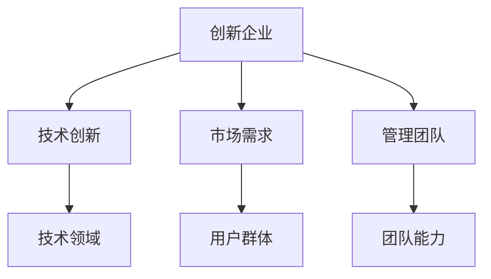
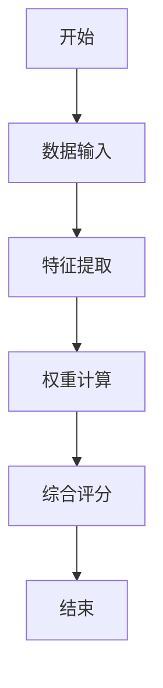
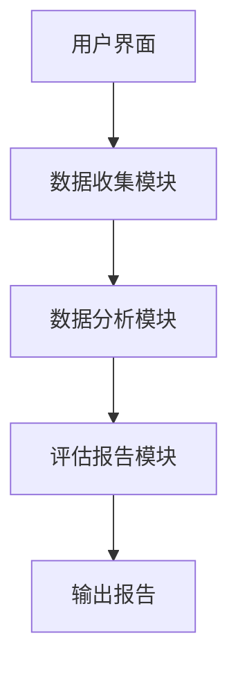
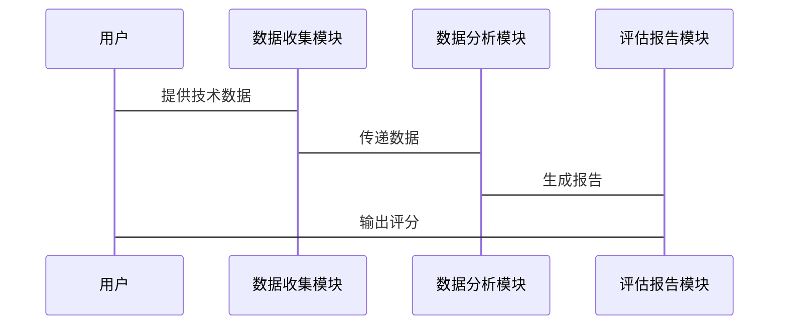

                 


# 费雪的创新企业评估：技术革新时代的投资机会

## 关键词
- 费雪投资理念
- 创新企业评估
- 技术革新
- 投资机会
- 算法模型
- 系统设计

## 摘要
在技术革新的新时代，创新企业的评估成为投资者关注的焦点。本文基于费雪的投资理念，探讨如何在技术快速变化的背景下，准确评估创新企业的潜力和风险，抓住投资机会。通过分析创新企业的核心要素、构建评估模型、设计系统架构，结合实际案例，为投资者提供科学的评估方法和策略。

---

## 目录大纲

### 第一部分：背景与核心概念

#### 第1章：技术革新时代的创新企业评估背景

##### 1.1 技术革新的现状与趋势
- 当前技术革新的主要领域（人工智能、大数据、区块链等）
- 技术革新对企业发展的深远影响
- 投资者视角下的技术革新机会

##### 1.2 创新企业的定义与特征
- 创新企业的核心定义
- 创新企业的主要特征（技术领先性、市场适应性、团队执行力等）
- 创新企业与传统企业的对比分析

##### 1.3 费雪投资理念的演变
- 费雪投资理论的起源
- 费雪投资理念的核心要素（成长股投资、内在价值等）
- 费雪理念在技术革新时代的适用性

#### 第2章：创新企业评估的核心概念与联系

##### 2.1 创新企业评估的核心要素
- 技术创新的评估维度（技术壁垒、研发投入等）
- 市场需求的评估维度（市场规模、竞争格局等）
- 管理团队的评估维度（团队能力、战略规划等）

##### 2.2 核心概念的属性特征对比
- 技术创新与市场需求的对比
- 管理团队与企业文化的对比
- 财务表现与成长潜力的对比

##### 2.3 实体关系图（ER图）


### 第二部分：算法原理

#### 第3章：创新企业评估的算法原理

##### 3.1 费雪多因素评估模型
- 模型概述
- 模型的输入变量（技术创新评分、市场需求评分、管理团队评分等）
- 模型的输出结果（综合创新评分）

##### 3.2 算法流程图


##### 3.3 算法实现代码
```python
def fisher_innovation_score(technology, market, management):
    # 权重分配
    weight_technology = 0.4
    weight_market = 0.3
    weight_management = 0.3

    # 计算综合评分
    score = (technology * weight_technology) + (market * weight_market) + (management * weight_management)
    return score

# 示例数据
technology = 80  # 技术创新评分
market = 70      # 市场需求评分
management = 85   # 管理团队评分

# 计算综合评分
score = fisher_innovation_score(technology, market, management)
print("综合创新评分：", score)
```

### 第三部分：系统分析与架构设计

#### 第4章：创新企业评估系统的分析与设计

##### 4.1 问题场景介绍
- 当前技术对企业评估的影响
- 投资者面临的挑战
- 系统化评估的必要性

##### 4.2 系统功能设计
- 数据收集模块（技术数据、市场数据、团队数据）
- 数据分析模块（特征提取、权重计算）
- 评估报告模块（综合评分、投资建议）

##### 4.3 系统架构设计


##### 4.4 系统接口设计
- 输入接口：技术数据、市场数据、团队数据
- 输出接口：综合评分、投资建议

##### 4.5 系统交互序列图


### 第四部分：项目实战

#### 第5章：创新企业评估系统的实战应用

##### 5.1 环境安装
- Python安装
- 安装必要的库（pandas、numpy、scikit-learn）

##### 5.2 核心代码实现
```python
import pandas as pd
from sklearn.linear_model import LinearRegression

def load_data(file_path):
    return pd.read_csv(file_path)

def preprocess_data(data):
    # 数据预处理
    data = data.dropna()
    return data

def train_model(data, target):
    model = LinearRegression()
    model.fit(data, target)
    return model

def predict_innovation_score(model, data):
    return model.predict(data)

# 示例运行
data = load_data("innovation.csv")
data_processed = preprocess_data(data)
target = data_processed['score']
features = data_processed[['technology', 'market', 'management']]

model = train_model(features, target)
predictions = predict_innovation_score(model, features)
print("预测结果：", predictions)
```

##### 5.3 实际案例分析
- 案例背景
- 数据分析与评估
- 投资建议

##### 5.4 项目小结
- 项目总结
- 经验教训
- 改进方向

### 第五部分：最佳实践

#### 第6章：创新企业评估的实践与思考

##### 6.1 小结
- 核心概念回顾
- 方法总结

##### 6.2 注意事项
- 数据质量的重要性
- 模型的局限性
- 风险提示

##### 6.3 拓展阅读
- 推荐书籍
- 推荐文章
- 其他资源

---

通过以上目录和内容安排，我们可以系统地探讨费雪的创新企业评估方法在技术革新背景下的应用，结合理论分析、算法实现和实际案例，为投资者提供科学的投资评估工具和策略。

