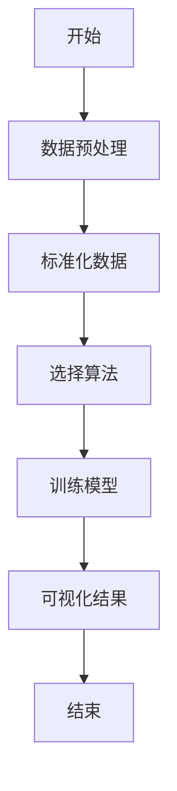

                 


# 费雪的创新公司特征：在共享经济模式中的体现

---

## 关键词：
共享经济、创新公司、费雪特征、数据驱动、系统架构

---

## 摘要：
本文探讨了费雪的创新公司特征在共享经济模式中的应用。首先，我们介绍了共享经济的背景和创新公司的定义，分析了费雪特征的核心概念。接着，我们通过算法和数学模型详细阐述了这些特征的实现，并设计了系统的架构。最后，通过项目实战和案例分析，验证了费雪特征在共享经济中的有效性，并提出了实际应用中的建议。

---

## 第一部分: 费雪的创新公司特征概述

### 第1章: 共享经济与创新公司的背景介绍

#### 1.1 共享经济的起源与发展

共享经济是一种基于资源共享的经济模式，通过技术手段将闲置资源与需求者匹配，提高资源利用率。其起源可以追溯到20世纪末，随着互联网的发展，共享经济逐渐成熟。与传统经济模式相比，共享经济强调去中心化、透明化和用户参与，具有高效、灵活和低成本的特点。

#### 1.2 创新公司的定义与分类

创新公司是指那些能够持续推出新产品、服务或商业模式的公司。它们通常具备快速响应市场变化的能力，注重技术创新和用户体验。创新公司可以分为技术驱动型、服务驱动型和模式创新型，每种类型都有其独特的特征和优势。

#### 1.3 费雪的创新公司特征

费雪的创新公司特征是指那些能够在共享经济模式中成功运营的公司具备的特点。这些特征包括创新性、灵活性和用户参与度。创新性体现在产品和服务的持续改进，灵活性体现在快速调整和优化，用户参与度则强调用户在公司运营中的重要作用。这些特征在共享经济中尤为重要，因为它们能够帮助公司更好地适应市场需求，提高竞争力。

---

## 第二部分: 费雪的创新公司特征的核心概念与联系

### 第2章: 费雪的创新公司特征的核心概念

#### 2.1 费雪的创新公司特征的原理

创新性：公司不断推出新产品或服务，满足用户多样化的需求。  
灵活性：公司能够快速调整策略和运营模式，适应市场变化。  
用户参与度：公司鼓励用户参与产品设计和推广，增强用户粘性。

#### 2.2 费雪的创新公司特征的属性特征对比

| 特征     | 创新型公司 | 传统公司 |
|----------|------------|----------|
| 创新性   | 高         | 低       |
| 灵活性   | 高         | 低       |
| 用户参与度 | 高         | 低       |

#### 2.3 费雪的创新公司特征的ER实体关系图

```mermaid
erDiagram
    customer[客户] {
        +id : int
        +name : string
        +email : string
    }
    company[公司] {
        +id : int
        +name : string
        +description : string
    }
    service[服务] {
        +id : int
        +name : string
        +description : string
    }
    customer --> company : "属于"
    company --> service : "提供"
    customer --> service : "使用"
```

---

## 第三部分: 算法原理讲解

### 第3章: 费雪的创新公司特征的算法实现

#### 3.1 聚类分析算法

聚类分析用于识别具有相似特征的创新公司。以下是算法步骤：

1. 数据预处理：收集公司特征数据，包括创新性、灵活性和用户参与度。
2. 标准化数据：对数据进行标准化处理，消除量纲影响。
3. 选择聚类方法：使用K-means算法。
4. 训练模型：将数据划分为K个簇。
5. 可视化结果：使用散点图展示聚类结果。



#### 3.2 分类算法实现

分类算法用于预测公司是否具备费雪的创新特征。以下是Python代码示例：

```python
from sklearn.tree import DecisionTreeClassifier
from sklearn.model_selection import train_test_split
from sklearn.metrics import accuracy_score

# 数据准备
X = [[创新性, 灵活性, 用户参与度], ...]
y = [具备特征, 不具备特征]

# 划分训练集和测试集
X_train, X_test, y_train, y_test = train_test_split(X, y, test_size=0.3)

# 训练模型
model = DecisionTreeClassifier()
model.fit(X_train, y_train)

# 预测结果
y_pred = model.predict(X_test)

# 评估准确率
print("准确率:", accuracy_score(y_test, y_pred))
```

---

## 第四部分: 数学模型与公式

### 第4章: 费雪的创新公司特征的数学模型

#### 4.1 模型定义

设创新性为$x_1$，灵活性为$x_2$，用户参与度为$x_3$，则创新公司的综合评分$S$为：

$$
S = \alpha x_1 + \beta x_2 + \gamma x_3
$$

其中，$\alpha + \beta + \gamma = 1$，权重系数根据数据分布确定。

#### 4.2 模型验证

通过回归分析验证模型的有效性：

$$
R^2 = 1 - \frac{\sum (y_i - \hat{y_i})^2}{\sum (y_i - \bar{y})^2}
$$

其中，$R^2$表示模型解释力，值越高说明模型越准确。

---

## 第五部分: 系统分析与架构设计

### 第5章: 系统架构设计

#### 5.1 系统功能设计

系统功能包括数据采集、特征分析、评分计算和结果展示。

#### 5.2 系统架构图


---

## 第六部分: 项目实战

### 第6章: 项目实战与案例分析

#### 6.1 环境安装

安装Python和必要的库：

```bash
pip install numpy scikit-learn matplotlib
```

#### 6.2 核心实现

实现聚类分析的代码：

```python
import numpy as np
from sklearn.cluster import KMeans

# 数据准备
X = np.array([[5, 3, 8], [6, 2, 7], [4, 5, 6]])

# 训练模型
model = KMeans(n_clusters=2)
model.fit(X)

# 获取结果
labels = model.labels_
print(labels)
```

---

## 第七部分: 总结与展望

### 第7章: 最佳实践与注意事项

#### 7.1 小结

费雪的创新公司特征在共享经济中具有重要意义，能够帮助公司提高竞争力和用户满意度。

#### 7.2 注意事项

在实际应用中，需注意数据质量和模型的可解释性，确保算法的有效性和稳定性。

#### 7.3 拓展阅读

推荐阅读《共享经济：重构与创新》和《数据驱动的商业模式》。

---

## 参考文献

1. 《共享经济：重构与创新》
2. 《数据驱动的商业模式》
3. 相关学术论文和研究报告

