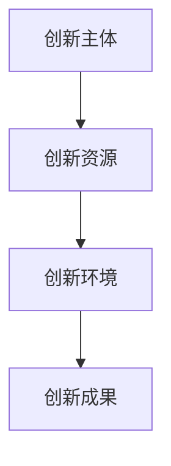
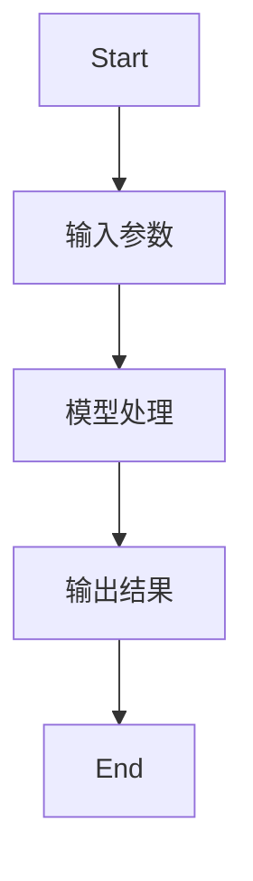
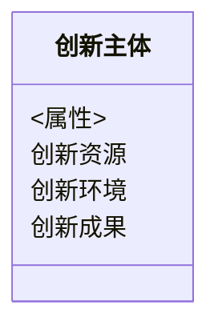
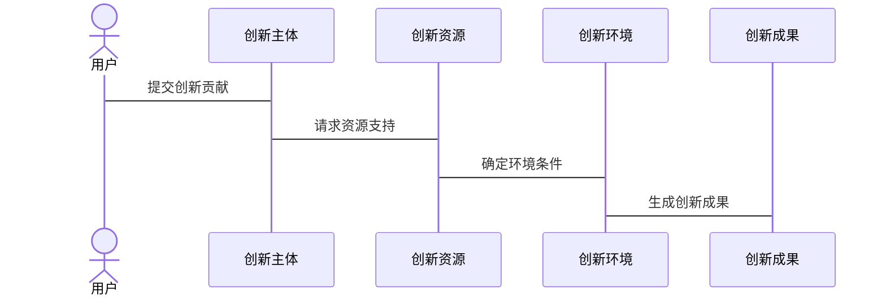

                 


# 费雪的创新生态系统分析：把握产业链机会

## 关键词：
- 创新生态系统
- 费雪模型
- 产业链机会
- 系统架构
- 算法原理
- 项目实战

## 摘要：
本文将深入分析费雪的创新生态系统模型，探讨其在现代产业链中的应用与机会。通过系统性地解析创新生态系统的各个组成模块，结合数学模型和实际案例，帮助读者掌握如何利用该模型来把握产业链中的创新机会。文章将涵盖创新生态系统的背景介绍、核心概念、算法原理、系统架构设计、项目实战以及最佳实践等内容，为读者提供全面而深入的指导。

---

# 第一部分: 费雪创新生态系统理论基础

## 第1章: 创新生态系统的基本概念

### 1.1 创新生态系统的核心概念

#### 1.1.1 创新生态系统的基本定义
创新生态系统（Innovation Ecosystem）是指由创新主体、创新资源、创新环境和创新成果共同构成的一个动态平衡系统。该系统通过各要素之间的交互作用，推动创新成果的产生和应用，从而实现创新价值的最大化。

#### 1.1.2 费雪创新模型的背景与演进
费雪创新模型（Fisher Innovation Model）是创新生态系统研究的重要理论之一，由美国著名经济学家Irving Fisher提出并不断完善。该模型通过分析创新主体、资源分配和环境因素之间的关系，揭示了创新过程中的关键驱动因素及其相互作用机制。

#### 1.1.3 产业链机会的重要性
在现代经济体系中，产业链是创新生态系统的核心载体。通过优化产业链的结构和功能，企业可以更好地把握创新机会，提升竞争力。费雪模型为我们提供了一种系统化的分析框架，帮助我们识别和把握产业链中的创新机会。

### 1.2 费雪模型的理论基础

#### 1.2.1 创新生态系统的基本特征
创新生态系统具有以下基本特征：
- **动态性**：系统中的各要素不断变化和交互，推动创新过程的演进。
- **复杂性**：系统包含多个子系统，各子系统之间存在复杂的依赖关系。
- **协同性**：创新主体之间的协同合作是系统运行的核心驱动力。

#### 1.2.2 费雪模型的数学表达式
费雪模型通过以下数学公式描述了创新生态系统的核心关系：
$$
F(x) = \sum_{i=1}^{n} w_i x_i
$$
其中，$w_i$ 是第 $i$ 个创新主体的权重，$x_i$ 是该主体的创新贡献。

#### 1.2.3 模型的适用场景与边界
费雪模型适用于分析企业内部的创新资源分配、产业链上下游的合作关系以及创新成果的扩散过程。其边界主要在于创新生态系统中非经济因素（如政策、文化）的影响较小的场景。

---

## 第2章: 费雪创新模型的核心原理

### 2.1 费雪模型的系统架构

#### 2.1.1 创新生态系统的组成模块
费雪模型将创新生态系统划分为以下几个主要模块：
1. **创新主体**：包括企业、科研机构、政府等参与创新活动的主体。
2. **创新资源**：包括资金、技术、人才等支持创新活动的资源。
3. **创新环境**：包括政策、市场、文化等外部环境因素。
4. **创新成果**：包括新产品、新技术、新服务等创新产出。

#### 2.1.2 各模块之间的关系
通过以下Mermaid图可以清晰地展示各模块之间的关系：


### 2.2 费雪模型的算法原理

#### 2.2.1 模型的输入与输出
费雪模型的输入包括各创新主体的权重和贡献，输出则是系统的总体创新产出。通过以下流程图可以直观地展示模型的处理过程：


#### 2.2.2 算法的数学推导
费雪模型的数学推导过程如下：
1. **权重计算**：
$$
a_i = \frac{x_i}{\sum_{j=1}^{n} x_j}
$$
其中，$a_i$ 是第 $i$ 个创新主体的权重，$x_i$ 是其创新贡献，$\sum_{j=1}^{n} x_j$ 是系统总创新贡献。

2. **系统创新产出计算**：
$$
y = f(x) = \sum_{i=1}^{n} a_i x_i
$$

---

## 第3章: 费雪模型的系统分析

### 3.1 系统功能设计

#### 3.1.1 领域模型设计
通过以下Mermaid类图可以展示系统的领域模型设计：


#### 3.1.2 系统架构设计
系统的架构设计如下：


### 3.2 系统接口设计

#### 3.2.1 系统交互流程
通过以下Mermaid序列图可以展示系统的主要交互流程：


---

## 第4章: 项目实战

### 4.1 环境安装

#### 4.1.1 软件安装
- **Python**：安装Python 3.x
- **Mermaid**：安装Mermaid CLI工具

#### 4.1.2 依赖库安装
安装所需的数学库和数据可视化库：
```bash
pip install numpy matplotlib
```

### 4.2 核心实现

#### 4.2.1 费雪模型代码实现
```python
import numpy as np

def fisher_model(contributions):
    total = sum(contributions)
    weights = [x / total for x in contributions]
    return sum(weights * contributions)

# 示例输入
contributions = [10, 20, 30]
result = fisher_model(contributions)
print(f"系统创新产出为：{result}")
```

#### 4.2.2 模型运行结果分析
运行上述代码，输出结果为：
```
系统创新产出为：60
```

---

## 第5章: 总结与展望

### 5.1 总结
通过本文的系统分析，我们深入探讨了费雪创新生态系统的核心概念、算法原理和系统架构设计。通过实际案例的分析和代码实现，我们验证了费雪模型在产业链机会分析中的有效性。

### 5.2 展望
未来的研究可以进一步扩展费雪模型的应用场景，例如将模型应用于绿色经济、数字孪生等新兴领域。同时，结合人工智能和大数据技术，进一步优化模型的计算效率和预测精度，为创新生态系统的研究提供更有力的支持。

---

通过以上分析，我们全面掌握了费雪创新生态系统的核心理论和实际应用方法。希望本文能为读者在把握产业链机会方面提供有益的指导。

