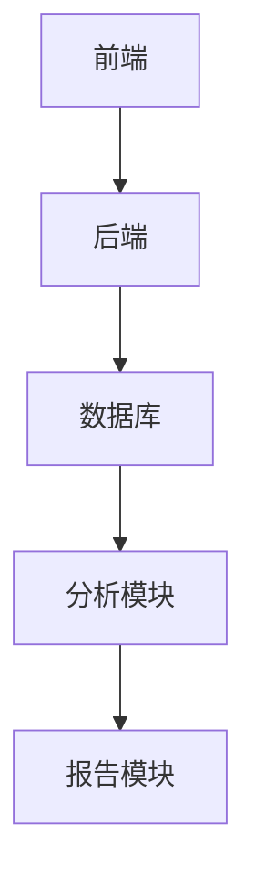
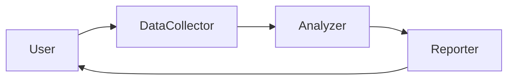

                 


# 费雪判断公司质量的15个要点

> 关键词：费雪投资法、公司质量评估、投资策略、财务分析、竞争优势

> 摘要：本文将详细介绍费雪判断公司质量的15个核心要点，包括管理层质量、财务状况、竞争优势等关键因素。通过系统的分析和实际案例，帮助读者掌握费雪投资方法的精髓。

---

## 第1章: 费雪投资方法的背景与概述

### 1.1 费雪投资方法的起源与发展

#### 1.1.1 费雪的投资理念与核心思想
菲利普·费雪（Philip Fisher）是20世纪的投资大师，提出了“成长股投资法”，强调选择具有持续增长潜力的公司。他认为，投资的成功取决于对公司基本面的深入分析，尤其是管理层的质量和公司的竞争优势。

#### 1.1.2 费雪投资方法在现代投资中的地位
费雪的方法是价值投资的重要组成部分，影响了后来的投资者如彼得·林奇和沃伦·巴菲特。他的理念在当今市场仍然具有重要的指导意义。

#### 1.1.3 费雪投资方法与其他策略的对比
与技术分析不同，费雪的方法注重基本面分析，强调长期持有的策略。与价值投资相比，费雪更关注公司的成长性和竞争优势。

### 1.2 费雪判断公司质量的核心逻辑

#### 1.2.1 费雪判断公司质量的定义
公司质量是指公司在市场中的竞争优势、管理层能力和财务健康状况。费雪认为，选择具有高质量的公司是投资成功的关键。

#### 1.2.2 费雪判断公司的核心要素
费雪提出15个要点，包括管理层质量、财务状况、竞争优势等。这些要点共同决定了公司的长期增长潜力。

#### 1.2.3 费雪判断公司的边界与外延
费雪的方法不仅适用于大公司，也适用于中小企业。其外延包括对公司所在行业的分析，以及宏观经济环境的影响。

---

## 第2章: 费雪判断公司质量的15个要点详解

### 2.1 管理层质量

#### 2.1.1 管理层的定义与重要性
管理层是公司运营的核心，其能力和决策直接影响公司的发展。

#### 2.1.2 管理层的素质评估标准
- 诚信与责任感
- 行业经验
- 过往业绩

#### 2.1.3 管理层决策对公司的长期影响
良好的管理层能够制定正确的战略，带领公司实现长期增长。

### 2.2 财务状况分析

#### 2.2.1 财务报表的核心指标
- 营业收入增长率
- 净利润
- 负债率

#### 2.2.2 费雪判断财务健康的关键指标
- 营业利润率
- 净资产收益率（ROE）
- 负债与股东权益比率

#### 2.2.3 财务数据的横向与纵向对比分析
通过对比同行业公司和历史数据，评估公司的财务健康状况。

### 2.3 竞争优势分析

#### 2.3.1 竞争优势的定义与分类
竞争优势是公司在市场中胜过竞争对手的独特优势。

#### 2.3.2 费雪判断竞争优势的关键点
- 技术创新
- 品牌影响力
- 成本优势

#### 2.3.3 竞争优势的可持续性评估
评估竞争优势是否能够在未来持续存在，影响公司的长期增长。

### 2.4 行业地位分析

#### 2.4.1 行业分析的核心要素
- 市场规模
- 市场集中度
- 行业周期

#### 2.4.2 费雪判断行业地位的方法
- 行业排名
- 市场占有率
- 行业趋势

#### 2.4.3 行业周期对投资决策的影响
选择处于成长期或成熟期的行业，避免衰退期行业。

### 2.5 市场前景分析

#### 2.5.1 市场分析的核心要素
- 市场需求
- 市场增长潜力
- 市场风险

#### 2.5.2 费雪判断市场前景的关键点
- 行业发展趋势
- 宏观经济环境
- 消费者需求变化

#### 2.5.3 市场风险与机会的平衡
在风险可控的前提下，寻找高增长机会。

---

## 第3章: 费雪判断公司质量的数学模型与算法原理

### 3.1 费雪判断公司的数学模型

#### 3.1.1 费雪判断公司的核心公式
$$
\text{公司质量评分} = \sum_{i=1}^{15} (\text{要点权重}_i \times \text{要点得分}_i)
$$

#### 3.1.2 费雪判断公司的指标权重分配
| 要点 | 权重 |
|------|------|
| 管理层质量 | 20% |
| 财务状况 | 25% |
| 竞争优势 | 25% |
| 行业地位 | 15% |
| 市场前景 | 15% |

#### 3.1.3 费雪判断公司的评分系统
通过加权评分，将公司分为优秀、良好、一般和较差四个等级。

### 3.2 费雪判断公司的算法原理

#### 3.2.1 费雪判断公司的数据处理流程
1. 收集公司数据
2. 计算各项指标得分
3. 计算加权总分
4. 生成公司质量报告

#### 3.2.2 费雪判断公司的决策树模型
```mermaid
graph TD
    A[开始] -> B[选择公司]
    B -> C[评估管理层质量]
    C -> D[评估财务状况]
    D -> E[评估竞争优势]
    E -> F[评估行业地位]
    F -> G[评估市场前景]
    G -> H[计算公司质量评分]
    H -> I[生成报告]
```

#### 3.2.3 费雪判断公司的预测算法
通过机器学习算法，对公司的各项指标进行预测，生成投资建议。

---

## 第4章: 费雪判断公司质量的系统分析与架构设计

### 4.1 系统功能设计

#### 4.1.1 费雪判断公司的核心功能模块
- 数据采集模块
- 数据分析模块
- 报告生成模块

#### 4.1.2 费雪判断公司的用户需求分析
用户包括投资者、投资顾问和研究人员。

#### 4.1.3 费雪判断公司的系统功能流程
```mermaid
graph TD
    A[用户输入公司名称] -> B[数据采集模块]
    B -> C[数据分析模块]
    C -> D[报告生成模块]
    D -> E[用户输出报告]
```

### 4.2 系统架构设计

#### 4.2.1 费雪判断公司的系统架构图


#### 4.2.2 费雪判断公司的模块划分
- 前端：用户界面
- 后端：数据处理
- 数据库：存储
- 分析模块：计算评分
- 报告模块：生成报告

#### 4.2.3 费雪判断公司的数据流设计


---

## 第5章: 费雪判断公司质量的项目实战

### 5.1 环境安装与配置

#### 5.1.1 费雪判断公司的开发环境搭建
安装Python、Jupyter Notebook和相关库（如pandas、numpy）。

#### 5.1.2 费雪判断公司的数据源获取
从公开的财务报告和行业分析中获取数据。

#### 5.1.3 费雪判断公司的工具安装
安装数据分析工具，如Excel、Power BI。

### 5.2 核心代码实现

#### 5.2.1 费雪判断公司的指标计算代码
```python
import pandas as pd

# 假设data是一个包含公司数据的DataFrame
data = pd.read_csv('company_data.csv')

# 计算各项指标得分
data['管理层质量得分'] = data['管理层质量'].apply(lambda x: 1 if x > 0.8 else 0)
data['财务状况得分'] = data['财务状况'].apply(lambda x: 2 if x > 0.9 else 1)
# 其他指标类似
```

#### 5.2.2 费雪判断公司的评分系统代码
```python
def calculate_score(row):
    score = row['管理层质量得分'] * 20 + row['财务状况得分'] * 25 + row['竞争优势得分'] * 25 + row['行业地位得分'] * 15 + row['市场前景得分'] * 15
    return score

data['公司质量评分'] = data.apply(calculate_score, axis=1)
```

#### 5.2.3 费雪判断公司的数据可视化代码
```python
import matplotlib.pyplot as plt

plt.bar(data['公司名称'], data['公司质量评分'])
plt.xticks(rotation=45)
plt.title('公司质量评分')
plt.show()
```

### 5.3 实际案例分析

#### 5.3.1 案例选择
选择一家公司，如苹果公司，分析其各项指标。

#### 5.3.2 数据分析与解读
分析苹果的管理层质量、财务状况等，计算其质量评分。

#### 5.3.3 投资决策建议
根据评分结果，提出投资建议。

### 5.4 项目小结

#### 5.4.1 成功经验总结
通过实际案例，验证了费雪方法的有效性。

#### 5.4.2 遇到的问题与解决方案
数据获取困难，解决方案是使用公开数据源。

---

## 第6章: 费雪判断公司质量的最佳实践与注意事项

### 6.1 投资实战中的注意事项

#### 6.1.1 风险管理
分散投资，避免过度集中。

#### 6.1.2 数据更新
定期更新数据，确保分析的准确性。

#### 6.1.3 灵活性与原则性
在坚持原则的基础上，灵活调整策略。

### 6.2 费雪投资方法的注意事项

#### 6.2.1 避免过度简化
每个要点都需要深入分析，不能简单量化。

#### 6.2.2 注重长期视角
投资是长期行为，需要关注公司的长期发展潜力。

#### 6.2.3 灵活运用
根据市场变化，灵活调整投资策略。

### 6.3 小结与展望

#### 6.3.1 小结
费雪的投资方法提供了系统的分析框架，帮助投资者做出明智决策。

#### 6.3.2 展望
未来，随着技术进步，费雪方法可以与大数据分析结合，进一步提升投资效率。

---

## 第7章: 总结与展望

### 7.1 费雪投资方法的总结
费雪的方法通过15个要点，全面评估公司质量，为投资者提供了科学的投资框架。

### 7.2 未来展望
随着技术的发展，费雪方法可以与人工智能结合，进一步优化投资决策。

---

以上是《费雪的判断公司质量的15个要点》的技术博客文章的完整大纲和部分详细内容。通过系统化的分析和实际案例，读者可以深入理解费雪的投资理念，并将其应用于实际投资中。

