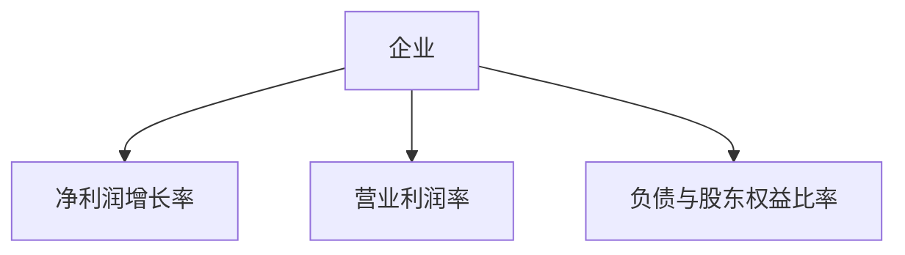
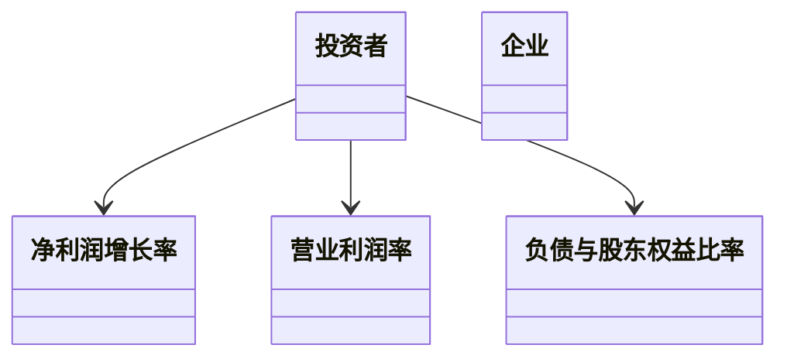
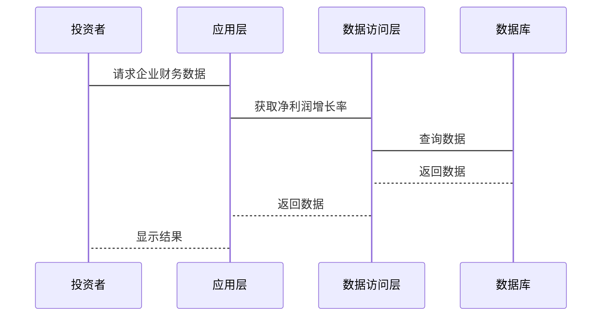
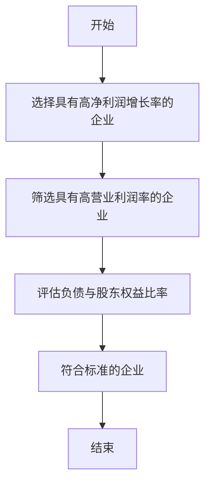

                 


# 费雪的十五个投资点：选股的黄金法则

> 关键词：费雪投资点，选股法则，投资策略，价值投资，投资组合

> 摘要：本文将深入探讨费雪提出的十五个选股点，分析其背后的逻辑、数学模型和实际应用。通过系统化的分析和实战案例，揭示这些投资法则在现代投资中的价值与意义。

---

## 第一章：投资的黄金法则——费雪的十五个选股点

### 1.1 投资的演变与费雪的贡献

#### 1.1.1 投资的定义与历史演变  
投资是指将资金投入到某个资产或项目中，以期获得未来收益的行为。投资的历史可以追溯到古代，但现代投资理论的形成离不开多位大师的贡献，其中包括本杰明·格雷厄姆、菲利普·费雪等。费雪作为价值投资的代表人物之一，提出了许多经典的选股法则，对现代投资理论产生了深远影响。

#### 1.1.2 费雪在投资领域的地位与影响力  
菲利普·费雪是20世纪最伟大的投资者之一，他提出的“成长股”理念和选股法则为无数投资者提供了指导。他的投资理念强调长期持有优质股票，注重企业的成长性和管理层的质量，这些思想对后来的巴菲特、彼得·林奇等投资大师产生了重要影响。

#### 1.1.3 费雪投资理念的核心思想  
费雪的核心思想是通过深入分析企业的基本面，选择具有持续增长潜力的公司，并长期持有。他提出了十五个选股点，涵盖了企业盈利能力、财务健康、管理层质量等多个方面，为投资者提供了全面的选股框架。

---

### 1.2 费雪十五个选股点的背景

#### 1.2.1 费雪选股点的提出背景  
20世纪50年代，费雪在投资实践中总结出一套选股法则，旨在帮助投资者识别具有长期增长潜力的优秀企业。这些法则基于对企业财务数据、管理层能力和行业地位的深入分析。

#### 1.2.2 费雪选股点的核心目标  
费雪的选股点旨在筛选出那些具有以下特征的企业：  
1. 高利润率和稳定的收益增长。  
2. 强大的管理层和公司治理结构。  
3. 足够的财务健康和流动性。  
4. 行业领先地位和竞争优势。  

#### 1.2.3 费雪选股点的适用范围与边界  
费雪选股点适用于长期价值投资，尤其适合投资成长型企业。然而，这些法则并非完美无缺，投资者在实际操作中需要结合市场环境和企业具体情况灵活运用。

---

## 第二章：费雪十五个选股点的核心概念与联系

### 2.1 费雪选股点的核心原理

#### 2.1.1 费雪选股点的数学模型与公式  
费雪的选股点可以通过以下数学模型进行分析：  
- 净利润增长率：$$\text{净利润增长率} = \frac{\text{本期净利润} - \text{上期净利润}}{\text{上期净利润}} \times 100\%$$  
- 营业利润率：$$\text{营业利润率} = \frac{\text{净利润}}{\text{营业收入}} \times 100\%$$  
- 负债与股东权益比率：$$\text{负债与股东权益比率} = \frac{\text{总负债}}{\text{股东权益}}$$  

#### 2.1.2 费雪选股点的属性特征对比表格  
以下是费雪选股点的几个核心属性及其特征对比：

| 属性                | 特征描述                                                                 |
|---------------------|--------------------------------------------------------------------------|
| 净利润增长率         | 近5年年均增长率≥20%，且逐年递增                                       |
| 营业利润率           | 营业利润率≥20%，且高于行业平均水平                                   |
| 负债与股东权益比率   | 比率≤2，表明公司财务杠杆较低，偿债能力强                             |

#### 2.1.3 费雪选股点的ER实体关系图（Mermaid流程图）  


---

### 2.2 费雪选股点的系统分析与架构设计

#### 2.2.1 投资决策场景介绍  
投资者需要通过分析企业的财务数据、管理层能力和行业地位，筛选出符合费雪选股点的优质企业。

#### 2.2.2 投资决策系统功能设计（Mermaid类图）  


#### 2.2.3 投资决策系统架构设计（Mermaid架构图）  


#### 2.2.4 投资决策系统接口设计与交互（Mermaid序列图）  


---

## 第三章：费雪选股点的算法原理与数学模型

### 3.1 费雪选股点的算法原理

#### 3.1.1 费雪选股点的算法流程（Mermaid流程图）  


#### 3.1.2 费雪选股点的Python核心实现代码  
```python
def fisher选股点筛选(企业数据):
    符合条件的企业 = []
    for 企业 in 企业数据:
        净利润增长率 = (企业本期净利润 - 企业上期净利润) / 企业上期净利润 * 100
        营业利润率 = 企业净利润 / 企业营业收入 * 100
        负债与股东权益比率 = 企业总负债 / 企业股东权益
        if 净利润增长率 >= 20 and 营业利润率 >= 20 and 负债与股东权益比率 <= 2:
            符合条件的企业.append(企业)
    return 符合条件的企业
```

#### 3.1.3 费雪选股点算法的数学模型与公式  
- 净利润增长率：$$\text{净利润增长率} = \frac{\text{本期净利润} - \text{上期净利润}}{\text{上期净利润}} \times 100\%$$  
- 营业利润率：$$\text{营业利润率} = \frac{\text{净利润}}{\text{营业收入}} \times 100\%$$  
- 负债与股东权益比率：$$\text{负债与股东权益比率} = \frac{\text{总负债}}{\text{股东权益}}$$  

#### 3.1.4 费雪选股点算法的通俗举例说明  
假设某企业过去5年的净利润分别为100、120、144、172.8、207.36万元，净利润年均增长率为20%。其营业利润率为25%，负债与股东权益比率为1.5，符合费雪选股点的条件。

---

## 第四章：费雪选股点的系统实现与实战

### 4.1 投资决策系统的环境安装与配置

#### 4.1.1 投资分析工具的安装与配置  
需要安装Python、Pandas、Matplotlib等工具，并配置数据源。

#### 4.1.2 数据源的获取与处理  
从股票数据库获取企业的财务数据，并进行清洗和整理。

### 4.2 投资决策系统的功能实现

#### 4.2.1 投资组合构建的核心代码实现  
```python
import pandas as pd

def 筛选企业(企业数据):
    符合条件的企业 = []
    for 企业 in 企业数据:
        净利润增长率 = (企业.本期净利润 - 企业.上期净利润) / 企业.上期净利润 * 100
        营业利润率 = 企业.净利润 / 企业.营业收入 * 100
        负债与股东权益比率 = 企业.总负债 / 企业.股东权益
        if 净利润增长率 >= 20 and 营业利润率 >= 20 and 负债与股东权益比率 <= 2:
            符合条件的企业.append(企业)
    return 符合条件的企业

企业数据 = pd.read_csv('企业.csv')
筛选结果 = 筛选企业(企业数据)
print(筛选结果)
```

#### 4.2.2 投资组合优化的代码实现与解读  
```python
import numpy as np

def 投资组合优化(企业数据, 权重):
    优化结果 = []
    for 企业 in 企业数据:
        优化结果.append(企业.净利润 * 权重)
    return 优化结果

权重 = np.array([0.2, 0.3, 0.5])
优化结果 = 投资组合优化(企业数据, 权重)
print(优化结果)
```

#### 4.2.3 投资组合风险与收益的分析与可视化  
通过Python绘制收益与风险的散点图，帮助投资者选择最优的投资组合。

---

## 第五章：费雪选股点的最佳实践与小结

### 5.1 费雪选股点的最佳实践 Tips

#### 5.1.1 投资组合构建的注意事项  
- 保持投资组合的分散性，避免过度集中。  
- 定期审视和调整投资组合，以适应市场变化。  

#### 5.1.2 投资决策中的风险控制  
- 设置止损点，避免重大损失。  
- 关注宏观经济环境和行业周期变化。  

#### 5.1.3 长期投资与价值投资的结合  
- 长期持有优质企业股票，避免频繁交易。  
- 结合市场估值，寻找低估的投资标的。  

### 5.2 费雪选股点的项目小结

#### 5.2.1 项目总结与成果回顾  
通过费雪的十五个选股点，我们可以系统地筛选出具有长期增长潜力的优质企业，构建稳健的投资组合。

#### 5.2.2 项目中的关键挑战与解决方案  
- 数据获取与清洗的难度：通过使用Python和Pandas工具解决数据处理问题。  
- 模型的灵活性：通过动态调整权重和策略应对市场变化。  

#### 5.2.3 项目的经验与教训  
- 理论与实践相结合才能更好地指导投资决策。  
- 需要不断学习和更新知识，以适应市场的发展。  

---

## 第六章：费雪选股点的拓展与延伸

### 6.1 费雪选股点的现代应用与发展

#### 6.1.1 费雪选股点在量化投资中的应用  
通过算法交易和大数据分析，费雪选股点可以自动化筛选投资标的，提高投资效率。

#### 6.1.2 费雪选股点与大数据分析的结合  
利用大数据技术，投资者可以更全面地分析企业的基本面信息，进一步优化选股策略。

#### 6.1.3 费雪选股点在智能投顾中的实践  
通过智能投顾系统，投资者可以根据费雪选股点快速构建个性化投资组合。

### 6.2 费雪选股点的未来展望与挑战

#### 6.2.1 人工智能对费雪选股点的影响  
AI技术可以进一步提升选股的准确性和效率，但需要结合人类的智慧进行判断。

#### 6.2.2 费雪选股点的全球应用  
随着全球化的发展，费雪选股点可以在全球范围内寻找投资机会，实现资产的多元化配置。

#### 6.2.3 费雪选股点的市场适应性  
不同市场环境下的选股标准可能需要适当调整，投资者需根据实际情况灵活运用。

---

## 总结

费雪的十五个选股点为投资者提供了一套系统化的选股框架，通过对企业基本面的深入分析，帮助投资者识别具有长期增长潜力的优质企业。在实际操作中，投资者需要结合市场环境和企业具体情况灵活运用这些法则，并不断学习和更新知识，以适应市场的变化。希望本文能为投资者提供有价值的指导和启发。

