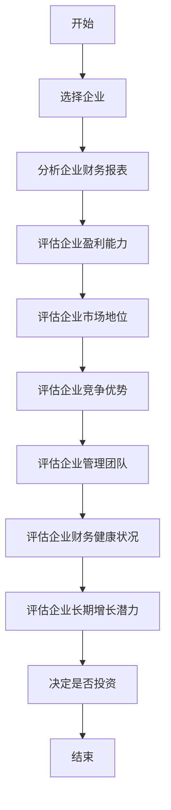

                 


# 费雪的十五个投资要点：选股的艺术

## 关键词：费雪，投资要点，选股，股票分析，长期价值投资

## 摘要：本文系统地介绍了费雪的十五个投资要点，从投资的基本概念、费雪十五要点的核心概念、算法原理、系统架构、项目实战、最佳实践等多个维度进行详细阐述。文章通过理论与实践相结合的方式，帮助投资者理解如何运用费雪的投资理念进行选股和投资决策。

---

## 第一部分：投资概述与费雪的十五个要点

### 第1章：投资的基本概念

#### 1.1 投资的基本定义

- **1.1.1 投资的定义与分类**
  - 投资是指将资金投入到某个项目或资产中，以期获得未来收益的行为。
  - 分类：股票投资、债券投资、房地产投资、货币投资等。
  - 股票投资的核心目标是通过分析企业的基本面和市场趋势，选择具有长期增长潜力的股票，实现财富增值。

- **1.1.2 股票投资的核心目标**
  - 追求长期资本增值。
  - 通过分散投资降低风险。
  - 通过基本面分析和市场分析，找到具有竞争优势的企业。

- **1.1.3 投资市场的基本构成**
  - 投资者：包括个人投资者和机构投资者。
  - 资产：股票、债券、基金等。
  - 市场：股票市场、债券市场、货币市场等。

#### 1.2 费雪投资理论的背景

- **1.2.1 费雪的生平与投资成就**
  - 本杰明·格雷厄姆的学生，价值投资的鼻祖之一。
  - 著名的投资理论家，提出了“费雪的投资理论”。

- **1.2.2 费雪投资理论的形成背景**
  - 20世纪的投资环境：大萧条时期的投资教训。
  - 通过分析企业的财务报表和市场趋势，提出十五个投资要点。

- **1.2.3 费雪理论在现代投资中的地位**
  - 为现代投资组合理论奠定基础。
  - 强调长期价值投资和风险管理。

### 第2章：费雪的十五个投资要点

#### 2.1 费雪十五要点的核心概念

- **2.1.1 十五个要点的概述**
  - 费雪的投资要点包括企业盈利能力、财务报表分析、市场先生、投资组合、长期投资、股价波动、股息率、投资风险、投资心理、市场周期、资产配置、投资纪律、投资知识、投资独立性和投资长期性。

- **2.1.2 每个要点的核心思想**
  - 企业盈利能力：选择具有持续盈利能力的企业。
  - 财务报表分析：通过分析企业的财务报表，评估企业的财务健康状况。
  - 市场先生：市场情绪波动会影响股价，但长期来看，股价反映企业的内在价值。
  - 投资组合：通过分散投资降低风险。
  - 长期投资：长期持有优质股票，获得资本增值。
  - 股价波动：股价波动是投资机会的来源。
  - 股息率：高股息率的企业具有较高的投资价值。
  - 投资风险：通过分散投资和选择优质企业降低风险。
  - 投资心理：投资者的心理会影响投资决策，避免情绪化投资。
  - 市场周期：股票市场存在周期性波动，投资者需要识别周期变化。
  - 资产配置：根据市场环境和个人风险承受能力进行资产配置。
  - 投资纪律：坚持长期投资纪律，避免频繁交易。
  - 投资知识：通过学习和实践积累投资知识。
  - 投资独立性：独立思考，不随波逐流。
  - 投资长期性：长期投资才能获得稳定的收益。

- **2.1.3 要点之间的相互关系**
  - 十五个要点相互关联，共同构成一个完整的投资体系。

#### 2.2 十五个要点的详细分析

- **2.2.1 企业的盈利能力**
  - 企业的盈利能力是衡量企业价值的重要指标。
  - 通过分析企业的净利润率和ROE（净资产收益率）来评估企业的盈利能力。

- **2.2.2 财务报表分析的重要性**
  - 财务报表分析是投资决策的核心工具。
  - 通过分析企业的收入、利润、资产负债表和现金流，评估企业的财务健康状况。

- **2.2.3 市场先生的特性**
  - 市场先生指的是股票市场的波动性。
  - 投资者需要利用市场先生的波动性，寻找投资机会。

- **2.2.4 投资组合的构建原则**
  - 投资组合的构建需要考虑风险和收益的平衡。
  - 通过分散投资降低风险，同时追求收益最大化。

- **2.2.5 长期投资的价值**
  - 长期投资能够获得企业的长期增长价值。
  - 长期投资需要选择具有竞争优势的企业。

- **2.2.6 股价波动与投资机会**
  - 股价波动是投资机会的来源。
  - 投资者需要在股价低估时买入，高估时卖出。

- **2.2.7 股息率与投资决策**
  - 高股息率的企业具有较高的投资价值。
  - 高股息率意味着企业具有稳定的盈利能力。

- **2.2.8 投资风险的管理**
  - 通过分散投资和选择优质企业降低风险。
  - 风险管理是投资决策的重要组成部分。

- **2.2.9 投资心理的作用**
  - 投资心理会影响投资决策。
  - 投资者需要克服贪婪和恐惧，保持理性。

- **2.2.10 市场周期的特性**
  - 股票市场存在周期性波动。
  - 投资者需要识别周期变化，做出相应的投资决策。

- **2.2.11 资产配置的重要性**
  - 资产配置是投资决策的重要组成部分。
  - 根据市场环境和个人风险承受能力进行资产配置。

- **2.2.12 投资纪律的遵守**
  - 长期投资需要遵守纪律。
  - 避免频繁交易，坚持长期投资纪律。

- **2.2.13 投资知识的积累**
  - 投资知识是投资决策的基础。
  - 通过学习和实践积累投资知识。

- **2.2.14 投资独立性的重要性**
  - 投资者需要独立思考，不随波逐流。
  - 独立思考是投资成功的关键。

- **2.2.15 投资的长期性**
  - 长期投资是实现财富增值的重要途径。
  - 长期投资需要选择具有长期增长潜力的企业。

---

## 第三部分：核心概念与联系

### 第3章：费雪十五要点的核心概念原理

#### 3.1 费雪十五要点的原理分析

- **3.1.1 费雪十五要点的逻辑框架**
  - 十五个要点相互关联，共同构成一个完整的投资体系。
  - 逻辑框架包括企业分析、市场分析、投资策略和风险管理。

- **3.1.2 每个要点的数学模型**
  - 企业盈利能力：净利润率 = 净利润 / 营业收入；ROE = 净利润 / 净资产。
  - 财务报表分析：通过财务指标分析企业的财务健康状况。
  - 投资组合：通过分散投资降低风险。

- **3.1.3 要点之间的关系图**
  ```mermaid
  graph TD
    A[企业盈利能力] --> B[财务报表分析]
    B --> C[投资组合]
    C --> D[风险管理]
    D --> E[长期投资]
    E --> F[资产配置]
    F --> G[投资纪律]
    G --> H[投资独立性]
    H --> I[投资长期性]
  ```

#### 3.2 核心概念对比表格

| 要点 | 核心思想 | 特征 | 应用 |
|------|----------|------|------|
| 企业盈利能力 | 选择具有持续盈利能力的企业 | 净利润率、ROE | 通过财务指标分析企业的盈利能力 |
| 财务报表分析 | 通过分析财务报表评估企业财务状况 | 资产负债表、利润表、现金流 | 识别财务风险 |
| 投资组合 | 通过分散投资降低风险 | 股票、债券、基金 | 构建多元化的投资组合 |
| 长期投资 | 长期持有优质股票，获得资本增值 | 时间跨度长 | 选择具有长期增长潜力的企业 |
| 投资风险 | 通过分散投资和选择优质企业降低风险 | 风险管理 | 评估和控制投资风险 |

#### 3.3 ER实体关系图

```mermaid
erDiagram
    investor {
        inv_id : integer
        name : string
        portfolio : set of asset
    }
    asset {
        asset_id : integer
        type : string
        value : float
    }
    market {
        market_id : integer
        index : string
        price : float
    }
    investor -> market : invests in
    investor -> asset : owns
```

---

## 第四部分：算法原理

### 第4章：算法原理

#### 4.1 费雪投资要点的数学模型

- **4.1.1 企业价值的计算**
  - 企业价值 = 净利润 / WACC（加权平均资本成本）。
  - WACC = (债务成本 × 权重) + (股权成本 × 权重)。

- **4.1.2 股票价格的波动性分析**
  - 股票价格 = 真实价值 + 市场情绪波动。
  - 通过历史数据分析股票价格的波动性。

#### 4.2 费雪投资要点的流程图



#### 4.3 费雪投资要点的Python实现

```python
import pandas as pd
import numpy as np

def calculate_profitability(company_data):
    # 计算净利润率
    net_profit_margin = company_data['净利润'] / company_data['营业收入']
    # 计算ROE
    roe = company_data['净利润'] / company_data['净资产']
    return net_profit_margin, roe

def calculate_asset_value(company_data, wacc):
    # 计算企业价值
    enterprise_value = company_data['净利润'] / wacc
    return enterprise_value

def calculate_market_price(company_data):
    # 计算股票价格
    stock_price = company_data['收盘价']
    return stock_price

# 示例数据
data = {
    '营业收入': [100, 200, 150],
    '净利润': [20, 40, 30],
    '净资产': [50, 100, 75],
    '收盘价': [50, 100, 80]
}

company_data = pd.DataFrame(data)
wacc = 0.1

net_profit_margin, roe = calculate_profitability(company_data)
enterprise_value = calculate_asset_value(company_data, wacc)
market_price = calculate_market_price(company_data)

print("净利润率:", net_profit_margin)
print("ROE:", roe)
print("企业价值:", enterprise_value)
print("股票价格:", market_price)
```

---

## 第五部分：系统分析与架构设计

### 第5章：系统架构设计

#### 5.1 问题场景介绍

- 投资者需要一个系统来帮助他们分析和选择股票。
- 系统需要整合费雪的十五个投资要点，提供全面的投资分析功能。

#### 5.2 项目介绍

- 项目名称：费雪投资要点分析系统。
- 项目目标：帮助投资者通过费雪的十五个投资要点进行选股和投资决策。

#### 5.3 系统功能设计

- 领域模型：
  ```mermaid
  classDiagram
      class Investor {
          inv_id : integer
          name : string
          portfolio : set of asset
      }
      class Asset {
          asset_id : integer
          type : string
          value : float
      }
      class Market {
          market_id : integer
          index : string
          price : float
      }
      Investor --> Asset : owns
      Investor --> Market : invests in
  ```

#### 5.4 系统架构设计

- 架构图：
  ```mermaid
  context System {
      Market Module
      Investor Module
      Asset Module
      Analysis Module
      Database
  }
  ```

#### 5.5 系统接口设计

- API接口：
  - GET /stocks 获取股票列表。
  - POST /analyze 分析股票。
  - GET /portfolio 获取投资组合。

#### 5.6 系统交互设计

- 序列图：
  ```mermaid
  sequenceDiagram
      User -> API Gateway: 请求股票分析
      API Gateway -> Market Module: 获取市场数据
      Market Module -> Asset Module: 获取资产数据
      Asset Module -> Analysis Module: 分析股票
      Analysis Module -> Investor Module: 提供投资建议
      Investor Module -> User: 返回分析结果
  ```

---

## 第六部分：项目实战

### 第6章：项目实战

#### 6.1 环境安装

- 安装Python和必要的库：
  - pip install pandas numpy matplotlib

#### 6.2 系统核心实现源代码

```python
import pandas as pd
import numpy as np

def calculate_profitability(company_data):
    net_profit_margin = company_data['净利润'] / company_data['营业收入']
    roe = company_data['净利润'] / company_data['净资产']
    return net_profit_margin, roe

def calculate_asset_value(company_data, wacc):
    enterprise_value = company_data['净利润'] / wacc
    return enterprise_value

def calculate_market_price(company_data):
    stock_price = company_data['收盘价']
    return stock_price

# 示例数据
data = {
    '营业收入': [100, 200, 150],
    '净利润': [20, 40, 30],
    '净资产': [50, 100, 75],
    '收盘价': [50, 100, 80]
}

company_data = pd.DataFrame(data)
wacc = 0.1

net_profit_margin, roe = calculate_profitability(company_data)
enterprise_value = calculate_asset_value(company_data, wacc)
market_price = calculate_market_price(company_data)

print("净利润率:", net_profit_margin)
print("ROE:", roe)
print("企业价值:", enterprise_value)
print("股票价格:", market_price)
```

#### 6.3 代码应用解读与分析

- 代码功能：
  - 计算企业的净利润率和ROE。
  - 计算企业的内在价值。
  - 获取股票的收盘价。

#### 6.4 实际案例分析

- 案例：分析苹果公司。
  - 数据来源：苹果公司的财务报表和股票价格。
  - 计算苹果公司的净利润率和ROE。
  - 评估苹果公司的内在价值。

#### 6.5 项目小结

- 通过代码实现费雪的十五个投资要点，帮助投资者进行选股和投资决策。
- 系统化的方法能够提高投资的准确性和效率。

---

## 第七部分：最佳实践

### 第7章：最佳实践

#### 7.1 小结

- 费雪的十五个投资要点是一个系统化的投资框架。
- 通过理论与实践相结合，能够帮助投资者做出更明智的投资决策。

#### 7.2 注意事项

- 避免情绪化投资，坚持长期投资纪律。
- 定期评估投资组合，调整资产配置。
- 持续学习，更新投资知识。

#### 7.3 拓展阅读

- 《股票作手回忆录》——杰西·利弗莫尔
- 《投资学原理》——威廉·夏普
- 《价值投资实战》——彼得·林奇

---

## 总结

通过本文的系统阐述，读者可以全面理解费雪的十五个投资要点，并将其应用于实际的选股和投资决策中。费雪的投资理念强调长期价值投资和风险管理，通过科学的方法和系统的分析，投资者能够更好地在股票市场中获得稳定的收益。

