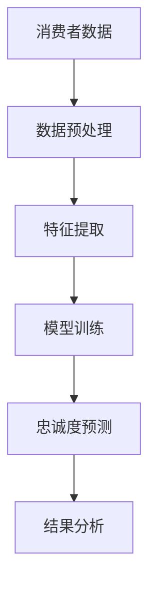
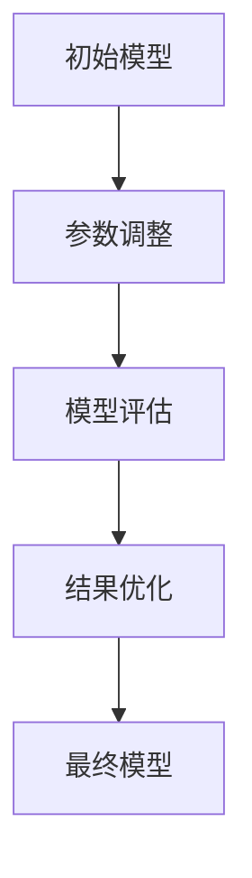
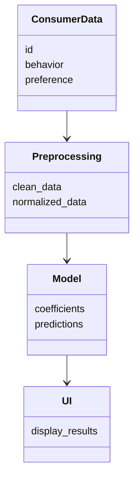

                 


# 费雪的品牌忠诚度分析：消费者行为的洞察

## 关键词：品牌忠诚度，消费者行为，费雪分析模型，数据驱动方法，品牌管理

## 摘要：本文深入探讨了费雪的品牌忠诚度分析方法，通过消费者行为的洞察，揭示品牌忠诚度的核心要素与影响因素。结合数学模型和算法实现，详细讲解了如何利用数据驱动的方法进行品牌忠诚度分析，为企业制定有效的品牌管理策略提供科学依据。

---

# 第二部分: 费雪的品牌忠诚度分析算法实现

## # 第4章: 费雪分析模型的数学基础与算法实现

### 4.1 费雪分析模型的数学基础
#### 4.1.1 品牌忠诚度的量化指标
##### 品牌忠诚度指数（Loyalty Index）
$$ LI = \frac{\sum_{i=1}^{n} w_i \cdot s_i}{\sum_{i=1}^{n} w_i} $$
其中，$w_i$ 是第 $i$ 个指标的权重，$s_i$ 是第 $i$ 个指标的得分。

#### 4.1.2 费雪模型的数学表达
$$ P(Loyalty) = \beta_0 + \beta_1 x_1 + \beta_2 x_2 + \ldots + \beta_k x_k + \epsilon $$
其中，$x_i$ 是消费者行为变量，$\beta_i$ 是回归系数，$\epsilon$ 是误差项。

### 4.2 费雪分析模型的算法流程图


### 4.3 费雪分析模型的Python实现

#### 4.3.1 数据预处理
```python
import pandas as pd
import numpy as np

# 读取数据
data = pd.read_csv('consumer_data.csv')

# 处理缺失值
data.dropna(inplace=True)

# 标准化处理
from sklearn.preprocessing import StandardScaler

scaler = StandardScaler()
data_scaled = scaler.fit_transform(data)
```

#### 4.3.2 模型训练与预测
```python
from sklearn.linear_model import LinearRegression

# 训练模型
model = LinearRegression()
model.fit(X_train, y_train)

# 预测忠诚度
y_pred = model.predict(X_test)
```

#### 4.3.3 模型评估
```python
from sklearn.metrics import r2_score, mean_squared_error

r2 = r2_score(y_test, y_pred)
rmse = np.sqrt(mean_squared_error(y_test, y_pred))

print(f'R² = {r2}, RMSE = {rmse}')
```

## # 第5章: 费雪分析模型的优化与调参

### 5.1 模型调参方法
#### 5.1.1 线性回归的参数优化
使用正规方程或梯度下降法优化回归系数。

#### 5.1.2 正则化方法
$$ Lasso \损失函数: \ L = \sum (y_i - y_pred_i)^2 + \alpha \sum |w_i| $$
$$ Ridge \损失函数: \ L = \sum (y_i - y_pred_i)^2 + \alpha \sum w_i^2 $$

### 5.2 模型优化流程图


---

# 第三部分: 基于费雪模型的系统架构设计与实现

## # 第6章: 系统功能设计与架构

### 6.1 系统功能模块
#### 6.1.1 数据采集模块
从数据库中提取消费者行为数据。

#### 6.1.2 数据预处理模块
清洗和标准化数据。

#### 6.1.3 模型训练模块
训练费雪分析模型。

#### 6.1.4 结果展示模块
可视化忠诚度预测结果。

### 6.2 系统架构设计图


---

# 第四部分: 费雪品牌忠诚度分析的项目实战与应用

## # 第7章: 项目实战

### 7.1 环境安装与数据准备
安装必要的Python库：
```bash
pip install numpy pandas scikit-learn matplotlib
```

### 7.2 核心代码实现
```python
import pandas as pd
from sklearn.linear_model import LinearRegression
from sklearn.metrics import r2_score

# 加载数据
data = pd.read_csv('loyalty_data.csv')

# 数据分割
X = data[['feature1', 'feature2']]
y = data['loyalty_score']

# 训练模型
model = LinearRegression()
model.fit(X, y)

# 预测
y_pred = model.predict(X)

# 评估
r2 = r2_score(y, y_pred)
print(f'R² Score: {r2}')
```

### 7.3 案例分析与结果解读
分析某品牌的真实数据，展示如何通过模型预测忠诚度，并提出改进建议。

---

# 第五部分: 费雪品牌忠诚度分析的最佳实践与拓展

## # 第8章: 最佳实践与拓展阅读

### 8.1 小结
总结费雪品牌忠诚度分析的核心内容与实际应用价值。

### 8.2 注意事项
- 数据质量对模型准确性的影响。
- 模型解释性的重要性。
- 定期更新模型以适应市场变化。

### 8.3 拓展阅读
推荐相关书籍和论文，如：
- 《消费者行为学》
- 《品牌管理》
- 费雪的经典论文

---

# 结语

通过本文的详细分析，读者可以全面理解费雪品牌忠诚度分析的方法及其在消费者行为研究中的应用。结合数学模型和实际项目案例，能够有效提升品牌管理的科学性和精准性，为企业制定策略提供有力支持。

---

