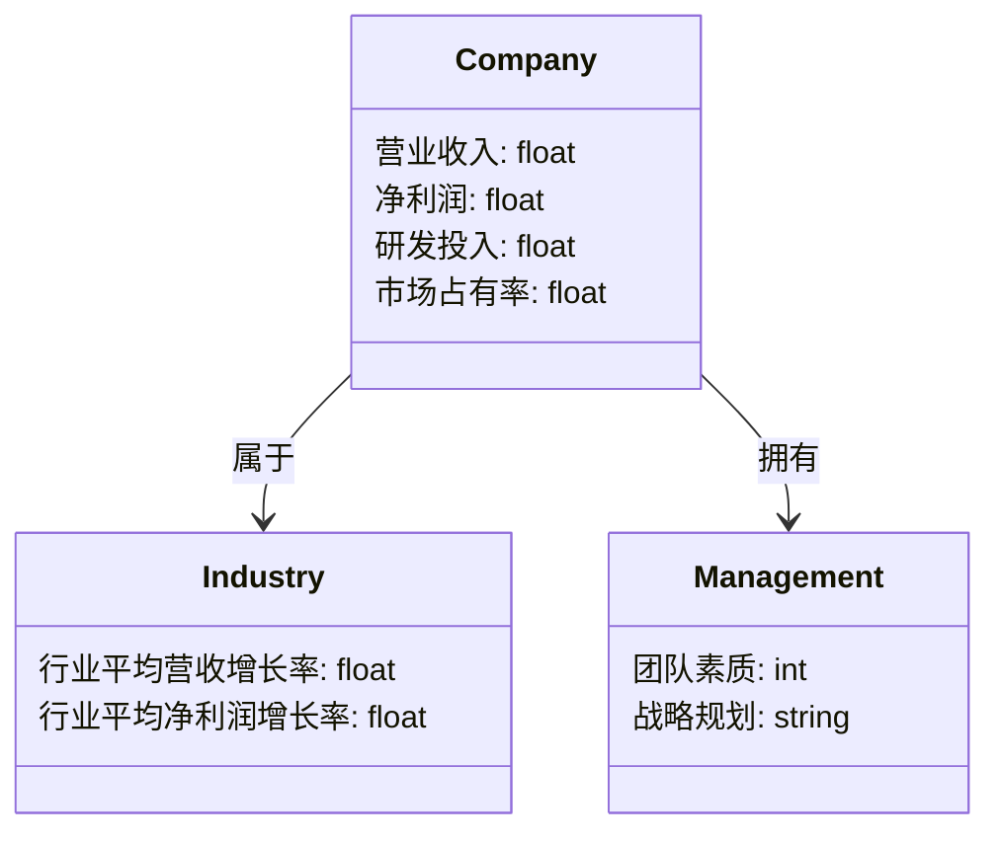

                 


# 费雪的增长型公司特征分析

## 关键词：菲利普·费雪、增长型公司、投资特征、财务分析、竞争优势、管理团队

## 摘要：  
本文深入分析了菲利普·费雪提出的增长型公司的特征，探讨了其财务指标、竞争优势、管理团队以及成长阶段的分析方法。通过具体案例和数学模型，详细阐述了如何识别和评估增长型公司，为投资者提供了系统的分析框架和实战指导。

---

## 第一部分：增长型公司的背景与定义

### 第1章：增长型投资的背景与意义

#### 1.1 投资学中的增长型投资

##### 1.1.1 增长型投资的定义与特点
增长型投资是一种以追求资本增值为目标的投资策略，主要通过投资于具有高成长潜力的公司来实现收益。其核心在于选择那些营业收入和净利润能够持续增长的企业。

##### 1.1.2 增长型投资与价值型投资的区别
| 特性 | 增长型投资 | 价值型投资 |
|------|------------|------------|
| 估值方法 | 市盈率（P/E）和市净率（P/B） | 市盈率、市净率和股息率 |
| 关注点 | 未来的增长潜力 | 当前的低估值 |
| 适用市场 | 增长型市场或牛市 | 熊市或低增长市场 |

##### 1.1.3 增长型投资的市场环境与发展趋势
增长型投资在经济周期上行阶段表现尤为突出，尤其是在科技、医疗和消费等行业中，具有较大潜力的企业更容易吸引投资者的关注。

---

### 第2章：菲利普·费雪的投资理念

#### 2.1 费雪的成长股投资理论
费雪提出，投资应着眼于企业的长期增长潜力，而非短期价格波动。他强调选择那些能够持续提高收益的公司。

#### 2.2 费雪对管理团队的重视
费雪认为，优秀的管理团队是公司持续增长的关键。他特别关注管理团队的领导力、决策能力和战略规划。

#### 2.3 费雪的长期投资策略
费雪主张长期持有优质股票，避免频繁交易。他认为市场短期波动会带来噪音，但优质企业的长期增长是可靠的。

---

### 第3章：增长型公司的定义与特征

#### 3.1 增长型公司的定义
增长型公司是指那些在较长的时间内能够实现营业收入和净利润持续增长的企业。这些公司通常处于成长期，具有较大的市场潜力和竞争优势。

#### 3.2 增长型公司的特征分析
| 特征 | 描述 |
|------|------|
| 高成长性 | 营收和净利润的年增长率高于行业平均水平 |
| 强大的竞争优势 | 在行业内具有独特的竞争优势，例如技术壁垒、品牌优势等 |
| 优秀的管理团队 | 领导能力强，战略清晰，能够推动公司持续发展 |
| 合理的估值水平 | 市盈率和市净率等估值指标处于合理范围内 |

#### 3.3 增长型公司与其他类型公司的对比
| 类型 | 增长型公司 | 价值型公司 | 稳定型公司 |
|------|------------|------------|------------|
| 收益来源 | 资本增值 | 低估值反弹 | 稳定股息收益 |
| 适用市场 | 增长期 | 熊市 | 经济衰退期 |
| 风险 | 中高 | 中低 | 低 |

---

## 第二部分：增长型公司的核心特征分析

### 第4章：增长型公司的财务特征分析

#### 4.1 营收与利润的高增长性
##### 4.1.1 收入增长率的计算与分析
收入增长率的计算公式为：
$$ \text{收入增长率} = \frac{\text{当年营业收入} - \text{上年营业收入}}{\text{上年营业收入}} \times 100\% $$

##### 4.1.2 净利润增长率的计算与分析
净利润增长率的计算公式为：
$$ \text{净利润增长率} = \frac{\text{当年净利润} - \text{上年净利润}}{\text{上年净利润}} \times 100\% $$

#### 4.2 财务健康性分析
##### 4.2.1 资产负债表分析
| 项目 | 偿债能力 | 营运能力 |
|------|----------|----------|
| 主要指标 | 资产负债率 | 存货周转率 |
| 重要性 | 评估公司财务杠杆 | 评估公司运营效率 |

##### 4.2.2 利润表分析
| 项目 | 收入能力 | 利润能力 |
|------|----------|----------|
| 主要指标 | 销售毛利率 | 净资产收益率（ROE） |
| 重要性 | 评估公司盈利能力 | 评估公司投资回报率 |

##### 4.2.3 现金流量表分析
| 项目 | 现金流入 | 现金流出 |
|------|----------|----------|
| 主要指标 | 经营活动现金流净额 | 资本支出 |
| 重要性 | 评估公司现金流健康 | 评估公司资本支出情况 |

---

### 第5章：增长型公司的竞争优势分析

#### 5.1 核心竞争力的定义与评估
核心竞争力是指公司能够在市场上持续获取竞争优势的关键因素，例如技术创新、成本优势或品牌影响力。

#### 5.2 市场地位的分析
##### 5.2.1 市场占有率的计算与分析
市场占有率的计算公式为：
$$ \text{市场占有率} = \frac{\text{公司销售额}}{\text{行业销售额}} \times 100\% $$

##### 5.2.2 行业地位的评估
行业地位可以通过公司在行业中的排名、市场份额和竞争优势来评估。

#### 5.3 创新能力的分析
##### 5.3.1 研发投入的评估
研发投入占收入的比例是衡量公司创新能力的重要指标。

##### 5.3.2 技术创新的案例分析
例如，科技公司每年将收入的10%以上投入研发，以保持技术领先。

---

### 第6章：增长型公司的管理团队分析

#### 6.1 管理团队的素质评估
##### 6.1.1 领导力的评估
领导力可以通过团队的过往成就和管理风格来评估。

##### 6.1.2 管理经验的评估
评估管理团队的行业经验和过往业绩。

#### 6.2 管理团队的战略规划分析
##### 6.2.1 公司战略的清晰度
战略清晰的公司通常有明确的长期目标和实现路径。

##### 6.2.2 战略执行的效率
高效执行战略的公司通常能够在预定时间内实现目标。

#### 6.3 管理团队的治理结构分析
##### 6.3.1 股权结构的合理性
合理的股权结构可以防止公司治理中的权力滥用。

##### 6.3.2 治理机制的完善性
完善的治理机制可以确保公司决策的透明性和公正性。

---

## 第三部分：增长型公司的算法与数学模型

### 第7章：增长型公司的算法原理

#### 7.1 费雪的内在价值计算公式
费雪的内在价值公式为：
$$ \text{内在价值} = \sum_{t=1}^{n} \frac{\text{现金流}_t}{(1 + r)^t} $$

其中，\( r \) 是折现率，\( \text{现金流}_t \) 是第 \( t \) 年的现金流。

#### 7.2 贴现现金流模型
贴现现金流模型（DCF）用于评估公司的未来现金流的现值。

##### 7.2.1 DCF模型的步骤
1. 预测未来现金流。
2. 确定折现率。
3. 计算未来现金流的现值。
4. 评估公司价值。

##### 7.2.2 Python代码实现
```python
import numpy as np

def discounted_cash_flow(cash_flows, discount_rate):
    present_value = 0
    for t, cash_flow in enumerate(cash_flows, 1):
        present_value += cash_flow / (1 + discount_rate) ** t
    return present_value

# 示例数据
cash_flows = [100, 150, 200, 250]
discount_rate = 0.1

value = discounted_cash_flow(cash_flows, discount_rate)
print(f"内在价值：{value}")
```

---

### 第8章：数学模型的详细分析

#### 8.1 费雪的公式
费雪的内在价值公式可以表示为：
$$ V = \sum_{t=1}^{\infty} \frac{CF_t}{(1 + r)^t} $$

其中，\( V \) 是内在价值，\( CF_t \) 是第 \( t \) 年的现金流，\( r \) 是折现率。

#### 8.2 案例分析
假设某公司未来5年的现金流分别为100、150、200、250和300，折现率为10%。计算其内在价值：
$$ V = \frac{100}{1.1} + \frac{150}{1.1^2} + \frac{200}{1.1^3} + \frac{250}{1.1^4} + \frac{300}{1.1^5} $$

---

## 第四部分：系统分析与架构设计

### 第9章：增长型公司分析框架

#### 9.1 问题场景介绍
我们希望通过分析公司的财务数据、竞争优势和管理团队，识别出具有高成长潜力的增长型公司。

#### 9.2 系统功能设计
##### 9.2.1 领域模型（Mermaid类图）


##### 9.2.2 系统架构设计（Mermaid架构图）
```mermaid
container 增长型公司分析系统 {
    组件 财务数据采集
    组件 竞争优势分析
    组件 管理团队评估
}
```

---

## 第五部分：项目实战

### 第10章：增长型公司案例分析

#### 10.1 环境安装
需要安装Python和相关库（如numpy、pandas）。

#### 10.2 核心代码实现
```python
import pandas as pd

# 示例数据
data = {
    '营业收入': [100, 150, 200, 250, 300],
    '净利润': [50, 75, 100, 125, 150],
    '研发投入': [10, 15, 20, 25, 30],
    '市场占有率': [10, 15, 20, 25, 30]
}

df = pd.DataFrame(data)

# 计算收入增长率
df['收入增长率'] = df['营业收入'].pct_change() * 100
# 计算净利润增长率
df['净利润增长率'] = df['净利润'].pct_change() * 100

print(df)
```

#### 10.3 案例分析与解读
以某科技公司为例，分析其是否符合增长型公司的特征。

#### 10.4 项目总结
总结分析过程和结果，指出公司是否具有高成长潜力。

---

## 第六部分：最佳实践与小结

### 第11章：最佳实践

#### 11.1 投资建议
投资者应结合财务分析、竞争优势和管理团队的评估，选择具有高成长潜力的公司进行投资。

#### 11.2 注意事项
注意市场波动和公司风险，避免盲目跟风。

#### 11.3 拓展阅读
推荐相关书籍和文献，供读者深入学习。

---

## 第七部分：总结

### 第12章：总结

通过本文的分析，我们深入了解了增长型公司的特征和分析方法。希望读者能够结合实际案例，灵活运用这些分析工具，找到具有高成长潜力的投资标的。

--- 

这篇文章涵盖了从理论到实践的全过程，通过具体的案例分析和数学模型，帮助读者系统地理解和应用增长型公司的分析方法。

