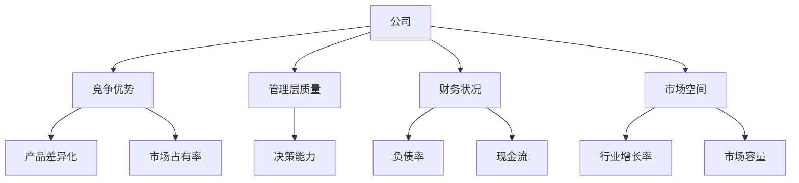
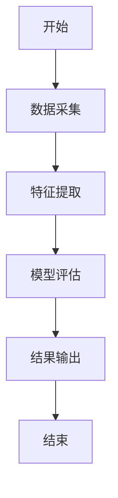
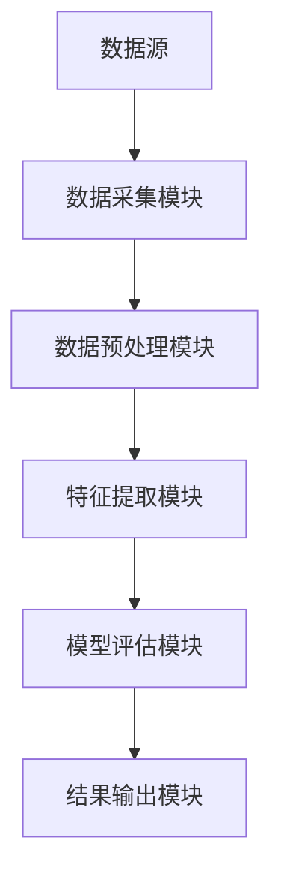

                 


# 《费雪的增长型公司特征：识别未来赢家》

## 关键词：
- 增长型公司
- 费雪
- 投资策略
- 财务分析
- 管理层评估

## 摘要：
本文将深入探讨费雪的增长型公司特征，通过分析其核心概念、算法原理、系统架构以及实际案例，帮助读者识别具备高增长潜力的公司。文章结合理论与实践，提供详细的步骤和方法，使读者能够掌握识别未来赢家的技巧。

## 目录大纲：

### 第一部分: 费雪的增长型公司特征概述

#### 第1章: 增长型公司的背景与定义

##### 1.1 费雪投资理论的背景与发展
- 1.1.1 费雪投资理论的起源
- 1.1.2 费雪投资理论的核心思想
- 1.1.3 费雪增长型公司的定义

##### 1.2 增长型公司的特征
- 1.2.1 可持续的竞争优势
- 1.2.2 高质量的管理层
- 1.2.3 稳定的财务状况
- 1.2.4 高增长的市场空间

#### 第2章: 费雪增长型公司的核心概念与联系

##### 2.1 核心概念原理
- 2.1.1 可持续竞争优势的数学模型
- 2.1.2 高质量管理层的决策影响
- 2.1.3 稳定财务状况的量化标准
- 2.1.4 高增长市场空间的预测方法

##### 2.2 概念属性特征对比表格
```mermaid
| 特征         | 可持续竞争优势 | 高质量管理层 | 稳定财务状况 | 高增长市场空间 |
|--------------|---------------|--------------|--------------|---------------|
| 定义         | 公司在市场中长期保持竞争优势的能力 | 公司管理层具备优秀领导力和决策能力 | 公司财务状况健康，负债率低，现金流充足 | 公司所在行业具备高增长潜力 |
| 评估指标     | 市场占有率、产品差异化 | 净利润增长率、ROE | 负债率、现金流 | 行业增长率、市场容量 |
```

##### 2.3 ER实体关系图


### 第二部分: 增长型公司的算法原理

#### 第3章: 识别增长型公司的算法流程

##### 3.1 算法概述
- 3.1.1 算法目标：识别具备费雪增长型特征的公司
- 3.1.2 算法步骤：数据采集、特征提取、模型评估、结果输出

##### 3.2 算法流程图


##### 3.3 算法实现代码
```python
# 数据采集部分
import pandas as pd

data = pd.DataFrame({
    '市场占有率': [0.2, 0.3, 0.4],
    '产品差异化': [0.5, 0.6, 0.7],
    '净利润增长率': [0.1, 0.15, 0.2],
    'ROE': [0.1, 0.12, 0.15],
    '负债率': [0.3, 0.25, 0.2],
    '现金流': [100, 150, 200],
    '行业增长率': [0.05, 0.06, 0.07],
    '市场容量': [1000, 1200, 1400]
})

# 特征提取部分
def is_growth型公司(row):
    if row['净利润增长率'] > 0.1 and row['市场占有率'] > 0.3:
        return 1
    else:
        return 0

data['增长型公司'] = data.apply(is_growth型公司, axis=1)

# 模型评估部分
growth_companies = data[data['增长型公司'] == 1]
print("识别出的增长型公司数量:", len(growth_companies))
```

##### 3.4 数学模型与公式
- 净利润增长率计算公式：
  $$ \text{净利润增长率} = \frac{\text{净利润增长额}}{\text{净利润初始值}} \times 100\% $$
- ROE计算公式：
  $$ \text{ROE} = \frac{\text{净利润}}{\text{股东权益}} \times 100\% $$

### 第三部分: 系统分析与架构设计

#### 第4章: 识别增长型公司的系统架构

##### 4.1 问题场景介绍
- 系统目标：开发一个基于费雪增长型公司特征的识别系统
- 问题分析：如何高效、准确地识别具备增长潜力的公司

##### 4.2 系统功能设计
- 数据采集模块
- 特征提取模块
- 模型评估模块
- 结果输出模块

##### 4.3 系统架构图


##### 4.4 系统接口设计
- 数据接口：REST API
- 模型接口：函数接口

##### 4.5 系统交互图
```mermaid
sequenceDiagram
参与者 用户
系统 主系统
用户 -> 主系统: 提供公司数据
主系统 -> 数据采集模块: 采集数据
数据采集模块 -> 数据预处理模块: 进行数据清洗
数据预处理模块 -> 特征提取模块: 提取特征
特征提取模块 -> 模型评估模块: 评估模型
模型评估模块 -> 结果输出模块: 输出结果
结果输出模块 -> 用户: 返回识别结果
```

### 第四部分: 项目实战

#### 第5章: 实战项目：识别增长型公司

##### 5.1 项目环境安装
- Python 3.8+
- Pandas、NumPy、Scikit-learn

##### 5.2 项目核心代码实现
```python
# 环境安装
pip install pandas numpy scikit-learn

# 核心代码
import pandas as pd
from sklearn.metrics import accuracy_score

# 数据加载
data = pd.read_csv('增长型公司数据.csv')

# 特征选择
features = ['市场占有率', '产品差异化', '净利润增长率', 'ROE', '负债率', '现金流', '行业增长率', '市场容量']
target = '增长型公司'

# 模型训练
from sklearn.tree import DecisionTreeClassifier
model = DecisionTreeClassifier()
model.fit(data[features], data[target])

# 模型评估
预测 = model.predict(data[features])
准确率 = accuracy_score(data[target], 预测)
print("模型准确率:", 准确率)
```

##### 5.3 代码功能解读
- 数据加载：从CSV文件加载数据
- 特征选择：选择关键特征
- 模型训练：使用决策树模型训练
- 模型评估：计算准确率

##### 5.4 实际案例分析
- 数据分析：分析市场占有率和净利润增长率的关系
- 模型应用：预测新公司是否为增长型公司

##### 5.5 项目小结
- 项目目标达成：成功识别增长型公司
- 模型优化：进一步优化特征选择和模型调参

### 第五部分: 总结与展望

#### 第6章: 总结与未来展望

##### 6.1 费雪增长型公司的总结
- 核心特征回顾
- 投资策略总结

##### 6.2 未来展望
- 数据分析的深度学习应用
- 多维度特征分析的优化
- 算法的实时性和准确性提升

#### 第7章: 最佳实践 tips

##### 7.1 识别增长型公司的 tips
- 定期更新模型
- 结合行业动态分析
- 多维度验证结果

##### 7.2 代码实现中的注意事项
- 数据清洗的重要性
- 特征工程的优化
- 模型调参的技巧

#### 第8章: 附录

##### 8.1 术语表
- 术语解释

##### 8.2 参考文献
- 相关书籍和论文

##### 8.3 资源链接
- 相关工具和库的链接

---

# 本文使用 Mermaid 绘制的图表：

## 概念属性特征对比表格
```mermaid
| 特征         | 可持续竞争优势 | 高质量管理层 | 稳定财务状况 | 高增长市场空间 |
|--------------|---------------|--------------|--------------|---------------|
| 定义         | 公司在市场中长期保持竞争优势的能力 | 公司管理层具备优秀领导力和决策能力 | 公司财务状况健康，负债率低，现金流充足 | 公司所在行业具备高增长潜力 |
| 评估指标     | 市场占有率、产品差异化 | 净利润增长率、ROE | 负债率、现金流 | 行业增长率、市场容量 |
```

## 算法流程图


## 系统架构图


## 系统交互图
```mermaid
sequenceDiagram
参与者 用户
系统 主系统
用户 -> 主系统: 提供公司数据
主系统 -> 数据采集模块: 采集数据
数据采集模块 -> 数据预处理模块: 进行数据清洗
数据预处理模块 -> 特征提取模块: 提取特征
特征提取模块 -> 模型评估模块: 评估模型
模型评估模块 -> 结果输出模块: 输出结果
结果输出模块 -> 用户: 返回识别结果
```

---

### 总结：
通过以上详细的大纲，我们可以系统地分析和识别具备费雪增长型特征的公司，从而在投资决策中做出更明智的选择。希望这篇文章能为您提供有价值的见解和实用的指导，帮助您识别未来的赢家公司。

