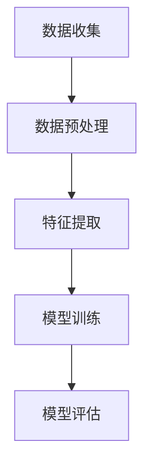
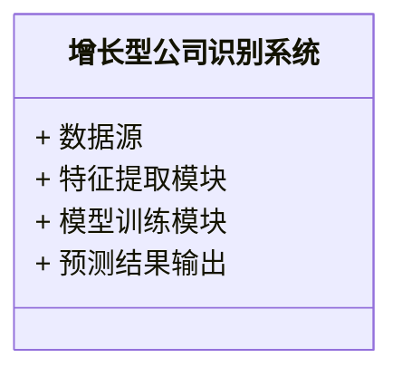
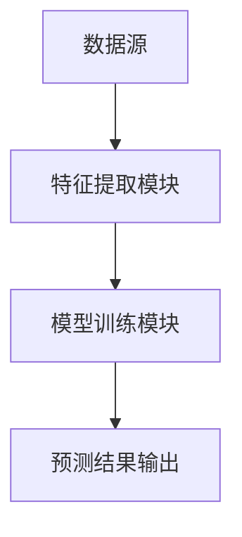

                 


# 费雪的增长型公司特征：适应数字化转型时代

> 关键词：增长型公司，数字化转型，费雪投资理念，竞争优势，可持续发展

> 摘要：本文探讨了费雪的增长型公司特征及其在数字化转型时代中的适应性。通过分析增长型公司的核心要素，结合数字化转型的趋势，提出了如何识别和培养具备持续增长潜力的企业。文章结合背景介绍、核心概念、算法原理、系统架构设计和项目实战，为读者提供了全面的视角和实用的指导。

---

## 第一部分: 费雪的增长型公司特征概述

### 第1章: 增长型公司的定义与特征

#### 1.1 增长型公司的定义

- **1.1.1 增长型公司的核心概念**
  增长型公司是指那些在较长时期内能够实现收入和利润持续快速增长的企业。这些公司通常处于高增长行业，具有强大的市场扩张能力和创新能力。

- **1.1.2 增长型公司的主要特征**
  增长型公司的主要特征包括：
  - **高增长率**：收入和利润增长率显著高于行业平均水平。
  - **强大的竞争优势**：通过创新、成本控制或市场定位等手段，形成独特的竞争优势。
  - **创新能力**：持续推出新产品或服务，适应市场变化。
  - **可持续发展能力**：具备长期增长的资源和战略支持。

- **1.1.3 增长型公司与价值型公司的区别**
  增长型公司与价值型公司的区别主要体现在估值方式和投资逻辑上。增长型公司通常以未来预期的高增长来估值，而价值型公司则以当前的低估值为基础。

#### 1.2 数字化转型时代的背景

- **1.2.1 数字化转型的定义与趋势**
  数字化转型是指企业利用数字技术（如人工智能、大数据、云计算等）改变其业务模式、流程、文化，以实现更高效、灵活和创新的运营。

- **1.2.2 数字化转型对企业的深远影响**
  数字化转型对企业的影响包括：
  - 提高效率和生产力。
  - 创新商业模式和客户体验。
  - 增强企业的数据驱动决策能力。

- **1.2.3 增长型公司在数字化转型中的角色**
  增长型公司通常是数字化转型的领导者，通过技术创新和数字化能力的提升，进一步巩固其市场地位。

#### 1.3 费雪的投资理念

- **1.3.1 费雪的投资哲学概述**
  费雪（Philip Fisher）是价值投资的重要倡导者，他提出了“成长股”的概念，主张投资那些具有持续增长潜力的公司。

- **1.3.2 费雪的“成长股”投资策略**
  费雪的投资策略强调：
  - 选择那些具有高成长潜力的公司。
  - 长期持有，等待价值的实现。

- **1.3.3 费雪投资理念的现代应用**
  在数字化时代，费雪的投资理念仍具有重要意义，尤其是对那些能够在数字化转型中持续增长的企业。

#### 1.4 增长型公司的特征分析

- **1.4.1 高成长性特征**
  增长型公司通常处于快速发展的行业，具备较高的市场增长率。

- **1.4.2 强大的竞争优势**
  增长型公司通过技术创新、成本优势或品牌影响力，形成独特的竞争优势。

- **1.4.3 创新能力与研发投入**
  增长型公司通常具有较高的研发投入，注重技术创新和产品迭代。

- **1.4.4 可持续发展能力**
  增长型公司具备长期的资源和战略支持，能够在市场波动中保持增长。

---

## 第二部分: 增长型公司的核心概念与联系

### 第2章: 核心概念与联系

#### 2.1 核心概念原理

- **2.1.1 增长型公司的核心要素**
  增长型公司的核心要素包括：
  - 市场需求：处于高增长的市场。
  - 技术创新：具备持续的技术创新能力。
  - 管理团队：拥有优秀的管理团队和战略规划能力。

- **2.1.2 增长型公司与数字化转型的关系**
  数字化转型为增长型公司提供了新的增长机会，尤其是在技术驱动的行业中。

- **2.1.3 增长型公司的竞争优势分析**
  增长型公司的竞争优势体现在：
  - 技术创新能力强。
  - 市场定位精准。
  - 模式创新能力强。

#### 2.2 增长型公司特征对比表格

| 特征维度       | 增长型公司特征 | 价值型公司特征 |
|----------------|----------------|----------------|
| 收入增长率       | 高              | 稳定            |
| 净利润率         | 中等偏高         | 高              |
| 市场扩张能力     | 强              | 有限            |
| 创新能力         | 高              | 低              |

#### 2.3 ER实体关系图架构

```mermaid
erd
    客户 <---- 订单 -----> 产品
    产品 <---- 属于 ------> 品类
    品类 <---- 包含 ------> 供应商
```

---

## 第三部分: 增长型公司的算法原理

### 第3章: 算法原理

#### 3.1 算法原理概述

- **3.1.1 算法流程**
  1. 数据收集与预处理。
  2. 特征提取与选择。
  3. 建模与训练。
  4. 模型评估与优化。

#### 3.2 算法流程图



#### 3.3 算法代码实现

```python
import pandas as pd
from sklearn.tree import DecisionTreeRegressor

# 数据加载与预处理
data = pd.read_csv('growth_companies.csv')
data = data.dropna()

# 特征选择
features = ['收入增长率', '净利润率', '研发投入']
target = '是否增长型'

# 模型训练
model = DecisionTreeRegressor()
model.fit(data[features], data[target])

# 预测与评估
predictions = model.predict(data[features])
print('预测结果:', predictions)
```

#### 3.4 算法数学模型

- **线性回归模型**：
  $$ y = \beta_0 + \beta_1x + \epsilon $$

- **决策树模型**：
  内部节点：特征分裂条件。
  叶节点：预测类别。

---

## 第四部分: 增长型公司的系统架构设计

### 第4章: 系统架构设计

#### 4.1 问题场景介绍

- **系统目标**：识别和分析增长型公司。
- **主要功能**：数据采集、特征分析、模型预测。

#### 4.2 系统功能设计



#### 4.3 系统架构图



#### 4.4 系统接口设计

- **输入接口**：数据文件上传。
- **输出接口**：预测结果报告。

#### 4.5 系统交互图

```mermaid
sequenceDiagram
    用户 -> 系统: 上传数据
    系统 -> 数据处理模块: 加工数据
    数据处理模块 -> 特征提取模块: 提取特征
    特征提取模块 -> 模型训练模块: 训练模型
    模型训练模块 -> 系统: 输出预测结果
    用户 <- 系统: 显示预测结果
```

---

## 第五部分: 增长型公司的项目实战

### 第5章: 项目实战

#### 5.1 环境安装

- 安装Python和相关库（如Pandas、Scikit-learn）。
- 数据集获取与准备。

#### 5.2 核心代码实现

```python
import pandas as pd
from sklearn.ensemble import RandomForestClassifier
from sklearn.metrics import accuracy_score

# 数据加载
data = pd.read_csv('growth_data.csv')

# 特征选择
X = data[['收入增长率', '净利润率', '研发投入']]
y = data['是否增长型']

# 模型训练
model = RandomForestClassifier()
model.fit(X, y)

# 预测
predictions = model.predict(X)
print('准确率:', accuracy_score(y, predictions))
```

#### 5.3 代码解读与分析

- **数据加载**：读取CSV文件中的数据。
- **特征选择**：选择关键特征进行建模。
- **模型训练**：使用随机森林算法进行训练。
- **预测与评估**：输出预测结果和准确率。

#### 5.4 案例分析

- **案例选择**：选取某科技公司作为案例，分析其是否符合增长型公司的特征。
- **分析过程**：通过模型预测和人工分析，得出结论。

#### 5.5 项目小结

- **项目成果**：成功识别出增长型公司。
- **经验总结**：模型选择和数据质量对结果的影响。

---

## 第六部分: 总结与展望

### 第6章: 总结与展望

#### 6.1 最佳实践

- **持续学习与更新**：随着数字化转型的深入，增长型公司的特征也在变化。
- **结合实际业务**：将技术分析与业务理解相结合，提高判断准确性。

#### 6.2 小结

- 本文详细探讨了费雪的增长型公司特征，并结合数字化转型的时代背景，分析了这些特征在现代企业中的应用。

#### 6.3 注意事项

- 在实际应用中，需注意数据的准确性和模型的适用性。
- 避免过度依赖单一模型，建议结合多种方法进行综合判断。

#### 6.4 拓展阅读

- 推荐阅读《费雪的投资哲学》和《数字化转型：技术与管理的双重革命》。

---

通过以上步骤，我们可以系统地分析和识别增长型公司，并在数字化转型的时代中，更好地把握投资机会。希望本文能为读者提供有价值的见解和指导。

