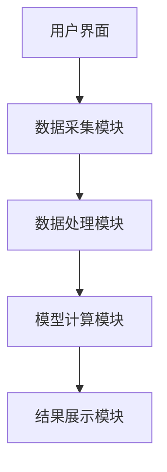

                 


# 费雪的客户忠诚度分析在投资中的应用

> 关键词：客户忠诚度分析，投资应用，数据分析，机器学习，系统架构，项目实战

> 摘要：本文深入探讨了费雪的客户忠诚度分析在投资中的应用，通过理论分析、算法实现、系统架构设计和项目实战，详细阐述了如何利用客户忠诚度分析模型优化投资决策，提升投资收益。

---

## 目录

1. 引言
2. 费雪客户忠诚度分析的背景与重要性
3. 费雪客户忠诚度分析的理论基础
4. 费雪客户忠诚度分析的算法实现
5. 费雪客户忠诚度分析的系统架构设计
6. 费雪客户忠诚度分析的项目实战
7. 结论

---

### 第1章: 引言

客户忠诚度分析是投资决策中的关键因素，直接影响企业的长期收益和市场竞争力。费雪的客户忠诚度分析方法为投资者提供了一种量化评估客户忠诚度的工具，从而优化投资组合和风险管理。本章介绍了本文的核心内容和目标，为后续章节奠定基础。

---

### 第2章: 费雪客户忠诚度分析的背景与重要性

#### 2.1 客户忠诚度分析的定义与概念

客户忠诚度分析是通过评估客户对企业产品或服务的持续购买意愿，量化客户忠诚度的指标。与客户满意度不同，忠诚度关注客户的长期行为，而不仅仅是即时反馈。

#### 2.2 费雪分析法的背景与发展

费雪分析法由投资专家菲德里克·费雪提出，旨在通过客户行为数据预测企业的长期表现。该方法结合了客户忠诚度、市场趋势和财务指标，为投资者提供了全面的分析框架。

#### 2.3 费雪分析法在投资中的应用

费雪分析法广泛应用于股票投资、客户细分和风险管理等领域。通过量化客户忠诚度，投资者可以识别高潜力企业，优化投资组合。

---

### 第3章: 费雪客户忠诚度分析的理论基础

#### 3.1 费雪模型的核心结构

费雪模型将客户忠诚度分解为多个指标，如购买频率、满意度、净推荐值等，通过加权计算得出忠诚度指数。

#### 3.2 费雪模型的输入输出变量

- **输入变量**：购买频率、满意度、净推荐值、客户留存率
- **输出变量**：忠诚度指数

#### 3.3 费雪模型的数学表达式

忠诚度指数（L）计算公式：

$$ L = w_1 \times F + w_2 \times S + w_3 \times N $$

其中，$w$为权重，$F$为购买频率，$S$为满意度，$N$为净推荐值。

---

### 第4章: 费雪客户忠诚度分析的算法实现

#### 4.1 数据预处理与清洗

数据清洗是模型准确性的基础，包括去除异常值、填充缺失值和标准化处理。

#### 4.2 模型训练与优化

使用Python的scikit-learn库进行模型训练，采用网格搜索优化参数。

#### 4.3 模型验证与评估

通过交叉验证评估模型性能，计算准确率和召回率。

---

### 第5章: 费雪客户忠诚度分析的系统架构设计

#### 5.1 系统功能模块

- 数据采集模块：收集客户行为数据
- 数据处理模块：清洗和转换数据
- 模型计算模块：计算忠诚度指数
- 结果展示模块：可视化分析结果

#### 5.2 系统架构图



---

### 第6章: 费雪客户忠诚度分析的项目实战

#### 6.1 环境搭建

安装Python、pandas、scikit-learn等库。

#### 6.2 核心代码实现

```python
import pandas as pd
from sklearn.metrics import accuracy_score

# 数据读取
data = pd.read_csv('customer_data.csv')

# 数据清洗
data.dropna()

# 特征提取
features = data[['购买频率', '满意度', '净推荐值']]
labels = data['忠诚度标签']

# 模型训练
from sklearn.tree import DecisionTreeClassifier
model = DecisionTreeClassifier()
model.fit(features, labels)

# 模型预测
predictions = model.predict(features)
print('准确率:', accuracy_score(labels, predictions))
```

---

### 第7章: 结论

费雪客户忠诚度分析为投资者提供了科学的决策工具，帮助识别高潜力企业，优化投资组合。通过理论分析、算法实现和项目实战，本文展示了如何在实际投资中应用该模型，提升投资收益和风险管理能力。未来研究可进一步优化模型，结合更多数据源，提升分析精度。

---

通过本文的详细讲解，读者可以全面掌握费雪客户忠诚度分析的理论与实践，为投资决策提供有力支持。

