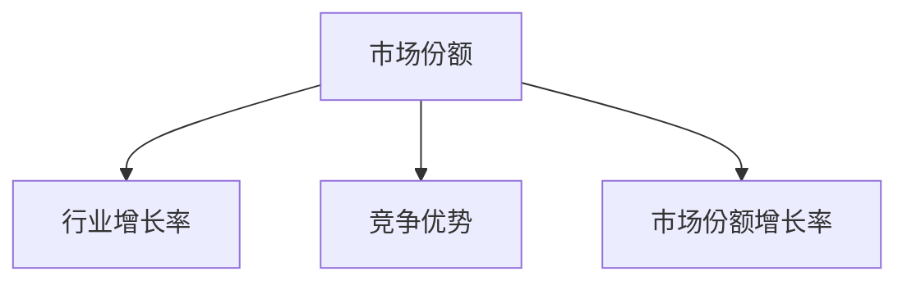
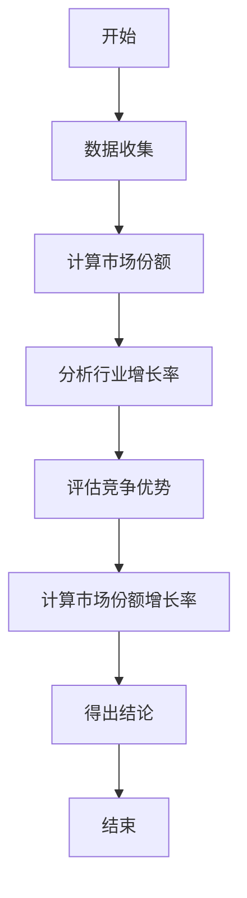
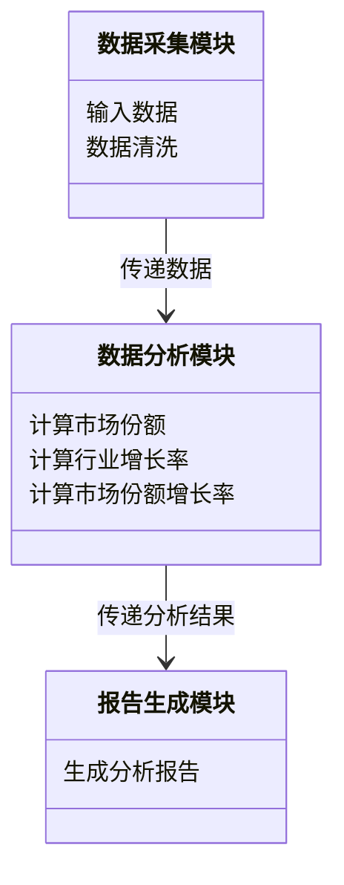

                 


# 费雪的市场份额增长分析方法

> 关键词：费雪分析方法，市场份额增长，投资分析，企业价值，财务分析

> 摘要：本文深入分析了菲利普斯·费雪的市场份额增长分析方法，从其投资理念、分析框架到具体算法实现，结合实际案例，详细阐述了如何通过市场份额增长分析来评估企业投资价值。文章内容包括费雪分析方法的核心概念、算法原理、系统架构设计、项目实战以及最佳实践，旨在帮助读者全面理解和掌握这一经典的分析方法。

---

# 第一部分: 费雪的市场份额增长分析方法概述

## 第1章: 费雪投资理念与市场份额增长分析的背景

### 1.1 费雪的投资理念与分析方法

#### 1.1.1 费雪的投资哲学概述

菲利普斯·费雪（Philip Fisher）是20世纪美国著名投资学家，被誉为“成长型投资之父”。他的投资理念以“成长”为核心，强调选择具有持续增长潜力的企业进行投资。费雪认为，企业的内在价值是其未来现金流的现值，而这种价值的增长与企业的市场份额增长密切相关。

#### 1.1.2 费雪分析方法的核心思想

费雪提出，企业的市场份额增长是判断其投资价值的重要指标。他强调，投资者应该选择那些能够在行业内持续扩大市场份额的企业，因为这些企业有更大的潜力实现收入和利润的增长。他的分析方法包括以下几个关键步骤：

1. **企业基本面分析**：研究企业的财务状况、盈利能力、成长潜力。
2. **行业分析**：评估企业在行业中的地位及竞争对手的情况。
3. **市场份额分析**：计算企业当前市场份额，并预测未来增长的可能性。

#### 1.1.3 费雪分析方法的现实意义

在当今竞争激烈的市场环境中，企业的市场份额增长能力仍然是决定其投资价值的关键因素。费雪的分析方法不仅适用于传统制造业，也适用于现代科技、服务业等领域。通过分析市场份额增长，投资者可以更好地识别出具有长期竞争优势的企业。

---

### 1.2 企业市场份额增长的重要性

#### 1.2.1 市场份额的定义与影响

市场份额是指企业在整个市场中所占的销售比例。它不仅反映了企业的市场地位，还直接关系到企业的收入、利润和长期发展能力。市场份额增长意味着企业在市场中的竞争力增强，具有更大的发展潜力。

#### 1.2.2 市场份额增长对企业价值的推动作用

市场份额的增长通常伴随着收入和利润的增长。对于投资者来说，企业市场份额的增长意味着企业能够持续创造价值，从而提升其内在价值和股票价格。

#### 1.2.3 费雪视角下的市场份额增长分析框架

费雪提出的市场份额增长分析框架包括以下几个关键要素：

1. **行业增长潜力**：分析行业整体增长趋势，判断企业是否能够从中受益。
2. **企业竞争优势**：评估企业在市场中的竞争优势，包括产品、技术、品牌等方面。
3. **市场份额变化趋势**：通过历史数据分析企业市场份额的变化趋势，预测未来的增长潜力。

---

## 第2章: 费雪分析方法的核心概念与联系

### 2.1 费雪分析方法的核心概念

#### 2.1.1 核心概念的定义

1. **市场份额（Market Share）**：企业在市场中的销售比例。
2. **市场份额增长率（Market Share Growth Rate）**：企业在一定时期内市场份额的变化速度。
3. **行业增长率（Industry Growth Rate）**：整个行业销售额的增长速度。
4. **竞争优势（Competitive Advantage）**：企业在市场上相对于竞争对手的优势。

#### 2.1.2 核心概念的属性特征对比表格

| 概念              | 定义描述                                                                 |
|-------------------|--------------------------------------------------------------------------|
| 市场份额          | 企业在市场中的销售比例                                                 |
| 行业增长率        | 行业整体销售额的增长速度                                                 |
| 竞争优势          | 企业在市场中相对于竞争对手的独特优势                                   |
| 市场份额增长率     | 企业在一定时期内市场份额的变化速度                                     |

#### 2.1.3 ER实体关系图架构的 Mermaid 流程图

```mermaid
erDiagram
    customer[顾客]
    company[公司]
    market[市场]
    competition[竞争]
    growth[增长]
    
    customer -|> company : 购买行为
    company --> market : 市场份额
    company --> competition : 竞争优势
    company --> growth : 市场份额增长率
```

---

### 2.2 费雪分析方法的原理与联系

#### 2.2.1 分析原理的详细阐述

费雪分析方法的核心在于通过分析企业的市场份额增长潜力，判断其投资价值。具体来说，企业需要具备以下条件：

1. **行业增长潜力大**：企业所在行业的市场规模正在快速增长。
2. **竞争优势明显**：企业在产品、技术、品牌等方面具有竞争优势。
3. **市场份额持续增长**：企业在过去几年中市场份额呈现上升趋势。

#### 2.2.2 核心概念之间的关系



---

## 第3章: 费雪分析方法的算法原理讲解

### 3.1 费雪分析方法的算法流程

#### 3.1.1 分析流程的 Mermaid 流程图



#### 3.1.2 算法步骤的详细说明

1. **数据收集**：收集企业的历史销售数据、行业数据、竞争对手数据等。
2. **计算市场份额**：计算企业在市场中的销售比例。
3. **分析行业增长率**：计算行业整体销售额的增长速度。
4. **评估竞争优势**：分析企业在产品、技术、品牌等方面的竞争优势。
5. **计算市场份额增长率**：计算企业在一定时期内市场份额的变化速度。
6. **得出结论**：综合以上分析，判断企业的投资价值。

#### 3.1.3 算法实现的 Python 源代码示例

```python
import pandas as pd

# 假设data是一个包含销售数据的DataFrame，columns包括企业名称、销售额和行业销售额
# 计算市场份额
def calculate_market_share(data):
    market_share = data['销售额'] / data['行业销售额'].sum() * 100
    return market_share

# 计算市场份额增长率
def calculate_growth_rate(data):
    market_share_growth = data['市场份额'].pct_change()
    return market_share_growth

# 示例数据
data = {
    '企业名称': ['A', 'B', 'C', 'D'],
    '销售额': [100, 200, 150, 80],
    '行业销售额': [500, 600, 700, 800]
}

df = pd.DataFrame(data)
market_share = calculate_market_share(df)
growth_rate = calculate_growth_rate(df)
print("市场份额：", market_share)
print("市场份额增长率：", growth_rate)
```

---

### 3.2 算法原理的数学模型与公式

#### 3.2.1 核心公式与数学模型

1. **市场份额计算公式**：
   \[
   \text{市场份额} = \frac{\text{企业销售额}}{\text{行业销售额}} \times 100\%
   \]

2. **市场份额增长率计算公式**：
   \[
   \text{市场份额增长率} = \frac{\text{当前市场份额} - \text{上一期市场份额}}{\text{上一期市场份额}} \times 100\%
   \]

3. **行业增长率计算公式**：
   \[
   \text{行业增长率} = \frac{\text{当前行业销售额} - \text{上一期行业销售额}}{\text{上一期行业销售额}} \times 100\%
   \]

#### 3.2.2 公式的详细推导过程

以市场份额计算公式为例：
假设某企业在某年的销售额为100万元，行业总销售额为500万元，则该企业的市场份额为：
\[
\text{市场份额} = \frac{100}{500} \times 100\% = 20\%
\]

---

## 第4章: 费雪分析方法的系统分析与架构设计

### 4.1 问题场景与项目介绍

#### 4.1.1 分析目标与问题场景

假设我们是一家投资机构，需要对某行业的多家企业进行市场份额增长分析，以筛选出具有投资价值的企业。

#### 4.1.2 项目背景与目标

项目背景：当前市场环境下，企业间的竞争日益激烈，投资者需要通过分析企业的市场份额增长潜力来做出投资决策。

项目目标：开发一个基于费雪分析方法的市场份额增长分析系统，帮助企业投资者评估企业的投资价值。

#### 4.1.3 项目范围与约束条件

项目范围：分析企业的市场份额、行业增长率、竞争优势等关键指标。

约束条件：数据来源必须可靠，分析结果需要具有较高的准确性和可操作性。

---

### 4.2 系统功能设计

#### 4.2.1 领域模型 Mermaid 类图



---

## 第5章: 项目实战与最佳实践

### 5.1 项目实战

#### 5.1.1 环境安装与数据准备

1. 安装必要的Python库：pandas、numpy、matplotlib等。
2. 准备企业的销售数据、行业数据、竞争对手数据等。

#### 5.1.2 系统核心实现源代码

```python
import pandas as pd

# 数据准备
data = {
    '企业名称': ['A', 'B', 'C', 'D'],
    '销售额': [100, 200, 150, 80],
    '行业销售额': [500, 600, 700, 800]
}

df = pd.DataFrame(data)

# 计算市场份额
df['市场份额'] = df['销售额'] / df['行业销售额'].sum() * 100

# 计算市场份额增长率
df['市场份额增长率'] = (df['市场份额'].pct_change() * 100).fillna(0)

# 显示结果
print(df)
```

#### 5.1.3 代码应用解读与分析

上述代码实现了对企业的市场份额和市场份额增长率的计算。通过分析这些数据，投资者可以判断企业的市场份额增长潜力，从而做出投资决策。

---

### 5.2 最佳实践

#### 5.2.1 小结

费雪的市场份额增长分析方法是一种简单而有效的投资分析工具。通过分析企业的市场份额、行业增长率和竞争优势，投资者可以更好地判断企业的投资价值。

#### 5.2.2 注意事项

1. 数据的准确性和完整性是分析结果的关键。
2. 分析过程中需要结合企业的实际情况，避免机械地套用公式。
3. 长期视角是关键，投资者需要关注企业的长期增长潜力。

#### 5.2.3 拓展阅读

推荐阅读菲利普斯·费雪的经典著作《股票投资成功之路》（*Common Stocks and Uncommon Profits*），深入了解其投资理念和分析方法。

---

# 结语

通过本文的分析，读者可以全面了解费雪的市场份额增长分析方法，并将其应用于实际投资分析中。希望本文能够为投资者提供有价值的参考，帮助他们在复杂多变的市场中找到具有长期增长潜力的企业。

