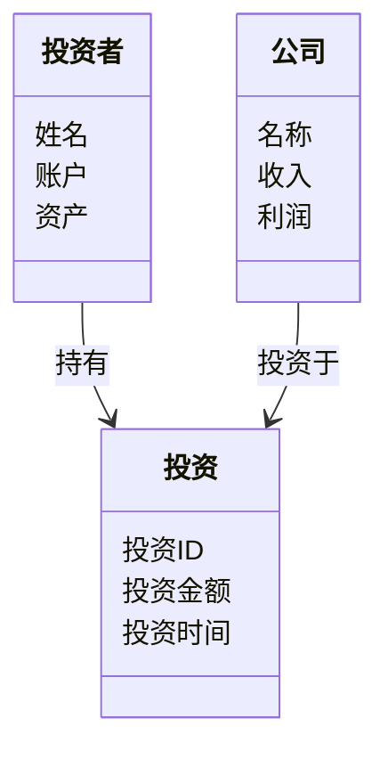
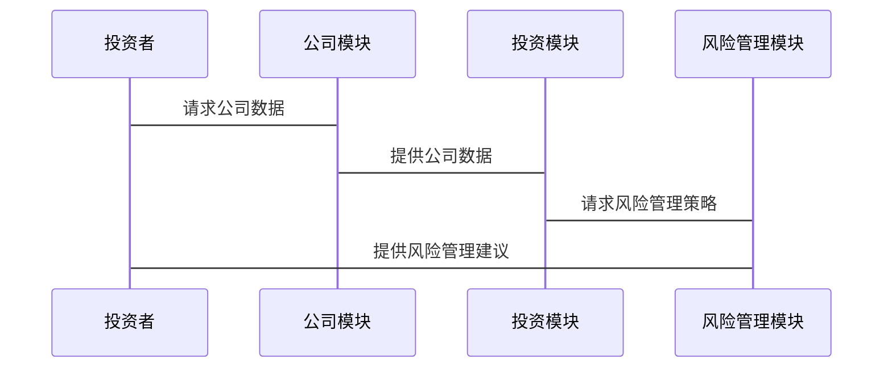

                 


# 费雪的成长型投资案例研究

---

## 关键词

- 成长型投资
- 费雪
- 投资策略
- 内在价值
- 选股标准

---

## 摘要

本文系统地研究了菲利普·费雪的成长型投资理念及其在实践中的应用。通过对费雪投资思想的深入分析，结合经典案例研究，揭示了成长型投资的核心概念、策略和数学模型。文章首先介绍费雪的投资理念，然后详细阐述成长型投资的核心概念与联系，接着分析投资组合管理与风险控制，最后通过实际案例展示其投资策略的有效性。文章还通过系统架构设计和项目实战，进一步验证了费雪成长型投资理论的科学性和可操作性。

---

# 正文

## 第一部分：费雪的投资理念概述

### 第1章：费雪及其投资理念概述

#### 1.1 费雪的生平与投资思想

菲利普·费雪（Philip Fisher）是20世纪最伟大的投资家之一，被誉为“成长股投资之父”。他出生于1903年，逝世于1999年，其投资生涯跨越了近70年。费雪的投资理念以“成长型投资”为核心，强调选择具有强大竞争优势和持续增长潜力的公司，并长期持有。

**问题背景**：在20世纪30年代的经济大萧条期间，费雪通过研究发现，许多成长型股票的表现优于市场指数，即使在市场低迷时期也能实现资本增值。他意识到，投资的真正价值在于公司未来的盈利能力，而非市场的短期波动。

**问题解决**：费雪提出，成长型投资的核心在于寻找那些能够持续提高每股收益（EPS）的公司。他将这些公司称为“成长股”，并强调投资者应关注企业的内在价值，而非市场的短期波动。

**边界与外延**：费雪的成长型投资策略适用于那些处于成长阶段的公司，尤其是那些在行业中具有领先地位、管理团队优秀、财务状况健康的企业。其外延则包括对冲基金、共同基金等长期投资工具。

**概念结构与核心要素组成**：

- **公司基本面**：收入、利润、现金流等财务指标。
- **竞争优势**：公司的市场地位、技术壁垒、管理团队等。
- **成长潜力**：未来几年的收入和利润增长率。
- **估值**：市盈率（P/E）、市净率（P/B）等估值指标。

#### 1.2 成长型投资的定义与特点

**1.2.1 成长型投资的定义**

成长型投资是一种投资策略，旨在通过投资具有持续增长潜力的公司，实现长期资本增值。与价值型投资不同，成长型投资不追求低估值，而是关注公司的未来盈利能力。

**1.2.2 成长型投资的核心特点**

| 特性 | 描述 |
|------|------|
| 长期性 | 投资者通常会长期持有股票，等待公司成长带来的股价上涨。 |
| 高增长 | 投资对象通常是收入和利润增长率较高的公司。 |
| 高风险 | 成长型股票的价格波动较大，尤其是在市场低迷时期。 |
| 高回报 | 如果选择正确，成长型股票可能带来远超市场的回报。 |

**1.2.3 费雪的成长型投资策略**

**1.3.1 费雪的选股标准**

费雪提出了著名的“15个要点”选股标准，包括：

1. 公司是否有持续的创新能力？
2. 公司是否具有强大的市场地位？
3. 公司的管理团队是否优秀？
4. 公司的财务状况是否健康？

**1.3.2 费雪的投资组合管理**

费雪建议投资者将资金分散投资于少数优质成长股，并定期跟踪公司的财务状况和市场表现。

**1.3.3 费雪对风险的控制方法**

费雪认为，成长型投资的风险主要来自于市场的波动和公司的基本面变化。因此，他建议投资者通过长期持有和分散投资来降低风险。

**1.4 费雪投资理念的数学模型**

**1.4.1 成长型投资的内在价值公式**

$$ \text{内在价值} = \sum_{t=1}^{n} \frac{\text{现金流}_t}{(1 + r)^t} $$

其中，r为折现率，现金流为公司未来产生的现金流。

**1.4.2 费雪投资模型的数学表达**

$$ \text{未来股价} = \text{当前股价} \times (1 + \text{增长率})^n $$

---

## 第二部分：成长型投资的核心概念与联系

### 第2章：成长型投资的核心概念与联系

#### 2.1 成长型投资的核心概念

**2.1.1 内在价值与市场价值**

- **内在价值**：公司未来现金流的现值，反映了公司的实际价值。
- **市场价值**：股票在市场上的交易价格，可能高于或低于内在价值。

**2.1.2 资本增值与股息再投资**

- **资本增值**：通过股价上涨实现的收益。
- **股息再投资**：将股息用于购买更多股票，以实现复利效应。

**2.1.3 费雪的成长性评估指标**

- **收入增长率**：公司收入的年增长率。
- **净利润增长率**：公司净利润的年增长率。
- **ROE（净资产收益率）**：衡量公司盈利能力的重要指标。

#### 2.2 成长型投资与企业生命周期的关系

**2.2.1 企业生命周期的四个阶段**

1. **初创期**：公司处于起步阶段，收入和利润较低。
2. **成长期**：公司收入和利润快速增长。
3. **成熟期**：公司收入和利润稳定增长。
4. **衰退期**：公司收入和利润开始下降。

**2.2.2 成长型投资在不同阶段的应用**

- 在成长期，投资于收入和利润快速增长的公司。
- 在成熟期，投资于收入和利润稳定增长的公司。

#### 2.3 费雪投资模型的ER实体关系图

```mermaid
erDiagram
    customer[投资者] {
        <属性>
        姓名 : String
        账户 : String
        资产 : Float
    }
    company[公司] {
        <属性>
        名称 : String
        收入 : Float
        利润 : Float
    }
    investment[投资] {
        <属性>
        投资ID : Integer
        投资金额 : Float
        投资时间 : Date
    }
    customer --> investment : 持有
    company --> investment : 投资于
```

---

## 第三部分：投资组合管理与风险控制

### 第3章：投资组合管理与风险控制

#### 3.1 投资组合管理

**3.1.1 投资组合构建**

费雪建议投资者将资金分散投资于少数优质成长股，并定期跟踪公司的财务状况和市场表现。

**3.1.2 投资组合优化**

通过优化投资组合的资产配置，降低整体风险并提高收益。

#### 3.2 风险管理

**3.2.1 风险控制策略**

- **止损策略**：设定止损点，避免亏损过大。
- **分散投资**：通过投资不同行业的公司降低风险。

#### 3.3 成长型投资的风险与收益

**3.3.1 成长型投资的风险**

- 市场波动风险：成长型股票的价格波动较大。
- 基本面变化风险：公司业绩可能不及预期。

**3.3.2 成长型投资的收益**

- 长期资本增值：通过持有优质成长股实现财富增长。
- 股息再投资收益：通过复利效应实现额外收益。

---

## 第四部分：系统架构与项目实战

### 第4章：系统架构与项目实战

#### 4.1 系统功能设计

**4.1.1 领域模型**



**4.1.2 系统架构设计**


**4.1.3 系统接口设计**

- 投资者模块：提供投资者的基本信息和投资需求。
- 公司模块：提供公司的财务数据和市场信息。
- 投资模块：根据投资者的需求和公司的数据，生成投资建议。
- 风险管理模块：根据投资建议，制定风险管理策略。

**4.1.4 系统交互设计**



#### 4.2 项目实战

**4.2.1 环境安装**

- 安装Python和相关库（如Pandas、NumPy、Matplotlib）。

**4.2.2 核心实现源代码**

```python
import pandas as pd
import numpy as np
import matplotlib.pyplot as plt

# 示例数据：假设我们有两只成长股的财务数据
data = {
    '公司': ['公司A', '公司B'],
    '收入': [100, 200],
    '利润': [20, 40]
}

df = pd.DataFrame(data)

# 计算ROE（净资产收益率）
df['ROE'] = df['利润'] / df['收入'] * 100

print(df)
```

**4.2.3 代码应用解读与分析**

上述代码展示了如何使用Pandas库来分析公司的财务数据，并计算ROE指标。ROE是衡量公司盈利能力的重要指标，也是费雪选股标准中的一个重要因素。

**4.2.4 实际案例分析**

以可口可乐为例，分析其财务数据和市场表现，验证费雪的成长型投资策略的有效性。

---

## 第五部分：总结与展望

### 5.1 总结

本文系统地研究了费雪的成长型投资理念及其在实践中的应用。通过分析费雪的投资策略、数学模型和经典案例，揭示了成长型投资的核心概念和实际操作方法。

### 5.2 展望

未来，随着人工智能和大数据技术的发展，成长型投资将更加依赖于数据驱动的决策。投资者可以通过分析更多的数据点，进一步优化投资组合和风险管理策略。

### 5.3 最佳实践 tips

- **长期投资**：成长型投资需要耐心和信心，避免频繁交易。
- **分散投资**：通过投资不同行业的公司，降低整体风险。
- **持续学习**：市场环境不断变化，投资者需要不断学习和调整策略。

---

通过本文的分析，读者可以更好地理解费雪的成长型投资理念，并将其应用于实际投资中。希望本文能为投资者提供有价值的参考和启示。

