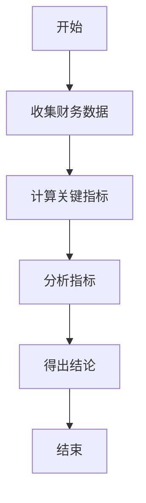
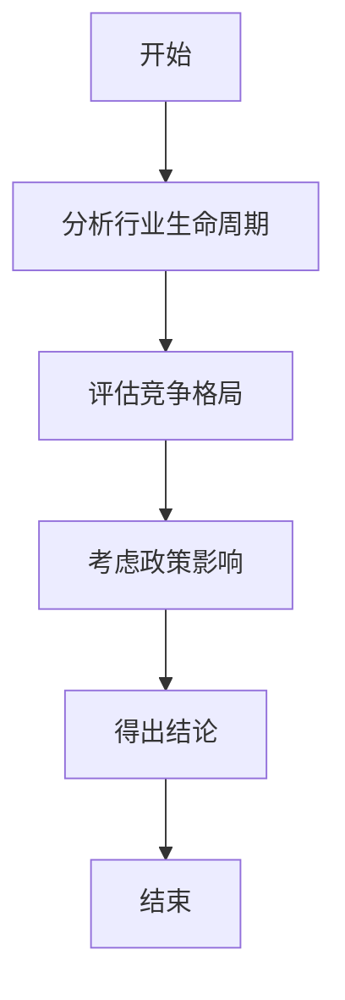
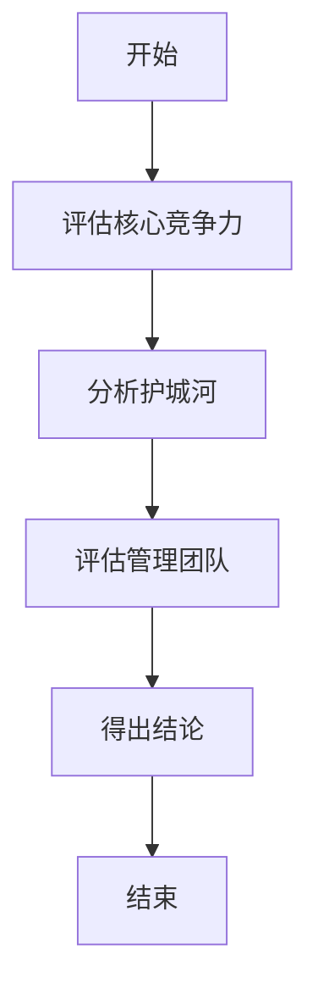
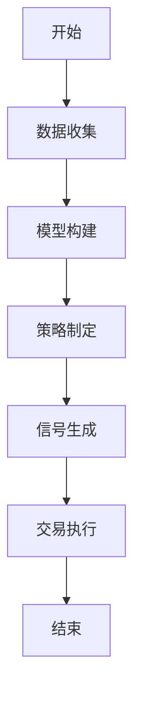
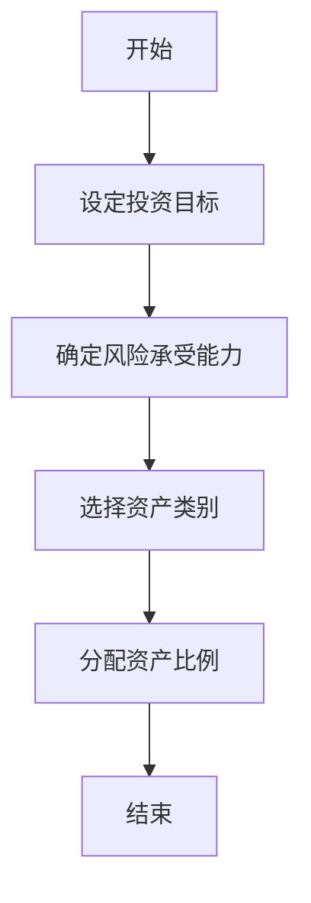

                 


# 费雪的成长型投资陷阱：避免高估值陷阱

---

## 关键词
- 成长型投资
- 高估值陷阱
- 估值模型
- 风险管理
- 费雪理论
- 投资策略
- 系统分析

---

## 摘要
在投资领域，成长型投资因其追求长期收益的特性而备受关注。然而，高估值陷阱常常让投资者陷入困境。本文将深入分析费雪的成长型投资理论，揭示高估值陷阱的核心特征，并提出系统的分析框架和应对策略。通过数学模型、系统设计和实际案例的结合，帮助投资者识别和规避高估值风险，从而在复杂的投资环境中实现稳健收益。

---

# 第1章: 投资的基本概念与误区

## 1.1 投资的基本概念

### 1.1.1 投资的定义与分类
- **定义**：投资是将资金投入某种资产或项目，以期在未来获得收益的行为。
- **分类**：
  - **权益投资**：购买股票，成为公司部分所有者。
  - **固定收益投资**：购买债券，获得固定利息收入。
  - **另类投资**：包括房地产、私募股权等。

### 1.1.2 成长型投资的定义与特点
- **定义**：成长型投资关注公司未来的成长潜力，而非当前的收益。
- **特点**：
  - 高增长潜力。
  - 估值可能高于当前收益。
  - 长期收益较高，但短期波动较大。

### 1.1.3 费雪的成长型投资理论
- **核心观点**：投资于能够持续增长的企业，关注企业的盈利能力、竞争优势和管理团队。
- **与价值投资的区别**：成长型投资更关注未来的增长潜力，而非当前的低估值。

## 1.2 高估值陷阱的背景与现状

### 1.2.1 高估值陷阱的定义
- 高估值陷阱指投资者因追求成长型企业的高增长潜力，而忽视其当前估值水平，导致投资亏损的现象。

### 1.2.2 高估值陷阱的形成原因
- **市场情绪影响**：市场过热时，投资者可能忽视基本面，盲目追高。
- **成长预期偏差**：企业未来增长潜力被过度夸大，导致估值过高。
- **流动性溢价**：高流动性资产可能被赋予更高的估值。

### 1.2.3 当前市场中的高估值陷阱现状
- **科技行业**：科技公司因高增长潜力，估值可能远超其盈利能力。
- **新兴市场**：新兴市场的高增长预期可能导致资产估值过高。
- **私募股权**：私募股权的高增长承诺可能掩盖其高估值风险。

## 1.3 本书的目标与结构

### 1.3.1 本书的核心目标
- 分析费雪的成长型投资理论。
- 揭示高估值陷阱的特征和成因。
- 提供系统化的分析框架和应对策略。

### 1.3.2 本书的章节安排
- **第1章**：投资的基本概念与误区。
- **第2章**：高估值陷阱的核心分析框架。
- **第3章**：高估值陷阱的系统化分析与应对策略。

### 1.3.3 本书的阅读方法
- **理论与实践结合**：从理论出发，结合实际案例分析。
- **系统化方法**：通过系统化的分析框架，帮助读者识别和规避高估值陷阱。

---

# 第2章: 高估值陷阱的核心分析框架

## 2.1 费雪的成长型投资理论

### 2.1.1 费雪的成长型投资三要素
- **企业盈利能力**：关注企业的净利润率和ROE（净资产收益率）。
- **竞争优势**：企业是否有独特的竞争优势，如专利、品牌或成本优势。
- **管理团队**：管理团队的能力和战略决策对企业发展至关重要。

### 2.1.2 费雪的内在价值计算方法
- **定义**：内在价值是企业在正常市场条件下能够实现的未来现金流的现值。
- **公式**：
  $$ V = \sum_{t=1}^{n} \frac{CF_t}{(1 + r)^t} $$
  其中，$CF_t$ 是第t年的现金流，$r$ 是折现率。

### 2.1.3 费雪投资策略的优缺点
- **优点**：
  - 长期收益较高。
  - 聚焦于具有竞争优势的企业。
- **缺点**：
  - 短期波动较大。
  - 对管理团队的依赖性强。

## 2.2 高估值陷阱的识别与分析

### 2.2.1 高估值陷阱的识别方法
- **相对估值法**：
  - 市盈率（P/E）：$$ P/E = \frac{P}{E} $$
  - 市净率（P/B）：$$ P/B = \frac{P}{B} $$
- **绝对估值法**：
  - 股权自由现金流模型（FCFE）：
    $$ FCFE = NI - NCC - Interest \times (1 - Tax Rate) $$
  - 内在价值计算：
    $$ V = \sum_{t=1}^{n} \frac{CF_t}{(1 + r)^t} $$

### 2.2.2 高估值陷阱的常见表现形式
- **市场情绪驱动**：投资者因市场情绪追高，导致估值偏离基本面。
- **成长预期偏差**：企业未来增长潜力被过度夸大，导致估值过高。
- **流动性溢价**：高流动性资产被赋予更高的估值。

### 2.2.3 高估值陷阱对投资组合的影响
- **短期损失**：高估值资产价格可能大幅波动，导致投资组合价值下降。
- **长期风险**：如果企业未能实现预期增长，高估值资产可能长期无法实现收益。

---

# 第3章: 高估值陷阱的系统化分析与应对策略

## 3.1 高估值陷阱的系统化分析框架

### 3.1.1 财务指标分析
- **核心指标**：
  - 利润能力：净利润率、ROE。
  - 成长能力：收入增长率、净利润增长率。
  - 财务健康度：资产负债率、流动比率。

### 3.1.2 行业环境分析
- **行业生命周期**：行业处于成长期还是成熟期。
- **竞争格局**：行业内竞争程度和市场集中度。
- **政策影响**：行业受到的政策支持或限制。

### 3.1.3 企业竞争优势分析
- **核心竞争力**：企业是否有独特的竞争优势。
- **护城河**：企业的竞争优势是否可持续。
- **管理团队**：管理团队的能力和战略决策。

## 3.2 高估值陷阱的应对策略

### 3.2.1 建立合理的估值模型
- **多指标分析**：结合市盈率、市净率、EV/EBITDA等指标进行综合分析。
- **情景分析**：考虑不同情景下的企业估值。

### 3.2.2 风险管理策略
- **分散投资**：通过分散投资降低单一资产的风险。
- **设置止损**：为投资组合设定止损点，避免过大损失。
- **动态调整**：定期审视投资组合，及时调整持仓。

### 3.2.3 长期投资策略
- **价值投资**：关注企业的内在价值，而非短期价格波动。
- **时间分散**：通过分批投资的方式，降低市场波动风险。

## 3.3 系统化投资方法

### 3.3.1 系统化投资的定义
- 系统化投资是指基于量化模型和严格的投资纪律进行投资。

### 3.3.2 系统化投资的核心要素
- **数据收集**：收集企业的财务数据、市场数据等。
- **模型构建**：基于数据构建量化模型。
- **策略执行**：根据模型信号执行交易。

### 3.3.3 系统化投资的优势
- **减少情绪干扰**：避免投资者情绪对决策的影响。
- **提高效率**：通过自动化和量化方法提高投资效率。

## 3.4 投资组合管理

### 3.4.1 投资组合构建
- **资产配置**：根据风险承受能力和收益目标进行资产配置。
- **风险分散**：通过多样化投资降低风险。

### 3.4.2 投资组合再平衡
- **定期审查**：定期审视投资组合的表现。
- **动态调整**：根据市场变化和投资目标进行调整。

### 3.4.3 长期投资策略
- **定投策略**：定期定额投资，分散投资风险。
- **长期持有**：关注企业的长期增长潜力，避免频繁交易。

---

# 第4章: 高估值陷阱的系统化分析与应对策略

## 4.1 系统化分析框架

### 4.1.1 财务指标分析
- 使用Mermaid图展示财务指标分析的流程：


### 4.1.2 行业环境分析
- 使用Mermaid图展示行业环境分析的流程：


### 4.1.3 企业竞争优势分析
- 使用Mermaid图展示企业竞争优势分析的流程：


## 4.2 系统化投资方法

### 4.2.1 系统化投资模型
- 使用Python代码实现简单的系统化投资模型：
```python
import pandas as pd
import numpy as np

def calculate_valuation_ratio(price, earnings):
    return price / earnings

# 示例数据
prices = [100, 120, 110, 130]
earnings = [20, 25, 30, 35]

# 计算市盈率
valuation_ratios = [calculate_valuation_ratio(p, e) for p, e in zip(prices, earnings)]
print(valuation_ratios)
```

### 4.2.2 投资策略
- 使用Mermaid图展示投资策略执行流程：


### 4.2.3 系统化投资的优势
- **减少情绪干扰**：通过系统化方法避免情绪化决策。
- **提高效率**：自动化处理数据，加快投资决策速度。

## 4.3 投资组合管理

### 4.3.1 投资组合构建
- 使用Mermaid图展示投资组合构建的流程：


### 4.3.2 投资组合再平衡
- 使用Python代码展示再平衡策略：
```python
import pandas as pd
import numpy as np

def rebalance_portfolio(portfolio, target_weights):
    current_weights = portfolio / portfolio.sum()
    rebalanced_portfolio = portfolio * target_weights / current_weights
    return rebalanced_portfolio

# 示例数据
portfolio = [100, 200, 300]
target_weights = [0.4, 0.3, 0.3]

# 再平衡投资组合
rebalanced = rebalance_portfolio(portfolio, target_weights)
print(rebalanced)
```

### 4.3.3 长期投资策略
- **定投策略**：通过定期定额投资分散风险。
- **长期持有**：关注企业的长期增长潜力，避免短期波动。

---

# 第5章: 总结与展望

## 5.1 本章总结
- **核心内容回顾**：分析了费雪的成长型投资理论，揭示了高估值陷阱的特征和成因，提出了系统的分析框架和应对策略。

## 5.2 展望
- **未来研究方向**：进一步研究高估值陷阱的量化模型，探索更多有效的风险管理策略。
- **投资策略优化**：结合市场变化，不断优化投资策略，提升投资收益。

---

# 参考文献
- 费雪：《成长股的估值》
- 格雷厄姆：《证券分析》
- 现代投资组合理论的相关文献

---

通过系统化的分析和策略制定，投资者可以更好地识别和规避高估值陷阱，实现长期稳健的投资收益。

