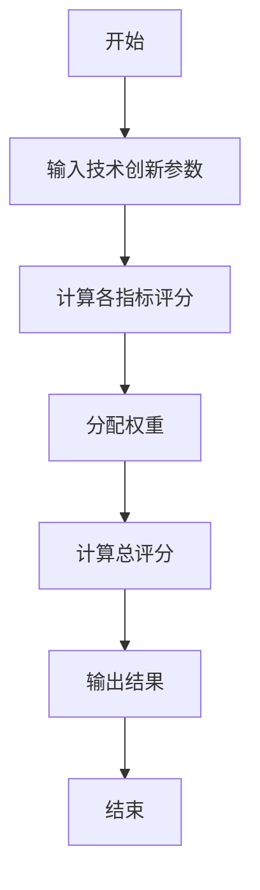

                 


# 费雪的技术创新评估在投资中的运用

> **关键词**：技术创新评估、投资策略、费雪模型、数学模型、系统设计、项目实战

> **摘要**：技术创新评估是投资决策中的关键环节，而费雪提出的技术创新评估方法为投资者提供了科学的分析工具。本文从费雪技术创新评估的理论基础出发，详细阐述了其模型的构建、算法原理、系统设计和实际应用，结合项目实战案例，深入分析了该方法在投资中的运用，为投资者提供了有效的决策支持。

---

## 第一部分: 费雪技术创新评估的理论基础

### 第1章: 技术创新评估的重要性

#### 1.1 技术创新在投资中的核心地位

##### 1.1.1 技术创新的定义与特征

技术创新是指将新的技术成果应用于产品或服务，以提高其市场竞争力。其核心特征包括：

- **创新性**：技术的新颖性和独特性。
- **实用性**：能够解决实际问题并创造价值。
- **可扩展性**：能够在不同场景下广泛应用。
- **可持续性**：技术的长期稳定性和可升级性。

##### 1.1.2 技术创新对投资价值的影响

技术创新是企业核心竞争力的源泉，直接影响企业的市场地位和盈利能力。投资者通过评估技术创新能力，可以识别出具有长期增长潜力的企业，从而做出更明智的投资决策。

##### 1.1.3 技术创新评估的必要性

在竞争激烈的市场环境中，技术创新评估能够帮助投资者筛选出具有持续创新能力的企业，降低投资风险，提高投资回报率。

---

#### 1.2 费雪技术创新评估方法的提出

##### 1.2.1 费雪投资理论的背景

菲利普斯·费雪（Philippe Fisher）是著名的价值投资者，其投资理论强调长期持有优质企业。费雪认为，技术创新是企业增长的核心驱动力，因此他提出了技术创新评估的方法，用于筛选具有长期增长潜力的企业。

##### 1.2.2 技术创新评估的核心思想

费雪的技术创新评估方法基于以下核心思想：

- **技术领先性**：企业是否拥有行业领先的技术。
- **技术可行性**：技术是否能够在实际应用中创造价值。
- **技术可持续性**：技术是否具有长期发展的潜力。

##### 1.2.3 费雪方法的独特性

费雪方法的独特之处在于其综合评估企业的技术创新能力，并结合市场前景和财务状况，为企业估值提供科学依据。

---

### 第2章: 费雪技术创新评估模型的构建

#### 2.1 费雪模型的基本框架

##### 2.1.1 技术创新评估的维度

费雪模型从以下几个维度对企业技术创新能力进行评估：

- **技术领先性**：企业技术与竞争对手的对比。
- **技术可行性**：技术的市场应用前景。
- **技术可持续性**：技术的长期发展能力。
- **技术团队能力**：技术团队的专业性和创新能力。
- **技术投入**：企业的研发投入和资源分配。

##### 2.1.2 评估指标的权重分配

费雪模型通过赋予每个评估指标不同的权重，反映其对技术创新能力的影响程度。权重分配基于以下几个因素：

- **指标的重要性**：不同指标对技术创新的影响程度不同。
- **行业特点**：不同行业的技术创新评估重点有所不同。
- **企业具体情况**：企业的实际技术能力和发展阶段。

##### 2.1.3 模型的数学表达式

费雪技术创新评分公式如下：

$$
\text{创新评分} = \sum_{i=1}^{n} w_i \cdot s_i
$$

其中，\( w_i \) 为第 \( i \) 个指标的权重，\( s_i \) 为第 \( i \) 个指标的评分（1-10分）。

---

#### 2.2 模型的输入与输出

##### 2.2.1 输入参数的定义

费雪模型的输入参数包括：

- **技术领先性评分**：评估企业在技术领域的领先地位。
- **技术可行性评分**：评估技术的实际应用价值。
- **技术可持续性评分**：评估技术的长期发展潜力。
- **技术团队能力评分**：评估技术团队的专业性和创新能力。
- **技术投入评分**：评估企业的研发投入和资源分配。

##### 2.2.2 输出结果的解释

模型输出的创新评分为综合评分，范围为1-100分。评分越高，表示企业的技术创新能力越强，投资价值越高。

##### 2.2.3 模型的适用范围

费雪模型适用于科技、制造、医疗等多个行业，尤其适合评估具有技术创新能力的成长型企业。

---

### 第3章: 费雪技术创新评估的核心算法

#### 3.1 算法原理

##### 3.1.1 技术创新评分的计算流程

1. **收集数据**：收集企业的技术创新相关数据，包括技术领先性、可行性、可持续性等指标。
2. **评分赋值**：根据每个指标的重要性，赋予其相应的权重。
3. **计算评分**：根据公式计算创新评分。

##### 3.1.2 权重分配的优化方法

权重分配需要结合行业特点和企业实际情况，可以通过以下方法优化：

- **专家评估法**：邀请行业专家进行评分和权重分配。
- **数据驱动法**：基于历史数据和市场表现进行权重调整。
- **组合优化法**：通过数学优化方法确定最优权重。

##### 3.1.3 模型的验证与调整

模型需要通过历史数据验证，确保其准确性和稳定性。如果验证结果与实际不符，需要调整权重或优化算法。

---

#### 3.2 算法实现

##### 3.2.1 Python代码实现

以下是一个简单的费雪模型实现代码示例：

```python
def fisher_technology_score(tech_features, weights):
    return sum(w * s for w, s in zip(weights, tech_features))
```

其中，`tech_features` 是技术创新指标的评分列表，`weights` 是各指标的权重。

##### 3.2.2 算法流程图



---

### 第4章: 技术创新评估的数学模型

#### 4.1 模型的数学表达

##### 4.1.1 创新评分公式

$$
S = \sum_{i=1}^{n} w_i \cdot s_i
$$

其中，\( S \) 为创新评分，\( w_i \) 为第 \( i \) 个指标的权重，\( s_i \) 为第 \( i \) 个指标的评分。

##### 4.1.2 权重调整公式

$$
w_i = \frac{w_i}{\sum_{j=1}^{n} w_j}
$$

权重调整公式用于确保权重之和为1，便于计算和比较。

---

### 第5章: 系统分析与架构设计

#### 5.1 问题场景介绍

##### 5.1.1 投资决策中的技术创新评估需求

投资者需要通过技术创新评估筛选出具有长期增长潜力的企业。

##### 5.1.2 系统需要解决的核心问题

- 如何高效地收集和分析技术创新相关数据。
- 如何快速计算技术创新评分。
- 如何可视化评估结果。

##### 5.1.3 系统的目标用户与使用场景

目标用户为投资机构、基金经理和企业战略规划人员。使用场景包括企业估值、投资决策和风险评估。

---

#### 5.2 系统架构设计

##### 5.2.1 系统功能模块划分

- **数据采集模块**：收集技术创新相关数据。
- **评分计算模块**：计算技术创新评分。
- **结果展示模块**：可视化评估结果。

##### 5.2.2 系统架构图


---

### 第6章: 项目实战

#### 6.1 环境安装与配置

##### 6.1.1 安装必要的Python库

- `numpy`：用于数值计算。
- `pandas`：用于数据处理。
- `matplotlib`：用于数据可视化。

##### 6.1.2 数据集准备

需要准备企业的技术创新相关数据，包括技术领先性、可行性、可持续性等指标。

---

#### 6.2 系统核心实现

##### 6.2.1 数据预处理

对数据进行清洗和标准化处理，确保数据的准确性和一致性。

##### 6.2.2 模型实现

根据费雪模型公式，计算企业的创新评分。

##### 6.2.3 结果可视化

将评估结果以图表形式展示，便于投资者理解和决策。

---

#### 6.3 案例分析

##### 6.3.1 案例背景

假设我们有一家科技公司，需要评估其技术创新能力。

##### 6.3.2 数据分析

收集公司的技术创新相关数据，包括技术领先性评分、可行性评分、可持续性评分等。

##### 6.3.3 模型计算

根据费雪模型公式，计算公司的创新评分。

##### 6.3.4 结果解读

根据评分结果，判断公司的技术创新能力，并给出投资建议。

---

## 第七章: 结论与展望

### 7.1 本文总结

费雪技术创新评估方法为投资者提供了科学的决策工具，能够有效筛选出具有长期增长潜力的企业。

### 7.2 未来展望

未来，随着人工智能和大数据技术的发展，技术创新评估将更加精准和高效。

---

## 参考文献

- 费雪《成长股投资》
- 技术创新评估相关学术论文

---

### **注意事项**

- 本文内容仅供参考，具体投资决策需结合市场实际情况。
- 本文代码和图表均为示例，实际应用需根据具体需求调整。

--- 

**完**

