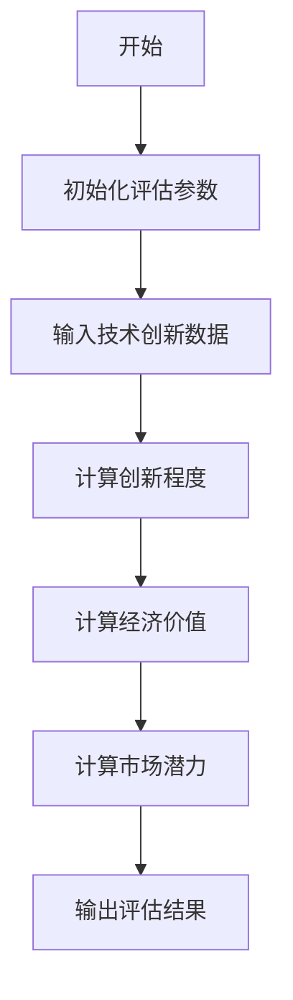
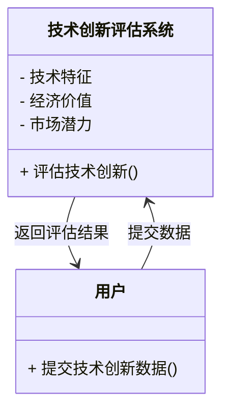
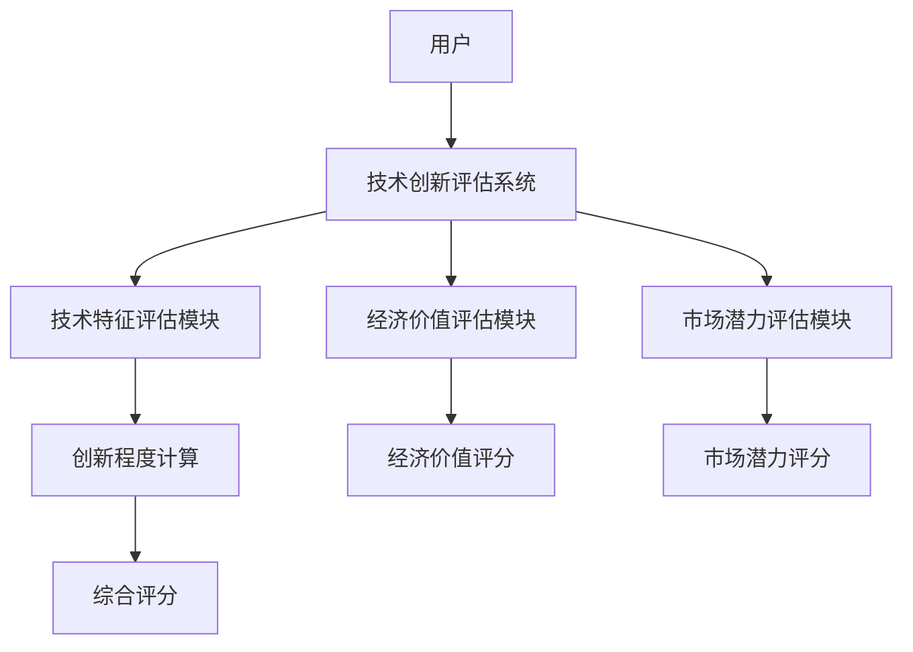
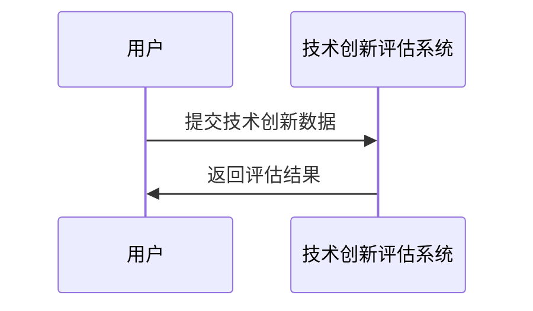

                 


# 费雪的技术创新评估：区分真正的突破

---

## 关键词：技术创新评估、费雪模型、技术突破、增量改进、评估维度

---

## 摘要：  
在当今快速发展的技术领域，区分真正的技术创新突破与简单的增量改进至关重要。本文通过费雪的技术创新评估模型，详细分析了如何系统性地评估技术创新的核心要素，包括技术特征、经济价值和市场潜力。文章从背景介绍、核心概念、算法原理、系统架构到项目实战，全面解析了费雪模型的应用，并通过实际案例展示了如何利用该模型区分真正的技术突破。

---

# 第1章：技术创新评估的背景与问题定义

## 1.1 技术创新评估的重要性  
技术创新是推动经济和社会进步的核心动力。然而，如何准确评估一项技术创新的价值和潜力，一直是技术管理和投资决策中的关键问题。  

### 1.1.1 技术创新在经济发展中的作用  
技术创新不仅能够提升生产效率，还能创造新的市场机会。例如，人工智能和区块链等技术的创新已经彻底改变了多个行业。  

### 1.1.2 技术创新评估的必要性  
在技术研发和投资中，区分真正的突破性创新与简单的改进至关重要。错误的评估可能导致资源浪费或错失重大机会。  

### 1.1.3 费雪模型的基本思想  
费雪模型通过多维度评估技术创新的核心要素，包括技术特征、经济价值和市场潜力，从而区分真正的技术突破与表面的改进。

---

## 1.2 技术创新评估的核心问题  
技术创新评估需要解决以下关键问题：  

### 1.2.1 区分真正的突破与 incremental 改进  
通过分析技术特征的创新性和市场潜力，识别真正的技术突破。  

### 1.2.2 技术创新的多维度评估标准  
技术创新需要从技术、经济和市场三个维度进行评估。  

### 1.2.3 技术创新评估的边界与外延  
明确评估的范围和限制，避免过度评估或遗漏关键因素。

---

## 1.3 费雪模型的核心概念  
费雪模型通过以下方式定义：  

### 1.3.1 技术创新的主体与客体  
技术创新的主体是开发者或企业，客体是技术本身。  

### 1.3.2 技术创新的环境  
包括政策、市场需求和技术趋势等因素。  

### 1.3.3 费雪模型与传统评估方法的区别  
传统方法通常只关注技术本身，而费雪模型引入了经济和市场维度。

---

## 1.4 本章小结  
本章介绍了技术创新评估的重要性，明确了费雪模型的核心思想和评估维度。

---

# 第2章：技术创新评估的核心概念与联系

## 2.1 技术创新的核心要素  
技术创新的核心要素包括：  

### 2.1.1 技术特征  
技术的创新性、可行性和可扩展性。  

### 2.1.2 经济价值  
技术创新带来的经济效益，包括成本降低和收益增加。  

### 2.1.3 市场潜力  
技术创新在市场中的应用前景和竞争优势。  

---

## 2.2 费雪模型的核心原理  
费雪模型通过以下方式实现技术创新评估：  

### 2.2.1 多维度评估  
从技术、经济和市场三个维度进行综合评估。  

### 2.2.2 加权评分  
根据各维度的重要性，赋予不同的权重。  

### 2.2.3 综合评分  
通过加权评分，计算技术创新的综合得分。  

---

## 2.3 技术创新评估的属性特征对比  

| 评估维度 | 技术特征 | 经济价值 | 市场潜力 |
|----------|----------|----------|----------|
| 创新性   | 高       | 高       | 高       |
| 可行性   | 中       | 中       | 中       |
| 市场需求 | 低       | 高       | 高       |

---

## 2.4 ER实体关系图  

```mermaid
er
    entity 技术创新评估 {
        id
        评估维度
        评估标准
        评估结果
    }
    entity 技术创新 {
        id
        技术特征
        创新程度
        市场潜力
    }
    entity 费雪模型 {
        id
        评估方法
        评估权重
        评估结果
    }
```

---

## 2.5 本章小结  
本章详细讲解了技术创新的核心要素和费雪模型的核心原理，并通过ER图展示了模型的实体关系。

---

# 第3章：技术创新评估的算法原理

## 3.1 费雪模型的算法流程  



---

## 3.2 费雪模型的Python实现  

```python
def fisher_technological_innovation_assessment(technology_features, economic_value, market_potential):
    # 初始化评估参数
    weights = {
        'technology': 0.4,
        'economic': 0.3,
        'market': 0.3
    }
    
    # 计算创新程度
    innovation_degree = sum([w * v for w, v in zip(weights.values(), [technology_features, economic_value, market_potential])])
    
    # 输出评估结果
    return f"技术创新评估结果：{innovation_degree}"
```

---

## 3.3 数学模型与公式  

创新程度计算公式：  
$$ \text{创新程度} = \sum_{i=1}^{n} w_i \times v_i $$  
其中，$w_i$ 是各维度的权重，$v_i$ 是各维度的评分。

---

## 3.4 本章小结  
本章通过算法流程图和Python代码，详细讲解了费雪模型的实现过程，并通过数学公式解释了创新程度的计算方法。

---

# 第4章：技术创新评估的系统分析与架构设计

## 4.1 问题场景介绍  
以评估一项新技术为例，分析其技术特征、经济价值和市场潜力。

---

## 4.2 系统功能设计  



---

## 4.3 系统架构设计  



---

## 4.4 接口设计与交互图  



---

## 4.5 本章小结  
本章通过系统设计和架构图，展示了技术创新评估系统的实现过程。

---

# 第5章：技术创新评估的项目实战

## 5.1 环境安装  
安装Python和必要的库，如numpy和pandas。

---

## 5.2 核心代码实现  

```python
import numpy as np
import pandas as pd

def calculate_innovation_degree(technology_features, economic_value, market_potential):
    weights = np.array([0.4, 0.3, 0.3])
    features = np.array([technology_features, economic_value, market_potential])
    innovation_degree = np.dot(weights, features)
    return innovation_degree

# 示例数据
technology_features = 0.8
economic_value = 0.7
market_potential = 0.9

result = calculate_innovation_degree(technology_features, economic_value, market_potential)
print(f"创新程度：{result}")
```

---

## 5.3 案例分析  
以人工智能技术为例，分析其技术特征、经济价值和市场潜力。

---

## 5.4 项目小结  
通过实际案例分析，验证了费雪模型的有效性。

---

# 第6章：技术创新评估的最佳实践

## 6.1 小结  
费雪模型能够有效区分真正的技术突破与简单的改进。

## 6.2 注意事项  
确保数据的准确性和模型的适用性。

## 6.3 拓展阅读  
推荐阅读相关文献，深入理解技术创新评估的理论与实践。

---

# 本章小结  
本文通过费雪模型，详细分析了技术创新评估的核心要素和实现方法，并通过实际案例验证了模型的有效性。

