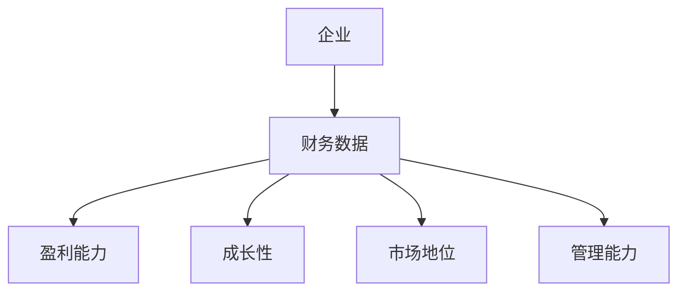
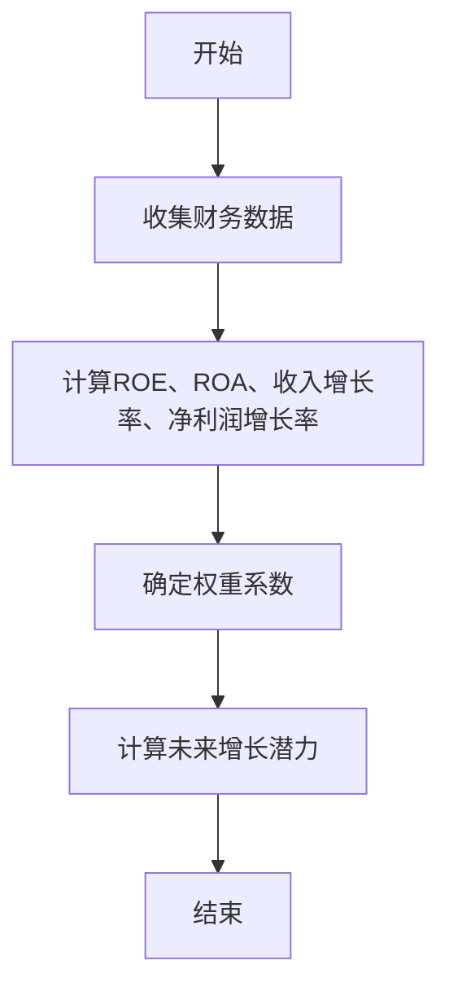
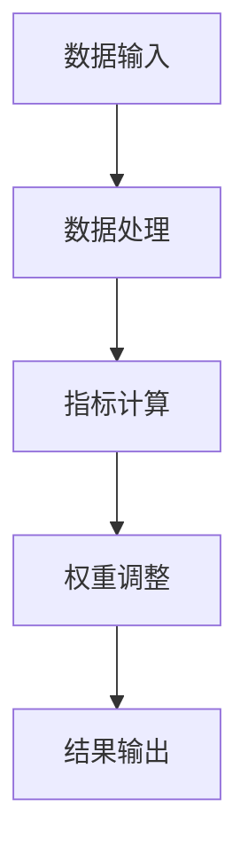
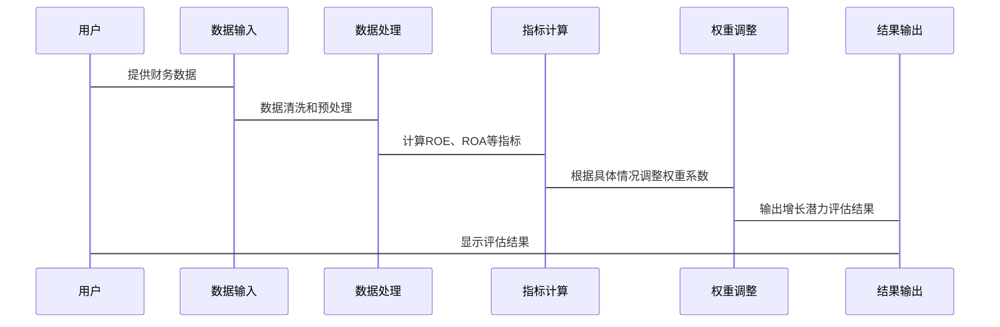

                 


# 费雪的未来增长潜力评估：看透当前财务数据

## 关键词：费雪增长潜力，财务数据，投资分析，企业评估，财务比率

## 摘要：  
费雪的未来增长潜力评估是一种基于财务数据的企业评估方法，旨在通过分析企业的财务状况和市场表现，预测其未来增长潜力。本文将从背景、核心概念、算法原理、系统架构设计、项目实战等多方面详细解读费雪方法，并通过案例分析和实际代码实现，帮助读者掌握这一评估方法。

---

# 第一部分: 费雪的未来增长潜力评估背景与基础

## 第1章: 费雪的未来增长潜力评估概述

### 1.1 什么是费雪的未来增长潜力评估
#### 1.1.1 费雪方法的起源与背景  
费雪的未来增长潜力评估方法由投资大师费雪提出，旨在通过分析企业的财务数据和市场表现，预测其未来的增长潜力。这种方法的核心在于通过财务指标和市场趋势，评估企业的盈利能力和成长性。

#### 1.1.2 未来增长潜力评估的重要性  
企业在市场中的表现不仅取决于当前的财务状况，还与其未来的增长潜力密切相关。通过评估企业的未来增长潜力，投资者可以更好地做出投资决策。

#### 1.1.3 费雪方法的核心思想  
费雪认为，企业的未来增长潜力可以通过对其财务数据的深入分析来预测。具体而言，企业未来的增长潜力取决于其盈利能力、市场地位、管理能力以及行业前景等因素。

---

### 1.2 财务数据在增长潜力评估中的作用
#### 1.2.1 财务数据的基本概念  
财务数据是企业经营状况的直接反映，包括收入、利润、成本、资产、负债等关键指标。这些数据为企业评估提供了重要的分析基础。

#### 1.2.2 财务数据与企业增长的关系  
企业的财务数据与其增长潜力密切相关。例如，高净利润率和稳定的收入增长通常意味着企业具备较强的增长潜力。

#### 1.2.3 费雪方法的独特视角  
费雪方法的独特之处在于，它不仅关注企业的财务数据，还结合市场趋势和行业前景，综合评估企业的未来增长潜力。

---

## 第2章: 费雪方法的核心概念与分析框架

### 2.1 费雪方法的核心概念
#### 2.1.1 核心概念的定义  
费雪方法的核心概念包括盈利能力、成长性、市场地位和管理能力等。

#### 2.1.2 核心概念的属性特征对比表格  
| 核心概念 | 定义 | 属性特征 |  
|----------|------|----------|  
| 盈利能力 | 利润与收入的比率 | 高利润率、稳定的收益 |  
| 成长性 | 收入和利润的增长速度 | 快速增长、稳定的增长 |  
| 市场地位 | 企业在市场中的竞争地位 | 高市场份额、强大的品牌影响力 |  
| 管理能力 | 管理层的决策能力和执行力 | 高效的管理、清晰的战略规划 |

#### 2.1.3 ER实体关系图架构的Mermaid流程图  


---

### 2.2 费雪方法的分析框架
#### 2.2.1 分析框架的构成  
费雪的未来增长潜力评估框架包括以下几个步骤：
1. 收集企业的财务数据。
2. 计算关键财务指标（如ROE、ROA等）。
3. 分析企业的盈利能力、成长性、市场地位和管理能力。
4. 综合评估企业的未来增长潜力。

#### 2.2.2 各模块之间的关系  
```mermaid
graph TD
    A[收集财务数据] --> B[计算财务指标]
    B --> C[分析盈利能力]
    B --> D[分析成长性]
    B --> E[分析市场地位]
    B --> F[分析管理能力]
    C, D, E, F --> G[综合评估]
```

#### 2.2.3 分析框架的数学模型与公式  
费雪方法的核心公式之一是：
$$ \text{未来增长潜力} = f(\text{ROE}, \text{ROA}, \text{收入增长率}, \text{净利润增长率}) $$  
其中，ROE（净资产收益率）和ROA（资产回报率）是衡量企业盈利能力的关键指标，收入增长率和净利润增长率则反映了企业的成长性。

---

# 第二部分: 费雪方法的数学模型与算法原理

## 第3章: 费雪方法的数学模型与公式

### 3.1 核心公式推导
#### 3.1.1 核心公式的数学推导  
费雪方法的核心公式可以表示为：
$$ \text{未来增长潜力} = \alpha \cdot \text{ROE} + \beta \cdot \text{ROA} + \gamma \cdot \text{收入增长率} + \delta \cdot \text{净利润增长率} $$  
其中，α、β、γ、δ是各指标的权重系数。

#### 3.1.2 公式的应用场景  
该公式适用于评估企业的未来增长潜力，尤其是在多个财务指标同时影响企业增长的情况下。

#### 3.1.3 公式的优缺点分析  
优点：综合考虑了多个财务指标的影响。缺点：权重系数的确定需要根据具体情况进行调整。

---

### 3.2 算法原理讲解
#### 3.2.1 算法流程的Mermaid流程图  


#### 3.2.2 算法的Python源代码实现  
```python
def calculate_growth_potential(roe, roa, revenue_growth, net_profit_growth):
    alpha = 0.4
    beta = 0.3
    gamma = 0.2
    delta = 0.1
    growth_potential = alpha * roe + beta * roa + gamma * revenue_growth + delta * net_profit_growth
    return growth_potential

# 示例数据
roe = 15
roa = 10
revenue_growth = 20
net_profit_growth = 15

result = calculate_growth_potential(roe, roa, revenue_growth, net_profit_growth)
print(f"未来增长潜力为: {result}")
```

#### 3.2.3 算法的详细讲解与举例说明  
通过上述代码示例，我们可以看到，费雪方法通过加权计算的方式，综合考虑了企业的盈利能力、资产回报率、收入增长率和净利润增长率等因素，从而评估其未来增长潜力。

---

## 第4章: 费雪方法的系统分析与架构设计

### 4.1 问题场景介绍
#### 4.1.1 问题背景  
企业在经营过程中，需要通过财务数据来评估其未来增长潜力，以便制定合理的战略规划。

#### 4.1.2 问题描述  
如何通过财务数据，准确评估企业的未来增长潜力？费雪方法提供了一种基于财务指标的评估框架。

#### 4.1.3 问题解决的目标  
通过系统化的分析和计算，评估企业的未来增长潜力，为投资决策提供依据。

#### 4.1.4 问题的边界与外延  
本文仅关注基于财务数据的评估方法，不涉及其他因素（如行业政策、宏观经济等）的影响。

#### 4.1.5 核心要素组成  
核心要素包括财务数据、财务指标、权重系数和增长潜力评估结果。

---

### 4.2 系统功能设计
#### 4.2.1 领域模型的Mermaid类图  


#### 4.2.2 系统架构设计的Mermaid架构图  


#### 4.2.3 系统接口设计  
1. 数据输入接口：接收企业的财务数据。
2. 数据处理接口：对数据进行清洗和预处理。
3. 指标计算接口：计算ROE、ROA等财务指标。
4. 权重调整接口：根据具体情况调整各指标的权重系数。
5. 结果输出接口：输出增长潜力评估结果。

#### 4.2.4 系统交互的Mermaid序列图  


---

# 第三部分: 费雪方法的项目实战与案例分析

## 第5章: 项目实战

### 5.1 环境安装与配置
#### 5.1.1 安装Python和相关库  
需要安装Python和以下库：
- `pandas`：用于数据处理
- `numpy`：用于数值计算
- `matplotlib`：用于数据可视化

#### 5.1.2 安装步骤  
```bash
pip install pandas numpy matplotlib
```

---

### 5.2 系统核心实现源代码
#### 5.2.1 财务数据的读取与处理  
```python
import pandas as pd

# 读取财务数据
data = pd.read_csv('financial_data.csv')

# 数据预处理
data = data.dropna()
data = data.astype(float)
```

#### 5.2.2 财务指标的计算  
```python
import pandas as pd

# 计算ROE
data['ROE'] = data['净利润'] / data['净资产']

# 计算ROA
data['ROA'] = data['净利润'] / data['总资产']

# 计算收入增长率
data['收入增长率'] = (data['收入'].pct_change() * 100).round(2)

# 计算净利润增长率
data['净利润增长率'] = (data['净利润'].pct_change() * 100).round(2)
```

#### 5.2.3 增长潜力的评估  
```python
def calculate_growth_potential(roe, roa, revenue_growth, net_profit_growth):
    alpha = 0.4
    beta = 0.3
    gamma = 0.2
    delta = 0.1
    growth_potential = alpha * roe + beta * roa + gamma * revenue_growth + delta * net_profit_growth
    return growth_potential

# 示例数据
roe = 15
roa = 10
revenue_growth = 20
net_profit_growth = 15

result = calculate_growth_potential(roe, roa, revenue_growth, net_profit_growth)
print(f"未来增长潜力为: {result}")
```

---

### 5.3 代码应用解读与分析
#### 5.3.1 代码解读  
上述代码首先读取财务数据并进行预处理，然后计算ROE、ROA、收入增长率和净利润增长率，最后通过加权计算评估企业的未来增长潜力。

#### 5.3.2 代码实现的功能  
代码实现了费雪方法的核心逻辑，包括数据读取、处理和增长潜力评估。

---

### 5.4 案例分析与详细讲解
#### 5.4.1 案例背景  
假设我们有一家企业的财务数据如下：
- 净利润：100万元
- 净资产：500万元
- 总资产：800万元
- 收入：2000万元
- 净利润增长率：15%
- 收入增长率：20%

#### 5.4.2 计算过程  
1. 计算ROE：$$ \text{ROE} = \frac{\text{净利润}}{\text{净资产}} = \frac{100}{500} = 20\% $$  
2. 计算ROA：$$ \text{ROA} = \frac{\text{净利润}}{\text{总资产}} = \frac{100}{800} = 12.5\% $$  
3. 计算收入增长率：$$ \text{收入增长率} = 20\% $$  
4. 计算净利润增长率：$$ \text{净利润增长率} = 15\% $$  
5. 计算未来增长潜力：$$ \text{未来增长潜力} = 0.4 \times 20 + 0.3 \times 12.5 + 0.2 \times 20 + 0.1 \times 15 = 8 + 3.75 + 4 + 1.5 = 17.25\% $$  

#### 5.4.3 结果分析  
根据计算结果，这家企业的未来增长潜力为17.25%，表明其具备一定的增长潜力，但与行业平均水平相比略显不足。

---

## 第6章: 总结与拓展

### 6.1 总结
费雪的未来增长潜力评估方法通过分析企业的财务数据，预测其未来的增长潜力。本文详细介绍了该方法的背景、核心概念、数学模型、系统架构设计和项目实战，并通过案例分析和代码实现，帮助读者掌握了这一评估方法。

### 6.2 最佳实践 tips
- 在实际应用中，建议根据企业的具体情况调整各指标的权重系数。
- 数据的准确性和完整性对评估结果至关重要，因此需要确保数据来源可靠。

### 6.3 注意事项
- 费雪方法仅考虑了财务数据和市场趋势的影响，忽略了其他因素（如行业政策、宏观经济等）。
- 在实际应用中，需要结合其他评估方法，以提高评估的准确性。

### 6.4 拓展阅读
- 《投资学基础》
- 《财务报表分析》
- 《费雪投资思想》

---

通过本文的讲解，读者可以系统地掌握费雪的未来增长潜力评估方法，并将其应用到实际的企业评估和投资决策中。

