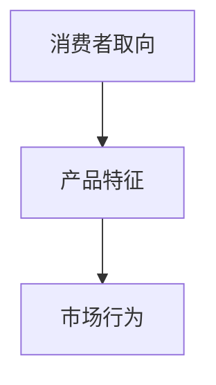
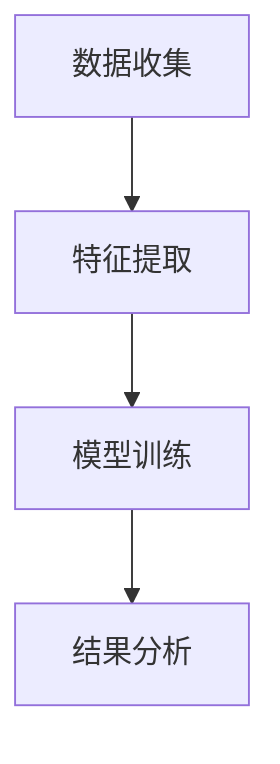
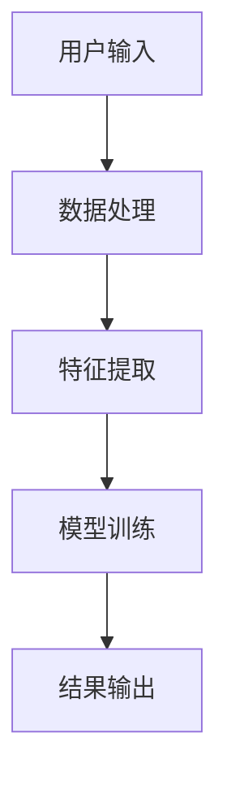
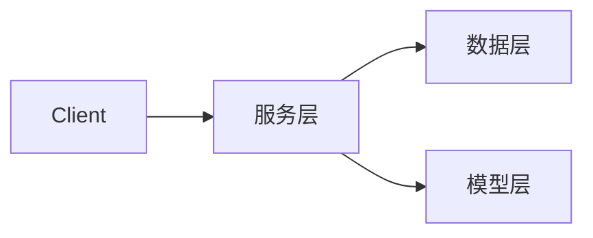

                 


# 费雪的消费者取向分析：把握市场脉搏

> 关键词：消费者取向分析，费雪分析法，市场行为研究，数据分析，Python实现，系统架构设计

> 摘要：本文深入探讨了费雪的消费者取向分析方法，从理论基础到实际应用，结合数学模型和系统架构设计，详细讲解了如何通过费雪分析法准确把握市场脉搏。文章内容涵盖背景介绍、核心概念、算法原理、系统设计、项目实战以及最佳实践等部分，帮助读者全面理解并掌握这一强大的市场分析工具。

---

# 第1章: 费雪的消费者取向分析背景介绍

## 1.1 消费者取向分析的定义与核心概念

### 1.1.1 消费者取向分析的定义
消费者取向分析是一种基于消费者行为和市场数据的分析方法，旨在通过研究消费者的需求、偏好、购买行为等因素，帮助企业制定精准的市场策略。费雪分析法是其中一种重要的分析方法，它通过数学模型和数据挖掘技术，揭示消费者取向与市场行为之间的内在联系。

### 1.1.2 费雪分析法的核心要素
- **消费者特征**：包括年龄、性别、收入水平、职业等 demographic features。
- **产品特征**：产品的属性，如价格、质量、品牌等。
- **市场行为**：消费者的购买行为，包括购买频率、购买金额等。

### 1.1.3 消费者取向分析的边界与外延
消费者取向分析的边界在于消费者行为的可测量性，而外延则包括对消费者心理和行为的深度挖掘。

## 1.2 消费者取向分析的历史与发展

### 1.2.1 消费者行为研究的历史演变
消费者行为研究起源于20世纪初，经历了从定性研究到定量研究的转变。

### 1.2.2 费雪分析法的提出与理论基础
费雪分析法由统计学家Fisher提出，基于多元统计分析理论。

### 1.2.3 费雪分析法在现代市场研究中的应用
现代市场研究中，费雪分析法被广泛应用于消费者细分和市场预测。

## 1.3 费雪分析法与其他市场分析方法的对比

### 1.3.1 费雪分析法与传统市场调研的区别
传统市场调研依赖问卷调查，而费雪分析法则利用数据分析技术。

### 1.3.2 费雪分析法与消费者心理学的联系
费雪分析法通过数据分析揭示消费者行为的心理动因。

### 1.3.3 费雪分析法与大数据分析的结合
大数据分析为费雪分析法提供了丰富的数据源。

---

# 第2章: 费雪分析法的核心概念与原理

## 2.1 费雪分析法的理论基础

### 2.1.1 费雪分析法的基本假设
费雪分析法假设消费者行为与产品特征之间存在线性关系。

### 2.1.2 费雪分析法的数学模型
费雪分析法的数学模型如下：
$$
y = \beta_0 + \beta_1 x_1 + \beta_2 x_2 + \cdots + \beta_n x_n + \epsilon
$$
其中，$y$是市场行为变量，$x_i$是消费者特征变量，$\beta_i$是回归系数，$\epsilon$是误差项。

### 2.1.3 费雪分析法的核心公式推导
通过最小二乘法，我们可以得到回归系数的估计值：
$$
\hat{\beta} = (X^T X)^{-1} X^T y
$$

## 2.2 费雪分析法的核心概念对比

### 2.2.1 消费者取向与市场行为的关系
消费者取向是影响市场行为的重要因素。

### 2.2.2 不同消费者取向维度的特征对比
下表展示了不同消费者取向维度的特征对比：

| 消费者取向维度 | 描述 |
|----------------|------|
| 年龄           | 消费者的年龄范围 |
| 收入           | 消费者的收入水平 |
| 职业           | 消费者的职业类型 |

### 2.2.3 费雪分析法的ER实体关系图


## 2.3 本章小结

---

# 第3章: 费雪分析法的算法原理与实现

## 3.1 费雪分析法的算法流程

### 3.1.1 数据预处理
数据预处理包括数据清洗、特征提取和标准化。

### 3.1.2 模型训练
使用多元线性回归模型进行训练。

### 3.1.3 结果分析
通过回归系数分析消费者取向对市场行为的影响程度。



## 3.2 费雪分析法的Python实现

### 3.2.1 环境安装
安装必要的Python库：
```bash
pip install numpy pandas scikit-learn
```

### 3.2.2 核心代码实现
```python
import numpy as np
from sklearn.linear_model import LinearRegression

# 数据准备
X = np.array([[age, income, occupation], ...])
y = np.array([...])  # 市场行为数据

# 模型训练
model = LinearRegression()
model.fit(X, y)

# 结果分析
print(model.coef_)
```

### 3.2.3 代码解读与分析
通过回归系数，我们可以分析不同消费者取向对市场行为的影响程度。

## 3.3 费雪分析法的数学模型和公式

### 3.3.1 费雪分析法的数学模型
费雪分析法的数学模型如前所述。

### 3.3.2 回归系数的计算公式
回归系数的计算公式为：
$$
\hat{\beta} = (X^T X)^{-1} X^T y
$$

---

# 第4章: 系统分析与架构设计

## 4.1 系统分析与设计

### 4.1.1 系统应用场景
费雪分析法可以应用于消费者行为研究、市场预测等领域。

### 4.1.2 系统功能设计
系统功能包括数据输入、特征提取、模型训练和结果输出。



## 4.2 系统架构设计

### 4.2.1 系统架构图


### 4.2.2 系统交互流程
```mermaid
graph LR
    Client -> S: 发送数据请求
    S -> D: 获取数据
    S -> M: 训练模型
    S -> Client: 返回结果
```

---

# 第5章: 项目实战

## 5.1 项目背景与目标

### 5.1.1 项目背景
本项目旨在通过费雪分析法研究消费者取向对市场行为的影响。

### 5.1.2 项目目标
实现费雪分析法的Python代码，并应用于实际案例分析。

## 5.2 核心代码实现

### 5.2.1 环境配置
安装必要的Python库：
```bash
pip install numpy pandas scikit-learn
```

### 5.2.2 数据准备
加载数据并进行预处理。

### 5.2.3 模型实现
使用线性回归模型进行训练。

## 5.3 实际案例分析

### 5.3.1 案例介绍
以消费者年龄、收入和职业为例，分析其对购买行为的影响。

### 5.3.2 数据分析与结果解读
通过回归系数分析不同因素对市场行为的影响程度。

## 5.4 项目小结

---

# 第6章: 最佳实践与注意事项

## 6.1 最佳实践 tips

### 6.1.1 数据预处理的重要性
数据预处理是影响模型性能的关键因素。

### 6.1.2 模型调优的技巧
通过交叉验证优化模型参数。

## 6.2 小结

## 6.3 注意事项

### 6.3.1 数据隐私问题
在处理消费者数据时，需要注意数据隐私保护。

### 6.3.2 模型适用性
费雪分析法适用于线性关系的场景。

## 6.4 拓展阅读

---

# 结语

通过本文的详细讲解，读者可以全面理解费雪的消费者取向分析方法，并掌握其实现和应用的技巧。希望本文能为市场分析领域提供有价值的参考。

