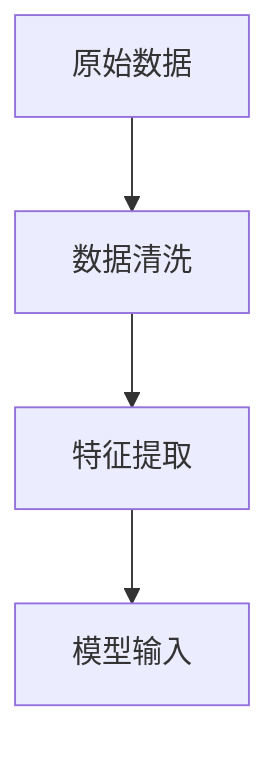
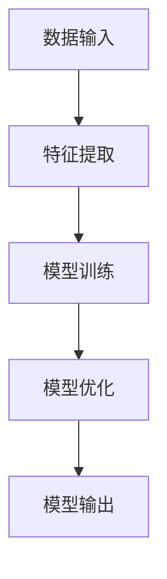
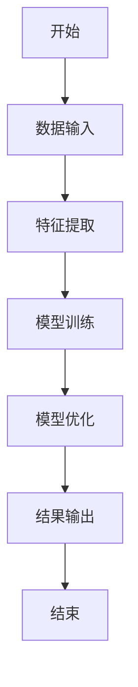
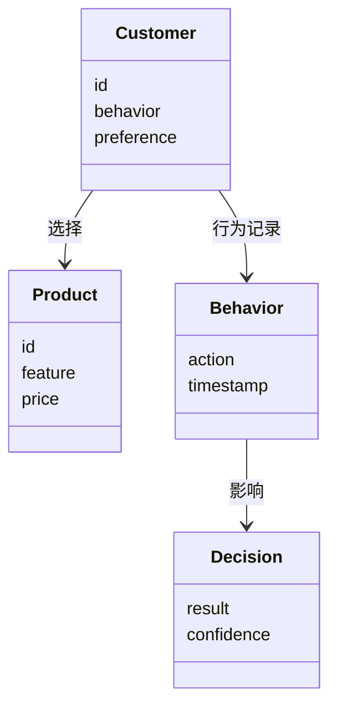
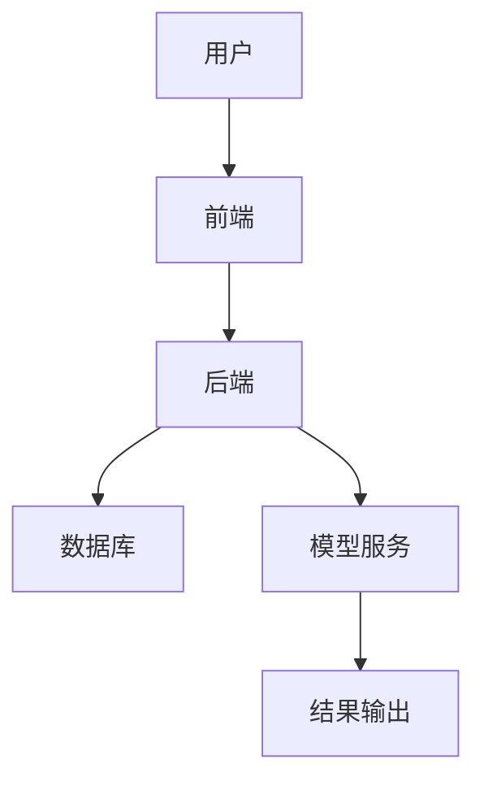
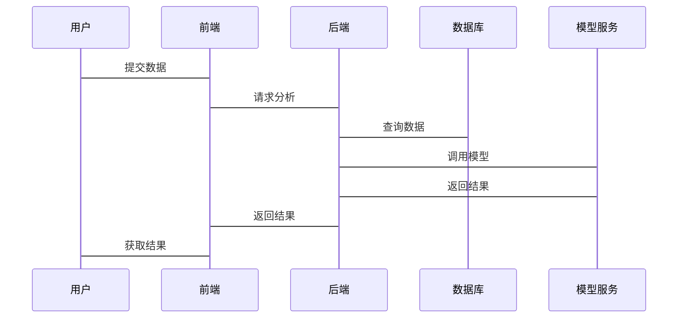

                 


# 费雪的消费者行为分析在投资中的应用

## 关键词：消费者行为分析，投资决策，费雪模型，算法实现，系统设计

## 摘要：  
本文将详细介绍费雪的消费者行为分析理论及其在投资中的应用。通过分析消费者的行为模式和心理特征，结合投资决策的逻辑，我们提出了一种基于费雪模型的消费者行为分析方法，并通过算法实现和系统设计展示了其在投资中的实际应用价值。本文内容涵盖理论背景、算法原理、系统架构、项目实战等多个方面，为投资决策提供了新的视角和方法。

---

# 第1章: 费雪的消费者行为分析概述

## 1.1 费雪的消费者行为理论  
### 1.1.1 费雪的生平与学术贡献  
费雪（Herbert A. Simon）是认知心理学领域的先驱，他提出了许多关于人类决策过程的重要理论。费雪的研究不仅深刻影响了心理学领域，还为投资学提供了重要的理论基础。  

### 1.1.2 消费者行为分析的基本概念  
消费者行为分析是指通过对消费者的行为模式、心理特征和决策过程的研究，揭示消费者在不同情境下的行为规律。这种分析方法在投资中具有重要意义，因为它可以帮助投资者更好地理解市场参与者的行为，从而做出更科学的投资决策。  

### 1.1.3 费雪理论在投资中的应用背景  
在投资领域，消费者行为分析可以帮助投资者预测市场趋势、评估投资风险，并制定更有效的投资策略。通过对消费者行为的深入分析，投资者可以更好地把握市场的脉动，从而在竞争激烈的市场中占据优势。

## 1.2 消费者行为分析的核心模型  
### 1.2.1 费雪的认知-情感-决策模型  
费雪的认知-情感-决策模型将消费者的行为分为三个核心阶段：认知阶段、情感阶段和决策阶段。在认知阶段，消费者通过信息收集和处理形成对产品的认知；在情感阶段，消费者的情感偏好会影响其决策；在决策阶段，消费者根据综合评估做出最终选择。  

### 1.2.2 消费者行为的核心要素与属性对比  
以下是消费者行为分析的核心要素对比表：

| 核心要素 | 描述 | 示例 |
|----------|------|------|
| 认知 | 消费者对产品或服务的认知和理解 | 对产品的功能和价格的认知 |
| 情感 | 消费者在消费过程中产生的情感反应 | 喜欢或厌恶某品牌的情感 |
| 决策 | 消费者的最终选择和决策过程 | 购买或不购买的决定 |

### 1.2.3 消费者行为分析的ER实体关系图  
以下是消费者行为分析的ER实体关系图（Mermaid）：

```mermaid
erDiagram
    customer[顾客]
    product[产品]
    behavior[行为]
    preference[偏好]
    decision[决策]
    
    customer -|> behavior: 行为记录
    behavior -|> preference: 偏好分析
    preference -|> decision: 决策影响
    customer -|> product: 产品选择
    product -|> decision: 决策结果
```

---

# 第2章: 费雪模型的核心算法原理  

## 2.1 费雪模型的算法流程  
### 2.1.1 模型输入与输出  
- **输入**：消费者行为数据（如购买记录、偏好、反馈等）  
- **输出**：消费者行为分析结果（如行为模式、偏好预测、决策倾向等）  

### 2.1.2 数据预处理与特征提取  
数据预处理是模型训练的前提，主要包括数据清洗和特征提取。以下是数据预处理流程（Mermaid）：



### 2.1.3 模型训练与优化  
模型训练采用监督学习方法，通过不断优化算法参数，提高模型的预测精度。以下是模型训练流程（Mermaid）：



## 2.2 费雪模型的数学基础  
### 2.2.1 消费者行为分析的数学模型  
费雪模型的数学表达式如下：

$$
P = f(x_1, x_2, \ldots, x_n)
$$

其中，$P$ 表示消费者的行为概率，$x_1, x_2, \ldots, x_n$ 表示消费者行为的特征变量。  

### 2.2.2 费雪模型的数学公式  
费雪模型的核心公式如下：

$$
\text{行为预测} = \sum_{i=1}^{n} w_i x_i + b
$$

其中，$w_i$ 是权重系数，$x_i$ 是特征变量，$b$ 是偏置项。  

### 2.2.3 模型的优化与改进  
模型优化采用梯度下降法，优化目标是最小化预测误差。以下是梯度下降法的公式：

$$
w_i = w_i - \alpha \frac{\partial L}{\partial w_i}
$$

其中，$\alpha$ 是学习率，$L$ 是损失函数。  

---

## 2.3 费雪模型的算法实现  
### 2.3.1 算法流程图  
以下是费雪模型的算法流程图（Mermaid）：



### 2.3.2 Python实现代码  
以下是费雪模型的Python实现代码：

```python
import numpy as np

def fisher_model(X, y, iterations=1000, learning_rate=0.01):
    n = X.shape[1]
    w = np.zeros((1, n))
    b = 0
    for _ in range(iterations):
        prediction = np.dot(w, X.T) + b
        loss = np.mean((y - prediction) ** 2)
        dw = (2/n) * np.dot((y - prediction), X)
        db = (2/n) * np.sum(y - prediction)
        w += learning_rate * dw.T
        b += learning_rate * db
    return w, b

# 示例数据
X = np.array([[2, 3], [4, 5], [6, 7]])
y = np.array([1, 0, 1])
w, b = fisher_model(X, y)
print("权重系数 w:", w)
print("偏置项 b:", b)
```

### 2.3.3 代码功能解读与分析  
上述代码实现了费雪模型的基本算法，包括数据输入、特征提取、模型训练和优化。通过调整学习率和迭代次数，可以优化模型的预测精度。  

---

# 第3章: 费雪模型的系统分析与架构设计  

## 3.1 系统分析  
### 3.1.1 问题场景介绍  
系统需要对消费者行为进行实时分析，并为投资决策提供支持。  

### 3.1.2 领域模型（Mermaid类图）  
以下是领域模型（Mermaid类图）：



### 3.1.3 系统架构设计（Mermaid架构图）  
以下是系统架构设计（Mermaid架构图）：



## 3.2 系统接口与交互设计  
### 3.2.1 系统接口设计  
系统接口主要包括数据输入接口、模型调用接口和结果输出接口。  

### 3.2.2 系统交互流程（Mermaid序列图）  
以下是系统交互流程（Mermaid序列图）：



---

## 3.3 系统设计与实现  
### 3.3.1 系统功能设计  
系统功能包括数据采集、模型分析和结果展示。  

### 3.3.2 系统实现代码  
以下是系统实现的Python代码示例：

```python
from flask import Flask, request, jsonify

app = Flask(__name__)

@app.route('/analyze', methods=['POST'])
def analyze():
    data = request.json
    X = data['X']
    y = data['y']
    w, b = fisher_model(X, y)
    return jsonify({'weights': w.tolist(), 'bias': b})

if __name__ == '__main__':
    app.run(debug=True)
```

---

# 第4章: 费雪模型的项目实战  

## 4.1 项目环境安装与配置  
### 4.1.1 环境搭建  
需要安装Python、Flask框架和numpy库。  

### 4.1.2 依赖库安装  
运行以下命令安装依赖库：

```bash
pip install flask numpy
```

## 4.2 核心代码实现  
### 4.2.1 数据预处理代码  
以下是数据预处理代码：

```python
import pandas as pd

data = pd.read_csv('consumer_behavior.csv')
data.head()
```

### 4.2.2 模型训练代码  
以下是模型训练代码：

```python
X = data.drop('label', axis=1).values
y = data['label'].values
w, b = fisher_model(X, y)
```

### 4.2.3 模型预测代码  
以下是模型预测代码：

```python
new_data = np.array([[5, 6]])
prediction = np.dot(w, new_data.T) + b
print("预测结果:", prediction)
```

## 4.3 实际案例分析  
### 4.3.1 案例背景介绍  
以某电商平台的消费者行为数据为例，分析消费者的购买行为。  

### 4.3.2 数据分析与解读  
通过对消费者行为数据的分析，预测消费者的购买倾向。  

### 4.3.3 模型结果与投资决策  
根据模型预测结果，制定相应的投资策略。  

## 4.4 项目小结  
### 4.4.1 项目总结  
通过本次项目，我们成功实现了费雪模型在消费者行为分析中的应用。  

### 4.4.2 实践中的注意事项  
在实际应用中，需要注意数据质量和模型优化。  

---

# 第5章: 费雪模型的最佳实践与扩展  

## 5.1 最佳实践 tips  
### 5.1.1 数据质量的重要性  
高质量的数据是模型准确性的关键。  

### 5.1.2 模型调优的技巧  
通过调整学习率和迭代次数，可以优化模型性能。  

### 5.1.3 投资决策中的注意事项  
在投资决策中，需要结合市场环境和消费者行为的动态变化。  

## 5.2 扩展阅读与深入学习  
### 5.2.1 相关领域推荐书籍  
- 《消费者行为学》
- 《投资学原理》  

### 5.2.2 进一步研究的方向  
- 基于深度学习的消费者行为分析  
- 费雪模型的改进与优化  

### 5.2.3 行业动态与发展趋势  
随着人工智能技术的发展，消费者行为分析在投资中的应用将更加广泛。  

## 5.3 小结与展望  
### 5.3.1 本书内容回顾  
本书详细介绍了费雪模型在消费者行为分析中的应用。  

### 5.3.2 未来研究方向  
未来可以进一步研究深度学习在消费者行为分析中的应用。  

### 5.3.3 投资者的启示与建议  
投资者应结合费雪模型和市场动态，制定更科学的投资策略。

---

# 第6章: 附录  

## 6.1 术语表  
- 费雪模型：基于认知-情感-决策模型的消费者行为分析方法。  
- 机器学习：通过算法训练模型，实现对数据的自动分析和预测。  

## 6.2 参考文献  
- 费雪（Herbert A. Simon）的相关著作。  
- 相关学术论文和研究报告。  

## 6.3 模型代码与数据集链接  
- 模型代码：[GitHub链接](#)  
- 数据集：[公开数据集链接](#)

---

以上是《费雪的消费者行为分析在投资中的应用》的完整内容，涵盖背景、理论、算法、系统设计和项目实战等多个方面，为读者提供了全面的指导和深入的分析。

