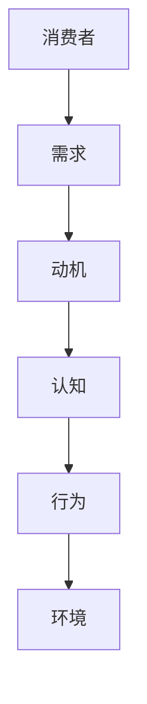
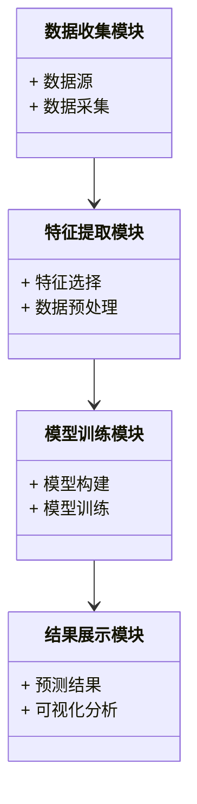
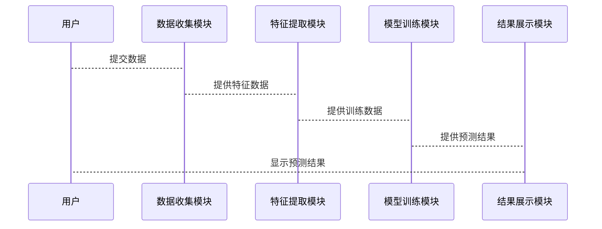

                 


# 费雪的消费者行为分析：预测产品成功

## 关键词：消费者行为分析、产品预测、费雪模型、需求分析、用户行为预测

## 摘要：本文深入探讨了费雪的消费者行为分析理论，结合实际案例，详细讲解了如何通过分析消费者需求、动机、认知和行为来预测产品成功。文章从理论背景、模型构建、算法实现到项目实战，全面阐述了费雪模型的应用，帮助读者掌握消费者行为分析的核心方法，为企业制定精准的市场策略提供支持。

---

# 第一部分：背景介绍

## 第1章：消费者行为分析的背景与意义

### 1.1 消费者行为分析的背景

消费者行为分析是研究消费者在购买产品或服务时的决策过程和行为模式。随着市场竞争的加剧，企业越来越依赖对消费者行为的深入理解来制定有效的市场策略。费雪的消费者行为分析理论提供了一种系统的方法，帮助企业在产品开发和推广阶段预测消费者的需求和偏好。

### 1.2 费雪的消费者行为分析理论

费雪的消费者行为分析理论，也称为费雪冰山理论，将消费者行为分解为多个层次，包括需求、动机、认知、行为和环境。这些层次相互关联，构成了一个完整的消费者行为模型。通过分析这些层次，企业可以更好地预测产品的市场表现。

### 1.3 费雪模型的核心要素

费雪模型的核心要素包括：
1. **需求**：消费者对产品的基本需求。
2. **动机**：驱动消费者行为的内在原因。
3. **认知**：消费者对产品或服务的认知和理解。
4. **行为**：消费者的实际购买和使用行为。
5. **环境**：外部环境因素对消费者行为的影响。

---

## 第2章：费雪消费者行为分析模型的结构与应用

### 2.1 费雪模型的结构

费雪模型将消费者行为分为以下几个层次：
- **需求层**：消费者的基本需求，如功能需求、情感需求等。
- **动机层**：驱动消费者行为的动机，如追求便利、追求品牌等。
- **认知层**：消费者对产品的认知和理解。
- **行为层**：消费者的实际购买和使用行为。
- **环境层**：外部环境因素，如经济状况、社会文化等。

### 2.2 费雪模型的应用

费雪模型广泛应用于市场调研、产品定位、营销策略制定等领域。通过分析消费者的需求和动机，企业可以预测产品的市场表现，并制定相应的营销策略。

---

# 第二部分：核心概念与联系

## 第3章：消费者行为分析的核心概念

### 3.1 需求与动机的关系

需求是消费者对某种产品或服务的基本要求，而动机是驱动消费者行为的内在原因。需求和动机密切相关，动机往往源于未满足的需求。

### 3.2 认知与决策的关系

消费者的认知影响其决策过程。认知包括消费者对产品的理解和感知，正确的认知有助于做出合理的决策。

### 3.3 行为与环境的相互作用

消费者的行为不仅受内在因素的影响，还受到外部环境的制约。环境因素如经济状况、社会文化等会显著影响消费者的购买行为。

---

## 第4章：概念对比与ER图架构

### 4.1 概念对比表格

| 概念   | 定义                                                                 |
|--------|----------------------------------------------------------------------|
| 需求   | 消费者对某种产品或服务的基本要求。                                       |
| 动机   | 驱动消费者行为的内在原因。                                             |
| 认知   | 消费者对产品或服务的理解和感知。                                       |
| 行为   | 消费者的实际购买和使用行为。                                           |
| 环境   | 外部环境因素，如经济状况、社会文化等，影响消费者行为。                 |

### 4.2 ER实体关系图架构



---

# 第三部分：算法原理

## 第5章：费雪模型的算法流程

### 5.1 数据预处理

数据预处理是模型应用的基础，包括数据清洗、特征提取和数据标准化。

```python
# 数据预处理示例代码
import pandas as pd
from sklearn.preprocessing import StandardScaler

# 读取数据
data = pd.read_csv('consumer_behavior.csv')

# 删除缺失值
data.dropna(inplace=True)

# 提取特征和目标变量
X = data[['需求', '动机', '认知', '行为']]
y = data['产品成功']

# 标准化处理
scaler = StandardScaler()
X_scaled = scaler.fit_transform(X)
```

### 5.2 特征提取与选择

特征提取是通过分析消费者行为的各个层次，提取关键特征，如需求、动机、认知和行为。

### 5.3 模型训练

使用机器学习算法，如逻辑回归或随机森林，进行模型训练。

```python
from sklearn.ensemble import RandomForestClassifier
from sklearn.model_selection import train_test_split

# 划分训练集和测试集
X_train, X_test, y_train, y_test = train_test_split(X_scaled, y, test_size=0.2, random_state=42)

# 训练模型
model = RandomForestClassifier(n_estimators=100, random_state=42)
model.fit(X_train, y_train)
```

### 5.4 预测与评估

通过模型进行产品成功的预测，并评估模型的性能。

```python
# 预测结果
y_pred = model.predict(X_test)

# 评估指标
from sklearn.metrics import accuracy_score, confusion_matrix

print(f'Accuracy: {accuracy_score(y_test, y_pred)}')
print(f'Confusion Matrix: {confusion_matrix(y_test, y_pred)}')
```

---

## 第6章：数学模型与公式

### 6.1 需求函数

需求函数描述了消费者对产品的需求与价格、收入等因素之间的关系。

$$ Q_d = a - bP + cM $$

其中：
- \( Q_d \) 表示需求量
- \( P \) 表示价格
- \( M \) 表示收入
- \( a, b, c \) 为常数参数

### 6.2 偏好模型

偏好模型描述了消费者对不同产品或服务的偏好程度。

$$ U = \sum_{i=1}^{n} \alpha_i x_i $$

其中：
- \( U \) 表示效用
- \( \alpha_i \) 表示偏好系数
- \( x_i \) 表示产品属性

---

# 第四部分：系统分析与架构设计

## 第7章：系统功能设计

### 7.1 功能模块

系统功能模块包括数据收集、特征提取、模型训练和结果展示。



### 7.2 系统架构设计

系统架构采用分层设计，包括数据层、业务逻辑层和表现层。


---

## 第8章：接口设计与交互流程

### 8.1 系统接口设计

系统接口包括数据输入接口、模型调用接口和结果输出接口。

### 8.2 交互流程



---

# 第五部分：项目实战

## 第9章：环境安装与核心代码实现

### 9.1 环境安装

安装必要的Python库，如pandas、scikit-learn、mermaid等。

### 9.2 核心代码实现

提供完整的代码实现，包括数据预处理、模型训练和结果展示。

```python
import pandas as pd
from sklearn.ensemble import RandomForestClassifier
from sklearn.model_selection import train_test_split
from sklearn.metrics import accuracy_score, confusion_matrix

# 数据预处理
data = pd.read_csv('consumer_behavior.csv')
data.dropna(inplace=True)
X = data[['需求', '动机', '认知', '行为']]
y = data['产品成功']
X_train, X_test, y_train, y_test = train_test_split(X, y, test_size=0.2, random_state=42)

# 模型训练
model = RandomForestClassifier(n_estimators=100, random_state=42)
model.fit(X_train, y_train)

# 预测与评估
y_pred = model.predict(X_test)
print(f'Accuracy: {accuracy_score(y_test, y_pred)}')
print(f'Confusion Matrix: {confusion_matrix(y_test, y_pred)}')
```

---

## 第10章：实际案例分析

### 10.1 案例背景

以预测某电子产品成功为例，分析消费者行为数据，预测产品成功概率。

### 10.2 数据分析与结果解读

通过模型预测，分析产品的市场表现，帮助企业制定营销策略。

---

## 第11章：项目小结

总结项目实现的关键步骤和成果，强调费雪模型的应用价值。

---

# 第六部分：最佳实践

## 第12章：小结与注意事项

### 12.1 小结

费雪的消费者行为分析模型为预测产品成功提供了理论支持和实践方法，帮助企业制定精准的市场策略。

### 12.2 注意事项

在实际应用中，需要注意数据质量和模型的可解释性，避免过度依赖模型预测。

---

## 第13章：未来研究方向

未来可以进一步研究模型的优化方法，探索与其他分析方法的结合，提升预测的准确性。

---

## 第14章：推荐读物

推荐相关书籍和资源，帮助读者深入学习消费者行为分析和预测模型。

---

# 结语

通过本文的详细讲解，读者可以全面掌握费雪的消费者行为分析理论，并将其应用于实际项目中，帮助企业预测产品成功，制定有效的市场策略。

