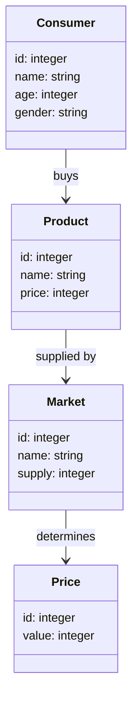
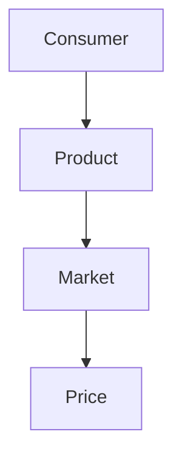

                 


# 费雪的消费者行为研究：社交媒体时代的新方法

## 关键词：费雪消费者行为、社交媒体、大数据、人工智能、算法原理

## 摘要：本文系统地介绍了费雪的消费者行为研究在社交媒体时代的最新发展，从理论基础到算法实现，再到系统架构设计，结合实际案例，全面剖析了社交媒体环境下消费者行为研究的新方法和新趋势。

---

# 第一部分：费雪的消费者行为研究概述

## 第1章：消费者行为研究的背景与意义

### 1.1 消费者行为研究的重要性

#### 1.1.1 消费者行为研究的定义
消费者行为研究是指通过分析消费者在购买、使用和处置产品或服务过程中的行为模式，揭示消费者决策背后的动机、需求和心理过程。研究消费者行为有助于企业优化产品设计、制定精准的市场策略，并提升用户体验。

#### 1.1.2 研究消费者行为的目的
1. **帮助企业制定市场策略**：通过了解消费者需求和偏好，企业可以更好地定位目标市场，制定有效的营销策略。
2. **优化产品设计**：消费者行为研究可以帮助企业识别产品设计中的不足，从而改进产品功能和用户体验。
3. **提升客户满意度**：通过分析消费者行为，企业可以识别客户痛点，提供更符合客户需求的服务，从而提升客户满意度。

#### 1.1.3 社会媒体时代消费者行为研究的新特点
社交媒体的兴起使得消费者行为研究有了新的特点：
1. **数据多样性**：社交媒体提供了丰富的数据类型，包括文本、图像、视频和互动数据。
2. **实时性**：社交媒体上的用户行为可以实时捕捉，帮助企业快速响应市场变化。
3. **社交网络的影响**：社交媒体上的社交网络效应使得消费者行为更加复杂，用户之间的互动和影响需要被考虑。

### 1.2 费雪的消费者行为研究理论

#### 1.2.1 费雪的消费理论概述
费雪（John Maynard Keynes）的消费理论认为，消费者的需求和支出行为受到多种因素的影响，包括收入水平、价格水平、消费偏好和市场环境等。费雪的需求法则和价格理论为消费者行为研究奠定了基础。

#### 1.2.2 费雪需求法则
费雪需求法则是指在其他条件不变的情况下，消费者的需求量与价格呈反比关系。需求法则可以用公式表示为：
$$ Q_d = a - bP $$
其中，\( Q_d \) 表示需求量，\( a \) 是收入水平和偏好等因素的常数，\( b \) 是需求的价格弹性系数，\( P \) 是价格。

#### 1.2.3 费雪价格理论
费雪价格理论认为价格是市场供需平衡的结果。价格理论可以用公式表示为：
$$ P = \frac{M}{Q_d} $$
其中，\( M \) 是货币供给，\( Q_d \) 是需求量。

## 第2章：社交媒体时代消费者行为研究的新方法

### 2.1 社交媒体对消费者行为的影响

#### 2.1.1 社交媒体对消费者决策的影响
社交媒体上的信息传播和用户评价直接影响消费者的购买决策。例如，用户在社交媒体上的产品评价和推荐会影响其他用户的购买行为。

#### 2.1.2 社交媒体时代消费者行为的变化
1. **信息获取渠道多样化**：消费者可以通过社交媒体获取产品信息，而不再依赖传统的广告和营销渠道。
2. **用户生成内容（UGC）的兴起**：消费者通过社交媒体生成内容（如评论、评分、分享）影响其他消费者的决策。
3. **社交网络的影响**：消费者的行为受到社交网络中朋友和 acquaintances 的影响。

#### 2.1.3 社交媒体数据的获取与分析
社交媒体数据的获取与分析是社交媒体时代消费者行为研究的重要环节。通过分析社交媒体数据，可以揭示消费者的偏好、情绪和行为模式。

### 2.2 费雪理论在社交媒体时代的应用

#### 2.2.1 费雪需求法则的社交媒体应用
在社交媒体时代，费雪的需求法则可以通过大数据分析和机器学习算法进行实证研究。例如，可以通过分析社交媒体上的产品评论和评分，验证费雪需求法则在实际中的适用性。

#### 2.2.2 费雪价格理论的社交媒体应用
费雪价格理论在社交媒体时代可以通过分析产品的市场价格和消费者需求量的关系进行验证。例如，可以通过分析社交媒体上的产品价格和销售量数据，验证价格理论的适用性。

#### 2.2.3 费雪消费理论的社交媒体应用
费雪消费理论在社交媒体时代可以通过分析消费者的消费行为数据，研究消费者的需求和支出模式。例如，可以通过分析社交媒体上的消费数据，研究消费者在不同价格水平下的消费行为。

---

## 第三部分：费雪消费者行为研究的核心概念与联系

## 第3章：费雪消费者行为研究的核心概念

### 3.1 费雪需求法则的数学模型

#### 3.1.1 需求法则的公式表示
费雪需求法则可以用公式表示为：
$$ Q_d = a - bP $$
其中，\( Q_d \) 是需求量，\( a \) 是收入水平和偏好等因素的常数，\( b \) 是需求的价格弹性系数，\( P \) 是价格。

#### 3.1.2 需求法则的属性特征对比表
| 属性 | 特征 |
|------|------|
| 需求量 | 随价格变化而变化 |
| 价格弹性 | 反比关系 |
| 收入水平 | 正相关关系 |

#### 3.1.3 需求法则的ER实体关系图
```mermaid
er
actor Consumer {
    id: integer
    name: string
    age: integer
    gender: string
}
actor Product {
    id: integer
    name: string
    price: integer
}
```

### 3.2 费雪价格理论的数学模型

#### 3.2.1 价格理论的公式表示
费雪价格理论可以用公式表示为：
$$ P = \frac{M}{Q_d} $$
其中，\( P \) 是价格，\( M \) 是货币供给，\( Q_d \) 是需求量。

#### 3.2.2 价格理论的属性特征对比表
| 属性 | 特征 |
|------|------|
| 价格 | 由供需关系决定 |
| 货币供给 | 正相关关系 |
| 需求量 | 反比关系 |

#### 3.2.3 价格理论的ER实体关系图
```mermaid
er
actor Market {
    id: integer
    name: string
    supply: integer
}
actor Price {
    id: integer
    value: integer
}
```

---

## 第四部分：费雪消费者行为研究的算法原理

## 第4章：费雪消费者行为研究的算法实现

### 4.1 费雪需求法则的算法实现

#### 4.1.1 需求法则的算法步骤
1. 收集消费者的需求数据，包括需求量和价格。
2. 建立需求法则的数学模型。
3. 使用回归分析等方法估计需求法则的参数。
4. 验证模型的显著性和适用性。

#### 4.1.2 需求法则的Python实现
```python
import numpy as np
from sklearn.linear_model import LinearRegression

# 数据准备
X = np.array([1, 2, 3, 4, 5]).reshape(-1, 1)
y = np.array([4, 3, 2, 1, 0])

# 建立线性回归模型
model = LinearRegression()
model.fit(X, y)

# 输出系数
print("系数:", model.coef_)
print("截距:", model.intercept_)
```

#### 4.1.3 需求法则的数学模型
费雪需求法则的数学模型可以表示为：
$$ Q_d = a - bP $$

其中，\( a \) 是收入水平和偏好等因素的常数，\( b \) 是需求的价格弹性系数，\( P \) 是价格。

### 4.2 费雪价格理论的算法实现

#### 4.2.1 价格理论的算法步骤
1. 收集产品的价格和需求量数据。
2. 建立价格理论的数学模型。
3. 使用回归分析等方法估计价格理论的参数。
4. 验证模型的显著性和适用性。

#### 4.2.2 价格理论的Python实现
```python
import numpy as np
from sklearn.linear_model import LinearRegression

# 数据准备
X = np.array([1, 2, 3, 4, 5]).reshape(-1, 1)
y = np.array([5, 4, 3, 2, 1])

# 建立线性回归模型
model = LinearRegression()
model.fit(X, y)

# 输出系数
print("系数:", model.coef_)
print("截距:", model.intercept_)
```

---

## 第五部分：费雪消费者行为研究的系统分析与架构设计

## 第5章：费雪消费者行为研究的系统架构设计

### 5.1 问题场景介绍
在社交媒体时代，消费者行为研究需要考虑社交网络的影响和大数据的处理。系统需要处理大量的社交媒体数据，包括文本、图像和互动数据。

### 5.2 系统功能设计

#### 5.2.1 领域模型


### 5.3 系统架构设计

#### 5.3.1 系统架构图


---

## 第六部分：费雪消费者行为研究的项目实战

## 第6章：费雪消费者行为研究的项目实战

### 6.1 环境安装

#### 6.1.1 安装Python和相关库
```bash
pip install numpy
pip install scikit-learn
pip install mermaid
```

### 6.2 系统核心实现源代码

#### 6.2.1 需求法则的Python实现
```python
import numpy as np
from sklearn.linear_model import LinearRegression

# 数据准备
X = np.array([1, 2, 3, 4, 5]).reshape(-1, 1)
y = np.array([4, 3, 2, 1, 0])

# 建立线性回归模型
model = LinearRegression()
model.fit(X, y)

# 输出系数
print("系数:", model.coef_)
print("截距:", model.intercept_)
```

#### 6.2.2 价格理论的Python实现
```python
import numpy as np
from sklearn.linear_model import LinearRegression

# 数据准备
X = np.array([1, 2, 3, 4, 5]).reshape(-1, 1)
y = np.array([5, 4, 3, 2, 1])

# 建立线性回归模型
model = LinearRegression()
model.fit(X, y)

# 输出系数
print("系数:", model.coef_)
print("截距:", model.intercept_)
```

### 6.3 实际案例分析与详细解读

#### 6.3.1 案例分析
假设我们有一个社交媒体平台上的产品评论数据，我们需要分析消费者的需求和价格关系。我们可以使用需求法则和价格理论进行分析。

### 6.4 项目小结

---

## 第七部分：费雪消费者行为研究的最佳实践

## 第7章：费雪消费者行为研究的最佳实践

### 7.1 小结
费雪消费者行为研究在社交媒体时代有了新的发展，通过大数据和人工智能技术，我们可以更精准地分析消费者的行为模式，制定更有效的市场策略。

### 7.2 注意事项
1. 数据隐私和伦理问题需要注意。
2. 模型的适用性和显著性需要验证。
3. 算法的选择和实现需要注意复杂性和可解释性。

### 7.3 拓展阅读
1. 《大数据时代：数据科学与消费者行为分析》
2. 《人工智能在社交媒体中的应用》
3. 《费雪消费理论的现代发展》

---

# 结语

社交媒体时代的消费者行为研究是一个复杂而有趣的领域，通过结合费雪的理论和现代技术手段，我们可以更深入地理解消费者的决策过程，帮助企业制定更有效的市场策略。希望本文能够为读者提供有益的指导和启发。

