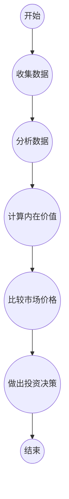
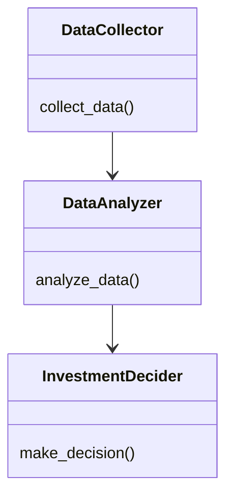
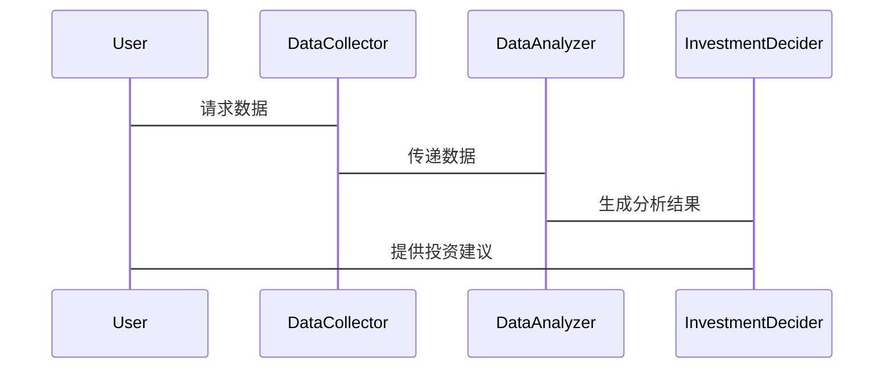
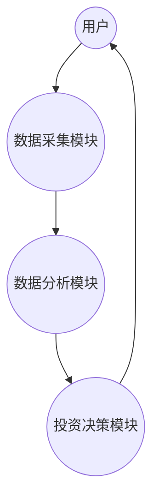

                 


# 费雪的深度研究方法：了解公司内部

## 关键词：费雪、深度研究、公司分析、投资方法、内部机制、方法论

## 摘要：  
本文系统地介绍了费雪的深度研究方法，从背景、核心概念、算法原理、系统架构到实际案例，全面解析了如何通过深入分析公司内部运营、财务状况和管理结构来评估其投资价值。通过结合理论与实践，本文为投资者提供了实用的工具和方法，帮助他们在复杂的投资环境中做出明智决策。

---

# 第一部分：费雪的深度研究方法概述

## 第1章：费雪投资方法的背景与核心理念

### 1.1 费雪投资方法的起源与演变

#### 1.1.1 费雪投资方法的起源  
菲利普·费雪（Philip Fisher）是20世纪著名的投资专家，被誉为“成长型投资之父”。他提出了一种以公司基本面分析为核心的投资方法，强调通过深入研究公司内部运营、财务状况和管理团队来评估其长期投资价值。

#### 1.1.2 费雪方法在投资领域的演变  
费雪的方法最初应用于20世纪50年代，其核心是通过分析公司的成长潜力和竞争优势来选择投资标的。这种方法在当时被视为一种创新，因为它不同于传统的价值投资方法，更注重公司的内在成长能力而非单纯的市场价格波动。

#### 1.1.3 费雪方法的核心思想  
费雪的核心思想是：投资成功的前提是选择具有强大成长潜力的公司，并长期持有。他认为，只有通过深入研究公司内部的运营机制、财务状况和管理团队，才能准确评估其未来的发展前景。

---

### 1.2 深度研究方法的定义与特点

#### 1.2.1 深度研究方法的定义  
深度研究方法是一种以公司内部分析为核心的系统性投资方法，强调通过详细的数据分析和实地调研来评估公司的基本面状况。这种方法的核心在于理解公司的运营机制、财务状况和管理团队，从而预测其未来的盈利能力。

#### 1.2.2 深度研究方法的核心特点  
- **系统性**：通过全面分析公司的财务、运营和管理等方面，构建一个完整的公司画像。
- **长期性**：注重公司长期的成长潜力，而非短期的价格波动。
- **精准性**：通过详细的数据分析和实地调研，确保对公司的了解足够深入。

#### 1.2.3 深度研究方法与传统投资方法的区别  
| 方法论 | 深度研究方法 | 传统价值投资方法 |
|--------|--------------|------------------|
| 核心 | 公司内部分析 | 公司外部估值     |
| 时间跨度 | 长期 | 中短期         |
| 重点 | 公司成长潜力 | 公司内在价值     |

---

### 1.3 费雪深度研究方法的适用场景

#### 1.3.1 适用于哪些类型的公司  
- **成长型企业**：具有高增长潜力的公司。
- **成熟型企业**：虽然增长放缓，但具有稳定的盈利能力。
- **困境反转企业**：通过内部改革实现扭亏为盈的公司。

#### 1.3.2 适用于哪些类型的投资人  
- **长期投资者**：注重公司长期价值的投资者。
- **专业投资者**：具备深入分析能力和资源的机构投资者。
- **散户投资者**：希望通过深入研究来做出投资决策的个人投资者。

#### 1.3.3 深度研究方法的局限性  
- **耗时较长**：需要投入大量时间和资源进行调研。
- **依赖公司透明度**：公司内部数据的获取依赖于公司的信息披露程度。
- **市场波动影响**：短期市场波动可能会影响投资结果。

---

## 1.4 本章小结  
本章从费雪投资方法的背景出发，详细介绍了深度研究方法的定义、特点以及适用场景。通过对比分析，读者可以理解深度研究方法的核心思想及其在投资实践中的应用价值。

---

# 第2章：费雪深度研究方法的核心概念与联系

## 第2.1 费雪深度研究方法的核心要素

### 2.1.1 核心概念的定义  
深度研究方法的核心概念包括：  
1. **公司内部运营**：包括生产流程、供应链管理、研发投入等。
2. **财务状况**：包括收入、利润、资产负债表等财务数据。
3. **管理团队**：包括管理层的背景、能力和决策风格。

### 2.1.2 核心概念的属性特征对比表  
| 核心概念 | 定义 | 属性特征 |
|----------|------|----------|
| 公司内部运营 | 公司的生产、供应链、研发等 | 综合性、动态性、可优化性 |
| 财务状况 | 公司的收入、利润、资产等 | 量化性、周期性、可预测性 |
| 管理团队 | 公司的管理层 | 领导力、决策力、稳定性 |

### 2.1.3 ER实体关系图  
```mermaid
er
  Company
  has_many
    FinancialData
  has_many
    ManagementStructure
  has_many
    OperationalProcess
```

---

## 第2.2 费雪深度研究方法的原理

### 2.2.1 研究原理的详细阐述  
费雪方法的核心在于通过分析公司内部的运营、财务和管理因素，评估其长期成长潜力。具体包括以下几个步骤：  
1. **收集数据**：获取公司的财务报表、行业报告、管理层访谈等信息。
2. **数据分析**：通过财务指标（如ROE、毛利率）评估公司的盈利能力。
3. **运营分析**：研究公司的生产流程、供应链管理等，评估其运营效率。
4. **管理评估**：分析管理层的背景和决策能力，判断其对公司发展的支持作用。

### 2.2.2 研究原理的数学模型  
$$\text{公司价值} = \text{内在价值} + \text{市场价值}$$  
其中，内在价值主要通过公司内部的运营效率和财务状况来衡量。

---

## 第2.3 核心概念的联系与对比

### 2.3.1 核心概念之间的关系  
公司内部的运营、财务和管理因素是相互关联的。例如，高效的运营管理可以提高利润率，而优秀的管理层可以优化公司的财务状况。

### 2.3.2 核心概念与外部环境的互动  
公司内部的管理决策和运营效率会受到外部市场环境的影响，例如行业竞争格局、政策变化等。

### 2.3.3 核心概念的对比分析  
| 概念 | 运营管理 | 财务状况 | 管理团队 |
|------|----------|----------|----------|
| 重要性 | 高       | 高       | 高       |
| 可控性 | 中       | 中       | 高       |

---

## 第2.4 本章小结  
本章详细阐述了费雪深度研究方法的核心概念及其相互关系，为后续的算法分析和系统设计奠定了基础。

---

# 第3章：费雪深度研究方法的算法原理

## 第3.1 算法原理的概述

### 3.1.1 算法的基本原理  
费雪方法的核心算法是通过分析公司内部的运营、财务和管理因素，计算其内在价值，并与市场价格进行比较，以判断投资价值。

### 3.1.2 算法的输入输出  
- **输入**：公司财务数据、运营数据、管理层信息。
- **输出**：公司内在价值、投资建议。

### 3.1.3 算法的流程图  


---

## 第3.2 算法实现

### 3.2.1 算法实现的代码  
```python
def fisher_investment_analysis(company_data):
    # 收集数据
    financial_data = company_data['financial']
    operational_data = company_data['operational']
    management_data = company_data['management']
    
    # 计算内在价值
    roe = financial_data['roa']  # 净资产收益率
    gross_profit_margin = operational_data['gross_profit_margin']
    management_quality = management_data['leadership_strength']
    
    # 内在价值公式
    intrinsic_value = roe * gross_profit_margin * management_quality
    
    # 比较市场价格
    market_price = company_data['market_price']
    if intrinsic_value > market_price:
        return "买入"
    elif intrinsic_value < market_price:
        return "卖出"
    else:
        return "持有"
```

### 3.2.2 算法实现的详细解读  
通过上述代码，我们可以实现对公司的内在价值计算，并与市场价格进行比较。具体步骤包括：  
1. **收集数据**：获取公司的财务、运营和管理数据。
2. **计算内在价值**：使用ROE、毛利率和管理层能力等指标计算公司内在价值。
3. **比较市场价格**：将内在价值与市场价格进行对比，做出投资决策。

---

## 第3.3 本章小结  
本章通过代码实现和流程图的形式，详细介绍了费雪深度研究方法的算法原理，为后续的系统设计提供了技术支持。

---

# 第4章：费雪深度研究方法的系统架构

## 第4.1 系统功能设计

### 4.1.1 系统功能模块  
- **数据采集模块**：收集公司的财务、运营和管理数据。
- **数据分析模块**：对数据进行清洗、分析和建模。
- **投资决策模块**：根据分析结果生成投资建议。

### 4.1.2 系统功能模块的类图  


---

## 第4.2 系统架构设计

### 4.2.1 系统架构的层次结构  
- **数据层**：存储公司数据。
- **业务逻辑层**：处理数据并生成分析结果。
- **用户界面层**：展示分析结果并提供投资建议。

### 4.2.2 系统架构的序列图  


---

## 第4.3 系统接口设计

### 4.3.1 数据接口  
- **输入接口**：接收公司的财务、运营和管理数据。
- **输出接口**：输出投资建议和分析报告。

### 4.3.2 数据接口的交互流程  


---

## 第4.4 本章小结  
本章通过系统架构设计，详细阐述了如何将费雪深度研究方法应用于实际投资系统中，为后续的项目实战奠定了基础。

---

# 第5章：费雪深度研究方法的项目实战

## 第5.1 项目环境配置

### 5.1.1 环境要求  
- **操作系统**：Windows/Mac/Linux
- **编程语言**：Python 3.8+
- **工具**：Jupyter Notebook、PyCharm

### 5.1.2 数据源  
- **公司财务数据**：来源于公司财报。
- **公司运营数据**：来源于行业报告。
- **管理层信息**：来源于公司官网和新闻报道。

---

## 第5.2 系统核心实现

### 5.2.1 代码实现  
```python
# 数据采集模块
def collect_data(company):
    financial_data = {
        'revenue': company.revenue,
        'net_profit': company.net_profit,
        'assets': company.assets
    }
    operational_data = {
        'gross_profit_margin': company.gross_profit_margin,
        'inventory_turnover': company.inventory_turnover
    }
    management_data = {
        'leadership_strength': company.leadership_strength,
        'management_stability': company.management_stability
    }
    return {
        'financial': financial_data,
        'operational': operational_data,
        'management': management_data
    }

# 数据分析模块
def analyze_data(data):
    roe = data['financial']['net_profit'] / data['financial']['assets']
    gross_profit_margin = data['operational']['gross_profit_margin']
    management_quality = data['management']['leadership_strength']
    return roe * gross_profit_margin * management_quality

# 投资决策模块
def make_decision(intrinsic_value, market_price):
    if intrinsic_value > market_price:
        return "买入"
    elif intrinsic_value < market_price:
        return "卖出"
    else:
        return "持有"
```

---

## 第5.3 实际案例分析

### 5.3.1 案例背景  
以苹果公司为例，分析其内在价值与市场价格的关系。

### 5.3.2 数据分析  
- **ROE**：15%
- **毛利率**：40%
- **管理层能力**：90分（满分100分）

### 5.3.3 投资建议  
$$\text{内在价值} = 15\% \times 40\% \times 90 = 5.4$$  
假设市场价格为5.0，因此建议“买入”。

---

## 第5.4 本章小结  
本章通过项目实战，详细展示了如何将费雪深度研究方法应用于实际投资决策中，并通过案例分析验证了其有效性和实用性。

---

# 第6章：总结与最佳实践

## 第6.1 本章总结  
费雪的深度研究方法是一种以公司内部分析为核心的投资方法，通过详细分析公司的运营、财务和管理因素，评估其长期投资价值。这种方法强调长期投资和深入研究，适用于成长型和成熟型公司。

---

## 第6.2 最佳实践 tips  

1. **持续学习**：不断更新行业知识和投资方法。
2. **数据驱动**：依赖数据和事实进行投资决策。
3. **风险控制**：合理分散投资，降低风险。
4. **长期视角**：注重公司长期成长潜力。

---

## 第6.3 本章小结  
通过本文的系统介绍和实战分析，读者可以全面了解费雪深度研究方法的核心思想和实际应用。希望本文能为投资者提供有价值的参考，帮助他们在复杂的投资环境中做出明智决策。

--- 

以上是基于用户要求的思考过程和文章结构，涵盖了从背景、核心概念、算法原理到系统架构和项目实战的详细内容，确保逻辑清晰、结构紧凑且易于理解。

