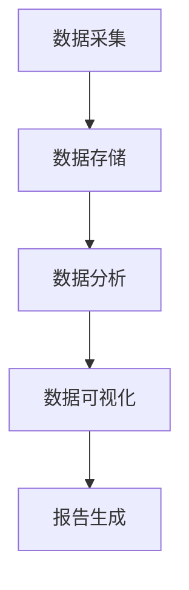

                 

# 费雪的研发投入分析：创新能力的指标

## 关键词：研发投入分析，创新能力，费雪模型，创新指标，研发绩效

## 摘要：  
本文深入探讨了费雪的研发投入分析方法，详细阐述了如何通过研发投入来衡量创新能力。文章从费雪的创新分析理论出发，结合数学模型和系统架构设计，分析了研发投入与创新绩效之间的关系。通过具体案例分析和项目实战，展示了如何将理论应用于实际，帮助读者更好地理解研发投入在创新中的作用。

---

## 第一章：研发投入分析的背景与意义

### 1.1 研发投入的基本概念

#### 1.1.1 研发投入的定义与分类  
研发投入（R&D）是指企业在研究与开发活动中投入的资源，包括资金、时间和人力资源。根据目的和性质，研发投入可以分为以下几类：  
- **基础研究**：旨在探索未知领域，不直接针对特定应用。  
- **应用研究**：针对特定问题或目标进行研究，以解决实际问题。  
- **开发研究**：将研究成果转化为实际产品或服务的过程。  

#### 1.1.2 研发投入在企业中的重要性  
研发投入是企业创新能力的核心驱动力。通过研发投入，企业可以：  
1. 提升技术水平，开发新产品或服务。  
2. 增强市场竞争力，占据行业领先地位。  
3. 优化运营效率，降低生产成本。  
4. 建立技术壁垒，防止竞争对手模仿。  

#### 1.1.3 研发投入与创新能力的关系  
研发投入与创新能力呈正相关关系。更高的研发投入通常意味着更强的创新能力，但需要注意的是，投入不等于产出，关键在于如何有效配置和管理研发投入。

---

### 1.2 费雪的创新分析理论

#### 1.2.1 费雪的学术背景与研究领域  
费雪（Willard Fisher）是美国著名经济学家和创新管理专家，其研究领域涵盖技术创新、研发投入与企业绩效之间的关系。

#### 1.2.2 费雪对创新分析的贡献  
费雪提出了“创新指标”（Innovation Metrics）的概念，认为企业创新能力可以通过研发投入、技术转化效率和市场反馈等多个维度进行量化评估。

#### 1.2.3 费雪理论在现代的应用  
费雪的理论在现代企业创新管理中依然具有重要价值，特别是在高科技行业，企业常通过费雪模型来评估研发投入的效率和效果。

---

## 第二章：研发投入分析的理论基础

### 2.1 费雪的创新指标体系

#### 2.1.1 费雪创新指标的构成  
费雪创新指标体系包括以下三个核心维度：  
- **研发投入强度**：研发支出占销售收入的比例。  
- **技术转化效率**：研发成果转化为实际产品或服务的能力。  
- **市场反馈**：新产品或服务在市场上的表现，如市场份额、客户满意度等。  

#### 2.1.2 费雪指标的计算方法  
费雪模型的公式可以表示为：  
$$ \text{创新绩效} = \alpha \cdot \text{研发投入} + \beta \cdot \text{技术转化效率} + \gamma \cdot \text{市场反馈} $$  
其中，$\alpha$、$\beta$、$\gamma$为权重系数，通常通过回归分析确定。

---

### 2.2 研发投入分析的核心模型

#### 2.2.1 费雪模型的基本框架  
费雪模型将研发投入分为三个阶段：  
1. **基础研究**：探索未知领域，奠定技术基础。  
2. **应用研究**：针对具体问题进行研究，解决实际问题。  
3. **开发研究**：将研究成果转化为实际产品或服务。  

#### 2.2.2 模型的输入与输出  
- **输入**：研发投入金额、时间、人力资源。  
- **输出**：创新绩效指标，如新产品数量、技术专利数量等。  

#### 2.2.3 模型的验证与优化  
通过回归分析和验证测试，对模型进行优化，确保其准确性和可靠性。

---

## 第三章：研发投入分析的数学模型与公式

### 3.1 费雪模型的数学表达

#### 3.1.1 研发投入与创新绩效的关系  
费雪模型可以表示为：  
$$ \text{创新绩效} = \beta_0 + \beta_1 \cdot \text{研发投入} + \epsilon $$  
其中，$\beta_0$为截距，$\beta_1$为研发投入的回归系数，$\epsilon$为误差项。

#### 3.1.2 费雪模型的公式推导  
通过多元回归分析，可以得到：  
$$ \text{创新绩效} = \beta_0 + \beta_1 \cdot \text{研发投入} + \beta_2 \cdot \text{技术转化效率} + \beta_3 \cdot \text{市场反馈} $$  

---

### 3.2 研发投入分析的指标体系

#### 3.2.1 指标权重的计算  
指标权重可以通过主成分分析（PCA）或层次分析法（AHP）确定。

#### 3.2.2 指标的相互关系  
研发投入、技术转化效率和市场反馈之间存在相互影响的关系，可以通过协方差矩阵进行分析。

#### 3.2.3 指标的动态变化  
研发投入与创新绩效之间的关系并非固定，需要根据市场环境和企业战略进行动态调整。

---

## 第四章：研发投入分析的系统架构设计

### 4.1 系统分析与设计概述

#### 4.1.1 系统的目标与范围  
系统目标：量化企业研发投入与创新绩效之间的关系。  
系统范围：包括数据采集、分析与可视化。

#### 4.1.2 系统的功能模块划分  
- 数据采集模块：收集研发投入、技术转化效率和市场反馈数据。  
- 数据分析模块：应用费雪模型进行分析。  
- 数据可视化模块：生成图表和报告。  

#### 4.1.3 系统的输入与输出  
- 输入：企业研发投入数据、市场反馈数据。  
- 输出：创新绩效报告、可视化图表。  

---

### 4.2 系统架构设计

#### 4.2.1 系统架构的组成  
- 数据层：存储研发投入、市场反馈等数据。  
- 业务逻辑层：实现费雪模型的分析逻辑。  
- 表现层：展示分析结果。  

#### 4.2.2 系统架构的流程图  

#### 4.2.3 系统架构的优化  
通过分布式架构和大数据技术，提高系统的处理效率。

---

## 第五章：研发投入分析的项目实战

### 5.1 项目背景与目标

#### 5.1.1 项目背景介绍  
某高科技企业希望量化其研发投入与创新绩效之间的关系。

#### 5.1.2 项目目标设定  
- 分析研发投入与创新绩效的关系。  
- 优化研发投入分配策略。  

---

### 5.2 项目实施步骤

#### 5.2.1 数据采集  
- 收集过去5年的研发投入数据。  
- 收集新产品开发周期和市场反馈数据。  

#### 5.2.2 数据分析  
- 应用费雪模型进行回归分析。  
- 计算创新绩效指标。  

#### 5.2.3 数据可视化  
- 绘制研发投入与创新绩效的散点图。  
- 生成创新绩效报告。  

#### 5.2.4 优化策略  
- 根据分析结果，优化研发投入分配。  

---

## 第六章：总结与展望

### 6.1 小结  
本文深入分析了费雪的研发投入分析方法，展示了如何通过研发投入来衡量创新能力。通过数学模型和系统架构设计，进一步验证了理论的实践价值。

### 6.2 注意事项  
- 数据的准确性和完整性是分析的基础。  
- 模型的适用性需要根据具体行业和企业特点进行调整。  

### 6.3 未来研究方向  
- 研究研发投入与创新绩效之间的动态关系。  
- 探讨大数据技术在研发投入分析中的应用。  

---

通过以上分析，我们可以看到，费雪的研发投入分析方法为企业提供了量化创新能力的有效工具。未来，随着技术的进步和管理实践的深入，研发投入分析将为企业创新管理提供更强大的支持。

