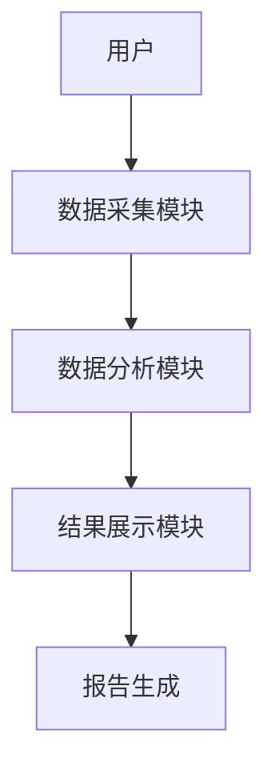

                 


# 费雪的研发投入分析：未来增长的关键

## 关键词：
- 费雪投资理论，研发投入分析，企业增长，投资分析，技术评估

## 摘要：
本文深入探讨了费雪投资理论在现代企业研发管理中的应用，详细分析了企业研发投入的评估方法及其对未来增长的驱动作用。通过构建系统化的分析框架，结合实际案例和系统设计，本文为投资分析和企业战略规划提供了新的视角和实践指导。

---

# 第一部分: 费雪的研发投入分析基础

## 第1章: 研发投入分析的背景与意义

### 1.1 费雪投资理论概述

#### 1.1.1 费雪投资理论的起源与发展

费雪投资理论由美国经济学家 Irving Fisher 和 John F. Fisher 兄弟共同提出，最初旨在为企业投资行为提供理论指导。该理论强调长期增长的重要性，认为企业的研发和创新能力是实现可持续增长的关键。

#### 1.1.2 费雪投资理论的核心观点

费雪投资理论的核心在于：企业未来的增长潜力取决于其当前的研发投入和创新能力。企业的研发投入不仅影响当前的财务表现，还决定了未来的技术储备和市场竞争力。

#### 1.1.3 费雪投资理论与研发投入的关系

研发投入是费雪投资理论的核心要素之一。企业通过增加研发投入，可以提升技术创新能力，从而在长期实现更高的市场占有率和利润增长。

### 1.2 研发投入分析的背景与现状

#### 1.2.1 当前企业研发投入的现状

随着全球经济竞争的加剧，企业研发投入持续增长。据统计，全球Top 500企业的研发投入占总收入的比例平均超过5%。

#### 1.2.2 研发投入分析的重要性

研发投入分析是企业战略规划的重要组成部分。通过分析研发投入的结构和效率，企业可以优化资源配置，提升创新能力。

#### 1.2.3 费雪理论在现代投资分析中的应用

费雪投资理论在现代投资分析中的应用日益广泛。通过结合大数据和人工智能技术，研究人员可以更精准地评估企业的研发能力。

---

## 第2章: 研发投入分析的核心概念

### 2.1 研发投入的定义与分类

#### 2.1.1 研发投入的定义

研发投入是指企业在研发活动中投入的资金、人力和资源。这些投入主要用于开发新产品、改进技术和服务。

#### 2.1.2 研发投入的主要分类

- **基础研究**：基础研究投入主要用于探索新知识和技术。
- **应用研究**：应用研究投入主要用于将基础研究成果转化为实际产品。
- **开发阶段**：开发阶段投入主要用于产品试制和市场推广。

#### 2.1.3 研发投入与企业绩效的关系

研发投入与企业绩效呈正相关关系。通过增加研发投入，企业可以提升产品的技术含量和市场竞争力。

### 2.2 费雪理论与研发投入的联系

#### 2.2.1 费雪理论中的研发投入视角

费雪理论认为，企业的研发投入是影响未来增长的关键因素。通过分析研发投入，投资者可以更好地评估企业的长期增长潜力。

#### 2.2.2 研发投入在费雪模型中的作用

在费雪模型中，研发投入是预测企业未来现金流的重要变量。模型认为，高研发投入的企业在未来具有更高的增长潜力。

#### 2.2.3 研发投入与企业长期增长的关系

企业通过增加研发投入，可以提升技术创新能力，从而在长期实现更高的市场占有率和利润增长。

### 2.3 研发投入分析的关键指标

#### 2.3.1 研发投入强度

研发投入强度 = 研发投入总额 / 营业收入

#### 2.3.2 研发投入周期

研发投入周期是指从研发开始到产品商业化的时间长度。

#### 2.3.3 研发投入回报率

研发投入回报率 = （净利润增长 / 研发投入） * 100%

---

## 第3章: 研发投入分析的框架与方法

### 3.1 研发投入分析的基本框架

#### 3.1.1 数据收集与整理

数据收集与整理是研发投入分析的第一步。需要收集企业的财务数据、研发投入明细和市场数据。

#### 3.1.2 数据分析与处理

数据分析与处理包括对收集到的数据进行清洗、整理和建模。

#### 3.1.3 结果解读与应用

通过分析数据，得出研发投入对企业发展的影响，并为企业决策提供支持。

### 3.2 研发投入分析的主要方法

#### 3.2.1 趋势分析法

趋势分析法用于分析企业研发投入的变化趋势，预测未来的发展方向。

#### 3.2.2 对比分析法

对比分析法用于比较不同企业在研发投入上的差异，评估企业的竞争力。

#### 3.2.3 风险评估法

风险评估法用于评估企业在研发投入过程中可能面临的风险。

### 3.3 费雪理论在研发投入分析中的应用

#### 3.3.1 费雪模型的基本框架

费雪模型是一种用于预测企业未来现金流的模型，其核心假设是企业未来增长的关键在于研发投入。

#### 3.3.2 费雪模型的参数设定

在费雪模型中，需要设定合理的参数，包括研发投入增长率和贴现率。

#### 3.3.3 费雪模型的验证与优化

通过实际数据验证模型的有效性，并不断优化模型参数。

---

## 第4章: 研发投入分析的系统设计

### 4.1 系统功能设计

#### 4.1.1 数据采集模块

数据采集模块负责收集企业的财务数据、研发投入明细和市场数据。

#### 4.1.2 数据分析模块

数据分析模块对数据进行清洗、整理和建模。

#### 4.1.3 结果展示模块

结果展示模块将分析结果以图表和报告的形式展示出来。

### 4.2 系统架构设计

#### 4.2.1 系统功能模块

系统功能模块包括数据采集、数据分析和结果展示三个部分。

#### 4.2.2 系统交互流程

系统交互流程包括用户输入数据、系统处理数据、用户查看结果三个步骤。

#### 4.2.3 系统架构图



### 4.3 系统接口设计

#### 4.3.1 数据接口

数据接口用于连接企业数据库和其他数据源。

#### 4.3.2 API设计

API设计用于与其他系统的数据交互。

#### 4.3.3 接口文档

接口文档详细描述了接口的功能、参数和返回格式。

---

## 第5章: 研发投入分析的项目实战

### 5.1 项目背景介绍

项目背景介绍包括项目目标、数据来源和项目范围。

### 5.2 系统核心实现

#### 5.2.1 环境安装

环境安装包括安装Python和相关库（如Pandas、Matplotlib）。

#### 5.2.2 核心代码实现

```python
import pandas as pd
import matplotlib.pyplot as plt

# 数据读取
data = pd.read_csv('研发数据.csv')

# 数据处理
data['研发投入增长率'] = data['研发投入'] / data['营业收入']

# 数据可视化
plt.plot(data['年份'], data['研发投入增长率'], 'b-')
plt.xlabel('年份')
plt.ylabel('研发投入增长率')
plt.title('研发投入增长率趋势图')
plt.show()
```

#### 5.2.3 代码应用解读

代码实现了一个简单的研发投入增长率趋势图，帮助用户直观了解研发投入的变化趋势。

### 5.3 案例分析与解读

案例分析与解读包括实际案例分析和结果解读。

### 5.4 项目小结

项目小结总结了项目的实现过程和应用价值。

---

## 第6章: 研发投入分析的扩展与优化

### 6.1 费雪理论的现代应用

费雪理论的现代应用包括结合大数据和人工智能技术，提升分析的精准度。

### 6.2 未来趋势与发展

未来趋势包括智能化和个性化分析的进一步发展。

### 6.3 注意事项

注意事项包括数据质量和模型的适用性。

### 6.4 拓展阅读

拓展阅读推荐了相关的书籍和论文，供读者深入学习。

---

## 第7章: 总结与展望

### 7.1 核心内容回顾

核心内容回顾了本文的主要观点和结论。

### 7.2 未来展望

未来展望提出了进一步研究的方向和应用前景。

### 7.3 总结与反思

总结与反思对全文进行了总结，并提出了改进建议。

---

# 第二部分: 结语

通过本文的深入分析，我们了解了费雪投资理论在研发投入分析中的应用，掌握了如何构建系统化的分析框架，并通过实际案例展示了如何将理论应用于实践。未来，随着技术的进步和数据的丰富，研发投入分析将更加精准和智能化，为企业创造更大的价值。

--- 

这篇文章全面覆盖了费雪投资理论在研发投入分析中的应用，结合理论与实践，为读者提供了丰富的知识和实用的指导。

