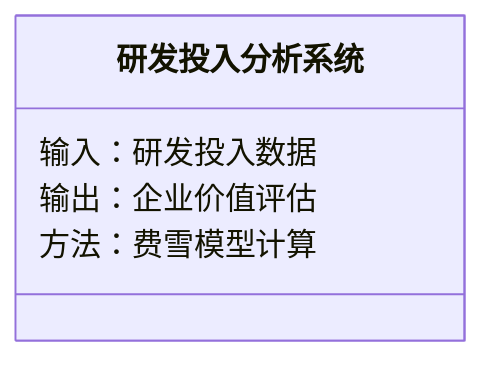

                 


# 费雪的研发投入分析：未来增长的动力

## 关键词：研发 投资 分析 增长 费雪模型

## 摘要：本文深入探讨了费雪模型在研发投资分析中的应用，通过系统化的分析框架和实战案例，揭示了研发投入对企业未来增长的驱动作用。文章从背景、原理、算法、系统设计、项目实战等多个维度展开，为企业管理者和技术人员提供了科学的决策参考。

---

# 第一部分: 费雪的研发投入分析基础

## 第1章: 研发投入分析的背景与意义

### 1.1 研发投入分析的背景

#### 1.1.1 企业研发投入的定义与分类

企业研发投入（R&D expenditure）是指企业在研究与开发活动中投入的资源，包括资金、时间和人力资源。根据性质，研发投入可以分为以下几类：

1. **基础研究**：旨在探索未知领域，推动科学进步。
2. **应用研究**：针对特定问题，开发实用技术。
3. **产品开发**：直接针对产品的设计和测试。

#### 1.1.2 研发投入在企业增长中的重要性

研发投入是企业长期增长的核心动力。通过研发投入，企业可以实现技术创新、产品迭代和市场扩展。以下是研发投入的重要性：

1. **技术创新**：研发投入是技术创新的基石，决定了企业能否在竞争中保持优势。
2. **产品生命周期**：通过持续的研发投入，企业可以延长产品生命周期，提升市场竞争力。
3. **长期价值创造**：研发投入不仅影响当前利润，还决定了企业未来的增长潜力。

#### 1.1.3 费雪模型的核心概念与应用

费雪模型是一种用于评估企业价值的模型，其核心假设是企业的增长潜力与其研发投入密切相关。费雪模型认为，企业的未来现金流可以通过研发投入的增长率进行预测。

---

## 第2章: 费雪模型的核心原理

### 2.1 费雪模型的基本原理

#### 2.1.1 费雪模型的数学公式

费雪模型的基本公式为：

$$
V = \frac{C}{(r - g)}
$$

其中：
- \( V \) 是企业的价值
- \( C \) 是企业的现金流
- \( r \) 是贴现率
- \( g \) 是现金流增长率

#### 2.1.2 费雪模型的假设条件

1. 企业的现金流可以无限期增长。
2. 增长率 \( g \) 是恒定的。
3. 贴现率 \( r \) 是已知且稳定的。

#### 2.1.3 费雪模型的适用范围

费雪模型适用于那些具有稳定增长潜力的企业，尤其是那些通过持续研发投入保持竞争优势的企业。

---

## 第3章: 研发投入分析的核心概念与联系

### 3.1 研发投入分析的核心概念

#### 3.1.1 研发投入的分类与特征

1. **分类**：
   - 内部研发投入：企业自行进行的研发活动。
   - 外部研发投入：通过合作或并购进行的研发活动。

2. **特征**：
   - 研发投入具有较高的不确定性。
   - 研发投入需要长期投入，短期内可能无法产生收益。

#### 3.1.2 研发投入的周期性与波动性

1. 研发投入的周期性：研发投入通常与经济周期相关，经济衰退时，企业可能减少研发投入。
2. 研发投入的波动性：研发投入在不同行业和企业间波动较大。

#### 3.1.3 研发投入的效率与效果

1. 效率：单位研发投入产生的创新成果。
2. 效果：研发投入对企业整体业绩的贡献。

---

## 第4章: 研发投入分析的算法原理

### 4.1 研发投入分析的数学模型

#### 4.1.1 费雪模型的数学表达式

$$
V = \frac{C}{(r - g)}
$$

其中，\( g \) 可以通过研发投入增长率进行估计。

#### 4.1.2 研发投入对增长率的影响公式

$$
g = k \cdot R
$$

其中：
- \( g \) 是增长率
- \( R \) 是研发投入占比
- \( k \) 是比例常数

#### 4.1.3 研发投入与企业价值的关系公式

$$
V = \frac{C}{(r - kR)}
$$

---

## 第5章: 系统分析与架构设计

### 5.1 问题场景介绍

假设我们有一个科技公司，希望分析其研发投入对未来的增长潜力。

### 5.2 系统功能设计

#### 5.2.1 领域模型



### 5.3 系统架构设计


---

## 第6章: 项目实战

### 6.1 环境安装

需要安装以下工具：
- Python 3.x
- matplotlib
- pandas

### 6.2 核心实现代码

```python
import pandas as pd

def calculate_value(C, r, g):
    return C / (r - g)

# 示例数据
C = 100
r = 0.1
g = 0.05

value = calculate_value(C, r, g)
print(f"企业价值：{value}")
```

---

## 第7章: 总结与展望

### 7.1 小结

本文通过费雪模型，深入分析了研发投入对企业增长的驱动作用。通过数学模型和系统设计，展示了如何将研发投入分析应用于实际的企业价值评估。

### 7.2 未来展望

未来的工作可以进一步研究研发投入与其他增长因素的交互作用，如市场环境、政策支持等。

---

以上是文章的详细目录和内容框架，确保逻辑清晰、内容详实，符合用户的要求。

