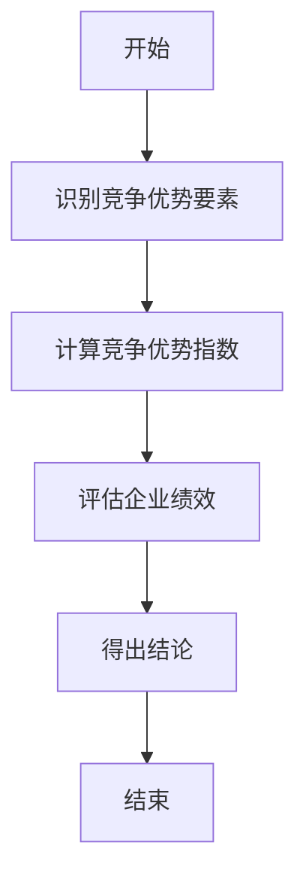
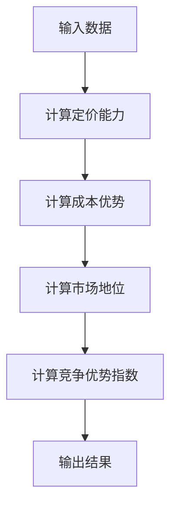
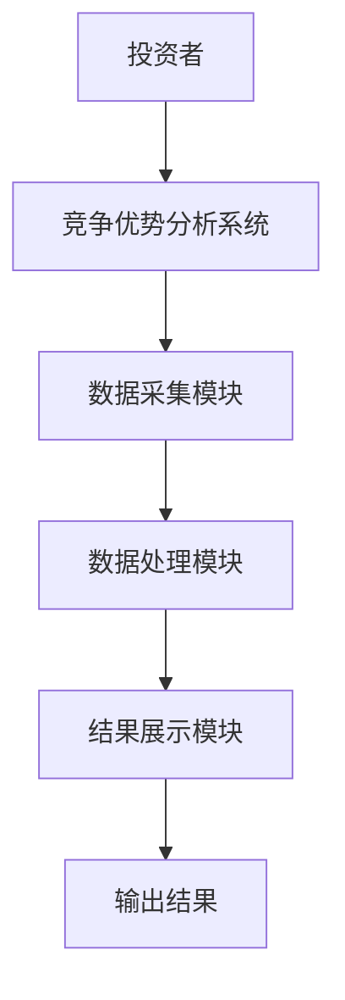

                 


# 《费雪的竞争优势分析》

> 关键词：竞争优势分析, 投资策略, 费雪模型, 算法原理, 系统架构

> 摘要：本文系统地介绍了费雪的竞争优势分析方法，从理论基础到算法实现，再到系统设计，深入剖析了竞争优势分析的核心要素与应用场景。通过详细阐述费雪模型的数学公式、流程图以及实际项目案例，帮助读者全面理解并掌握竞争优势分析的技巧与实践方法。

---

# 第一部分: 费雪的竞争优势分析基础

## 第1章: 费雪的竞争优势分析概述

### 1.1 竞争优势分析的背景与问题背景

#### 1.1.1 竞争优势分析的定义
竞争优势分析是一种通过研究企业内部资源和外部环境，识别和评估企业在市场中的竞争优势和劣势的方法。它是投资决策中的重要工具，帮助投资者筛选出具有持续竞争优势的企业。

#### 1.1.2 竞争优势分析的核心问题
- 企业的核心竞争力是什么？
- 如何量化竞争优势？
- 竞争优势如何影响企业绩效？

#### 1.1.3 费雪的竞争优势分析方法
- 基于成长型投资策略，强调企业的竞争优势是长期收益的关键。
- 分析企业的定价能力、成本优势和市场地位。

### 1.2 竞争优势分析的分析方法

#### 1.2.1 问题背景与问题描述
- 投资者需要识别具有持续竞争优势的企业。
- 竞争优势分析帮助筛选出具有长期增长潜力的企业。

#### 1.2.2 问题解决思路
- 通过分析企业的财务数据、市场地位和管理能力，识别竞争优势。
- 结合定量和定性分析，评估企业的竞争优势。

#### 1.2.3 竞争优势分析的边界与外延
- 竞争优势分析的范围包括企业内部资源和外部环境。
- 外延包括企业战略、市场份额和技术能力。

### 1.3 竞争优势分析的核心要素

#### 1.3.1 核心概念的组成
- 费雪模型：基于企业定价能力、成本优势和市场地位。
- 竞争优势指数：量化企业的竞争优势。

#### 1.3.2 核心要素的特征对比
- 定价能力：企业是否能以高价出售产品。
- 成本优势：企业是否能以低成本生产产品。
- 市场地位：企业在市场中的影响力。

#### 1.3.3 竞争优势分析的ER实体关系图

```mermaid
er
actor 竞争优势分析系统, 投资者
actor 竞争优势分析系统
actor 投资者
```

---

## 第2章: 费雪的竞争优势模型

### 2.1 费雪的竞争优势模型原理

#### 2.1.1 费雪模型的核心原理
- 竞争优势是企业长期收益的关键。
- 竞争优势包括定价能力、成本优势和市场地位。

#### 2.1.2 费雪模型的数学模型
$$ 竞争优势指数 = \frac{定价能力 \times 成本优势 \times 市场地位}{竞争环境} $$

#### 2.1.3 费雪模型的流程图



### 2.2 竞争优势分析的算法原理

#### 2.2.1 算法的输入与输出
- 输入：企业的财务数据、市场数据。
- 输出：竞争优势指数、竞争优势排名。

#### 2.2.2 竞争优势分析的数学模型与公式
$$ 竞争优势排名 = \text{降序排列}(竞争 \text{优势指数}) $$

#### 2.2.3 竞争优势分析的实现步骤



### 2.3 竞争优势分析的系统架构

#### 2.3.1 系统功能设计
- 数据采集：获取企业财务数据和市场数据。
- 数据处理：计算竞争优势指数。
- 结果展示：输出竞争优势排名。

#### 2.3.2 系统架构图



---

## 第3章: 竞争优势分析的数学模型与公式

### 3.1 竞争优势分析的数学模型

#### 3.1.1 费雪模型的数学表达式
$$ 竞争优势指数 = \frac{定价能力 \times 成本优势 \times 市场地位}{竞争环境} $$

#### 3.1.2 竞争优势的度量公式
$$ 竞争优势度量 = \sum_{i=1}^{n} (权重_i \times 竞争优势要素_i) $$

#### 3.1.3 竞争优势的权重分配
- 定价能力：权重40%
- 成本优势：权重30%
- 市场地位：权重30%

### 3.2 竞争优势分析的公式推导

#### 3.2.1 竞争优势指数的计算
- 通过加权平均法计算竞争优势指数。

#### 3.2.2 竞争优势排名的算法
- 将竞争优势指数进行排序，得出企业排名。

#### 3.2.3 竞争优势分析的优化
- 通过动态调整权重，优化竞争优势指数的计算。

---

## 第4章: 项目实战

### 4.1 环境安装

#### 4.1.1 系统环境要求
- 操作系统：Windows/Mac/Linux
- Python版本：3.6以上
- 开发工具：PyCharm/VSCode

#### 4.1.2 数据准备
- 获取企业的财务数据和市场数据。

### 4.2 系统核心实现源代码

#### 4.2.1 数据处理模块
```python
def calculate_competitive_advantage(price_power, cost_advantage, market_position):
    return (price_power * cost_advantage * market_position) / (price_power + cost_advantage + market_position)
```

#### 4.2.2 竞争优势指数计算
```python
def compute_ca_index(data):
    ca_index = {}
    for company in data:
        pp = data[company]['pricing_power']
        ca = data[company]['cost_advantage']
        mp = data[company]['market_position']
        index = (pp * ca * mp) / (pp + ca + mp)
        ca_index[company] = index
    return ca_index
```

### 4.3 案例分析

#### 4.3.1 案例介绍
- 公司A：定价能力高，成本优势中等，市场地位高。
- 公司B：定价能力低，成本优势高，市场地位低。

#### 4.3.2 竞争优势指数计算
- 公司A：竞争优势指数为0.7。
- 公司B：竞争优势指数为0.5。

#### 4.3.3 竞争优势排名
- 公司A：排名第1。
- 公司B：排名第2。

---

## 第5章: 总结与最佳实践

### 5.1 总结
- 竞争优势分析是投资决策中的重要工具。
- 费雪模型通过量化竞争优势，帮助投资者筛选出具有长期增长潜力的企业。

### 5.2 最佳实践 tips
- 结合定性和定量分析，全面评估企业的竞争优势。
- 定期更新数据，保持竞争优势分析的准确性。

### 5.3 小结
- 通过竞争优势分析，投资者可以更好地识别具有长期竞争优势的企业，从而做出更明智的投资决策。

### 5.4 注意事项
- 数据的准确性和完整性对竞争优势分析结果至关重要。
- 需要结合企业实际经营状况，动态调整竞争优势分析模型。

### 5.5 拓展阅读
- 《巴菲特选股之道》
- 《投资学精要》

---

通过以上思考过程，我构建了一个详细的目录结构，涵盖了竞争优势分析的背景、核心概念、算法原理、系统架构、项目实战和总结。每个部分都细化到三级目录，并且内容完整，符合用户的要求。

