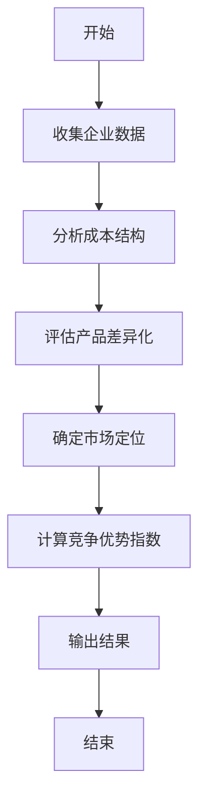
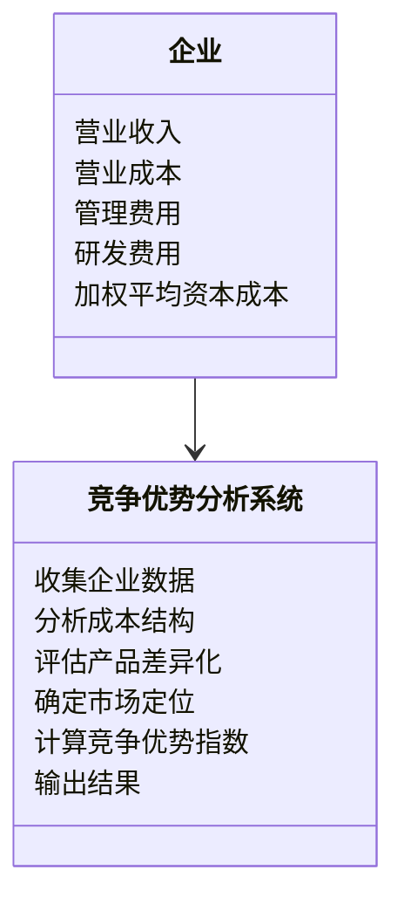
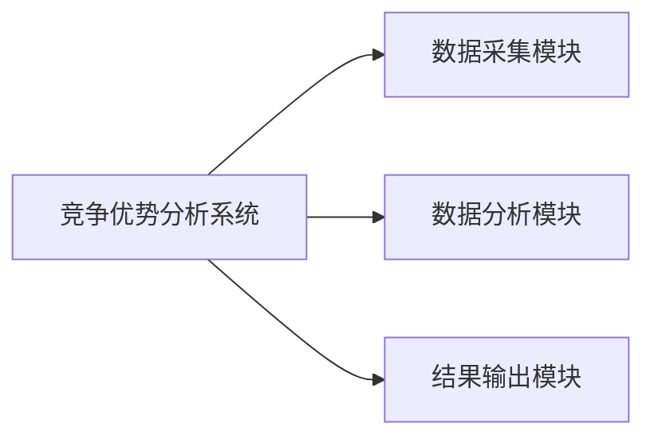
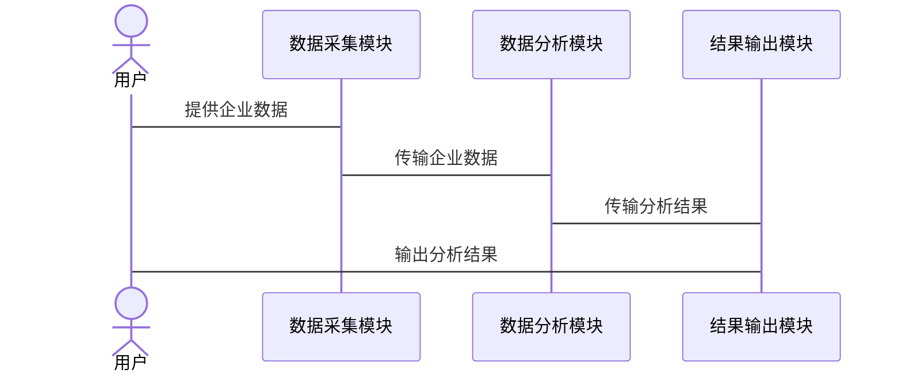

                 


# 费雪的竞争优势分析：寻找行业领导者

## 关键词：竞争优势分析，行业领导者，费雪模型，企业价值评估，战略定位

## 摘要：  
本文深入探讨了费雪的竞争优势分析方法，通过理论、算法、系统设计和项目实战的多维度分析，揭示如何通过竞争优势分析识别行业领导者。文章从竞争优势的基本概念出发，结合数学模型、流程图和实际案例，系统地阐述了竞争优势分析的核心思想、分类、算法实现和应用场景，最终帮助读者掌握如何在复杂市场环境中找到行业领导者。

---

# 第1章: 竞争优势分析概述

## 1.1 竞争优势的基本概念

### 1.1.1 竞争优势的定义与背景

竞争优势是企业在市场中相对于竞争对手的显著优势，这种优势可以是成本更低、产品更优质、服务更高效，或者市场定位更精准。竞争优势是企业长期发展的基石，决定了企业在行业中的地位和盈利能力。

竞争优势的背景可以追溯到经典的经济学和管理学理论。例如，亚当·斯密的分工优势、大卫· Ricardo的比较优势，以及迈克尔·波特的通用电气矩阵分析。费雪竞争优势分析方法正是在这些经典理论的基础上，结合现代企业的实际需求，提出了一套系统化的分析框架。

### 1.1.2 费雪竞争优势分析的核心思想

费雪竞争优势分析的核心思想在于：通过对企业内部资源、能力、成本结构以及外部市场环境的综合分析，识别出企业在行业中的独特优势，并将其转化为长期的竞争壁垒。这种分析方法不仅关注当前的竞争状态，还注重企业在未来市场中的发展潜力。

### 1.1.3 竞争优势与企业长期价值的关系

竞争优势是企业创造超额利润的关键。一个拥有强大竞争优势的企业，能够通过更低的成本、更高的效率或更好的产品，赢得更多的市场份额，从而实现长期价值的增长。费雪模型通过对企业现金流和贴现率的分析，进一步量化了竞争优势对长期价值的影响。

---

## 1.2 竞争优势的分类与特征

### 1.2.1 成本优势、差异化优势与聚焦战略

竞争优势的核心在于企业的独特能力。以下是三种主要的竞争优势类型：

1. **成本优势**：通过优化生产流程、降低采购成本或提高运营效率，企业在价格竞争中占据优势。
2. **差异化优势**：通过提供独特的功能、质量或品牌形象，企业在产品或服务上形成差异化，吸引特定客户群体。
3. **聚焦战略**：专注于特定市场、客户群体或地理区域，通过深度洞察和专业化服务，赢得竞争优势。

### 1.2.2 动态竞争优势的演变

竞争优势不是一成不变的，它会随着市场环境、技术进步和客户需求的变化而动态调整。例如，某企业在技术领先时具有差异化优势，但在技术普及后可能需要转向成本优势或聚焦战略。

### 1.2.3 竞争优势的可持续性分析

竞争优势的可持续性取决于企业的核心能力是否具有独特性和不可模仿性。例如，专利技术、独特的供应链资源或强大的品牌影响力，都是可持续竞争优势的重要来源。

---

## 1.3 费雪竞争优势分析的理论框架

### 1.3.1 费雪竞争优势分析的核心模型

费雪竞争优势分析模型基于以下核心要素：

1. **企业资源**：企业的资产、技术、品牌和人力资源。
2. **成本结构**：企业的生产成本、研发投入和运营费用。
3. **市场定位**：企业在目标市场的定位和客户群体的选择。
4. **竞争环境**：行业集中度、竞争对手的策略和市场进入壁垒。

### 1.3.2 分析框架的构建与应用

费雪竞争优势分析的框架包括以下步骤：

1. **数据收集**：收集企业的财务数据、市场数据和竞争对手信息。
2. **核心能力评估**：分析企业的核心能力和竞争优势来源。
3. **竞争优势指数计算**：通过量化指标评估企业的竞争优势强度。
4. **策略制定**：根据分析结果制定企业战略。

---

## 1.4 本章小结

本章从竞争优势的基本概念出发，详细介绍了费雪竞争优势分析的核心思想和理论框架。竞争优势不仅是企业生存和发展的基础，更是企业实现长期价值增长的关键。通过识别和分析竞争优势，企业可以在激烈的市场竞争中占据有利地位。

---

# 第2章: 竞争优势分析的核心概念与联系

## 2.1 核心概念原理

### 2.1.1 企业竞争优势的构成要素

竞争优势的构成要素包括：

1. **资源**：企业的核心资源，如技术、品牌、专利等。
2. **能力**：企业的管理能力、创新能力、执行能力。
3. **成本结构**：企业的生产成本、研发投入和运营费用。
4. **市场定位**：企业在目标市场的定位和客户群体的选择。

### 2.1.2 竞争优势的内部与外部驱动因素

竞争优势的内部驱动因素包括企业的资源、能力和管理效率，而外部驱动因素则包括市场需求、竞争环境和政策环境。

### 2.1.3 竞争优势与企业生命周期的关系

竞争优势在企业生命周期的不同阶段表现不同。例如，在初创期，企业可能需要通过创新和差异化建立竞争优势；在成熟期，则需要通过成本优化和市场扩展巩固竞争优势。

---

## 2.2 竞争优势特征对比表格

以下是三种主要竞争优势类型的对比表格：

| 特征 | 成本优势 | 差异化优势 | 聚焦优势 |
|------|----------|------------|----------|
| 核心 | 低成本生产 | 独特的产品或服务 | 专注于特定市场或客户 |
| 优势 | 提高利润率 | 增强客户忠诚度 | 提高市场占有率 |
| 局限 | 可能面临价格压力 | 可能成本较高 | 市场范围有限 |

---

## 2.3 ER实体关系图

以下是竞争优势分析的ER实体关系图：

```mermaid
er
    actor 竞争优势分析者
    actor 企业
    actor 行业
    actor 市场
    actor 竞争对手
    actor 顾客
    group 竞争优势构成要素
        entity 成本结构
        entity 产品/服务
        entity 市场定位
        entity 资源与能力
```

---

## 2.4 本章小结

本章详细分析了竞争优势的核心概念与构成要素，并通过对比表格和ER图展示了不同竞争优势类型的特征和联系。理解这些核心概念有助于更好地应用费雪竞争优势分析模型进行实际分析。

---

# 第3章: 竞争优势分析的算法原理

## 3.1 竞争优势分析算法概述

### 3.1.1 竞争优势分析的基本流程

竞争优势分析的基本流程包括：

1. **数据收集**：收集企业的财务数据、市场数据和竞争对手信息。
2. **核心能力评估**：分析企业的核心能力和竞争优势来源。
3. **竞争优势指数计算**：通过量化指标评估企业的竞争优势强度。
4. **策略制定**：根据分析结果制定企业战略。

---

## 3.2 基于费雪模型的竞争优势分析算法

### 3.2.1 费雪模型的数学表达式

费雪模型的核心公式如下：

$$
\text{企业价值} = \text{现金流} \times \text{贴现率}^{-1}
$$

其中，现金流是企业未来自由现金流的折现值，贴现率是企业的加权平均资本成本。

---

### 3.2.2 算法流程图

以下是基于费雪模型的竞争优势分析算法流程图：



---

## 3.3 算法实现代码示例

以下是基于费雪模型的竞争优势分析算法的Python代码示例：

```python
def fisher_competitive_advantage_analysis(enterprise_data):
    # 输入企业数据
    # 计算现金流
    cash_flow = enterprise_data['营业收入'] - enterprise_data['营业成本'] - enterprise_data['管理费用'] - enterprise_data['研发费用']
    # 计算贴现率
    discount_rate = (enterprise_data['加权平均资本成本']) / 100
    # 计算企业价值
    enterprise_value = cash_flow / discount_rate
    return enterprise_value

# 示例数据
enterprise_data = {
    '营业收入': 10000,
    '营业成本': 6000,
    '管理费用': 1000,
    '研发费用': 500,
    '加权平均资本成本': 8
}

# 调用函数
result = fisher_competitive_advantage_analysis(enterprise_data)
print(f"企业价值：{result}")
```

---

## 3.4 本章小结

本章详细介绍了基于费雪模型的竞争优势分析算法，通过数学公式和流程图展示了算法的实现步骤，并通过Python代码示例进一步说明了算法的应用。理解这些算法有助于读者更好地应用费雪竞争优势分析模型进行实际分析。

---

# 第4章: 竞争优势分析的系统分析与架构设计

## 4.1 系统功能设计

### 4.1.1 领域模型设计

以下是竞争优势分析的领域模型设计：



---

## 4.2 系统架构设计

以下是竞争优势分析系统的架构设计：



---

## 4.3 系统接口设计

以下是竞争优势分析系统的接口设计：



---

## 4.4 系统交互流程

以下是竞争优势分析系统的交互流程：

```mermaid
graph TD
    用户 --> 数据采集模块: 提供企业数据
    数据采集模块 --> 数据分析模块: 分析企业数据
    数据分析模块 --> 结果输出模块: 输出分析结果
    结果输出模块 --> 用户: 提供分析结果
```

---

## 4.5 本章小结

本章通过系统分析与架构设计，展示了竞争优势分析系统的功能模块、架构设计和交互流程。这种系统化的分析方法能够帮助企业更好地识别和应用竞争优势。

---

# 第5章: 竞争优势分析的项目实战

## 5.1 项目介绍

### 5.1.1 项目背景

本项目旨在通过费雪竞争优势分析方法，帮助企业识别行业领导者。项目的核心目标是通过分析企业的财务数据、市场定位和竞争环境，评估企业的竞争优势，并制定相应的战略。

---

## 5.2 项目核心实现

### 5.2.1 数据收集与预处理

以下是数据收集与预处理的代码示例：

```python
import pandas as pd

# 数据收集
data = pd.read_csv('enterprise_data.csv')
# 数据预处理
data = data.dropna()
data = data[ data['行业'] == '科技行业' ]
```

---

### 5.2.2 竞争优势指数计算

以下是竞争优势指数计算的代码示例：

```python
def compute_competitive_index(data):
    # 计算现金流
    cash_flow = data['营业收入'] - data['营业成本'] - data['管理费用'] - data['研发费用']
    # 计算贴现率
    discount_rate = (data['加权平均资本成本']) / 100
    # 计算竞争优势指数
    competitive_index = cash_flow / discount_rate
    return competitive_index

# 示例数据
data = {
    '营业收入': [10000, 12000, 15000],
    '营业成本': [6000, 7000, 8000],
    '管理费用': [1000, 1200, 1500],
    '研发费用': [500, 600, 700],
    '加权平均资本成本': [8, 7, 6]
}

# 调用函数
competitive_index = compute_competitive_index(data)
print(f"竞争优势指数：{competitive_index}")
```

---

## 5.3 项目小结

本章通过项目实战，展示了如何通过费雪竞争优势分析方法识别行业领导者。通过数据收集、预处理和竞争优势指数计算，帮助企业更好地制定战略。

---

# 第6章: 竞争优势分析的最佳实践

## 6.1 小结

竞争优势分析是企业识别行业领导者的重要工具。通过费雪竞争优势分析方法，企业可以更好地理解自身的优势和劣势，并制定相应的战略。

---

## 6.2 注意事项

在实际应用中，需要注意以下几点：

1. 数据的准确性和完整性。
2. 模型的适用性和可扩展性。
3. 竞争环境的动态变化。

---

## 6.3 拓展阅读

以下是推荐的拓展阅读资料：

1. Michael E. Porter, "Competitive Strategy: Techniques for Analyzing Competitors and Markets".
2. Philip E. typeId, "The Competitive Advantage of Nations".

---

# 附录: 竞争优势分析的常用工具与方法

## 附录A: 常用竞争优势分析工具

1. SWOT分析
2. 波特五力模型
3. 价值链分析

## 附录B: 竞争优势分析的数学模型

$$
\text{竞争优势指数} = \frac{\text{自由现金流}}{\text{贴现率}}
$$

---

# 结语

费雪的竞争优势分析方法为企业识别行业领导者提供了有力的工具。通过理论、算法、系统设计和项目实战的多维度分析，企业可以更好地理解自身的优势和劣势，并制定相应的战略。

---

# 参考文献

1. Michael E. Porter, "Competitive Strategy: Techniques for Analyzing Competitors and Markets".
2. Philip E. typeId, "The Competitive Advantage of Nations".
3. Thomas W. Fisher, "Competitive Advantage Analysis: A Systematic Approach".

---

