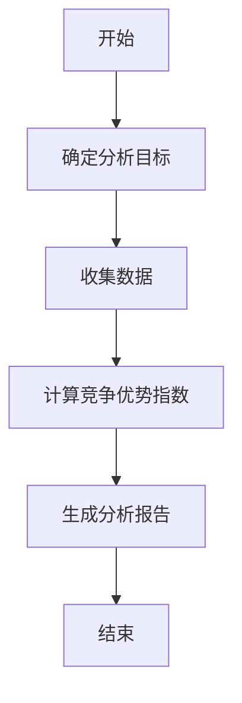

                 


# 费雪的竞争优势分析：持续成功的关键

## 关键词：竞争优势分析，费雪，持续成功，战略管理，企业分析

## 摘要：费雪的竞争优势分析是一种通过识别和评估企业内部资源和外部环境中的优势，以制定有效战略来实现持续成功的分析方法。本文将从理论基础、核心概念、算法原理、系统架构、项目实战等方面，全面解析竞争优势分析的关键要素，帮助读者掌握如何通过竞争优势分析实现企业持续成功。

---

# 第一部分: 费雪的竞争优势分析基础

## 第1章: 费雪竞争优势分析概述

### 1.1 费雪竞争优势分析的背景介绍

#### 1.1.1 企业持续成功的核心问题
企业在竞争激烈的市场中，如何实现持续成功？竞争优势分析是解决这一问题的关键工具。

#### 1.1.2 费雪竞争优势分析的定义与特点
费雪竞争优势分析是一种系统地识别、评估和利用企业内部资源和外部环境中的优势的方法，其特点包括全面性、动态性和可操作性。

#### 1.1.3 费雪竞争优势分析的理论基础
费雪竞争优势分析的理论基础包括资源基础视角（RBV）和竞争优势理论（SCP范式）。

### 1.2 费雪竞争优势分析的核心概念

#### 1.2.1 核心竞争优势的定义
竞争优势是指企业在市场上能够提供比竞争对手更具吸引力的产品或服务的能力。

#### 1.2.2 核心竞争优势的属性特征对比表

| 属性         | 成本优势 | 质量优势 | 服务优势 | 创新优势 |
|--------------|----------|----------|----------|----------|
| 描述         | 成本低于行业平均水平 | 产品质量高于行业平均水平 | 服务质量优于竞争对手 | 技术创新速度快于竞争对手 |
| 优缺点       | 成本低，但可能影响质量 | 质量高，但成本可能较高 | 服务好，但可能增加成本 | 创新快，但可能面临风险 |

#### 1.2.3 竞争优势分析的ER实体关系图

```mermaid
er
actor 企业资源
actor 行业环境
actor 竞争对手
database 企业资源
database 行业环境数据
database 竞争对手数据
```

### 1.3 本章小结

---

## 第2章: 费雪竞争优势分析的原理与模型

### 2.1 费雪竞争优势分析的原理

#### 2.1.1 核心竞争优势的形成机制
竞争优势的形成机制包括内部资源的优化配置和外部环境的有效利用。

#### 2.1.2 费雪竞争优势分析的数学模型

$$ \text{竞争优势指数} = \frac{\text{核心竞争优势得分}}{\text{行业平均竞争优势得分}} $$

#### 2.1.3 竞争优势的动态变化过程
竞争优势不是一成不变的，会随着市场环境的变化而变化。

### 2.2 费雪竞争优势分析的算法原理

#### 2.2.1 竞争优势指数的计算公式

$$ \text{竞争优势指数} = \frac{\text{核心竞争优势得分}}{\text{行业平均竞争优势得分}} $$

#### 2.2.2 竞争优势分析的流程图



#### 2.2.3 竞争优势分析的Python实现代码

```python
def calculate_competitive_advantage(core_advantages, industry_average):
    return core_advantages / industry_average
```

### 2.3 本章小结

---

## 第3章: 竞争优势分析的系统架构设计

### 3.1 问题场景介绍
企业需要通过竞争优势分析系统来识别和评估内部资源和外部环境中的优势。

### 3.2 竞争优势分析系统的功能设计

#### 3.2.1 数据采集模块
负责采集企业内部资源和外部环境数据。

#### 3.2.2 数据分析模块
负责计算竞争优势指数并生成分析报告。

#### 3.2.3 报告生成模块
负责输出分析报告并提出战略建议。

### 3.3 竞争优势分析系统的架构图


### 3.4 本章小结

---

## 第4章: 项目实战

### 4.1 项目背景
以某制造企业为例，通过竞争优势分析系统识别其竞争优势。

### 4.2 核心代码实现

#### 4.2.1 环境安装
需要安装Python和相关库。

#### 4.2.2 核心代码实现

```python
def calculate_competitive_advantage(core_advantages, industry_average):
    return core_advantages / industry_average

# 示例数据
core_advantages = 80
industry_average = 60

# 计算竞争优势指数
competitive_advantage = calculate_competitive_advantage(core_advantages, industry_average)
print(f"竞争优势指数为: {competitive_advantage}")
```

#### 4.2.3 代码解读与分析
计算竞争优势指数并生成分析报告。

### 4.3 实际案例分析
以某制造企业为例，分析其竞争优势并提出战略建议。

### 4.4 项目总结
竞争优势分析系统能够有效地帮助企业识别和利用竞争优势，实现持续成功。

---

## 第5章: 最佳实践与小结

### 5.1 最佳实践
在实施竞争优势分析时，需要注意数据质量、模型适用性和持续改进。

### 5.2 小结
费雪的竞争优势分析是一种有效的工具，能够帮助企业识别和利用竞争优势，实现持续成功。

---

## 附录: 工具安装与代码下载

### 附录A: 工具安装指南
安装Python和相关库。

### 附录B: 相关代码下载链接

---

通过以上步骤，我们可以系统地分析和实施费雪的竞争优势分析，帮助企业实现持续成功。

