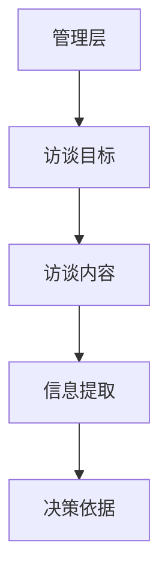
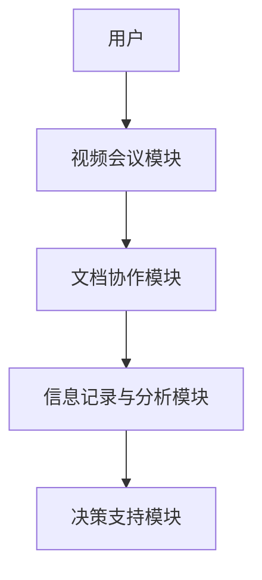
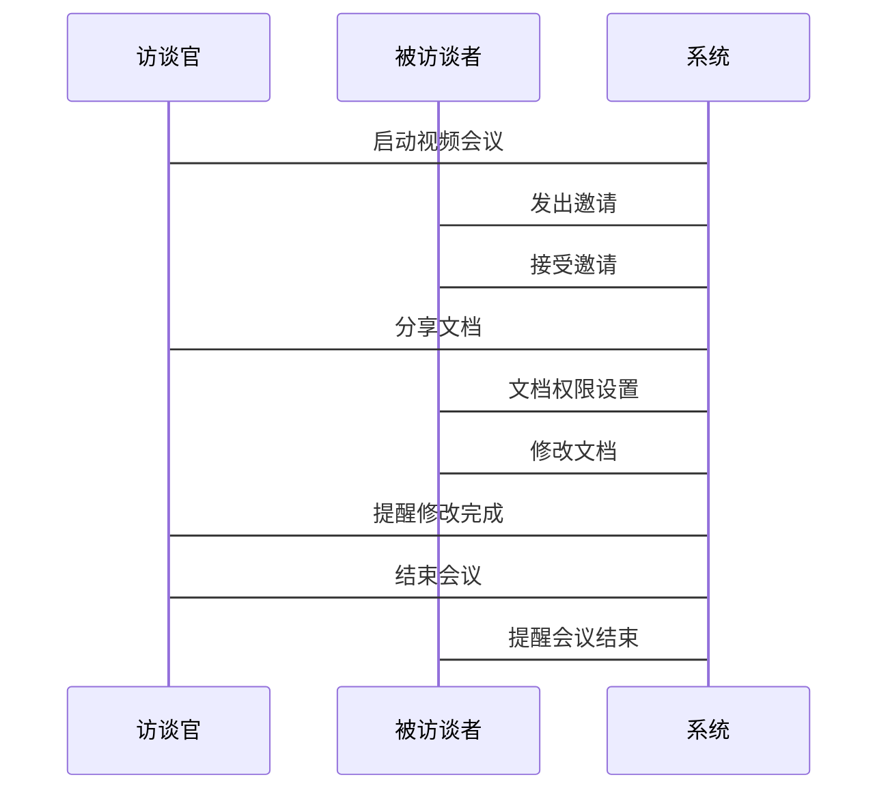

                 


# 费雪的管理层访谈技巧：远程尽职调查的新方法

> 关键词：费雪访谈法, 管理层访谈技巧, 远程尽职调查, 信息提取机制, 情感共鸣策略, 结构化访谈流程

> 摘要：本文深入探讨了费雪的管理层访谈技巧及其在远程尽职调查中的新方法。通过分析费雪访谈法的核心原理、技巧及其在远程环境中的应用，结合实际案例和系统架构设计，详细阐述了如何通过结构化访谈流程、高效工具选择和信息验证方法，实现远程尽职调查的有效性和准确性。文章最后总结了最佳实践和注意事项，为读者提供了实用的指导。

---

## 第一部分: 费雪的管理层访谈技巧基础

### 第1章: 费雪访谈法的起源与核心要素

#### 1.1 费雪访谈法的背景与起源

费雪访谈法是一种基于行为科学和认知心理学的管理访谈方法，起源于20世纪60年代。其核心理念是通过结构化的问题设计和情感共鸣策略，从管理层中提取有价值的信息，帮助企业在决策中获得更深层次的洞察。

- **背景介绍**  
  管理访谈在企业管理中扮演着重要角色，尤其是在招聘、领导力评估和组织文化建设方面。传统的访谈方法往往依赖于访谈官的经验和直觉，而费雪访谈法则通过系统化的结构和技巧，提高了访谈的可靠性和有效性。

- **核心理念**  
  费雪访谈法强调“以问题为导向”的访谈策略，通过设计开放性问题和引导性问题，逐步深入探讨管理层的思考方式、价值观和决策逻辑。同时，它注重在访谈过程中建立情感共鸣，增强被访谈者的信任感和参与感。

- **适用场景与边界**  
  费雪访谈法适用于需要深入了解管理层能力、团队协作能力以及组织文化的情境，如企业并购、领导力评估和组织文化建设等。然而，对于短期、低风险的决策场景，其复杂性和成本可能不具优势。

#### 1.2 费雪访谈法的核心要素

费雪访谈法的核心要素包括访谈目标的明确性、访谈对象的选择标准以及访谈过程的结构化。

- **访谈目标的明确性**  
  访谈目标是费雪访谈法的第一步。明确的目标可以帮助访谈官设计更有针对性的问题，确保访谈内容的深度和广度。例如，在领导力评估中，目标可能是评估候选人的决策能力和团队协作能力。

- **访谈对象的选择标准**  
  费雪访谈法强调选择与访谈目标高度相关的对象。这包括管理层的职位、职责以及他们在组织中的影响力。选择合适的对象可以提高访谈的有效性，避免信息偏差。

- **访谈过程的结构化**  
  费雪访谈法通过结构化的访谈流程，将访谈过程分为准备阶段、实施阶段和总结阶段。每个阶段都有明确的任务和目标，确保访谈的系统性和可重复性。

#### 1.3 费雪访谈法的理论基础

费雪访谈法的理论基础主要来源于行为科学和认知心理学，包括以下几个方面：

- **人类行为学**  
  人类行为学为费雪访谈法提供了关于人类行为和互动的基本原理。通过理解管理层的行为模式，访谈官可以更好地设计问题和引导对话。

- **认知心理学**  
  认知心理学关注个体如何处理信息和做出决策。费雪访谈法通过设计问题和引导对话，深入探索管理层的认知过程，帮助提取有价值的信息。

- **管理学理论**  
  费雪访谈法结合了管理学中的相关理论，如领导力理论和组织行为学，帮助访谈官更好地理解管理层的行为动机和决策逻辑。

#### 1.4 费雪访谈法的实践意义

- **在企业管理中的应用价值**  
  费雪访谈法可以帮助企业更好地评估管理层的能力和潜力，为招聘、晋升和培训提供科学依据。

- **在领导力提升中的作用**  
  通过深入分析管理层的决策过程和问题解决能力，费雪访谈法可以帮助企业识别和培养优秀的领导者。

- **在组织文化建设中的意义**  
  费雪访谈法可以为组织文化建设提供重要信息，帮助领导者更好地理解团队文化和员工需求，从而推动组织文化的优化和提升。

#### 1.5 本章小结

费雪访谈法是一种基于行为科学和认知心理学的管理访谈方法，通过结构化的问题设计和情感共鸣策略，帮助企业在决策中获得更深层次的洞察。其核心要素包括访谈目标的明确性、访谈对象的选择标准以及访谈过程的结构化。接下来，我们将深入探讨费雪访谈法的核心原理与技巧。

---

### 第2章: 费雪访谈法的核心原理与技巧

#### 2.1 费雪访谈法的原理分析

- **信息提取机制**  
  费雪访谈法通过设计开放性问题和引导性问题，逐步深入探讨管理层的思考方式、价值观和决策逻辑。信息提取机制是费雪访谈法的核心，它通过系统化的问题设计和引导策略，确保信息的完整性和准确性。

- **情感共鸣策略**  
  情感共鸣是费雪访谈法的重要组成部分。通过建立情感共鸣，访谈官可以增强被访谈者的信任感和参与感，从而提高访谈的深度和效果。

- **逻辑引导方法**  
  费雪访谈法通过逻辑引导方法，帮助被访谈者逐步展开思考，揭示其深层次的决策逻辑和价值观。这种方法不仅可以提取表面信息，还可以挖掘潜在的信息，为决策提供更全面的支持。

#### 2.2 费雪访谈法的核心技巧

- **问题设计的艺术**  
  费雪访谈法强调问题设计的艺术。好的问题不仅能够引导对话，还可以揭示被访谈者的深层次思考。例如，开放性问题可以帮助访谈官了解被访谈者的观点和态度，而引导性问题则可以帮助访谈官深入探讨特定主题。

- **沉默与倾听的技巧**  
  沉默和倾听是费雪访谈法的重要技巧。通过适当的沉默，访谈官可以给被访谈者足够的时间来思考和表达自己的观点。倾听则需要访谈官专注于被访谈者的话语，避免打断或引导，从而确保信息的完整性和真实性。

- **情境引导的策略**  
  情境引导是费雪访谈法的另一种重要技巧。通过设置特定的情境，访谈官可以更好地了解被访谈者的决策能力和应变能力。例如，在企业并购的情境中，访谈官可以通过模拟并购场景，观察被访谈者的反应和决策过程。

#### 2.3 费雪访谈法的属性特征对比

下表对比了费雪访谈法与其他访谈方法的属性特征：

| 特性               | 费雪访谈法               | 传统访谈法              | 深度访谈法              |
|--------------------|--------------------------|--------------------------|--------------------------|
| 访谈目标           | 深入挖掘管理层能力       | 信息收集和初步筛选       | 深入探索主题            |
| 访谈结构           | 结构化和系统化            | 较为松散                | 高度结构化              |
| 访谈技巧           | 情感共鸣和逻辑引导       | 直接提问和记录           | 开放性和深度探索        |
| 适用场景           | 领导力评估和组织文化建设  | 招聘和初步筛选           | 高级决策支持            |

#### 2.4 费雪访谈法的ER实体关系图



#### 2.5 本章小结

费雪访谈法的核心原理在于通过结构化的问题设计和情感共鸣策略，深入挖掘管理层的能力和潜力。其核心技巧包括问题设计的艺术、沉默与倾听的技巧以及情境引导的策略。接下来，我们将探讨远程尽职调查的挑战与解决方案。

---

### 第3章: 远程尽职调查的挑战与解决方案

#### 3.1 远程尽职调查的背景与现状

- **远程工作的兴起**  
  近年来，远程工作的兴起使得企业对远程尽职调查的需求不断增加。尤其是在企业并购和领导力评估中，远程访谈已成为一种重要的方式。

- **远程尽职调查的需求增长**  
  远程尽职调查的需求增长主要源于企业对高效、低成本和高效率的需求。通过远程访谈，企业可以节省时间和成本，同时扩大招聘和评估的范围。

- **远程访谈的技术支持**  
  远程访谈需要依赖高效的技术工具支持，如视频会议软件、在线文档协作工具等。这些工具可以帮助访谈官和被访谈者在虚拟环境中实现高效的互动和信息交流。

#### 3.2 远程尽职调查的挑战

- **技术工具的选择与使用**  
  远程访谈的技术工具种类繁多，包括视频会议软件、在线文档协作工具和屏幕共享工具等。选择合适的工具并确保其正常运行是远程访谈成功的关键。

- **虚拟环境中的访谈关系建立**  
  在虚拟环境中，访谈官和被访谈者之间的关系建立可能面临更多的挑战。由于缺乏面对面的互动，情感共鸣的建立可能更加困难。

- **远程沟通中的信息失真问题**  
  远程沟通中的信息失真问题是一个重要的挑战。由于技术限制和环境干扰，信息的准确性和完整性可能受到影响。

#### 3.3 远程尽职调查的解决方案

- **高效远程访谈工具的选择**  
  选择高效的远程访谈工具是解决远程尽职调查问题的关键。推荐使用具有高质量音频和视频功能、屏幕共享和在线文档协作功能的工具。

- **远程访谈中的信任建立策略**  
  在虚拟环境中建立信任需要更多的努力。访谈官可以通过提前建立联系、明确访谈目标和流程，以及展示专业性和亲和力，增强被访谈者的信任感。

- **远程信息验证的方法**  
  为了确保信息的准确性和完整性，远程尽职调查需要结合多种信息验证方法。例如，可以通过查阅公开资料、咨询第三方机构或进行多轮访谈来验证信息。

#### 3.4 费雪访谈法在远程尽职调查中的应用

- **远程访谈的结构化流程**  
  费雪访谈法的结构化流程可以很好地应用于远程尽职调查。通过明确的访谈目标和结构化的问题设计，访谈官可以在虚拟环境中实现高效的访谈。

- **远程访谈中的非语言信号识别**  
  在远程访谈中，非语言信号的识别可能受到技术限制。访谈官需要通过观察视频画面中的肢体语言和面部表情，以及通过语气和语调的变化，来判断被访谈者的情绪和态度。

- **远程访谈结果的分析与应用**  
  远程访谈的结果需要通过系统化的分析和整理，才能为决策提供支持。分析过程中，需要注意信息的准确性和完整性，同时结合其他信息源进行验证。

#### 3.5 本章小结

远程尽职调查的挑战主要来自于技术工具的选择、虚拟环境中的关系建立以及信息失真问题。通过选择高效的远程访谈工具、建立信任关系以及结合多种信息验证方法，可以有效克服这些挑战。费雪访谈法的结构化流程和技巧在远程尽职调查中具有重要的应用价值。

---

### 第4章: 费雪访谈法的算法原理与数学模型

#### 4.1 费雪访谈法的算法原理

费雪访谈法的算法原理主要体现在信息提取机制和逻辑引导方法上。信息提取机制通过系统化的问题设计和引导策略，确保信息的完整性和准确性。逻辑引导方法则通过逐步深入的对话，揭示被访谈者的决策逻辑和价值观。

#### 4.2 费雪访谈法的数学模型

费雪访谈法的数学模型主要体现在信息权重和信息相关性分析上。例如，可以通过加权平均的方法，计算不同问题对访谈结果的贡献权重。公式如下：

$$
\text{信息权重} = \sum_{i=1}^{n} w_i \times x_i
$$

其中，\( w_i \) 是问题 \( i \) 的权重，\( x_i \) 是问题 \( i \) 的答案。

---

## 第二部分: 远程尽职调查的系统架构与实现

### 第5章: 远程尽职调查的系统架构设计

#### 5.1 系统功能设计

远程尽职调查系统需要具备以下功能：

- **视频会议功能**  
  支持高清视频会议和屏幕共享，确保访谈官和被访谈者之间的高效互动。

- **文档协作功能**  
  提供在线文档协作功能，方便访谈官和被访谈者共同查看和编辑文档。

- **信息记录与分析功能**  
  系统需要具备信息记录和分析功能，帮助访谈官整理和分析访谈结果。

#### 5.2 系统架构设计



#### 5.3 系统接口设计

系统接口设计需要考虑以下几点：

- **视频会议接口**  
  支持与主流视频会议工具的集成，如Zoom、Microsoft Teams等。

- **文档协作接口**  
  提供与在线文档协作工具的集成，如Google Docs、Microsoft OneNote等。

- **信息记录与分析接口**  
  提供与数据分析工具的集成，如Excel、Power BI等。

#### 5.4 系统交互设计



---

## 第三部分: 项目实战与案例分析

### 第6章: 项目实战

#### 6.1 环境准备与工具安装

- **环境准备**  
  确保网络稳定，安装视频会议软件和文档协作工具。

- **工具安装**  
  安装并熟悉视频会议模块、文档协作模块和信息记录与分析模块。

#### 6.2 核心实现源代码

以下是一个简单的费雪访谈法远程访谈系统的伪代码实现：

```python
class InterviewSystem:
    def __init__(self):
        self.videoConference = VideoConferenceModule()
        self.documentCollaboration = DocumentCollaborationModule()
        self.dataAnalysis = DataAnalysisModule()

    def start_interview(self):
        self.videoConference.start()
        self.documentCollaboration.share_document()
        self.dataAnalysis.begin_recording()

    def end_interview(self):
        self.videoConference.stop()
        self.documentCollaboration.save_document()
        self.dataAnalysis.analyze_data()

# 示例使用
interviewSystem = InterviewSystem()
interviewSystem.start_interview()
interviewSystem.end_interview()
```

#### 6.3 代码应用解读与分析

上述代码实现了费雪访谈法远程访谈系统的基本功能，包括视频会议启动、文档协作和信息记录与分析。实际应用中，需要根据具体需求进行功能扩展和优化。

#### 6.4 案例分析与详细讲解

以下是一个实际案例的分析：

**案例背景**：某科技公司计划收购一家创业公司，需要对创业公司的管理层进行远程尽职调查。

**案例分析**：

1. **访谈目标**：评估创业公司管理层的决策能力和团队协作能力。
2. **访谈对象**：创业公司的CEO、CTO和COO。
3. **访谈工具**：使用Zoom进行视频会议，Google Docs进行文档协作。
4. **访谈过程**：通过结构化的问题设计，逐步深入探讨管理层的决策逻辑和团队协作能力。
5. **结果分析**：根据访谈结果，评估创业公司的潜力和风险，为收购决策提供支持。

#### 6.5 项目小结

通过实际案例的分析，我们可以看到费雪访谈法在远程尽职调查中的重要应用价值。结构化的访谈流程和高效的技术工具可以帮助企业在远程环境中实现高效的访谈和决策支持。

---

## 第四部分: 最佳实践与总结

### 第7章: 最佳实践与总结

#### 7.1 最佳实践 tips

- **选择合适的远程访谈工具**  
  根据具体需求选择高效的远程访谈工具，确保视频和音频的质量。

- **建立信任关系**  
  在虚拟环境中，建立信任关系需要更多的努力。通过提前联系和明确的访谈目标，可以增强被访谈者的信任感。

- **结合多种信息验证方法**  
  为了确保信息的准确性和完整性，需要结合多种信息验证方法，如查阅公开资料和咨询第三方机构。

#### 7.2 本章小结

费雪访谈法是一种基于行为科学和认知心理学的管理访谈方法，通过结构化的问题设计和情感共鸣策略，帮助企业在决策中获得更深层次的洞察。远程尽职调查的挑战可以通过选择高效的远程访谈工具、建立信任关系以及结合多种信息验证方法来克服。费雪访谈法在远程尽职调查中的应用价值日益凸显，为企业提供了高效、低成本和高效率的决策支持。

---

## 结语

通过本文的详细讲解，我们深入探讨了费雪的管理层访谈技巧及其在远程尽职调查中的新方法。结合理论分析和实际案例，我们展示了如何通过结构化访谈流程、高效工具选择和信息验证方法，实现远程尽职调查的有效性和准确性。希望本文能够为读者提供实用的指导，帮助他们在实际工作中更好地应用费雪访谈法。

--- 

**全文完**

