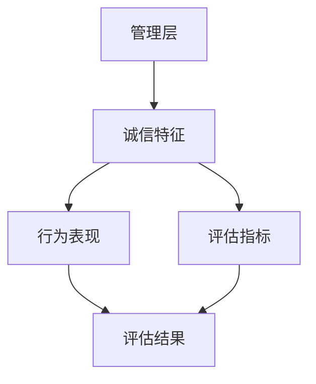
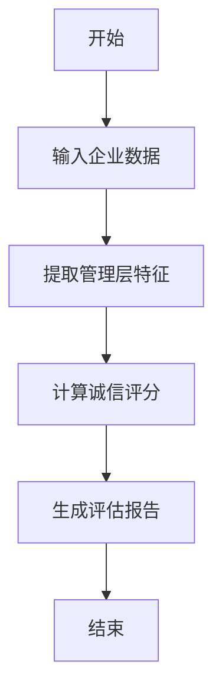
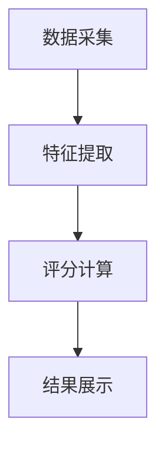
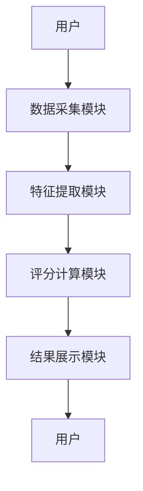

                 


# 费雪的管理层诚信评估方法

> 关键词：管理层诚信评估，费雪方法，诚信评分，算法原理，系统架构，项目实战

> 摘要：本文详细介绍了费雪的管理层诚信评估方法，从背景介绍、核心概念、算法原理到系统设计和项目实战，全面解析了该方法的理论基础和实际应用。通过具体的数学公式、流程图和代码实现，展示了如何科学地评估管理层诚信，并为读者提供了实践指导和注意事项。

---

## 第1章: 费雪的管理层诚信评估方法背景介绍

### 1.1 问题背景

#### 1.1.1 管理层诚信的重要性
管理层的诚信是企业健康发展的基石。诚信的管理层能够做出透明、公正的决策，增强企业的信任度和声誉。然而，现实中管理层诚信问题频发，如财务造假、利益输送等，严重损害了企业和股东的利益。因此，建立科学的诚信评估方法至关重要。

#### 1.1.2 现有评估方法的局限性
传统的管理层诚信评估方法往往依赖主观判断，缺乏量化标准。部分方法仅关注财务指标，忽视了行为表现和领导力等重要维度。此外，现有方法在实际应用中难以操作，难以满足企业对高效评估的需求。

#### 1.1.3 费雪方法的提出动机
费雪方法的提出旨在弥补现有评估方法的不足，通过多维度分析和量化评分，提供一种客观、可操作的诚信评估框架。这种方法能够帮助企业和投资者更准确地评估管理层的诚信水平。

### 1.2 问题描述

#### 1.2.1 管理层诚信的定义
管理层诚信是指管理层在决策、财务管理和日常经营中表现出的诚实、透明和负责任的行为。

#### 1.2.2 评估管理层诚信的核心要素
费雪方法将管理层诚信分解为以下三个核心要素：
1. **决策透明度**：管理层在决策过程中的公开性和可解释性。
2. **财务规范性**：管理层在财务管理中的合规性和准确性。
3. **领导力**：管理层在团队管理和战略执行中的表现。

#### 1.2.3 问题解决的目标与边界
- **目标**：量化评估管理层诚信水平，帮助企业识别和管理诚信风险。
- **边界**：仅关注管理层的诚信问题，不涉及企业外部环境和市场因素。

### 1.3 问题解决方法

#### 1.3.1 费雪方法的基本思路
费雪方法通过多维度数据采集、特征提取和量化评分，综合评估管理层的诚信水平。

#### 1.3.2 方法的适用场景与限制
- **适用场景**：适用于企业内部管理、投资者决策支持、企业并购中的管理层评估。
- **限制**：依赖于数据的准确性和完整性，对数据质量和数量要求较高。

#### 1.3.3 方法的创新点与优势
- **创新点**：将管理层诚信量化为可计算的指标，便于比较和分析。
- **优势**：操作性强，结果直观，能够为决策提供明确的参考依据。

## 第2章: 管理层诚信评估的核心概念与联系

### 2.1 核心概念原理

#### 2.1.1 诚信的多维度特征
诚信具有透明性、合规性、责任感和领导力四大特征。

#### 2.1.2 管理层行为与诚信的关系
管理层的行为表现直接反映了其诚信水平，例如决策透明度高的管理层通常具有较高的诚信水平。

#### 2.1.3 费雪方法的理论基础
费雪方法基于行为经济学和管理学理论，结合统计学方法，构建了多维度的评估框架。

### 2.2 核心概念对比分析

#### 2.2.1 诚信与利益的关系对比
诚信与利益并非完全对立，诚信的管理层能够在长期利益和短期利益之间找到平衡。

#### 2.2.2 不同管理层角色的诚信特征对比
不同管理层角色（如CEO、CFO）在诚信表现上存在差异，需根据角色特点进行差异化评估。

#### 2.2.3 费雪方法与其他评估方法的对比
与传统方法相比，费雪方法更具科学性和可操作性。

### 2.3 实体关系图（ER图）



## 第3章: 费雪管理层诚信评估方法的算法原理

### 3.1 方法概述

#### 3.1.1 费雪方法的基本框架
费雪方法包括数据采集、特征提取、评分计算和结果生成四个步骤。

#### 3.1.2 方法的输入与输出
- **输入**：企业数据、管理层行为记录、财务数据。
- **输出**：管理层诚信评分、评估报告。

#### 3.1.3 方法的步骤分解
1. 数据采集：收集相关数据。
2. 特征提取：提取关键特征。
3. 评分计算：计算诚信评分。
4. 结果生成：生成评估报告。

### 3.2 算法流程图



### 3.3 数学模型与公式

#### 3.3.1 诚信评分公式
$$ \text{诚信评分} = \sum_{i=1}^{n} w_i \cdot x_i $$
其中，$w_i$ 是第 $i$ 个特征的权重，$x_i$ 是第 $i$ 个特征的评分。

#### 3.3.2 权重计算公式
$$ w_i = \frac{f_i}{\sum_{j=1}^{m} f_j} $$
其中，$f_i$ 是第 $i$ 个特征的重要性分数，$m$ 是特征总数。

### 3.4 示例分析

#### 示例1：某公司管理层诚信评分计算
假设某公司管理层有三个特征：决策透明度（权重0.4）、财务规范性（权重0.3）、领导力（权重0.3）。评分分别为80、75、85，则诚信评分为：
$$ 0.4 \times 80 + 0.3 \times 75 + 0.3 \times 85 = 32 + 22.5 + 25.5 = 80 $$

## 第4章: 管理层诚信评估系统的架构设计

### 4.1 系统架构设计

#### 4.1.1 系统功能模块
- **数据采集模块**：负责采集企业数据。
- **特征提取模块**：提取关键特征。
- **评分计算模块**：计算诚信评分。
- **结果展示模块**：生成评估报告。

#### 4.1.2 系统架构图



#### 4.1.3 系统交互流程图



## 第5章: 项目实战

### 5.1 项目介绍

#### 5.1.1 项目目标
实现费雪管理层诚信评估方法的系统化应用。

#### 5.1.2 项目环境
- 操作系统：Linux
- 编程语言：Python
- 开发工具：Jupyter Notebook

### 5.2 核心代码实现

#### 5.2.1 数据采集代码

```python
def collect_data(company_id):
    # 数据采集逻辑
    pass
```

#### 5.2.2 特征提取代码

```python
def extract_features(data):
    # 特征提取逻辑
    pass
```

#### 5.2.3 评分计算代码

```python
def calculate_score(features):
    score = sum(w * x for w, x in zip(weights, features))
    return score
```

### 5.3 案例分析

#### 5.3.1 案例背景
某公司管理层的特征数据如下：
- 决策透明度：80
- 财务规范性：75
- 领导力：85

#### 5.3.2 计算过程
$$ 0.4 \times 80 + 0.3 \times 75 + 0.3 \times 85 = 80 $$

## 第6章: 总结与展望

### 6.1 本章小结
费雪的管理层诚信评估方法通过多维度分析和量化评分，提供了一种科学、系统的评估框架。

### 6.2 注意事项
- 数据质量对评估结果影响较大，需确保数据的准确性和完整性。
- 方法的权重设置需根据实际情况调整，避免“一刀切”。

### 6.3 未来展望
未来可以进一步研究动态评估方法，结合人工智能技术，提升评估的实时性和准确性。

---

通过本文的详细讲解，读者可以全面了解费雪的管理层诚信评估方法，并将其应用于实际场景中，为企业的管理和决策提供有力支持。

