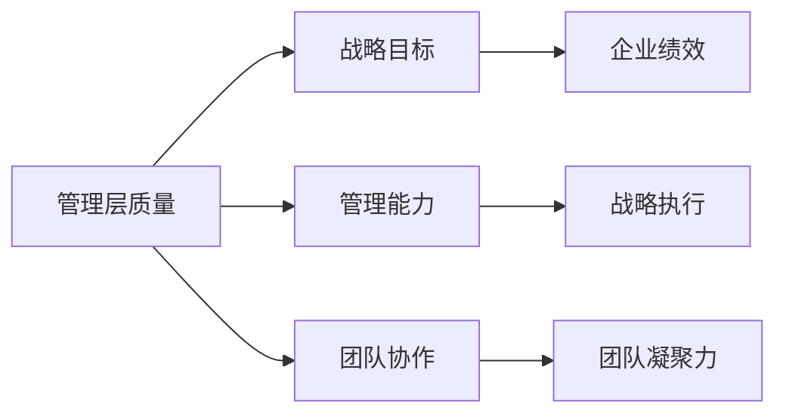
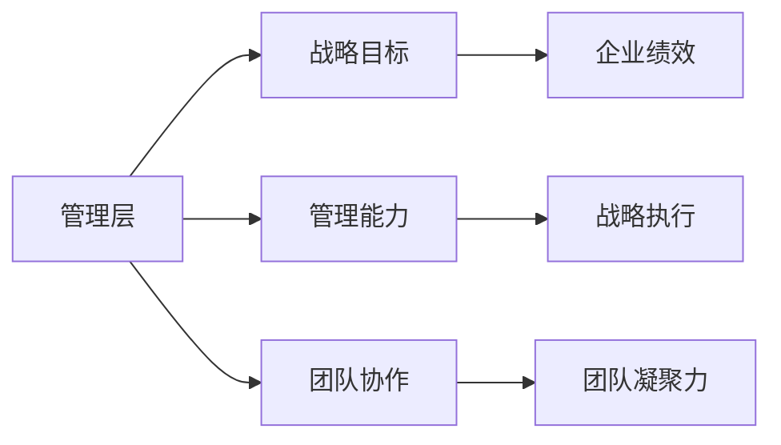

                 


# 费雪的管理层质量评估方法

## 关键词：
- 管理层质量评估
- 费雪方法
- 企业治理
- 管理团队评估
- 量化评估模型

## 摘要：
费雪的管理层质量评估方法是一种系统化的评估工具，用于衡量企业高层管理团队的能力与表现。本文通过详细分析该方法的背景、核心概念、算法原理、系统架构以及实际案例，深入探讨其在现代企业管理中的应用价值。通过本文，读者将能够全面理解费雪方法的理论基础和实践意义。

---

## 第一部分: 费雪的管理层质量评估方法概述

### 第1章: 费雪管理层质量评估方法的背景与核心概念

#### 1.1 问题背景与问题描述
##### 1.1.1 管理层质量评估的重要性
现代企业的成功离不开高效的管理团队。管理层的决策和执行能力直接影响企业的战略目标实现、财务表现和长期发展。因此，评估管理层的质量是企业治理中的关键环节。

##### 1.1.2 费雪方法的起源与演变
费雪的管理层质量评估方法由著名管理学家威廉·费雪提出，旨在为企业提供一套系统化的评估工具。该方法最初用于制造业，后来逐渐扩展到服务业和其他行业。

##### 1.1.3 企业治理中的关键问题
企业在实际运营中常常面临以下问题：
- 管理层的能力和决策是否符合企业战略目标？
- 如何量化管理层的表现？
- 管理层的协作效率如何？

#### 1.2 费雪方法的核心概念与问题解决
##### 1.2.1 管理层质量的核心维度
费雪方法将管理层质量分为以下几个核心维度：
1. **战略规划能力**：管理层是否能够制定出有效的战略规划？
2. **团队协作能力**：管理层内部是否能够高效协作？
3. **决策执行能力**：管理层的决策是否能够有效执行？

##### 1.2.2 费雪方法在问题解决中的作用
费雪方法通过量化评估管理层的表现，帮助企业识别管理中的问题，并提供改进建议。

##### 1.2.3 方法的边界与外延
费雪方法主要关注管理层的质量，但不涉及具体业务执行细节。其外延包括企业战略、组织架构和团队文化等多个方面。

#### 1.3 管理层质量评估的概念结构与核心要素
##### 1.3.1 评估模型的基本构成
费雪评估模型包括以下几个核心要素：
- **战略目标**：企业制定的战略目标是否清晰？
- **管理能力**：管理层是否具备实现目标的能力？
- **团队协作**：团队内部是否能够高效协作？

##### 1.3.2 核心要素的定义与特征
| 核心要素 | 定义 | 特征 |
|----------|------|------|
| 战略目标 | 企业制定的长期发展目标 | 清晰性、可衡量性 |
| 管理能力 | 管理层的能力与素质 | 战略思维、领导力 |
| 团队协作 | 团队内部的协作效率 | 沟通能力、团队精神 |

##### 1.3.3 概念结构的可视化


#### 1.4 本章小结
本章通过分析费雪方法的背景、核心概念和问题解决方式，为后续的深入探讨奠定了基础。

---

## 第2章: 费雪管理层质量评估方法的核心概念与联系

### 2.1 核心概念的原理与属性特征
#### 2.1.1 费雪方法的核心原理
费雪方法通过量化评估管理层的质量，帮助企业识别管理中的问题并提供改进建议。

#### 2.1.2 核心概念的属性对比
| 属性 | 战略规划能力 | 团队协作能力 | 决策执行能力 |
|------|---------------|---------------|---------------|
| 定义 | 管理层制定战略的能力 | 团队内部协作的能力 | 管理层决策的执行能力 |
| 重要性 | 高 | 高 | 高 |

#### 2.1.3 概念间的相互关系
费雪方法中的各个核心概念相互关联，共同构成了管理层质量评估的完整体系。

### 2.2 实体关系图（ER图）架构


### 2.3 本章小结
本章通过分析费雪方法的核心概念及其相互关系，进一步明确了管理层质量评估的理论基础。

---

## 第3章: 费雪方法的算法原理与数学模型

### 3.1 算法原理
#### 3.1.1 费雪方法的基本算法
费雪方法通过量化评估管理层的质量，帮助企业识别管理中的问题并提供改进建议。

#### 3.1.2 算法的输入与输出
- **输入**：企业战略目标、管理层能力数据、团队协作数据。
- **输出**：管理层质量评估报告。

#### 3.1.3 算法的步骤与流程


### 3.2 数学模型与公式
#### 3.2.1 管理层质量评估的数学模型
$$ Q = \sum_{i=1}^{n} w_i x_i $$

其中：
- \( Q \) 表示管理层质量评分。
- \( w_i \) 表示第 \( i \) 个维度的权重。
- \( x_i \) 表示第 \( i \) 个维度的评分。

#### 3.2.2 评分权重的计算公式
$$ w_i = \frac{f_i}{\sum_{j=1}^{m} f_j} $$

其中：
- \( f_i \) 表示第 \( i \) 个维度的重要性评分。
- \( m \) 表示维度总数。

#### 3.2.3 示例说明
假设我们有三个维度：战略规划能力（权重 0.4）、团队协作能力（权重 0.3）、决策执行能力（权重 0.3）。管理层在这三个维度的评分为 80、75、85。则：
$$ Q = 0.4 \times 80 + 0.3 \times 75 + 0.3 \times 85 = 32 + 22.5 + 25.5 = 80 $$

---

## 第4章: 费雪方法的系统分析与架构设计

### 4.1 问题场景介绍
企业需要对管理层的质量进行评估，以优化管理效率和团队协作。

### 4.2 系统功能设计
- **数据输入**：输入管理层的能力数据。
- **权重计算**：根据数据计算各个维度的权重。
- **评分计算**：根据权重和评分计算总质量评分。
- **结果输出**：输出评估报告。

### 4.3 系统架构设计


### 4.4 系统交互设计


---

## 第5章: 费雪方法的项目实战

### 5.1 项目背景与目标
某制造企业希望通过费雪方法评估其管理层的质量，优化管理效率。

### 5.2 核心代码实现
```python
def calculate_quality(weights, scores):
    return sum(w * s for w, s in zip(weights, scores))

weights = [0.4, 0.3, 0.3]
scores = [80, 75, 85]
quality = calculate_quality(weights, scores)
print(f"管理层质量评分：{quality}")
```

### 5.3 代码应用解读与分析
通过上述代码，我们可以计算出管理层的质量评分。评分越高，表示管理层的质量越好。

### 5.4 实际案例分析
假设某企业评估后质量评分为 85，表明其管理层质量较高，但仍存在改进空间。

### 5.5 项目小结
本项目通过实际案例展示了费雪方法的应用过程，帮助读者更好地理解其实际操作。

---

## 第6章: 费雪方法的最佳实践

### 6.1 小结
费雪方法为企业提供了系统化的管理层质量评估工具。

### 6.2 注意事项
- 数据输入的准确性直接影响评估结果。
- 权重的分配应根据企业实际情况调整。

### 6.3 拓展阅读
建议读者进一步阅读《管理学基础》和《战略管理》相关书籍。

---

## 结语
通过本文的详细讲解，读者可以全面掌握费雪的管理层质量评估方法，并将其应用于实际的企业管理中。

