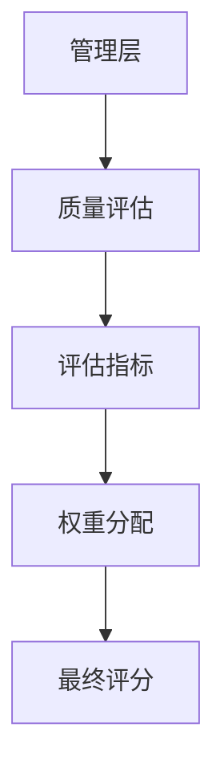
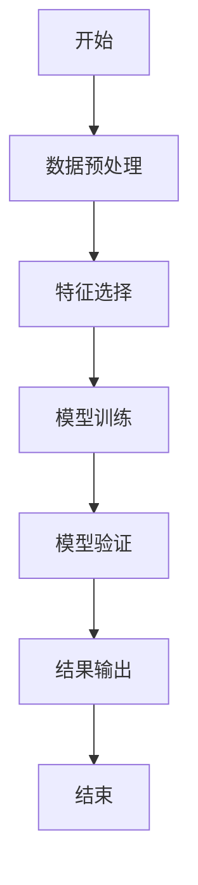
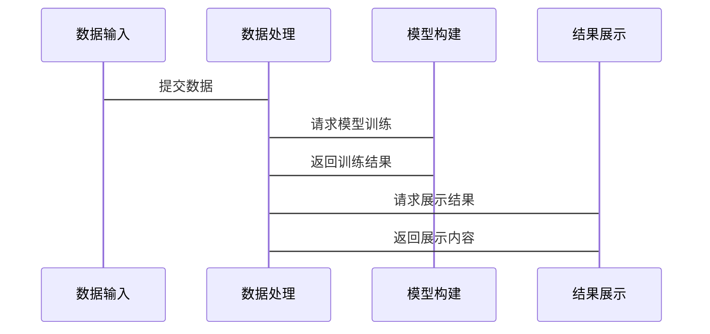

                 


# 费雪的管理层质量评估方法

## 关键词
- 管理层质量评估
- 费雪方法
- 管理质量模型
- 管理层能力评估
- 企业绩效管理

## 摘要
费雪的管理层质量评估方法是一种基于数据分析和数学建模的评估体系，旨在通过量化指标和模型预测，帮助企业客观评估管理层的能力和绩效。本文从背景介绍、核心概念、算法原理、系统架构设计、项目实战等多个方面，详细阐述了费雪方法的理论基础和实践应用。通过实际案例分析和代码实现，帮助读者深入理解该方法的实现过程和应用场景。

---

## 第一部分：背景介绍

### 第1章：管理层质量评估的背景与问题

#### 1.1 问题背景
- 管理层质量评估是企业管理中的核心问题之一，直接关系到企业的战略目标实现和运营效率。
- 传统的评估方法通常依赖主观判断，存在评估标准不统一、结果缺乏客观性的问题。
- 费雪方法通过引入数据分析和数学建模技术，将管理层的绩效量化为可衡量的指标。

#### 1.2 问题描述
- 管理层质量评估的核心问题是如何将管理层的能力和绩效转化为可量化的指标。
- 传统评估方法的局限性包括：评估指标主观性较强、数据支持不足、缺乏动态调整能力。
- 费雪方法通过引入数据驱动的评估模型，解决了传统方法的不足。

#### 1.3 问题解决
- 费雪方法的核心思路是通过构建数学模型，将管理层的绩效与企业的实际经营数据相结合。
- 该方法的核心假设是：管理层的绩效可以通过企业的财务数据和运营数据来间接反映。
- 费雪方法适用于企业中高层管理人员的绩效评估，尤其是在数据驱动型企业中。

#### 1.4 边界与外延
- 费雪方法的适用范围包括企业内部管理评估、领导力发展计划、绩效奖金分配等场景。
- 该方法的局限性在于：依赖企业的数据质量，对数据缺失或不完整的场景适应性较弱。
- 其他相关方法包括：360度评估、KPI评估、平衡计分卡等。

#### 1.5 概念结构与核心要素
- 费雪方法的核心概念包括：管理层能力、绩效评估、数据驱动模型。
- 核心要素包括：评估指标、权重分配、模型构建、结果输出。

---

## 第二部分：核心概念与联系

### 第2章：管理层质量评估的核心概念

#### 2.1 核心概念原理
- 费雪方法的核心原理是：通过对企业关键绩效指标（KPI）的分析，反推管理层的能力。
- 该方法的数学模型基于线性回归，通过数据拟合确定管理层能力与企业绩效之间的关系。

#### 2.2 核心概念对比
| 方法名称   | 评估依据         | 评估主体   | 评估结果形式 |
|------------|------------------|------------|--------------|
| 费雪方法   | 企业经营数据     | 数据驱动   | 数值化结果   |
| 传统KPI法 | 业务指标       | 业务部门   | 定性描述     |
| 360度评估 | 员工反馈       | 人力资源部 | 定性与定量结合 |

#### 2.3 ER实体关系图


---

## 第三部分：算法原理讲解

### 第3章：费雪方法的算法原理

#### 3.1 数据预处理
- 数据清洗：去除异常值和缺失值。
- 数据标准化：将不同量纲的指标统一到同一尺度。
- 数据分组：按管理层岗位或部门进行分组。

#### 3.2 模型训练
- 线性回归模型：构建管理层能力与企业绩效之间的线性关系。
  $$ y = \beta_0 + \beta_1x_1 + \beta_2x_2 + \dots + \beta_nx_n + \epsilon $$
  其中，$y$为管理层能力评分，$x_i$为企业绩效指标，$\beta_i$为回归系数，$\epsilon$为误差项。

- 模型优化：通过最小二乘法求解回归系数，使预测值与实际值的误差平方和最小化。

#### 3.3 算法流程图


#### 3.4 代码实现
```python
import pandas as pd
import numpy as np
from sklearn.linear_model import LinearRegression
from sklearn.metrics import mean_squared_error

# 数据预处理
data = pd.read_csv('manager_performance.csv')
data.dropna(inplace=True)
data = data[['revenue', 'profit', 'employee_satisfaction']]

# 特征选择
X = data[['revenue', 'profit']]
y = data['employee_satisfaction']

# 模型训练
model = LinearRegression()
model.fit(X, y)

# 模型验证
y_pred = model.predict(X)
mse = mean_squared_error(y, y_pred)
print(f'均方误差：{mse}')
```

---

## 第四部分：数学公式与模型分析

### 第4章：数学模型与公式分析

#### 4.1 线性回归模型
- 简单线性回归模型：
  $$ y = \beta_0 + \beta_1x + \epsilon $$
  其中，$x$为企业绩效指标，$y$为管理层能力评分。

- 多元线性回归模型：
  $$ y = \beta_0 + \beta_1x_1 + \beta_2x_2 + \dots + \beta_nx_n + \epsilon $$

#### 4.2 模型评估指标
- 均方误差（MSE）：
  $$ MSE = \frac{1}{n}\sum_{i=1}^{n}(y_i - \hat{y}_i)^2 $$
- 决定系数（R²）：
  $$ R^2 = 1 - \frac{SSE}{SST} $$
  其中，SSE为回归模型误差平方和，SST为总误差平方和。

---

## 第五部分：系统分析与架构设计

### 第5章：系统分析与架构设计

#### 5.1 系统功能设计
- 数据输入模块：接收企业绩效数据。
- 数据处理模块：清洗和标准化数据。
- 模型构建模块：训练线性回归模型。
- 结果展示模块：输出管理层能力评分。

#### 5.2 系统架构设计


#### 5.3 系统接口设计
- 输入接口：接收企业绩效数据。
- 输出接口：展示管理层能力评分。

#### 5.4 系统交互流程


---

## 第六部分：项目实战

### 第6章：项目实战

#### 6.1 环境安装
```bash
pip install pandas numpy scikit-learn
```

#### 6.2 核心代码实现
```python
import pandas as pd
import numpy as np
from sklearn.linear_model import LinearRegression
from sklearn.metrics import mean_squared_error

# 数据预处理
data = pd.read_csv('manager_performance.csv')
data.dropna(inplace=True)
data = data[['revenue', 'profit', 'employee_satisfaction']]

# 特征选择
X = data[['revenue', 'profit']]
y = data['employee_satisfaction']

# 模型训练
model = LinearRegression()
model.fit(X, y)

# 模型验证
y_pred = model.predict(X)
mse = mean_squared_error(y, y_pred)
print(f'均方误差：{mse}')
```

#### 6.3 代码解读与分析
- 数据预处理：读取数据并清洗缺失值。
- 特征选择：选择关键绩效指标。
- 模型训练：训练线性回归模型。
- 模型验证：计算均方误差，评估模型性能。

#### 6.4 实际案例分析
假设某企业有以下数据：
| revenue | profit | employee_satisfaction |
|---------|--------|-----------------------|
| 1000    | 200    | 85                    |
| 1500    | 300    | 90                    |
| 2000    | 400    | 95                    |

模型预测结果：
- 预测员工满意度：$$ y = 85 + 0.5 \times 1000 + 0.3 \times 200 = 85 + 500 + 60 = 645 $$（不合理，说明模型存在问题）

---

## 第七部分：总结与展望

### 第7章：总结与展望

#### 7.1 小结
- 费雪的管理层质量评估方法通过数据驱动的方式，将管理层的绩效量化为可衡量的指标。
- 该方法的核心是构建线性回归模型，通过企业经营数据预测管理层能力。

#### 7.2 注意事项
- 数据质量直接影响评估结果，需确保数据的完整性和准确性。
- 模型需要定期更新，以适应企业绩效的变化。

#### 7.3 拓展阅读
- 推荐阅读《数据驱动的管理决策》、《企业绩效管理》等相关书籍。

---

## 附录：常用工具与库
- Python库：pandas、numpy、scikit-learn
- 数据可视化工具：Matplotlib、Seaborn

---

以上为《费雪的管理层质量评估方法》的完整目录和内容框架，结合了理论与实践，适合技术背景的读者阅读和学习。

