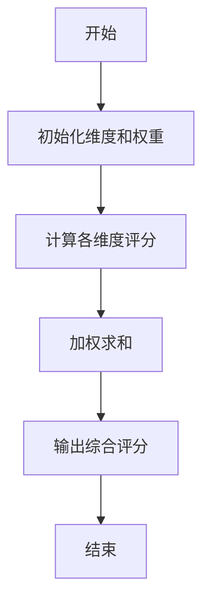
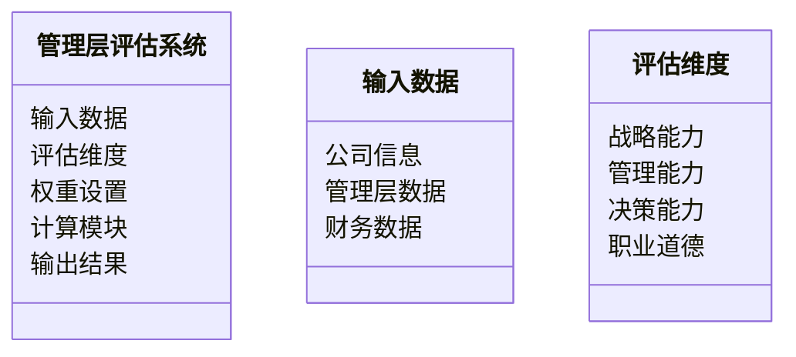
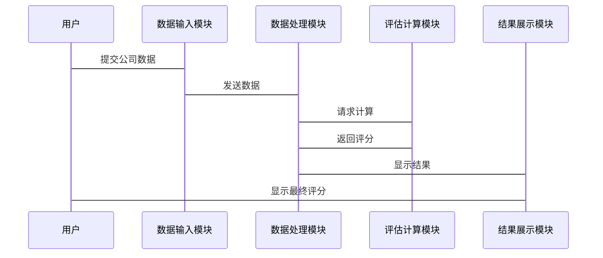

                 


# 费雪的管理层质量评估：公司治理在投资决策中的作用

**关键词**：费雪、管理层质量评估、公司治理、投资决策、战略能力、管理能力、决策能力、职业道德

**摘要**：本文系统阐述了菲利普·费雪的管理层质量评估理论，深入分析了公司治理在投资决策中的核心作用。通过详细探讨管理层的战略能力、管理能力、决策能力和职业道德，结合数学模型和系统设计，提供了一套完整的评估方法，并通过实际案例展示了如何将理论应用于投资实践。

---

## 第1章：公司治理与投资决策概述

### 1.1 公司治理的基本概念

#### 1.1.1 公司治理的定义与内涵
公司治理是确保公司有效运作和股东利益最大化的制度安排，涉及董事会、管理层和股东之间的关系。

#### 1.1.2 公司治理的核心要素
- 股东权利
- 董事会结构
- 高层管理职责
- 透明度与披露

#### 1.1.3 公司治理与企业绩效的关系
良好的公司治理是企业长期绩效的基石，能够降低代理成本，提升企业价值。

### 1.2 投资决策的基本原理

#### 1.2.1 投资决策的定义与类型
投资决策是将资金分配到不同资产以实现收益最大化的决策过程，主要包括权益投资、固定收益投资和另类投资。

#### 1.2.2 投资决策的核心原则
- 风险与收益平衡
- 时间价值
- 分散化原则

#### 1.2.3 投资决策中的信息不对称问题
信息不对称导致投资者难以全面了解公司的基本面，增加了投资风险。

### 1.3 费雪的管理层质量评估理论

#### 1.3.1 费雪投资理论的起源与发展
菲利普·费雪是价值投资的先驱，强调管理层质量在投资决策中的重要性。

#### 1.3.2 管理层质量评估在投资决策中的作用
管理层的质量直接影响企业的战略执行和财务表现，是投资决策的关键因素。

#### 1.3.3 费雪理论的现代应用与挑战
尽管费雪理论在现代投资中仍然适用，但也面临信息过载和技术变革的挑战。

### 1.4 本章小结
本章介绍了公司治理和投资决策的基本概念，重点阐述了费雪的管理层质量评估理论，为后续分析奠定了基础。

---

## 第2章：管理层质量评估的核心维度

### 2.1 管理层的战略能力评估

#### 2.1.1 战略规划能力的定义与衡量标准
战略规划能力是指管理层制定和执行战略计划的能力，衡量标准包括战略的清晰度和可行性。

#### 2.1.2 战略执行能力的评估方法
通过分析公司实际业绩与战略目标的契合度来评估战略执行能力。

#### 2.1.3 战略调整能力的案例分析
以某公司应对市场变化的战略调整为例，分析其战略调整能力。

### 2.2 管理层的管理能力评估

#### 2.2.1 组织管理能力的评估维度
包括组织架构合理性、团队协作性和内部沟通效率。

#### 2.2.2 人员管理能力的评估指标
通过员工满意度、离职率和绩效表现来衡量人员管理能力。

#### 2.2.3 管理风格对团队绩效的影响
分析不同管理风格（如授权型、命令型）对团队绩效的影响。

### 2.3 管理层的决策能力评估

#### 2.3.1 决策效率的衡量标准
包括决策速度、决策的及时性和适应性。

#### 2.3.2 决策质量的评估方法
通过分析决策的正确性、长期效果和风险控制能力来评估决策质量。

#### 2.3.3 决策失误的预防机制
建立集体决策和风险评估机制，降低决策失误风险。

### 2.4 管理层的职业道德与责任感

#### 2.4.1 职业道德对管理层行为的影响
职业道德影响管理层的决策透明度和责任感。

#### 2.4.2 管理层责任感的评估指标
包括对股东利益的保护、对公司治理的参与度和对风险的管理能力。

#### 2.4.3 职业道德与企业长期发展的关系
良好的职业道德是企业长期稳定发展的基础。

### 2.5 本章小结
本章详细分析了管理层质量评估的核心维度，为后续的数学模型和系统设计提供了理论基础。

---

## 第3章：管理层质量评估的数学模型

### 3.1 费雪评估模型的数学表达

#### 3.1.1 加权评分公式
$$
\text{管理层评分} = \sum (\text{维度权重} \times \text{维度评分})
$$

其中，权重根据各维度的重要性分配，评分基于具体评估标准。

#### 3.1.2 案例分析
以某公司为例，计算其管理层的综合评分，展示模型的应用过程。

### 3.2 算法实现

#### 3.2.1 Python代码实现
```python
def calculate_management_score(dimensions, weights):
    score = 0
    for i in range(len(dimensions)):
        score += dimensions[i] * weights[i]
    return score

dimensions = [85, 70, 90, 80]
weights = [0.3, 0.2, 0.3, 0.2]
score = calculate_management_score(dimensions, weights)
print("管理层综合评分：", score)
```

#### 3.2.2 算法流程图


### 3.3 模型的优化与验证

#### 3.3.1 模型优化
通过调整权重和引入更多的评估维度，提高模型的准确性。

#### 3.3.2 模型验证
通过历史数据验证模型的有效性，并进行回测分析。

### 3.4 本章小结
本章通过数学模型和算法实现，详细阐述了管理层质量评估的具体方法，为实际应用提供了技术支持。

---

## 第4章：系统分析与架构设计方案

### 4.1 问题场景介绍
在投资决策中，如何高效评估管理层质量是关键问题，需要构建一个智能化的评估系统。

### 4.2 系统功能设计

#### 4.2.1 领域模型


#### 4.2.2 系统架构设计


### 4.3 接口设计与交互流程

#### 4.3.1 系统接口设计
- 数据输入接口
- 评估计算接口
- 结果展示接口

#### 4.3.2 交互流程


### 4.4 本章小结
本章通过系统分析和架构设计，展示了如何将管理层质量评估模型应用于实际投资决策中。

---

## 第5章：项目实战与案例分析

### 5.1 环境安装与配置

#### 5.1.1 安装Python和相关库
安装Python和pandas、numpy等库，为后续分析做准备。

### 5.2 核心代码实现

#### 5.2.1 数据收集与预处理
```python
import pandas as pd

# 假设数据存储在Excel文件中
data = pd.read_excel('management_data.xlsx')
print(data.head())
```

#### 5.2.2 评估计算
```python
import pandas as pd
import numpy as np

def calculate_management_score(dimensions, weights):
    return np.dot(dimensions, weights)

dimensions = data.drop(columns=['公司名称']).values
weights = [0.3, 0.2, 0.3, 0.2]
scores = calculate_management_score(dimensions, weights)
data['评分'] = scores
print(data)
```

#### 5.2.3 结果展示
```python
import matplotlib.pyplot as plt

plt.barh(data['公司名称'], data['评分'])
plt.title('管理层综合评分')
plt.xlabel('评分')
plt.ylabel('公司名称')
plt.show()
```

### 5.3 案例分析与解读

#### 5.3.1 案例分析
以某公司为例，展示其管理层评分过程和结果。

#### 5.3.2 案例解读
分析评分结果，评估公司的管理层质量，为投资决策提供依据。

### 5.4 本章小结
本章通过项目实战，展示了如何利用Python代码实现管理层质量评估，并通过案例分析验证了模型的有效性。

---

## 第6章：最佳实践与总结

### 6.1 小结
本文系统阐述了费雪的管理层质量评估理论，结合数学模型和系统设计，提供了完整的评估方法。

### 6.2 注意事项
- 数据来源的可靠性
- 模型的适用性和局限性
- 结果的解释与应用

### 6.3 拓展阅读
推荐相关书籍和文献，帮助读者深入学习公司治理和投资决策的理论与实践。

### 6.4 本章小结
本章总结了全文内容，强调了理论与实践相结合的重要性，为读者提供了进一步学习的方向。

---

## 结语

通过对费雪管理层质量评估理论的深入分析和系统设计，本文为投资决策提供了有力的支持。未来，随着技术的进步，管理层质量评估将更加智能化和精准化，为投资者创造更大的价值。

--- 

希望这篇技术博客文章能满足您的需求！如果需要进一步调整或补充，请随时告诉我。

