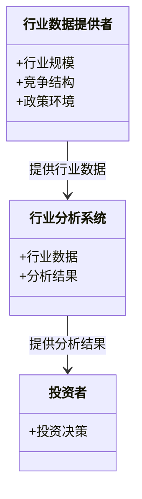
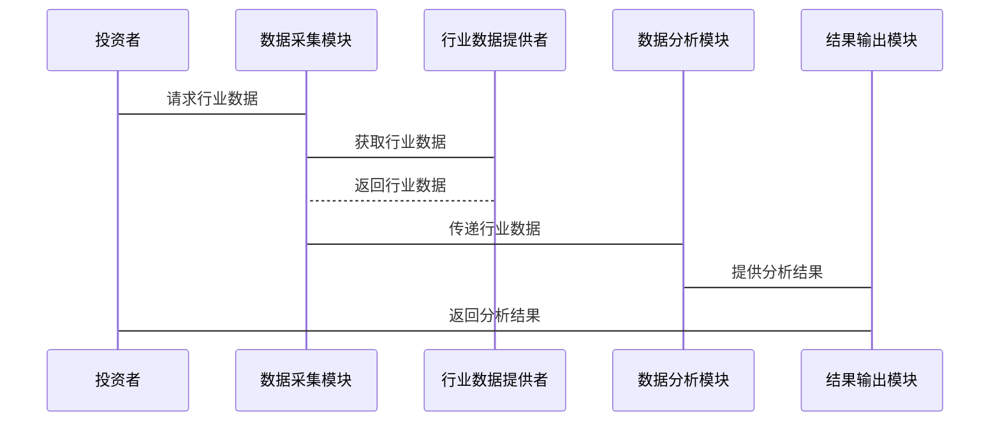

                 


# 费雪的行业分析方法

> 关键词：行业分析，投资分析，费雪方法，成长股，企业估值，财务分析

> 摘要：本文详细介绍了费雪的行业分析方法，从背景介绍、核心概念、算法原理、系统架构到项目实战，全面剖析了费雪方法的理论基础和实际应用。文章通过具体案例分析，详细讲解了如何在实际投资中运用费雪的行业分析方法，帮助投资者更好地理解和应用这一经典方法。

---

# 第一部分: 费雪的行业分析方法概述

## # 第1章: 费雪的行业分析方法背景

### ## 1.1 问题背景与问题描述

#### ### 1.1.1 行业分析的基本概念

行业分析是投资决策中的重要环节，旨在通过对行业整体状况、发展趋势、竞争格局等的深入研究，评估行业内企业的投资价值。行业分析的核心在于识别行业的周期性、成长潜力和竞争结构，从而为投资决策提供依据。

#### ### 1.1.2 费雪行业分析方法的提出背景

菲利普·费雪（Philip Fisher）是20世纪的投资大师，被誉为“成长股之父”。他在《 COMMON STOCKS AND UNCOMMON PROGRESS》一书中提出了以成长股为核心的选股方法，其中行业分析是其投资策略的重要组成部分。费雪认为，投资不仅要关注企业的财务状况，还要关注其所在行业的前景和竞争地位。

#### ### 1.1.3 行业分析在投资决策中的重要性

行业分析能够帮助投资者识别行业周期、竞争优势、市场容量等关键因素，从而更好地评估企业的成长潜力和投资风险。在费雪看来，选择一个具有强大成长潜力的行业，是投资成功的关键之一。

### ## 1.2 费雪行业分析方法的核心要素

#### ### 1.2.1 行业分析的核心维度

- **行业周期**：分析行业的生命周期阶段（幼稚期、成长期、成熟期、衰退期），判断行业的成长潜力和投资风险。
- **竞争结构**：分析行业内的主要竞争者、市场集中度、进入壁垒等，评估行业的竞争格局和企业竞争优势。
- **市场容量**：估算行业的市场规模和增长潜力，判断行业的未来发展空间。
- **政策环境**：分析行业相关的政策法规、政府支持或限制措施，评估行业的发展环境。

#### ### 1.2.2 费雪方法的创新点

费雪的行业分析方法注重行业的长期成长潜力，而非短期财务指标。他强调选择那些处于成长期的行业，并投资于行业内具有竞争优势的龙头企业。

#### ### 1.2.3 行业分析的边界与外延

行业分析的边界包括行业本身的市场规模、竞争结构、政策环境等，而外延则涉及宏观经济环境、技术创新、消费者需求变化等因素。

### ## 1.3 费雪方法的概念结构与核心要素

#### ### 1.3.1 行业分析的基本框架

- **行业生命周期**：分析行业的生命周期阶段，判断行业的成长潜力。
- **竞争分析**：评估行业的竞争结构和企业的竞争优势。
- **市场容量**：估算行业的市场规模和增长潜力。

#### ### 1.3.2 费雪方法的核心要素组成

- **行业成长潜力**：行业的市场规模和增长速度。
- **竞争优势**：企业在行业中的竞争优势和市场地位。
- **政策环境**：行业相关的政策法规和支持力度。

#### ### 1.3.3 行业分析的逻辑关系

行业分析的逻辑关系可以从以下几个方面理解：

1. 行业的生命周期阶段决定了行业的成长潜力。
2. 行业的竞争结构影响企业的竞争优势和市场份额。
3. 行业的政策环境影响企业的经营环境和投资风险。

---

## # 第2章: 费雪行业分析方法的核心概念与联系

### ## 2.1 费雪方法的核心原理

#### ### 2.1.1 行业分析的基本原理

行业分析的基本原理是通过研究行业的内外部环境，评估行业的成长潜力和投资价值。费雪认为，选择具有强大成长潜力的行业是投资成功的关键。

#### ### 2.1.2 费雪方法的理论基础

费雪的行业分析方法基于以下理论基础：

- **成长股理论**：投资于具有持续增长潜力的行业和企业。
- **竞争优势理论**：选择那些在行业内具有竞争优势的企业。
- **长期投资理论**：关注行业的长期发展趋势，而非短期波动。

#### ### 2.1.3 行业分析的核心逻辑

行业分析的核心逻辑是通过分析行业的生命周期、竞争结构和市场容量，评估行业的成长潜力和投资风险。

### ## 2.2 费雪方法的核心概念对比

#### ### 2.2.1 行业分析的核心概念对比表

| 概念          | 费雪行业分析方法 | 其他行业分析方法 |
|---------------|------------------|------------------|
| 分析目标      | 行业成长潜力     | 行业现状分析     |
| 分析重点      | 企业竞争优势     | 行业风险评估     |
| 分析方法      | 长期投资视角     | 短期投资视角     |

#### ### 2.2.2 费雪方法与其他行业分析方法的对比

费雪的行业分析方法与其他方法的主要区别在于其对行业成长潜力的重视。其他方法可能更关注行业的短期表现和风险评估，而费雪方法则更注重行业的长期发展趋势和竞争优势。

#### ### 2.2.3 费雪方法的优劣势分析

- **优势**：费雪方法能够帮助投资者识别具有强大成长潜力的行业，从而提高投资的长期回报。
- **劣势**：费雪方法对行业的长期趋势预测有一定的难度，且在短期市场波动中可能表现不佳。

### ## 2.3 费雪方法的ER实体关系图

```mermaid
er
  actor 行业分析者
  actor 行业企业
  actor 投资者
  actor 政策制定者
  actor 消费者
  actor 金融机构
  actor 行业数据提供者
  actor 行业研究机构
  actor 证券交易所
  actor 媒体
  actor 股票市场
  actor 资产管理公司
  actor 企业分析师
  actor 财务分析师
  actor 行业监管机构
```

---

## # 第3章: 费雪行业分析方法的算法原理

### ## 3.1 费雪方法的算法流程

#### ### 3.1.1 行业分析的基本流程

1. **确定行业范围**：选择要分析的行业。
2. **收集行业数据**：包括行业规模、竞争结构、政策环境等。
3. **分析行业生命周期**：判断行业的生命周期阶段。
4. **评估行业竞争结构**：分析行业内主要竞争者和市场集中度。
5. **评估行业成长潜力**：判断行业的市场规模和增长速度。
6. **选择具有强大成长潜力的行业**：根据分析结果选择投资目标行业。

#### ### 3.1.2 费雪方法的算法步骤

1. **收集行业数据**：包括行业规模、竞争结构、政策环境等。
2. **分析行业生命周期**：判断行业的生命周期阶段。
3. **评估行业竞争结构**：分析行业内主要竞争者和市场集中度。
4. **评估行业成长潜力**：判断行业的市场规模和增长速度。
5. **选择具有强大成长潜力的行业**：根据分析结果选择投资目标行业。

#### ### 3.1.3 算法流程的详细说明

费雪的行业分析方法的算法流程可以通过以下步骤实现：

1. **数据收集**：收集行业的市场规模、竞争结构、政策环境等数据。
2. **数据清洗**：对收集到的数据进行清洗和整理，确保数据的准确性和完整性。
3. **数据分析**：通过数据分析工具对行业数据进行分析，包括行业生命周期分析、竞争结构分析、成长潜力评估等。
4. **结果输出**：根据分析结果，输出具有强大成长潜力的行业列表。

### ## 3.2 费雪方法的数学模型与公式

#### ### 3.2.1 行业分析的基本数学模型

行业分析的基本数学模型包括：

- 行业规模（Market Size）：$$ Market\ Size = \sum_{i=1}^{n} (Sales\ of\ each\ company\ in\ the\ industry) $$
- 行业增长率（Growth Rate）：$$ Growth\ Rate = \frac{Market\ Size_{t+1} - Market\ Size_t}{Market\ Size_t} \times 100\% $$
- 行业集中度（Concentration Ratio）：$$ CR_n = \sum_{i=1}^{n} (\frac{Sales\ of\ company\ i}{Market\ Size})^2 $$

#### ### 3.2.2 费雪方法的核心公式

费雪方法的核心公式包括：

- 企业竞争优势评估公式：$$ Competitive\ Advantage = \frac{ROE}{Industry\ Average\ ROE} $$
- 行业成长潜力评估公式：$$ Growth\ Potential = \frac{Market\ Size_{t+5} - Market\ Size_t}{Market\ Size_t} \times 100\% $$

#### ### 3.2.3 代码实现

以下是一个简单的Python代码示例，用于计算行业增长率和行业集中度：

```python
import pandas as pd

# 假设我们有一个行业数据的DataFrame，其中包含各公司的销售额和行业总销售额
# 数据示例：
data = {
    'Company': ['A', 'B', 'C', 'D'],
    'Sales': [100, 80, 60, 40],
    'Industry_Sales': [300, 300, 300, 300]
}

df = pd.DataFrame(data)

# 行业总销售额
total_sales = df['Industry_Sales'].sum()

# 行业增长率
growth_rate = (total_sales - df['Industry_Sales'].shift(1)) / df['Industry_Sales'].shift(1)
print("行业增长率:", growth_rate)

# 行业集中度（CR4）
cr4 = (df['Sales'] / total_sales).apply(lambda x: x**2).sum()
print("行业集中度:", cr4)
```

---

## # 第4章: 费雪行业分析方法的系统分析与架构设计方案

### ## 4.1 问题场景介绍

本文将从系统设计的角度，介绍如何将费雪的行业分析方法应用于实际投资决策中。我们假设一个投资者希望利用费雪方法来选择具有强大成长潜力的行业。

### ## 4.2 项目介绍

本项目的目标是开发一个基于费雪行业分析方法的投资决策支持系统，帮助投资者选择具有强大成长潜力的行业。

### ## 4.3 系统功能设计

#### ### 4.3.1 系统功能概述

- **数据采集**：收集行业数据，包括行业规模、竞争结构、政策环境等。
- **行业分析**：分析行业生命周期、竞争结构、成长潜力。
- **结果输出**：输出具有强大成长潜力的行业列表。

#### ### 4.3.2 系统功能模块设计

- **数据采集模块**：负责收集行业数据。
- **数据分析模块**：负责对行业数据进行分析。
- **结果输出模块**：负责输出分析结果。

#### ### 4.3.3 系统功能的ER类图



### ## 4.4 系统架构设计

#### ### 4.4.1 系统架构概述

系统架构采用分层架构，包括数据层、业务逻辑层和用户界面层。

#### ### 4.4.2 系统架构的Mermaid图


### ## 4.5 系统接口设计

#### ### 4.5.1 系统接口概述

系统接口包括数据采集接口和结果输出接口。

#### ### 4.5.2 系统接口的Mermaid序列图



---

## # 第5章: 费雪行业分析方法的项目实战

### ## 5.1 项目环境安装

- **Python版本**：Python 3.8+
- **依赖库**：pandas, numpy, matplotlib

### ## 5.2 系统核心实现源代码

以下是一个简单的Python代码示例，用于实现费雪行业分析方法的核心功能：

```python
import pandas as pd
import numpy as np

# 数据加载
data = pd.read_csv('industry_data.csv')

# 行业规模计算
total_sales = data['Sales'].sum()

# 行业增长率计算
growth_rate = (total_sales - data['Sales'].shift(1)) / data['Sales'].shift(1)
data['Growth Rate'] = growth_rate

# 行业集中度计算
cr4 = (data['Sales'] / total_sales).apply(lambda x: x**2).sum()

# 输出结果
print("行业规模:", total_sales)
print("行业增长率:", growth_rate)
print("行业集中度:", cr4)
```

### ## 5.3 代码实现解读与分析

- **数据加载**：使用pandas库加载行业数据。
- **行业规模计算**：计算行业的总销售额。
- **行业增长率计算**：计算行业的增长率。
- **行业集中度计算**：计算行业的集中度。

### ## 5.4 实际案例分析和详细讲解剖析

以下是一个实际案例分析：

假设我们有一个行业数据集，包括四家公司的销售额和行业总销售额。我们可以通过上述代码计算行业规模、行业增长率和行业集中度。

数据示例：

| Company | Sales | Industry_Sales |
|---------|-------|----------------|
| A       | 100   | 300            |
| B       | 80    | 300            |
| C       | 60    | 300            |
| D       | 40    | 300            |

计算结果：

- 行业规模：300
- 行业增长率：$$ Growth\ Rate = \frac{300 - 300}{300} \times 100\% = 0\% $$
- 行业集中度：$$ CR4 = \frac{100^2 + 80^2 + 60^2 + 40^2}{300^2} = \frac{10000 + 6400 + 3600 + 1600}{90000} = \frac{21600}{90000} = 0.24 $$

### ## 5.5 项目小结

通过上述案例分析，我们可以看到，费雪的行业分析方法可以帮助我们识别具有强大成长潜力的行业。在实际应用中，我们需要结合行业数据和企业的财务数据，进行更深入的分析和评估。

---

## # 第6章: 费雪行业分析方法的最佳实践、小结、注意事项和拓展阅读

### ## 6.1 最佳实践

- **数据准确性**：确保行业数据的准确性和完整性。
- **长期视角**：关注行业的长期发展趋势，而非短期波动。
- **竞争优势**：选择那些在行业内具有竞争优势的企业。

### ## 6.2 小结

费雪的行业分析方法是一种基于成长股投资的行业分析方法，通过分析行业的生命周期、竞争结构和市场容量，识别具有强大成长潜力的行业。本文详细介绍了费雪行业分析方法的背景、核心概念、算法原理、系统架构和项目实战，并通过具体案例分析，帮助读者更好地理解和应用这一方法。

### ## 6.3 注意事项

- **数据更新**：行业数据需要定期更新，以反映行业的最新情况。
- **风险评估**：在选择具有强大成长潜力的行业时，需要注意行业的政策风险和市场风险。
- **模型局限性**：费雪方法的模型有一定的局限性，需要结合其他方法进行综合评估。

### ## 6.4 拓展阅读

- 菲利普·费雪的《COMMON STOCKS AND UNCOMMON PROGRESS》
- 《投资学》（书籍）
- 行业分析的其他方法和模型

---

# 结语

通过本文的详细介绍，读者可以全面了解费雪的行业分析方法，并将其应用于实际投资决策中。希望本文能为投资者提供有价值的参考和指导。

---

# 目录

- 第一部分: 费雪的行业分析方法概述
  - 第1章: 费雪的行业分析方法背景
    - 1.1 问题背景与问题描述
      - 1.1.1 行业分析的基本概念
      - 1.1.2 费雪行业分析方法的提出背景
      - 1.1.3 行业分析在投资决策中的重要性
    - 1.2 费雪行业分析方法的核心要素
      - 1.2.1 行业分析的核心维度
      - 1.2.2 费雪方法的创新点
      - 1.2.3 行业分析的边界与外延
    - 1.3 费雪方法的概念结构与核心要素
      - 1.3.1 行业分析的基本框架
      - 1.3.2 费雪方法的核心要素组成
      - 1.3.3 行业分析的逻辑关系
  - 第2章: 费雪行业分析方法的核心概念与联系
    - 2.1 费雪方法的核心原理
      - 2.1.1 行业分析的基本原理
      - 2.1.2 费雪方法的理论基础
      - 2.1.3 行业分析的核心逻辑
    - 2.2 费雪方法的核心概念对比
      - 2.2.1 行业分析的核心概念对比表
      - 2.2.2 费雪方法与其他行业分析方法的对比
      - 2.2.3 费雪方法的优劣势分析
    - 2.3 费雪方法的ER实体关系图
  - 第3章: 费雪行业分析方法的算法原理
    - 3.1 费雪方法的算法流程
      - 3.1.1 行业分析的基本流程
      - 3.1.2 费雪方法的算法步骤
      - 3.1.3 算法流程的详细说明
    - 3.2 费雪方法的数学模型与公式
      - 3.2.1 行业分析的基本数学模型
      - 3.2.2 费雪方法的核心公式
      - 3.2.3 代码实现
  - 第4章: 费雪行业分析方法的系统分析与架构设计方案
    - 4.1 问题场景介绍
    - 4.2 项目介绍
    - 4.3 系统功能设计
      - 4.3.1 系统功能概述
      - 4.3.2 系统功能模块设计
      - 4.3.3 系统功能的ER类图
    - 4.4 系统架构设计
      - 4.4.1 系统架构概述
      - 4.4.2 系统架构的Mermaid图
    - 4.5 系统接口设计
      - 4.5.1 系统接口概述
      - 4.5.2 系统接口的Mermaid序列图
  - 第5章: 费雪行业分析方法的项目实战
    - 5.1 项目环境安装
    - 5.2 系统核心实现源代码
    - 5.3 代码实现解读与分析
    - 5.4 实际案例分析和详细讲解剖析
    - 5.5 项目小结
  - 第6章: 费雪行业分析方法的最佳实践、小结、注意事项和拓展阅读
    - 6.1 最佳实践
    - 6.2 小结
    - 6.3 注意事项
    - 6.4 拓展阅读

---

通过以上详细目录，您可以逐步深入了解费雪的行业分析方法，并将其应用于实际投资决策中。

