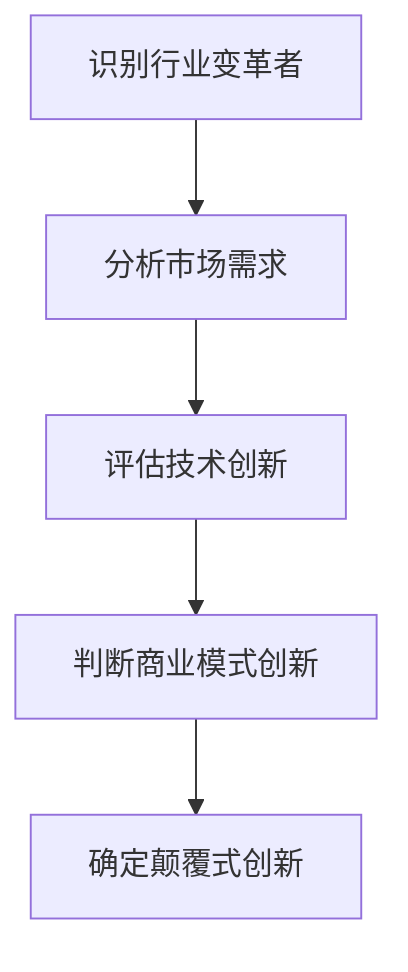
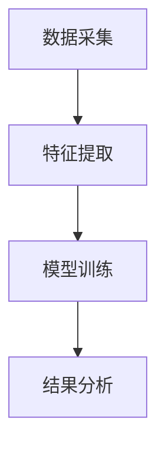
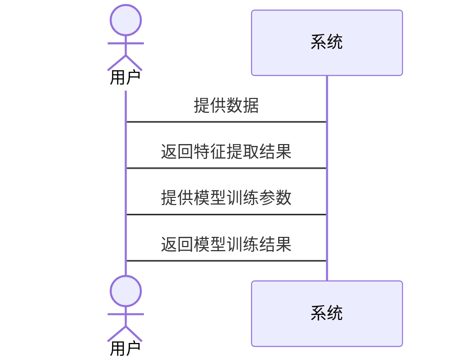

                 


# 费雪的行业变革者识别：颠覆式创新时代的新标准

## 关键词：
- 费雪理论
- 行业变革者
- 颠覆式创新
- 创新识别
- 行业分析

## 摘要：
费雪的行业变革者识别方法是一种基于颠覆式创新的理论框架，用于帮助企业识别和预测行业中的变革者。本文将从费雪理论的起源与发展入手，详细分析颠覆式创新与行业变革者识别的核心概念，探讨其在不同行业中的应用。通过数学模型和算法原理的讲解，结合实际案例分析，本文将为您提供一套系统化的行业变革者识别方法，帮助您在颠覆式创新时代把握行业趋势，提前布局。

---

# 第1章: 费雪的行业变革者识别概述

## 1.1 费雪理论与行业变革者识别

### 1.1.1 费雪理论的起源与发展
- 费雪理论的核心思想
- 费雪理论在创新研究中的地位
- 费雪理论的演变与应用

### 1.1.2 行业变革者的定义与特征
- 行业变革者的定义
- 行业变革者的特征分析
- 行业变革者与行业领导者的区别

### 1.1.3 费雪理论在现代的应用
- 费雪理论在科技行业的应用
- 费雪理论在金融行业的应用
- 费雪理论在制造业的应用

## 1.2 颠覆式创新与行业变革

### 1.2.1 颠覆式创新的定义与核心要素
- 颠覆式创新的定义
- 颠覆式创新的核心要素：技术、市场、商业模式

### 1.2.2 颠覆式创新与持续性创新的区别
- 持续性创新的定义与特点
- 颠覆式创新与持续性创新的对比分析

### 1.2.3 颠覆式创新对行业的影响
- 颠覆式创新对行业结构的影响
- 颠覆式创新对市场格局的影响
- 颠覆式创新对消费者行为的影响

## 1.3 费雪理论的行业应用

### 1.3.1 费雪理论在科技行业的应用
- 科技行业的颠覆式创新案例
- 费雪理论在科技行业变革者识别中的应用

### 1.3.2 费雪理论在金融行业的应用
- 金融行业的颠覆式创新案例
- 费雪理论在金融行业变革者识别中的应用

### 1.3.3 费雪理论在制造业的应用
- 制造业的颠覆式创新案例
- 费雪理论在制造业变革者识别中的应用

## 1.4 行业变革者识别的必要性

### 1.4.1 行业变革者识别的意义
- 识别行业变革者的重要性
- 行业变革者识别对企业战略的影响

### 1.4.2 企业如何应对行业变革
- 企业如何识别行业变革者
- 企业如何制定应对行业变革的策略

### 1.4.3 行业变革者识别的挑战
- 数据获取的难度
- 模型构建的复杂性
- 行业动态的不确定性

## 1.5 本章小结
- 本章的核心内容总结
- 本章的关键结论
- 下一章的引导

---

# 第2章: 费雪理论的核心概念与联系

## 2.1 费雪理论的核心要素

### 2.1.1 颠覆式创新的三要素
- 技术创新
- 商业模式创新
- 市场需求

### 2.1.2 行业结构与竞争格局
- 行业结构的分析方法
- 竞争格局对行业变革者识别的影响

### 2.1.3 市场需求与技术变革的关系
- 市场需求的变化规律
- 技术变革对市场需求的影响

## 2.2 核心概念对比分析

### 2.2.1 颠覆式创新与持续性创新的对比
- 核心目标的对比
- 实施路径的对比
- 成功关键的对比

### 2.2.2 行业变革者与行业领导者的对比
- 行为特征的对比
- 市场地位的对比
- 战略选择的对比

### 2.2.3 技术创新与商业模式创新的对比
- 创新内容的对比
- 创新主体的对比
- 创新影响的对比

## 2.3 实体关系图与流程图

### 2.3.1 费雪理论的ER实体关系图
```mermaid
er
actor 行业变革者 {
  name: 名称
 特征: 特征
 行为: 行为
}
actor 行业环境 {
  技术: 技术
 市场: 市场
 竞争: 竞争
}
```

### 2.3.2 颠覆式创新的流程图


---

# 第3章: 行业变革者识别的算法原理

## 3.1 数据采集与特征提取

### 3.1.1 数据来源与采集方法
- 数据来源的多样性
- 数据采集的常用方法
- 数据清洗与预处理

### 3.1.2 关键特征的识别与提取
- 市场需求特征
- 技术创新特征
- 商业模式特征

### 3.1.3 数据预处理与清洗
- 数据清洗的必要性
- 数据标准化与归一化

## 3.2 算法原理与流程

### 3.2.1 基于费雪理论的分类算法
- 分类算法的选择
- 分类模型的构建

### 3.2.2 机器学习模型的构建
- 机器学习模型的选择
- 模型训练与优化

### 3.2.3 算法流程图


## 3.3 数学模型与公式

### 3.3.1 分类模型的数学表达
$$ P(y|x) = \frac{P(x|y)P(y)}{P(x)} $$

### 3.3.2 模型评估与优化
- 准确率、召回率、F1值的计算
- 模型优化的策略

### 3.3.3 示例代码与实现
```python
from sklearn.tree import DecisionTreeClassifier
from sklearn.model_selection import train_test_split
from sklearn.metrics import accuracy_score

# 数据准备
X = df[['特征1', '特征2', '特征3']]
y = df['标签']

# 数据划分
X_train, X_test, y_train, y_test = train_test_split(X, y, test_size=0.2)

# 模型训练
model = DecisionTreeClassifier()
model.fit(X_train, y_train)

# 模型预测
y_pred = model.predict(X_test)

# 模型评估
print(accuracy_score(y_test, y_pred))
```

---

# 第4章: 系统分析与架构设计

## 4.1 系统功能设计

### 4.1.1 系统功能模块
- 数据采集模块
- 特征提取模块
- 模型训练模块
- 结果分析模块

### 4.1.2 系统功能流程图


### 4.1.3 系统架构图


## 4.2 系统接口设计

### 4.2.1 系统接口定义
- 数据输入接口
- 模型调用接口
- 结果输出接口

### 4.2.2 系统交互流程图


---

# 第5章: 项目实战

## 5.1 环境安装与配置

### 5.1.1 环境配置
- Python版本要求
- 依赖库的安装：scikit-learn、pandas、numpy

## 5.2 系统核心实现

### 5.2.1 数据采集与处理
- 数据来源：互联网行业公开数据
- 数据清洗与预处理

### 5.2.2 模型训练与优化
- 选择合适的分类算法
- 调参与优化

### 5.2.3 结果分析与解读
- 结果可视化
- 结果解读

## 5.3 案例分析与解读

### 5.3.1 案例背景
- 案例行业：互联网行业
- 案例目标：识别行业变革者

### 5.3.2 实施步骤
- 数据采集与处理
- 模型训练与优化
- 结果分析与解读

## 5.4 项目小结

### 5.4.1 项目总结
- 项目实施的关键点
- 项目的成功经验

### 5.4.2 项目反思
- 项目中的问题与不足
- 改进的建议

---

# 第6章: 最佳实践与小结

## 6.1 最佳实践

### 6.1.1 小结
- 本章的核心内容总结
- 本章的关键结论

### 6.1.2 注意事项
- 数据获取的注意事项
- 模型选择的注意事项
- 结果解读的注意事项

### 6.1.3 拓展阅读
- 推荐的书籍与文章
- 推荐的研究方向

---

# 结语
通过本篇文章，我们系统地介绍了费雪的行业变革者识别方法，从理论到实践，从算法到系统设计，为您提供了一套完整的解决方案。希望本文能为您提供启发，帮助您在颠覆式创新时代识别行业变革者，抓住行业变革的机遇。

--- 

（注：以上为部分章节内容示例，完整文章将包含所有章节的详细内容。）

