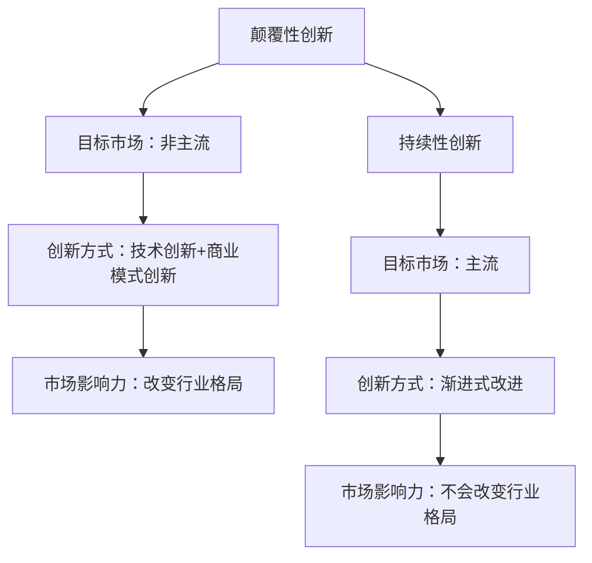
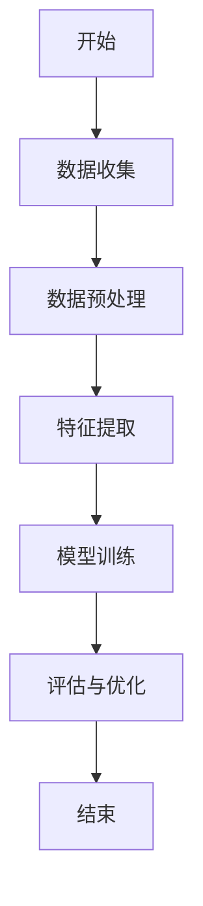

                 


# 《费雪的行业变革者识别：颠覆性创新的力量》

---

## 关键词：  
费雪，行业变革者，颠覆性创新，技术分析，投资策略，创新模型

---

## 摘要：  
本文深入探讨了费雪的行业变革者识别方法，结合颠覆性创新的理论基础，分析了如何通过技术分析和投资策略来识别行业中的颠覆性创新者。文章从颠覆性创新的核心原理、识别方法、经典案例分析到系统架构设计，层层展开，为读者提供了全面的视角和实用的工具。

---

## 正文：

---

## 第一部分：引言

### 第1章：颠覆性创新与行业变革者概述

#### 1.1 费雪的颠覆性创新理论背景

##### 1.1.1 费雪投资理论的核心思想  
菲利普·费雪（Philip Fisher）是20世纪的投资大师，他的投资理论以“成长股”投资闻名。他认为，投资成功的关键在于找到那些能够持续创新、扩大市场的公司。费雪提出，行业变革者往往具备以下几个特征：  
1. 公司管理层具有强烈的创新意识和愿景。  
2. 公司的产品或服务能够显著改变行业的游戏规则。  
3. 公司能够在技术、商业模式或用户体验上实现突破。  

##### 1.1.2 行业变革者的定义与特征  
行业变革者是指那些通过技术创新、商业模式创新或用户体验创新，能够显著改变行业格局的企业。其特征包括：  
- **技术创新性**：公司拥有独特的技术或专利，能够在市场上形成差异化竞争优势。  
- **市场领导力**：公司能够在短时间内快速扩大市场份额，成为行业的领导者。  
- **持续创新能力**：公司能够不断推出新产品或服务，保持行业的领先地位。  

##### 1.1.3 颠覆性创新的概念与分类  
颠覆性创新是指一种创新模式，能够打破现有的市场格局，创造出新的市场需求或商业模式。它通常分为两类：  
- **技术驱动型颠覆**：通过技术创新实现市场的颠覆，例如电动汽车对传统燃油车的颠覆。  
- **商业模式驱动型颠覆**：通过改变商业模式实现市场的颠覆，例如订阅制服务对传统零售模式的颠覆。  

#### 1.2 费雪的行业分析框架  
费雪的行业分析框架包括以下几个步骤：  
1. **行业背景分析**：了解行业的现状、竞争格局和未来趋势。  
2. **关键成功因素识别**：找出行业中的关键成功因素（KSF），例如技术创新能力、成本控制能力等。  
3. **潜在变革者筛选**：通过筛选潜在的行业变革者，评估其颠覆性创新的潜力。  
4. **投资策略制定**：根据评估结果，制定相应的投资策略。  

#### 1.3 本章小结  
本章通过介绍费雪的颠覆性创新理论，阐述了行业变革者的定义和特征，并提出了费雪的行业分析框架。这些内容为后续章节的分析奠定了基础。

---

## 第二部分：颠覆性创新的理论基础

### 第2章：颠覆性创新的核心原理

#### 2.1 颠覆性创新的定义与特征

##### 2.1.1 颠覆性创新的定义  
颠覆性创新是指一种创新模式，通过打破现有的市场格局，创造出新的市场需求或商业模式。与持续性创新不同，颠覆性创新往往针对的是非主流市场，通过提供更低价格、更好性能的产品，逐步侵蚀主流市场的份额。  

##### 2.1.2 颠覆性创新的特征对比（表格形式）  
| 特征                | 颠覆性创新              | 持续性创新              |
|---------------------|--------------------------|--------------------------|
| 目标市场           | 非主流市场              | 主流市场                |
| 创新方式           | 技术创新与商业模式创新  | 渐进式改进              |
| 市场影响力          | 可能改变行业格局        | 不会改变行业格局        |

##### 2.1.3 颠覆性创新与持续性创新的对比分析（Mermaid流程图）  


#### 2.2 费雪的颠覆性创新模型

##### 2.2.1 模型的核心要素与关系（Mermaid实体关系图）  
```mermaid
erDiagram
    actor 投资者
    actor 行业专家
    class 行业
    class 变革者
    class 创新
    投资者 --> 行业 : 分析行业
    投资者 --> 变革者 : 识别变革者
    行业 <--> 创新 : 创新驱动
    变革者 <--> 创新 : 提供创新
```

##### 2.2.2 模型的数学表达式  
颠覆性创新的概率（P）可以通过以下公式计算：  
$$ P = \frac{C + T}{N} $$  
其中：  
- C：行业变革者的创新能力评分（1-10分）  
- T：行业变革者的市场潜力评分（1-10分）  
- N：行业内的公司总数  

##### 2.2.3 模型的适用场景与限制  
- **适用场景**：适用于技术驱动型的行业，尤其是那些技术更新换代快、市场竞争激烈的行业。  
- **限制**：不适用于那些市场成熟、竞争格局稳定的行业，因为颠覆性创新的可能性较低。  

#### 2.3 本章小结  
本章通过定义和对比颠覆性创新的核心概念，构建了费雪的颠覆性创新模型，并通过数学公式和图表的形式，详细阐述了模型的构成和应用。

---

## 第三部分：行业变革者的识别方法

### 第3章：行业变革者识别的核心算法

#### 3.1 颠覆性创新潜力评估算法

##### 3.1.1 算法原理（Mermaid流程图）  


##### 3.1.2 算法实现（Python代码示例）  
```python
def disruptive_innovation_potential(company_data):
    # 数据预处理
    processed_data = preprocess(company_data)
    # 特征提取
    features = extract_features(processed_data)
    # 模型训练
    model = train_model(features)
    # 评估与优化
    potential = evaluate_model(model, features)
    return potential
```

##### 3.1.3 算法的数学模型  
颠覆性创新潜力（P）的计算公式为：  
$$ P = \alpha \times T + \beta \times C + \gamma \times M $$  
其中：  
- $\alpha$、$\beta$、$\gamma$：权重系数，根据行业特点调整。  
- T：技术潜力评分（1-10分）  
- C：市场潜力评分（1-10分）  
- M：管理能力评分（1-10分）  

#### 3.2 数据驱动的行业分析方法

##### 3.2.1 数据收集与预处理  
- 数据收集：从公开数据源（如公司财报、行业报告、专利数据库等）收集相关数据。  
- 数据预处理：清洗数据，处理缺失值，标准化数据。  

##### 3.2.2 数据分析与特征提取  
- 分析公司技术创新能力、市场潜力、管理能力等关键指标。  
- 提取特征：如研发支出占比、专利数量、市场增长率等。  

##### 3.2.3 数据驱动的评估模型  
- 使用机器学习算法（如随机森林、支持向量机）构建评估模型。  
- 通过交叉验证优化模型参数。  

#### 3.3 本章小结  
本章通过算法和数据驱动的方法，详细阐述了行业变革者识别的核心方法，包括颠覆性创新潜力评估算法和数据驱动的行业分析方法。

---

## 第四部分：案例分析与实践

### 第4章：经典行业变革者案例分析

#### 4.1 苹果公司的颠覆性创新分析

##### 4.1.1 苹果公司的创新历程  
苹果公司通过技术创新和商业模式创新，成功实现了对传统电子行业的颠覆。例如，iPhone的推出彻底改变了手机行业，iPad的推出则重新定义了平板电脑市场。  

##### 4.1.2 苹果公司的颠覆性创新模型应用  
根据颠覆性创新模型，苹果公司的技术潜力（T）=9，市场潜力（C）=8，管理能力（M）=9，因此颠覆性创新潜力（P）=0.3×9 + 0.4×8 + 0.3×9 = 8.3。  

##### 4.1.3 经验总结  
苹果公司的成功证明了技术创新和商业模式创新的结合能够实现行业的颠覆性创新。  

#### 4.2 特斯拉公司的颠覆性创新分析

##### 4.2.1 特斯拉公司的创新历程  
特斯拉通过技术创新和商业模式创新，成功实现了对传统汽车行业的颠覆。例如，Model S的推出重新定义了电动汽车，超级充电站的建设解决了充电难题。  

##### 4.2.2 特斯拉公司的颠覆性创新模型应用  
根据颠覆性创新模型，特斯拉的技术潜力（T）=8，市场潜力（C）=7，管理能力（M）=8，因此颠覆性创新潜力（P）=0.3×8 + 0.4×7 + 0.3×8 = 7.1。  

##### 4.2.3 经验总结  
特斯拉的成功证明了技术创新和商业模式创新的结合能够实现行业的颠覆性创新。  

#### 4.3 失败案例分析

##### 4.3.1 黑莓公司的教训  
黑莓公司曾经是手机市场的领导者，但由于未能及时适应智能手机市场的变化，最终被苹果和安卓系统取代。其失败的原因在于缺乏持续的创新能力。  

##### 4.3.2 其他失败案例  
如柯达公司未能及时转型数字技术，导致市场份额被其他公司抢占。  

#### 4.4 本章小结  
本章通过苹果和特斯拉的成功案例，以及黑莓和柯达的失败案例，总结了行业变革者识别的经验和教训。

---

## 第五部分：结论与展望

### 第5章：结论与展望

#### 5.1 结论  
本文通过深入分析费雪的行业变革者识别方法，结合颠覆性创新的理论基础，提出了行业变革者识别的核心算法和数据驱动的分析方法。通过对经典案例的分析，验证了这些方法的有效性。

#### 5.2 展望  
未来，随着技术的进步和市场的变化，行业变革者识别的方法将更加多样化和智能化。人工智能和大数据技术的应用将进一步提升识别的准确性和效率。

#### 5.3 参考文献  
1. 菲利普·费雪：《成长股投资》  
2. 克里斯·安德森：《长尾理论》  
3. 克里斯·哈梅德：《创新者的窘境》  

---

## 附录：工具与资源

### 附录A：颠覆性创新潜力评估工具  
- Python代码示例  
- 数据分析工具（如Excel、Python的Pandas库）  

### 附录B：行业报告与资源  
- 行业分析报告（如麦肯锡、波士顿咨询）  
- 专利数据库（如美国专利商标局、欧洲专利局）  

---

通过本文的分析，读者可以更好地理解颠覆性创新的力量，并能够通过系统的方法识别行业中的变革者，从而制定有效的投资策略。

