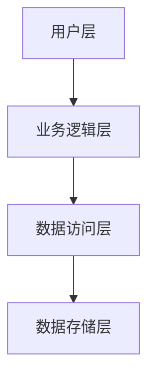
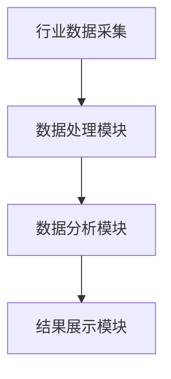
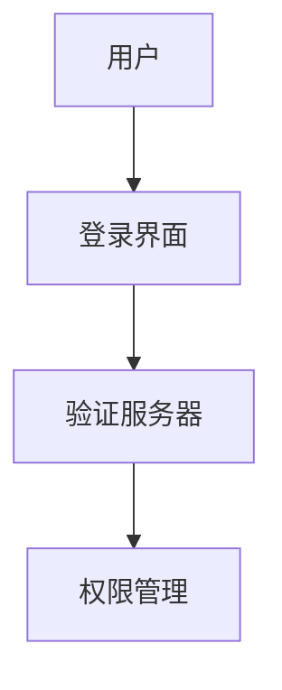

                 


# 费雪的行业研究方法：了解公司的竞争环境

> **关键词**：费雪、行业研究、竞争环境、投资分析、数学模型  
> **摘要**：本文深入探讨了费雪的行业研究方法，重点分析了如何通过行业研究了解公司的竞争环境。文章从费雪的理论背景出发，结合数学模型和系统架构设计，详细讲解了行业分析的核心概念、工具与方法，并通过实战案例展示了如何在实际投资分析中应用这些方法。最后，文章总结了最佳实践和注意事项，为读者提供了全面的行业研究指南。

---

# 第一部分：费雪的行业研究方法概述

## 第1章：费雪的行业研究方法概述

### 1.1 费雪投资理论的背景

#### 1.1.1 费雪投资理论的起源

菲利普·费雪（Philip Fisher）是20世纪著名的投资理论家，他提出了“成长股投资法”，强调通过深入研究公司的基本面，特别是公司的成长潜力和竞争优势，来选择投资标的。费雪的理论在现代投资分析中仍然具有重要的指导意义，尤其是在行业研究领域。

#### 1.1.2 费雪方法的核心思想

费雪的核心思想是，投资者应该选择那些具有强大竞争优势、管理层优秀且能够持续增长的公司。他认为，行业研究是理解公司竞争环境的重要基础，只有通过深入了解行业结构、竞争格局和潜在风险，才能做出明智的投资决策。

#### 1.1.3 费雪方法与现代投资分析的结合

随着市场的不断发展，费雪的理论与现代投资分析方法相结合，形成了更加系统和科学的行业研究方法。本文将从费雪的视角出发，结合现代技术手段，详细探讨如何通过行业研究了解公司的竞争环境。

---

## 第2章：行业研究的重要性

### 2.1 行业研究在投资决策中的作用

#### 2.1.1 行业研究的基本框架

行业研究是投资分析的重要组成部分，它不仅帮助投资者理解行业的整体发展趋势，还能揭示行业内公司的竞争优势和潜在风险。通过行业研究，投资者可以更好地评估公司的投资价值。

#### 2.1.2 行业研究的核心内容

行业研究的核心内容包括行业规模、市场结构、竞争格局、行业周期、政策环境、技术发展等多个方面。这些内容共同构成了行业研究的基本框架。

#### 2.1.3 行业研究的工具与方法

行业研究常用的工具包括行业数据报告、财务报表分析、市场调研、竞争分析模型等。其中，费雪的五力分析模型是一个经典的工具，它可以帮助投资者全面评估行业的竞争环境。

---

## 第3章：费雪的竞争环境分析方法

### 3.1 五力分析模型

#### 3.1.1 行业新进入者的威胁

行业新进入者的威胁是五力分析模型中的重要组成部分。新进入者的威胁取决于行业的进入壁垒，包括技术壁垒、资金壁垒、政策壁垒等。

#### 3.1.2 竞争对手的 rivalry

竞争对手的 rivalry 是行业内部竞争的直接体现。通过分析行业内主要竞争对手的市场份额、产品定位、战略方向，可以评估行业的竞争强度。

#### 3.1.3 替代品的威胁

替代品的威胁是行业研究中不可忽视的一部分。替代品的存在会削弱行业的定价能力，因此需要通过行业研究来评估替代品的市场潜力和竞争优势。

---

## 第4章：行业分析的数学模型与工具

### 4.1 行业增长模型

#### 4.1.1 市场增长率计算公式

$$ \text{市场增长率} = \frac{\text{当前市场规模} - \text{上期市场规模}}{\text{上期市场规模}} \times 100\% $$

市场增长率是衡量行业发展趋势的重要指标，通过计算可以判断行业的扩张速度和潜力。

#### 4.1.2 行业渗透率分析

$$ \text{渗透率} = \frac{\text{实际销售量}}{\text{潜在需求量}} \times 100\% $$

渗透率是评估行业市场饱和程度的重要指标，通过分析渗透率可以判断行业的增长空间。

### 4.2 行业竞争分析模型

#### 4.2.1 市场集中度计算

$$ \text{市场集中度} = \sum_{i=1}^{n} (\text{市场份额}_i)^2 $$

市场集中度是衡量行业市场集中程度的指标，通过计算可以判断行业内的竞争格局和市场垄断程度。

#### 4.2.2 行业利润率分析

$$ \text{利润率} = \frac{\text{净利润}}{\text{营业收入}} \times 100\% $$

利润率是评估行业盈利能力的重要指标，通过分析利润率可以判断行业的经营效率和盈利能力。

---

## 第5章：系统分析与架构设计

### 5.1 行业分析系统的构建

#### 5.1.1 系统需求分析

##### 功能需求
- 数据采集与处理
- 数据分析与建模
- 结果展示与可视化

##### 性能需求
- 数据处理速度
- 系统稳定性
- 可扩展性

##### 用户需求
- 投资者
- 研究人员
- 行业分析师

#### 5.1.2 系统架构设计

##### 分层架构设计



##### 模块划分



#### 5.1.3 系统接口设计

##### 数据接口规范
- RESTful API
- 数据格式：JSON

##### API设计
- 获取行业数据
- 计算市场增长率
- 分析竞争环境

#### 5.1.4 系统交互设计

##### 用户登录与权限管理



---

## 第6章：项目实战

### 6.1 实战案例：科技行业分析

#### 6.1.1 环境安装

##### 安装Python环境
- 使用Anaconda安装Python 3.9
- 安装必要的库：Pandas、NumPy、Matplotlib

#### 6.1.2 核心实现源代码

##### 行业数据采集

```python
import pandas as pd
import requests

url = "https://www.example.com/api/industry_data"
response = requests.get(url)
data = response.json()
df = pd.DataFrame(data)
```

##### 行业数据分析

```python
# 计算市场增长率
market_growth = (df['current市场规模'] - df['上期市场规模']) / df['上期市场规模'] * 100

# 计算市场集中度
market_share = df['市场份额'].values
market_concentration = sum(share**2 for share in market_share)
```

##### 结果展示

```python
import matplotlib.pyplot as plt

plt.plot(market_growth)
plt.title('市场增长率')
plt.xlabel('时间')
plt.ylabel('增长率(%)')
plt.show()
```

---

## 第7章：最佳实践与注意事项

### 7.1 最佳实践

#### 7.1.1 数据来源的可靠性
- 使用权威的数据源
- 数据清洗与验证

#### 7.1.2 分析模型的适用性
- 根据实际情况选择模型
- 定期更新模型

#### 7.1.3 投资决策的科学性
- 综合考虑多方面因素
- 定期复盘与调整

### 7.2 小结

通过本文的探讨，我们可以看到，费雪的行业研究方法在现代投资分析中仍然具有重要的指导意义。通过系统的行业分析和数学模型的应用，投资者可以更好地理解公司的竞争环境，做出更加明智的投资决策。

### 7.3 注意事项

- 行业研究需要结合实际情况，避免过于理论化
- 数据分析需要结合行业背景，避免片面性
- 投资决策需要结合市场变化，避免僵化

---

## 第8章：拓展阅读

### 8.1 推荐书籍

- 《投资学》
- 《行业分析实战指南》

### 8.2 在线资源

- 行业分析报告网站
- 数据分析工具教程

### 8.3 专业论坛

- 投资分析社区
- 行业研究交流群

---

通过本文的详细讲解，读者可以全面理解费雪的行业研究方法，并将其应用于实际的投资分析中。希望本文能够为投资者和行业分析师提供有价值的参考。

