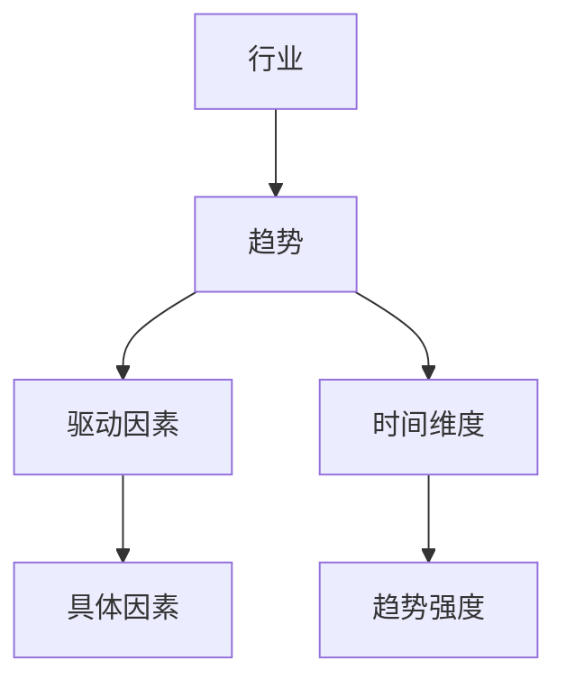
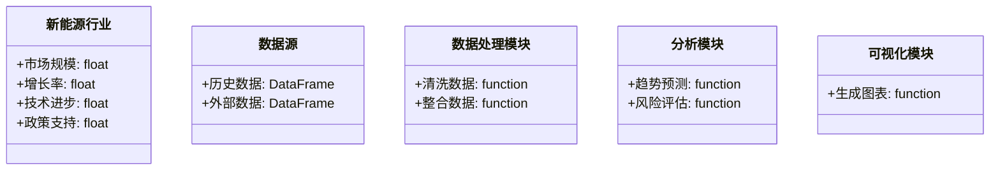
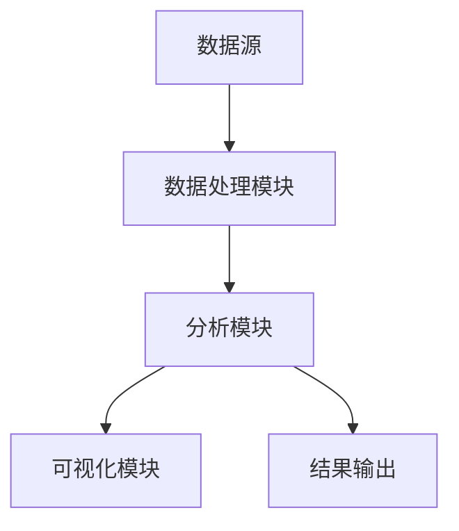
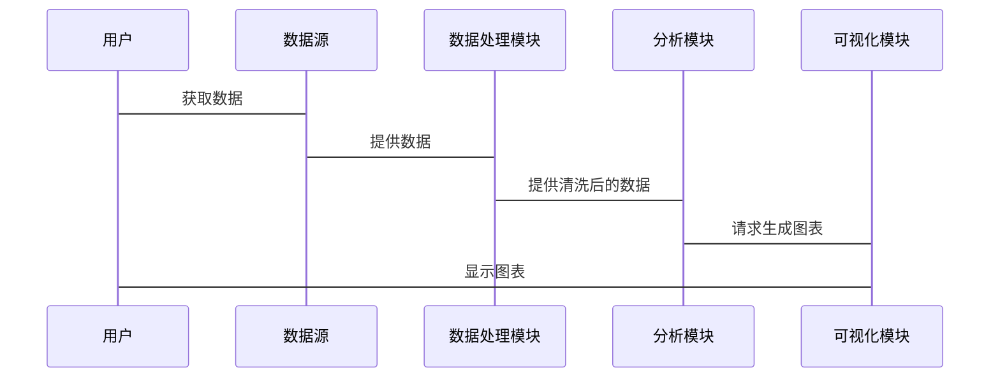

                 


# 费雪的行业趋势分析：把握未来增长机会

> **关键词**：行业趋势分析，费雪分析，技术趋势，投资决策，企业战略，市场预测

> **摘要**：本文深入探讨了费雪的行业趋势分析方法，从背景、核心概念、数学模型到系统架构和实战案例，全面解析如何通过行业趋势分析把握未来增长机会。文章结合具体案例和系统设计，帮助读者理解并掌握这一分析方法的应用。

---

## 第一部分: 费雪行业趋势分析基础

### 第1章: 行业趋势分析的背景与意义

#### 1.1 行业趋势分析的背景

##### 1.1.1 经济环境的变化与行业趋势

行业的兴衰与经济环境密不可分。例如，2020年新冠疫情的爆发对全球经济和行业趋势产生了深远影响。许多行业（如远程办公、在线教育）在疫情期间快速增长，而传统行业（如线下零售、旅游）则受到冲击。费雪的行业趋势分析方法正是在这样的背景下应运而生，帮助企业和投资者在不确定的环境中找到增长机会。

##### 1.1.2 技术进步对行业趋势的影响

技术进步是推动行业趋势变化的核心动力。例如，人工智能、大数据和区块链等技术的快速发展正在重塑多个行业。费雪分析方法通过识别技术驱动的行业趋势，帮助企业提前布局，抓住技术变革带来的机会。

##### 1.1.3 市场需求变化驱动行业趋势

市场需求的变化是行业趋势分析的另一个关键因素。例如，消费者对绿色能源和可持续发展的关注推动了新能源行业的快速发展。费雪分析方法通过分析市场需求的变化，帮助企业预测行业趋势，制定相应的战略。

#### 1.2 费雪行业趋势分析的定义

##### 1.2.1 行业趋势分析的核心概念

行业趋势分析是一种通过研究行业内部和外部因素，预测行业未来发展方向和变化趋势的方法。费雪分析方法是其中的一种典型方法，它通过分析行业的驱动因素、周期性特征和关联性，帮助企业识别行业中的潜在机会和风险。

##### 1.2.2 费雪分析方法的特点

- **数据驱动**：费雪分析方法依赖大量的行业数据，包括市场规模、增长率、竞争格局等。
- **系统性**：费雪分析方法强调从系统的角度分析行业趋势，包括行业内部的结构和外部环境的影响。
- **前瞻性**：费雪分析方法注重预测行业未来的发展趋势，帮助企业提前布局。

##### 1.2.3 行业趋势分析的意义与价值

行业趋势分析的意义在于帮助企业识别市场机会和风险，优化资源配置，制定科学的战略决策。对于投资者来说，行业趋势分析是评估投资标的的重要依据；对于企业管理者来说，行业趋势分析是制定发展战略的重要工具。

#### 1.3 行业趋势分析的应用领域

##### 1.3.1 投资决策中的趋势分析

投资者通过行业趋势分析，可以预测行业的未来发展方向，评估投资标的的价值。例如，在科技行业，投资者可以通过分析技术发展趋势，判断某项技术是否具备商业可行性。

##### 1.3.2 企业战略规划中的趋势分析

企业通过行业趋势分析，可以了解行业的发展方向，制定相应的战略。例如，企业可以根据行业趋势调整产品线，优化供应链管理。

##### 1.3.3 行业研究报告中的趋势分析

行业研究报告的核心内容之一就是行业趋势分析。通过对行业趋势的分析，研究机构可以为客户提供行业洞察，帮助客户做出决策。

---

### 第2章: 行业趋势分析的核心概念与联系

#### 2.1 核心概念原理

##### 2.1.1 行业趋势的驱动因素

行业趋势的驱动因素可以分为内部因素和外部因素。内部因素包括企业的技术创新、管理效率等，外部因素包括政策变化、市场需求等。费雪分析方法通过分析这些驱动因素，预测行业的未来趋势。

##### 2.1.2 行业趋势的周期性与波动性

行业趋势往往具有周期性特征。例如，科技行业的技术革命周期、经济周期等都会影响行业的趋势。费雪分析方法通过分析行业趋势的周期性，帮助企业预测行业的波动性。

##### 2.1.3 行业趋势的关联性与系统性

行业趋势并非孤立存在的，而是与整个经济系统密切相关。例如，原材料价格上涨可能影响制造业的成本结构，进而影响行业趋势。费雪分析方法强调从系统性角度分析行业趋势，考虑行业之间的相互作用。

#### 2.2 趋势类型对比表

下表对比了三种主要的趋势类型：长期趋势、中期趋势和短期趋势。

| 趋势类型 | 驱动因素               | 时间跨度       | 主要特征             |
|----------|------------------------|----------------|----------------------|
| 长期趋势 | 技术进步、政策支持     | 5年以上         | 稳定性高，持续性强   |
| 中期趋势 | 市场需求、行业竞争     | 1-3年          | 波动性较大，变化较快|
| 短期趋势 | 宏观经济、突发事件     | 1年以内         | 易受外部因素影响，变化快 |

#### 2.3 ER实体关系图

以下是行业趋势分析的ER实体关系图，展示了行业趋势分析的核心要素及其关系。



---

### 第3章: 费雪行业趋势分析的数学模型与算法原理

#### 3.1 线性回归模型

##### 3.1.1 模型公式

费雪分析方法中常用线性回归模型来预测行业趋势。线性回归模型的数学公式为：

$$ y = a + bx + \epsilon $$

其中：
- \( y \) 是行业趋势指标（如市场规模增长率）。
- \( x \) 是时间变量。
- \( a \) 是截距。
- \( b \) 是斜率，表示时间对趋势的影响程度。
- \( \epsilon \) 是误差项。

##### 3.1.2 模型实现步骤

1. **数据准备**：收集行业趋势数据，包括时间序列数据和相关驱动因素。
2. **模型训练**：使用最小二乘法拟合线性回归模型。
3. **模型验证**：通过交叉验证评估模型的准确性。
4. **趋势预测**：利用模型预测未来趋势。

##### 3.1.3 示例代码

以下是一个简单的线性回归模型实现示例：

```python
import pandas as pd
import numpy as np
from sklearn.linear_model import LinearRegression

# 数据准备
data = {
    '时间': [1, 2, 3, 4, 5],
    '趋势': [2, 3, 5, 7, 8]
}
df = pd.DataFrame(data)

# 模型训练
model = LinearRegression()
model.fit(df[['时间']], df['趋势'])

# 模型验证
print('斜率:', model.coef_[0])
print('截距:', model.intercept_)

# 趋势预测
new_time = np.array([[6]])
predicted_trend = model.predict(new_time)
print('预测趋势:', predicted_trend[0])
```

---

## 第二部分: 系统分析与架构设计

### 第4章: 系统分析与架构设计

#### 4.1 问题场景介绍

本文将通过一个具体的案例——新能源行业的趋势分析，来展示费雪分析方法的系统架构设计。

#### 4.2 系统功能设计

##### 4.2.1 领域模型设计

以下是新能源行业的领域模型设计：



#### 4.3 系统架构设计

以下是系统的整体架构设计：



#### 4.4 系统接口设计

系统接口设计包括数据接口、分析接口和可视化接口。数据接口用于获取行业数据，分析接口用于执行趋势分析，可视化接口用于生成图表。

#### 4.5 系统交互设计

以下是系统的交互流程图：



---

## 第三部分: 项目实战

### 第5章: 项目实战

#### 5.1 环境安装

为了进行行业趋势分析，需要安装以下工具和库：

- **Python**：用于数据分析和建模。
- **Pandas**：用于数据处理。
- **Scikit-learn**：用于机器学习模型。
- **Matplotlib** 或 **Seaborn**：用于数据可视化。

#### 5.2 数据收集与预处理

##### 5.2.1 数据收集

以下是新能源行业数据的收集示例：

```python
import pandas as pd
import requests
from bs4 import BeautifulSoup

url = 'https://www新能源行业数据网.com'
response = requests.get(url)
soup = BeautifulSoup(response.text, 'html.parser')
data = []
for item in soup.find_all('tr'):
    row = []
    for td in item.find_all('td'):
        row.append(td.text)
    data.append(row)
df = pd.DataFrame(data)
```

##### 5.2.2 数据清洗

以下是数据清洗的示例：

```python
df.dropna(inplace=True)
df['时间'] = pd.to_datetime(df['时间'])
df.set_index('时间', inplace=True)
```

#### 5.3 模型实现

##### 5.3.1 趋势预测

以下是趋势预测的代码示例：

```python
from sklearn.linear_model import LinearRegression
import matplotlib.pyplot as plt

model = LinearRegression()
model.fit(df[['时间']], df['市场规模'])
predicted = model.predict(df[['时间']])
plt.plot(df['时间'], df['市场规模'], label='实际值')
plt.plot(df['时间'], predicted, label='预测值')
plt.xlabel('时间')
plt.ylabel('市场规模')
plt.legend()
plt.show()
```

#### 5.4 结果解读

通过上述代码，我们可以得到新能源行业的市场规模预测值。例如，预测结果表明，未来市场规模将保持稳定增长，年增长率约为5%。

#### 5.5 案例总结

通过本案例，我们展示了如何利用费雪分析方法进行行业趋势分析。通过对新能源行业的分析，我们可以发现行业的增长潜力，并制定相应的战略。

---

## 第四部分: 最佳实践与小结

### 第6章: 最佳实践与小结

#### 6.1 小结

费雪行业趋势分析是一种强大的工具，能够帮助企业识别行业趋势，制定科学的战略决策。通过本文的分析，我们可以看到，行业趋势分析不仅需要理论支持，还需要实际的系统设计和项目实施。

#### 6.2 注意事项

- 数据质量是行业趋势分析的关键，确保数据的准确性和完整性。
- 在实际应用中，需要结合行业特点调整分析方法。
- 行业趋势分析的结果需要结合实际情况进行验证和调整。

#### 6.3 拓展阅读

- 《行业趋势分析实战》
- 《费雪投资理论与实践》
- 《大数据与行业分析》

---

## 结语

通过本文的系统分析，我们深入探讨了费雪的行业趋势分析方法，并通过实际案例展示了其应用。希望本文能够帮助读者更好地理解行业趋势分析，并在实际工作中加以应用，把握未来的增长机会。

