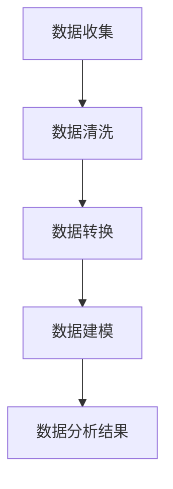
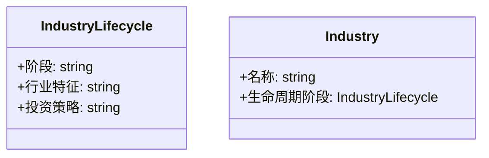
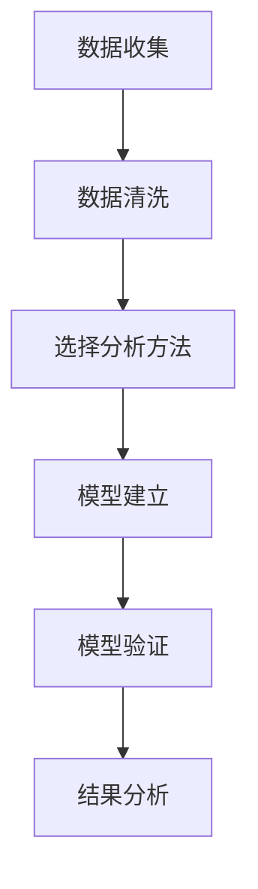
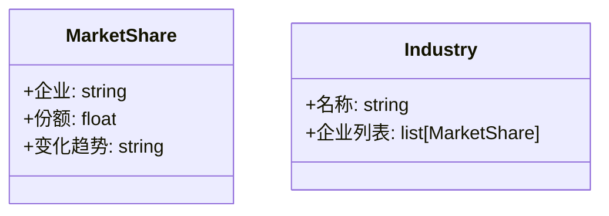
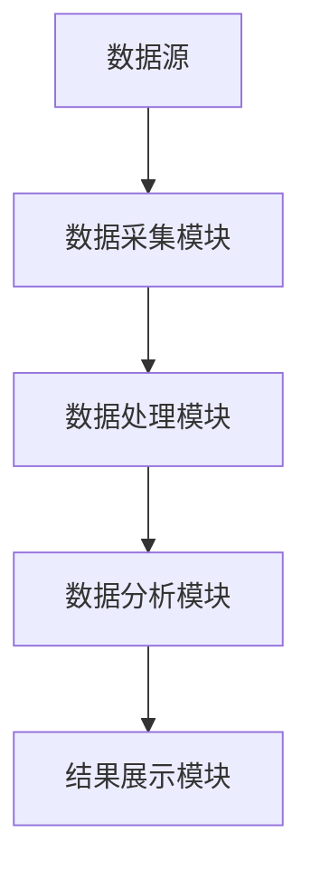

                 


# 费雪的行业趋势分析：未来增长的关键

---

## 关键词
- 行业趋势分析
- 费雪投资理念
- 趋势识别
- 数据分析
- 投资策略
- 长期增长

---

## 摘要
本文深入探讨了费雪的行业趋势分析方法，结合现代数据分析工具和技术，帮助投资者识别行业趋势，评估市场前景，并制定有效的投资策略。通过详细讲解趋势识别、数据分析、数学模型和系统架构，本文为读者提供了从理论到实践的完整指南，帮助他们在复杂多变的市场中找到长期增长的关键。

---

## 正文

### 第一部分：行业趋势分析的基础

#### 第1章：费雪投资理念与行业趋势分析概述

##### 1.1 费雪的投资哲学

###### 1.1.1 费雪的生平与投资理念
乔治·费雪（George D. Fisher）是趋势投资理论的倡导者，他强调通过分析行业趋势来识别投资机会。费雪认为，成功的投资不仅依赖于个股的选择，更取决于对行业趋势的深刻理解。他的投资理念基于长期增长的视角，关注那些能够持续适应市场变化并保持增长的行业。

**背景介绍：**  
费雪的投资理念源于20世纪初的经济波动，他通过观察行业趋势，提出了“投资于趋势，而非个股”的策略。这种理念在现代投资实践中仍然具有重要的指导意义。

**核心概念与联系：**  
费雪的投资理念与行业趋势分析密切相关。他强调，行业趋势是企业增长的核心驱动力，因此，投资者需要识别和分析行业趋势，以做出明智的投资决策。

##### 1.1.2 长期投资与价值发现的核心思想
费雪认为，长期投资的核心在于选择那些能够持续增长的行业，并在这些行业中寻找具有竞争优势的企业。他提出，企业价值的增长与其所在行业的趋势密切相关，因此，投资者需要关注行业趋势的变化，以识别具有长期增长潜力的投资标的。

**核心概念与联系：**  
- **长期投资：** 费雪强调长期投资的重要性，认为短期市场波动不应影响长期投资决策。  
- **价值发现：** 通过分析行业趋势，识别那些能够持续增长的企业，从而实现价值发现。

##### 1.1.3 费雪方法与现代趋势分析的结合
尽管费雪的投资理念源于早期的经济环境，但其核心思想在现代数据分析技术的支持下得到了进一步的发展。现代趋势分析结合了大数据和人工智能技术，能够更准确地识别和预测行业趋势，从而为投资者提供更有力的支持。

**背景介绍：**  
现代数据分析技术的进步使得趋势分析更加精确和高效。通过结合费雪的投资理念，现代趋势分析能够帮助投资者更有效地识别行业趋势，并制定相应的投资策略。

**核心概念与联系：**  
- **大数据与人工智能：** 现代趋势分析利用大数据和人工智能技术，提高了趋势识别的准确性和效率。  
- **费雪方法的延续：** 费雪的投资理念在现代趋势分析中得到了进一步的拓展和应用。

---

#### 第2章：行业趋势分析的基本方法

##### 2.1 数据分析与趋势识别

###### 2.1.1 数据收集与处理
数据分析是行业趋势分析的基础。首先，需要收集与目标行业相关的数据，包括市场规模、增长率、市场份额、竞争格局等。这些数据可以通过行业报告、公司财报、政府统计数据等渠道获取。

**背景介绍：**  
数据收集与处理是行业趋势分析的第一步。准确的数据是后续分析的基础，因此，数据的收集和处理过程需要特别注意数据的准确性和完整性。

**算法原理讲解：**  
数据分析的基本流程包括数据清洗、数据转换和数据建模。以下是数据分析流程的mermaid图：



**代码实现：**  
以下是一个简单的数据清洗示例：

```python
import pandas as pd

# 假设df是原始数据
# 删除缺失值
df.dropna(inplace=True)

# 去除重复值
df.drop_duplicates(inplace=True)

# 处理异常值
# 这里假设使用Z-score方法
from scipy import stats
z = stats.zscore(df['收入'])
df['收入'] = z
```

##### 2.1.2 数据可视化与初步趋势识别
数据可视化是趋势识别的重要手段。通过绘制时间序列图、柱状图、饼图等图表，可以帮助投资者直观地观察数据的变化趋势和分布情况。

**核心概念与联系：**  
- **时间序列图：** 用于观察数据随时间的变化趋势。  
- **柱状图：** 用于比较不同类别或时间段的数据。  
- **饼图：** 用于展示数据的构成比例。

**代码实现：**  
以下是一个时间序列图的绘制示例：

```python
import matplotlib.pyplot as plt

# 假设data是时间序列数据
plt.figure(figsize=(10, 6))
plt.plot(data.index, data['收入'], 'b-', label='收入')
plt.title('行业收入时间序列图')
plt.xlabel('时间')
plt.ylabel('收入')
plt.legend()
plt.show()
```

---

##### 2.2 行业生命周期分析

###### 2.2.1 行业生命周期的四个阶段
行业生命周期分为导入期、成长期、成熟期和衰退期。不同阶段的行业具有不同的增长潜力和投资机会。

**背景介绍：**  
行业生命周期分析是行业趋势分析的重要内容。了解行业所处的生命周期阶段，可以帮助投资者制定相应的投资策略。

**核心概念与联系：**  
- **导入期：** 行业刚刚进入市场，增长潜力大，但风险较高。  
- **成长期：** 行业快速增长，企业竞争加剧。  
- **成熟期：** 行业增长稳定，竞争格局基本确定。  
- **衰退期：** 行业增长放缓，企业可能面临转型或退出的压力。

##### 2.2.2 不同阶段的投资策略
根据行业所处的生命周期阶段，投资者可以制定相应的投资策略。例如，在导入期，投资者可以关注具有创新能力和竞争优势的企业；在衰退期，投资者可以考虑退出或调整投资组合。

**背景介绍：**  
不同生命周期阶段的投资策略需要结合行业趋势和企业基本面进行综合分析。

**系统分析与架构设计方案：**  
以下是一个行业生命周期分析的类图：



---

##### 2.3 市场需求与供给分析

###### 2.3.1 市场需求的预测方法
市场需求预测是行业趋势分析的重要内容。常用的方法包括历史数据分析、市场调研和专家预测等。

**背景介绍：**  
市场需求预测需要结合历史数据和市场动态，分析未来市场的需求变化。

**数学模型：**  
以下是一个简单的需求预测模型：

$$
需求 = a \times 收入 + b \times 价格 + c \times 其他因素
$$

其中，a、b、c是模型的参数，可以通过回归分析确定。

**代码实现：**  
以下是一个需求预测的回归分析示例：

```python
import statsmodels.api as sm

# 假设x是自变量，y是因变量
model = sm.OLS(y, sm.add_constant(x))
results = model.fit()
print(results.summary())
```

---

#### 第3章：趋势识别与趋势强度

##### 3.1 趋势识别的关键步骤

###### 3.1.1 数据清洗与预处理
数据清洗是趋势识别的第一步。需要去除异常值和缺失值，确保数据的准确性和完整性。

**背景介绍：**  
数据清洗是数据分析的基础工作，直接影响后续分析的准确性。

**代码实现：**  
以下是一个数据清洗的示例：

```python
import pandas as pd

# 假设df是原始数据
# 删除缺失值
df.dropna(inplace=True)

# 去除重复值
df.drop_duplicates(inplace=True)
```

##### 3.1.2 趋势线与拐点识别
趋势线是趋势识别的重要工具。通过绘制趋势线，可以帮助投资者识别数据的主趋势和拐点。

**核心概念与联系：**  
- **趋势线：** 用于展示数据的主趋势。  
- **拐点：** 数据趋势发生变化的转折点。

**数学模型：**  
以下是一个趋势线的回归模型：

$$
y = a x + b
$$

其中，a是斜率，b是截距。

**代码实现：**  
以下是一个趋势线的绘制示例：

```python
import matplotlib.pyplot as plt
import numpy as np

# 假设x是时间，y是数据
slope, intercept = np.polyfit(x, y, 1)
plt.plot(x, slope * x + intercept, 'r-', label='趋势线')
plt.scatter(x, y, label='原始数据')
plt.legend()
plt.show()
```

##### 3.1.3 时间序列分析方法
时间序列分析是趋势识别的重要方法。通过分析时间序列数据的变化规律，可以帮助投资者识别周期性、趋势性和随机性成分。

**背景介绍：**  
时间序列分析是现代数据分析的重要工具，广泛应用于金融、经济等领域。

**系统分析与架构设计方案：**  
以下是一个时间序列分析的流程图：



---

##### 3.2 趋势强度的衡量指标

###### 3.2.1 增长率的计算与分析
增长率是衡量趋势强度的重要指标。通过计算增长率，可以帮助投资者判断行业趋势的强弱。

**背景介绍：**  
增长率计算是趋势分析的基本方法，广泛应用于行业和企业分析。

**数学模型：**  
以下是一个增长率的计算公式：

$$
增长率 = \frac{当前值 - 原值}{原值} \times 100\%
$$

**代码实现：**  
以下是一个增长率计算的示例：

```python
# 假设prev是上一期的值，current是当前期的值
growth_rate = ((current - prev) / prev) * 100
print(f"增长率：{growth_rate}%")
```

##### 3.2.2 市场份额的变化趋势
市场份额是衡量行业趋势的重要指标。通过分析市场份额的变化趋势，可以帮助投资者判断行业的竞争格局和市场潜力。

**背景介绍：**  
市场份额分析是行业趋势分析的重要内容，帮助投资者识别行业内的优势企业和市场机会。

**系统分析与架构设计方案：**  
以下是一个市场份额分析的类图：



---

### 第四部分：行业趋势分析的系统化框架

#### 第5章：构建行业趋势分析系统

##### 5.1 系统功能设计
系统功能设计是行业趋势分析系统的核心内容。包括数据采集、数据分析、趋势预测和结果展示等功能。

**背景介绍：**  
行业趋势分析系统需要具备强大的数据处理和分析能力，以支持投资者的决策需求。

**系统架构设计：**  
以下是一个行业趋势分析系统的架构图：



---

#### 第6章：项目实战

##### 6.1 环境安装与配置
项目实战需要一定的环境配置。以下是常用的工具和库的安装步骤：

1. 安装Python和Jupyter Notebook。
2. 安装数据分析库（Pandas、NumPy、Matplotlib）。
3. 安装机器学习库（Scikit-learn、XGBoost）。
4. 安装可视化工具（Seaborn、Plotly）。

**代码实现：**  
以下是一个环境配置的示例：

```bash
pip install pandas numpy matplotlib scikit-learn xgboost seaborn plotly
```

##### 6.2 核心代码实现
以下是一个行业趋势分析的核心代码实现：

```python
import pandas as pd
import matplotlib.pyplot as plt
from sklearn.linear_model import LinearRegression

# 数据加载
data = pd.read_csv('industry_data.csv')

# 数据预处理
data.dropna(inplace=True)

# 趋势线拟合
model = LinearRegression()
model.fit(data[['时间']], data['收入'])
预测收入 = model.predict(data[['时间']])

# 图形绘制
plt.figure(figsize=(10, 6))
plt.plot(data['时间'], data['收入'], 'b-', label='实际收入')
plt.plot(data['时间'], 预测收入, 'r-', label='趋势线')
plt.title('行业收入趋势分析')
plt.xlabel('时间')
plt.ylabel('收入')
plt.legend()
plt.show()
```

##### 6.3 案例分析与结果解读
以下是一个具体的案例分析：

假设我们选择科技行业作为分析对象，收集了过去5年的收入数据，并使用线性回归模型进行趋势预测。分析结果显示，科技行业的收入呈现持续增长的趋势，年均增长率为8%。这表明科技行业具有较高的增长潜力，投资者可以考虑长期投资。

**结果解读：**  
通过趋势分析，我们发现科技行业的收入增长趋势明显，且增长率稳定，因此，科技行业是一个具有长期增长潜力的行业，值得投资者关注。

---

### 第五部分：总结与展望

#### 5.1 总结
本文详细介绍了费雪的行业趋势分析方法，结合现代数据分析技术，为投资者提供了从理论到实践的完整指南。通过趋势识别、数据分析和系统构建，投资者可以更准确地判断行业趋势，并制定相应的投资策略。

#### 5.2 展望
未来，随着大数据和人工智能技术的进一步发展，行业趋势分析将更加精准和高效。投资者可以通过结合更多的数据源和更复杂的模型，进一步提升趋势分析的准确性和深度。同时，行业趋势分析也将拓展到更多的领域，为投资者提供更多的机会和挑战。

---

**最佳实践 Tips：**  
- **数据来源：** 确保数据的准确性和可靠性，优先选择权威的数据源。  
- **模型选择：** 根据具体需求选择合适的模型，避免过度复杂化。  
- **持续学习：** 市场趋势不断变化，投资者需要持续学习和更新知识，以适应新的市场环境。

---

通过本文的详细讲解，读者可以掌握费雪的行业趋势分析方法，并将其应用到实际投资中，从而在复杂的市场环境中找到未来增长的关键。

