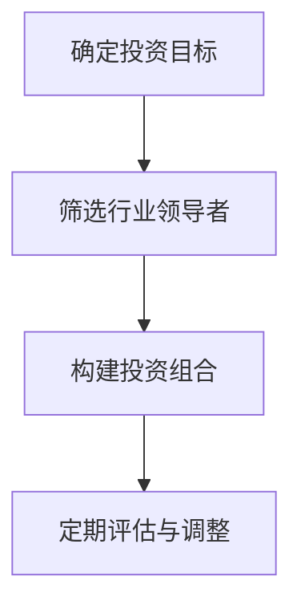
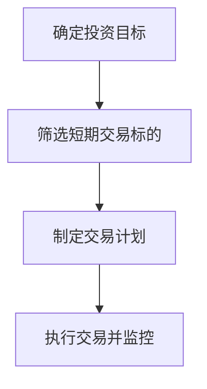
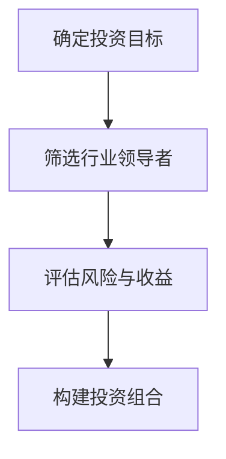
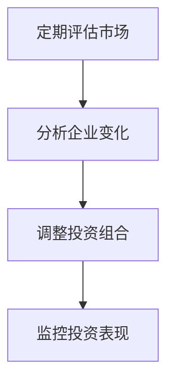

                 


# 费雪的行业领导者投资法

> 关键词：费雪投资法、行业领导者、投资策略、财务分析、系统架构

> 摘要：本文系统地介绍费雪的行业领导者投资法，从基础理论到实际操作，结合案例分析和系统设计，详细讲解如何识别和投资行业领导者，构建稳健的投资组合。

---

# 第一部分: 费雪的行业领导者投资法基础

## 第1章: 费雪投资法概述

### 1.1 费雪投资法的核心理念
#### 1.1.1 投资的目的是什么
$$投资的本质是通过分析和选择，找到能够长期创造价值的企业，并分享其增长的收益。$$

#### 1.1.2 费雪投资法的定义
费雪投资法是由投资大师菲利普·费雪提出的一种专注于投资行业领导者的策略。其核心在于通过深入研究企业的基本面，选择那些具有强大竞争优势和增长潜力的公司进行长期投资。

#### 1.1.3 费雪投资法的核心原则
1. **长期投资**：投资于具有持续增长潜力的企业，而非短期交易。
2. **深入研究**：通过对企业管理层、产品竞争力、财务状况的全面分析，选择优质标的。
3. **分散投资**：通过投资于多个行业的领导者，降低风险。

### 1.2 费雪投资法的基本框架
#### 1.2.1 费雪投资法的三要素
1. **管理质量**：企业的管理层是否优秀，是否能够持续推动企业发展。
2. **产品竞争力**：企业的产品或服务是否具有独特的竞争优势。
3. **财务表现**：企业的财务状况是否健康，是否有持续增长的潜力。

#### 1.2.2 费雪投资法的四个步骤
1. **确定投资目标**：明确投资目的和风险承受能力。
2. **筛选行业领导者**：通过基本面分析，筛选出具有竞争优势的公司。
3. **构建投资组合**：根据行业分布和风险偏好，选择多个行业领导者。
4. **持续监控与调整**：定期评估投资组合的表现，根据市场变化进行调整。

#### 1.2.3 费雪投资法的优缺点分析
- **优点**：
  - 着重于长期价值，避免短期波动的干扰。
  - 通过投资行业领导者，获得较高的增长潜力。
- **缺点**：
  - 对投资者的分析能力要求较高。
  - 需要较长的时间周期才能看到收益。

### 1.3 费雪投资法与其他投资方法的对比
#### 1.3.1 费雪投资法与价值投资的异同
- **相同点**：都注重企业的基本面分析，寻找被市场低估的投资标的。
- **不同点**：价值投资更注重价格与价值的匹配，而费雪投资法则更注重企业的成长性和竞争优势。

#### 1.3.2 费雪投资法与成长投资的异同
- **相同点**：都关注具有高增长潜力的企业。
- **不同点**：成长投资更注重企业的增长率，而费雪投资法则更注重企业的竞争优势和管理层质量。

#### 1.3.3 费雪投资法与趋势投资的异同
- **相同点**：都关注行业趋势和企业的发展前景。
- **不同点**：趋势投资更注重短期市场趋势，而费雪投资法则更注重长期竞争优势。

### 1.4 本章小结
本章介绍了费雪投资法的核心理念、基本框架及其与其他投资方法的异同。通过对比分析，读者可以更好地理解费雪投资法的独特之处及其适用场景。

---

# 第二部分: 行业领导者分析方法

## 第2章: 行业领导者的特征分析

### 2.1 行业领导者的定义与分类
#### 2.1.1 行业领导者的定义
行业领导者是指在特定行业中具有最强市场地位、竞争优势和增长潜力的企业。

#### 2.1.2 行业领导者的分类
1. **市场领导者**：市场份额最高的企业。
2. **市场挑战者**：市场份额排名靠前，但不是第一的企业。
3. **市场跟随者**：市场份额较小，但具有潜在增长能力的企业。

### 2.2 行业领导者的市场地位分析
#### 2.2.1 市场领导者
- **市场领导者**：市场份额最高，具有定价权和品牌优势。
- **分析工具**：使用市场份额分布图（如下图）来判断企业的市场地位。


#### 2.2.2 市场挑战者
- **市场挑战者**：市场份额排名第二，但增长速度快，有潜力成为领导者。
- **分析工具**：市场份额趋势图（如下图）。

```mermaid
lineChart
    title 市场份额趋势
    xlabel 年份
    ylabel 百分比
    "Market Leader": [50, 48, 47, 46, 45]
    "Market Challenger": [30, 32, 34, 36, 38]
```

#### 2.2.3 市场跟随者
- **市场跟随者**：市场份额较小，但具有差异化竞争优势。
- **分析工具**：市场份额与利润率对比图。

```mermaid
barChart
    title 市场份额与利润率对比
    xlabel 企业
    ylabel 指标
    "市场领导者": ["市场份额: 50%", "利润率: 20%"]
    "市场挑战者": ["市场份额: 30%", "利润率: 18%"]
    "市场跟随者": ["市场份额: 20%", "利润率: 22%"]
```

### 2.3 行业领导者的竞争优势分析
#### 2.3.1 核心竞争力
- **核心竞争力**：企业的核心竞争优势，如技术创新、成本优势、品牌影响力等。
- **分析工具**：核心竞争力对比表（如下表）。

| 企业名称       | 核心竞争力               |
|----------------|--------------------------|
| 市场领导者     | 技术创新、品牌优势       |
| 市场挑战者     | 成本优势、市场扩展能力   |
| 市场跟随者     | 产品差异化、服务优势     |

#### 2.3.2 技术优势
- **技术优势**：企业在技术领域的领先地位，包括专利数量、研发投入等。
- **分析工具**：技术优势雷达图（如下图）。

```mermaid
radarChart
    title 技术优势雷达图
    "市场领导者": 技术研发投资高、专利数量多
    "市场挑战者": 技术研发投资中、专利数量中
    "市场跟随者": 技术研发投资低、专利数量少
```

#### 2.3.3 市场占有率
- **市场占有率**：企业在市场上的份额占比，反映了企业的市场地位和竞争力。
- **分析工具**：市场占有率趋势图（如下图）。


### 2.4 行业领导者的财务表现分析
#### 2.4.1 财务健康状况
- **财务健康状况**：企业的财务状况是否健康，包括资产负债率、流动比率等。
- **分析工具**：财务健康状况评分表（如下表）。

| 企业名称       | 资产负债率 | 流动比率 |
|----------------|------------|----------|
| 市场领导者     | 40%        | 2.5      |
| 市场挑战者     | 45%        | 2.2      |
| 市场跟随者     | 50%        | 2.0      |

#### 2.4.2 盈利能力
- **盈利能力**：企业的盈利能力，包括净利润率、ROE等。
- **分析工具**：盈利能力对比图（如下图）。

```mermaid
lineChart
    title 盈利能力趋势
    xlabel 年份
    ylabel 指标
    "市场领导者": [15%, 16%, 17%, 18%]
    "市场挑战者": [12%, 13%, 14%, 15%]
    "市场跟随者": [10%, 11%, 12%, 13%]
```

#### 2.4.3 增长潜力
- **增长潜力**：企业的未来增长能力，包括收入增长率、净利润增长率等。
- **分析工具**：增长潜力对比图（如下图）。

```mermaid
barChart
    title 增长潜力对比
    xlabel 企业
    ylabel 指标
    "市场领导者": [20%, 25%, 30%]
    "市场挑战者": [15%, 20%, 25%]
    "市场跟随者": [10%, 15%, 20%]
```

### 2.5 本章小结
本章通过分析行业领导者的市场地位、竞争优势和财务表现，帮助投资者更好地识别和选择具有潜力的行业领导者。

---

# 第三部分: 费雪投资法的系统分析与架构设计

## 第3章: 费雪投资法的系统分析

### 3.1 投资目标的确定
#### 3.1.1 投资目标的定义
投资目标是指投资者希望通过投资实现的具体目标，如财富增长、风险控制等。

#### 3.1.2 投资目标的分类
1. **短期目标**：如资金增值、风险控制。
2. **长期目标**：如财富积累、资产传承。

#### 3.1.3 投资目标的确定方法
- **方法一**：根据风险承受能力和收益需求，确定投资目标。
- **方法二**：根据市场环境和企业状况，调整投资目标。

### 3.2 投资策略的设计
#### 3.2.1 长期投资策略
- **长期投资策略**：通过长期持有优质股票，分享企业的成长收益。
- **分析工具**：长期投资策略流程图（如下图）。



#### 3.2.2 短期投资策略
- **短期投资策略**：通过短期交易，捕捉市场波动带来的收益。
- **分析工具**：短期投资策略流程图（如下图）。



#### 3.2.3 组合投资策略
- **组合投资策略**：通过投资多个行业领导者，分散风险，提高收益。
- **分析工具**：投资组合风险收益图（如下图）。

```mermaid
scatterPlot
    title 投资组合风险收益图
    xlabel 风险
    ylabel 收益
    point 市场领导者: (中, 高)
    point 市场挑战者: (中, 中)
    point 市场跟随者: (低, 低)
```

### 3.3 投资组合的管理
#### 3.3.1 投资组合的构建
- **投资组合的构建**：根据投资目标和风险偏好，选择多个行业领导者，构建投资组合。
- **分析工具**：投资组合构建流程图（如下图）。



#### 3.3.2 投资组合的调整
- **投资组合的调整**：根据市场变化和企业状况，定期调整投资组合。
- **分析工具**：投资组合调整流程图（如下图）。



#### 3.3.3 投资组合的风险控制
- **风险控制**：通过分散投资、止损策略等，控制投资组合的风险。
- **分析工具**：风险控制策略表（如下表）。

| 风险类型       | 控制措施               |
|----------------|------------------------|
| 市场风险       | 分散投资、使用对冲工具   |
| 信用风险       | 选择优质企业、控制杠杆率|
| 操作风险       | 定期监控、严格遵守投资纪律|

### 3.4 本章小结
本章通过系统分析，帮助投资者制定合理的投资策略，并通过投资组合管理，实现风险控制和收益最大化。

---

# 第四部分: 费雪投资法的项目实战

## 第4章: 费雪投资法的环境安装与配置

### 4.1 投资环境的分析
#### 4.1.1 经济环境
- **经济环境**：包括宏观经济指标（GDP增长率、利率、通货膨胀率等）。
- **分析工具**：经济环境分析表（如下表）。

| 指标名称       | 当前值       | 预测值       |
|----------------|--------------|--------------|
| GDP增长率       | 5%           | 6%           |
| 利率           | 3%           | 4%           |
| 通货膨胀率       | 2%           | 3%           |

#### 4.1.2 行业环境
- **行业环境**：包括行业发展趋势、竞争格局等。
- **分析工具**：行业环境分析雷达图（如下图）。

```mermaid
radarChart
    title 行业环境分析
    "行业发展趋势": 上升
    "竞争格局": 中等
    "政策环境": 有利
```

#### 4.1.3 公司环境
- **公司环境**：包括公司基本面、管理层质量等。
- **分析工具**：公司环境分析表（如下表）。

| 企业名称       | 基本面指标       | 管理层质量 |
|----------------|------------------|------------|
| 市场领导者     | 良好             | 高         |
| 市场挑战者     | 中等             | 中         |
| 市场跟随者     | 较低             | 低         |

### 4.2 投资工具的安装
#### 4.2.1 财务分析工具
- **财务分析工具**：包括财务报表分析、估值模型等。
- **工具推荐**：Excel、Python（Pandas库）。

#### 4.2.2 行业分析工具
- **行业分析工具**：包括行业研究报告、市场数据分析工具。
- **工具推荐**：Morningstar、FactSet。

#### 4.2.3 数据分析工具
- **数据分析工具**：包括数据清洗、数据可视化的工具。
- **工具推荐**：Python（Pandas、Matplotlib）、R。

### 4.3 投资环境的配置
#### 4.3.1 数据源的选择
- **数据源**：包括财务报表、行业报告、市场数据等。
- **数据源推荐**：Yahoo Finance、Google Finance、Bloomberg。

#### 4.3.2 数据的清洗与处理
- **数据清洗**：处理缺失值、异常值等。
- **数据处理**：数据转换、数据归一化等。

#### 4.3.3 数据的可视化
- **数据可视化**：使用图表展示数据，便于分析。
- **可视化工具**：Matplotlib、Seaborn、Tableau。

### 4.4 本章小结
本章介绍了投资环境的分析和投资工具的安装与配置，为后续的实战分析奠定了基础。

---

## 第5章: 费雪投资法的核心算法实现

### 5.1 投资组合优化算法
#### 5.1.1 算法原理
- **投资组合优化算法**：通过优化模型，选择最优的投资组合，实现风险与收益的平衡。
- **数学模型**：
  $$ \text{目标函数：} \min_w \sigma^2(w) $$
  $$ \text{约束条件：} \sum_{i=1}^{n} w_i = 1, \sum_{i=1}^{n} w_i r_i \geq R_{\text{min}} $$
  其中，\( \sigma^2(w) \) 是组合的方差，\( w_i \) 是投资权重，\( r_i \) 是资产的预期收益，\( R_{\text{min}} \) 是最低收益要求。

#### 5.1.2 算法实现
- **代码实现**：
  ```python
  import numpy as np
  from scipy.optimize import minimize

  def portfolio_optimization(returns, cov_matrix, target_return=0.1):
      n = len(cov_matrix)
      init_guess = np.array([0.2]*n)
      constraints = [
          {'type': 'eq', 'fun': lambda w: np.sum(w) - 1},
          {'type': 'eq', 'fun': lambda w: np.dot(w, returns) - target_return}
      ]
      result = minimize(lambda w: np.dot(w.T, np.dot(cov_matrix, w)), init_guess, constraints)
      return result.x
  ```

#### 5.1.3 算法优化
- **优化策略**：通过调整目标收益和风险偏好，优化投资组合。
- **优化后的收益**：更高的收益和更低的波动性。

### 5.2 行业领导者识别算法
#### 5.2.1 算法原理
- **行业领导者识别算法**：通过多维度分析，识别具有竞争优势的行业领导者。
- **数学模型**：
  $$ \text{综合评分} = \alpha \times \text{管理质量} + \beta \times \text{产品竞争力} + \gamma \times \text{财务表现} $$
  其中，\( \alpha + \beta + \gamma = 1 \)。

#### 5.2.2 算法实现
- **代码实现**：
  ```python
  def industry_leader_identification(stocks, alpha=0.3, beta=0.3, gamma=0.4):
      leader_scores = []
      for stock in stocks:
          management_quality = stock['管理质量']
          product_competition = stock['产品竞争力']
          financial_performance = stock['财务表现']
          score = alpha * management_quality + beta * product_competition + gamma * financial_performance
          leader_scores.append((stock['名称'], score))
      leader_scores.sort(key=lambda x: -x[1])
      return leader_scores
  ```

#### 5.2.3 算法优化
- **优化策略**：根据市场变化，动态调整权重。
- **优化后的效果**：识别更准确的行业领导者。

### 5.3 本章小结
本章通过算法实现，帮助投资者更科学地优化投资组合，并识别行业领导者。

---

# 第五部分: 费雪投资法的总结与小结

## 第6章: 总结与小结

### 6.1 费雪投资法的核心内容回顾
- **核心内容**：通过深入分析行业领导者，选择具有竞争优势的企业进行长期投资。

### 6.2 费雪投资法的实战技巧
- **实战技巧**：定期评估投资组合，根据市场变化进行调整。

### 6.3 费雪投资法的注意事项
- **注意事项**：
  1. 投资需谨慎，建议在专业指导下进行。
  2. 定期评估和调整投资组合。
  3. 风险控制是投资成功的关键。

### 6.4 拓展阅读
- **推荐书籍**：
  1. 《费雪的投资哲学》
  2. 《投资学基础》
  3. 《投资组合管理》

### 6.5 本章小结
本章总结了费雪投资法的核心内容，并提供了实战技巧和注意事项，帮助投资者更好地应用这种方法。

---

# 结语

通过本篇文章的系统介绍，读者可以全面了解费雪的行业领导者投资法，并通过实际案例和系统设计，掌握如何在实际操作中应用这一方法。希望本文能为投资者提供有价值的参考和指导。

