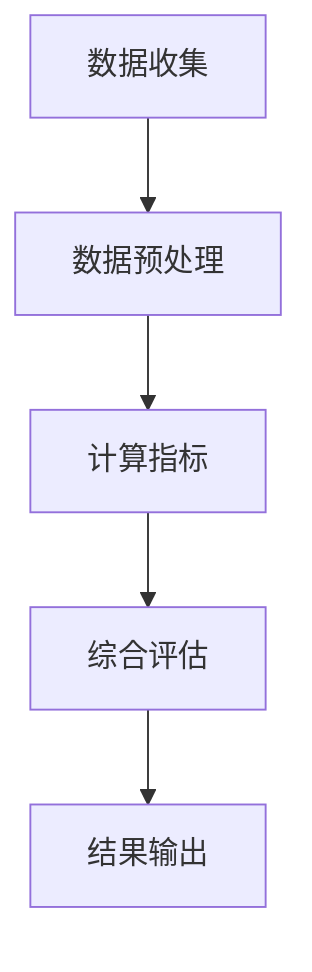
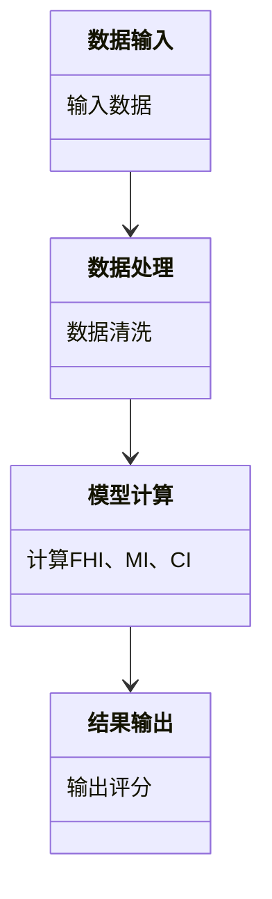
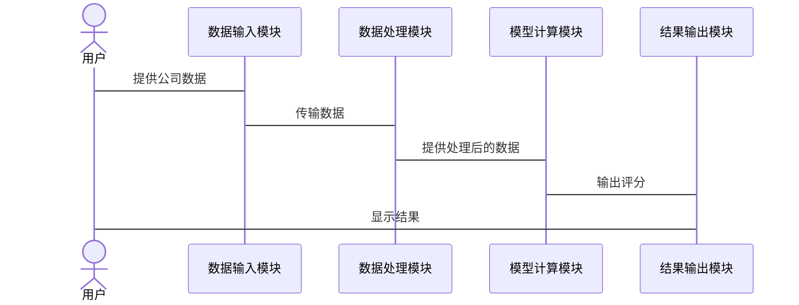

                 


# 费雪的行业领导者理论：独角兽公司的崛起与评估

## 关键词
- 费雪投资理论
- 独角兽公司
- 行业领导者
- 投资评估
- 数学模型

## 摘要
本文探讨了费雪的行业领导者理论在独角兽公司评估中的应用，通过分析核心概念、算法原理和系统架构，展示了如何利用这些理论识别和评估具有高增长潜力的企业。文章详细讲解了数学模型、系统设计和项目实战，为投资者提供了实用的工具和方法。

---

# 费雪的行业领导者理论：独角兽公司的崛起与评估

## 第一部分：背景介绍

### 第1章：费雪投资理论的起源与发展

#### 1.1 费雪投资理论的起源
费雪（Philip A. Fisher）是20世纪的投资大师，他的理论强调长期增长潜力。他认为，投资成功的关键在于选择优秀的公司，而非仅仅关注短期收益。费雪的理论在投资界具有重要地位，特别是在识别行业领导者方面。

#### 1.2 独角兽公司的定义
独角兽公司指的是估值超过10亿美元的初创企业。这些公司通常具有高增长潜力，创新能力强，市场地位突出。独角兽公司的崛起与费雪的行业领导者理论密切相关。

#### 1.3 费雪理论与传统投资理论的区别
传统投资理论关注短期波动和市场趋势，而费雪理论则侧重于长期增长和公司基本面。费雪认为，选择优秀的公司比关注市场时机更重要。

---

## 第二部分：核心概念

### 第2章：行业领导者的特征

#### 2.1 财务健康状况
行业领导者通常具有稳定的财务状况，包括高利润率、低负债率和健康的现金流。费雪提出的财务健康指数（FHI）用于评估公司的财务状况。

#### 2.2 市场地位
行业领导者在市场中具有强大的竞争力，往往占据主导地位。市场地位指数（MI）通过市场份额和品牌影响力来评估公司的市场地位。

#### 2.3 创新能力
创新能力是独角兽公司的重要特征。费雪认为，创新能力强的公司能够持续推出新产品，保持竞争优势。

---

### 第3章：独角兽公司的特征

#### 3.1 高增长潜力
独角兽公司通常具有高增长潜力，尤其是在技术驱动的行业。高增长指数（GHI）用于评估公司的增长潜力。

#### 3.2 创新能力强
独角兽公司往往依赖技术创新，具备强大的研发能力和创新能力。创新指数（CI）用于评估公司的创新能力。

#### 3.3 财务状况稳健
独角兽公司通常具有稳健的财务状况，能够支持高增长和扩张。稳健的财务状况是独角兽公司成功的关键因素之一。

---

## 第三部分：算法原理与数学模型

### 第4章：费雪行业领导者评估算法

#### 4.1 算法步骤
1. 数据收集：收集目标公司的财务数据、市场数据和创新数据。
2. 数据预处理：清洗数据，处理缺失值和异常值。
3. 计算指标：计算财务健康指数（FHI）、市场地位指数（MI）和创新指数（CI）。
4. 综合评估：根据权重计算综合评分，确定是否为行业领导者。

#### 4.2 算法流程图


---

### 第5章：数学模型与公式

#### 5.1 财务健康指数（FHI）
$$ FHI = \frac{ROE + ROI + ROA}{3} $$
其中，ROE为净资产收益率，ROI为投资回报率，ROA为资产净利率。

#### 5.2 市场地位指数（MI）
$$ MI = \frac{市场份额 + 品牌价值}{2} $$

#### 5.3 创新指数（CI）
$$ CI = \frac{研发支出 + 专利数量}{2} $$

---

## 第四部分：系统架构与设计

### 第6章：系统架构设计

#### 6.1 系统功能模块


#### 6.2 系统交互流程


---

## 第五部分：项目实战

### 第7章：项目实战

#### 7.1 环境安装
安装Python和必要的库：
```bash
pip install numpy pandas scikit-learn matplotlib
```

#### 7.2 核心代码实现

```python
import numpy as np
import pandas as pd

# 计算财务健康指数
def calculate_fhi(financial_data):
    roe = financial_data['ROE']
    roi = financial_data['ROI']
    roa = financial_data['ROA']
    return np.mean([roe, roi, roa])

# 计算市场地位指数
def calculate_mi(market_data):
    market_share = market_data['Market Share']
    brand_value = market_data['Brand Value']
    return np.mean([market_share, brand_value])

# 计算创新指数
def calculate_ci(innovation_data):
    r_d = innovation_data['R&D']
    patents = innovation_data['Patents']
    return np.mean([r_d, patents])

# 综合评分
def overall_score(fhi, mi, ci):
    return (fhi + mi + ci) / 3
```

#### 7.3 代码解读与分析
以上代码展示了如何计算FHI、MI和CI，并根据这些指标计算综合评分。每个函数接收相应的数据并返回计算结果。

---

## 第六部分：最佳实践与小结

### 第8章：最佳实践

#### 8.1 实践小结
费雪的行业领导者理论为识别独角兽公司提供了有效的工具。通过财务健康指数、市场地位指数和创新指数的综合评估，可以准确识别出具有高增长潜力的企业。

#### 8.2 注意事项
在实际应用中，需要注意数据的准确性和模型的适用性。同时，模型的结果需要结合市场环境和其他因素进行综合判断。

#### 8.3 未来展望
随着技术的发展，费雪的理论将与人工智能和大数据分析结合，进一步提升独角兽公司的识别和评估能力。

---

通过本文的详细讲解，读者可以全面理解费雪的行业领导者理论，并将其应用于独角兽公司的评估中，为投资决策提供有力支持。

