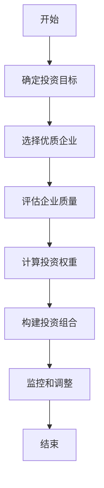
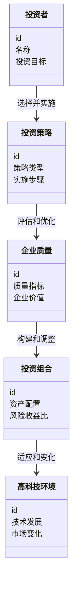
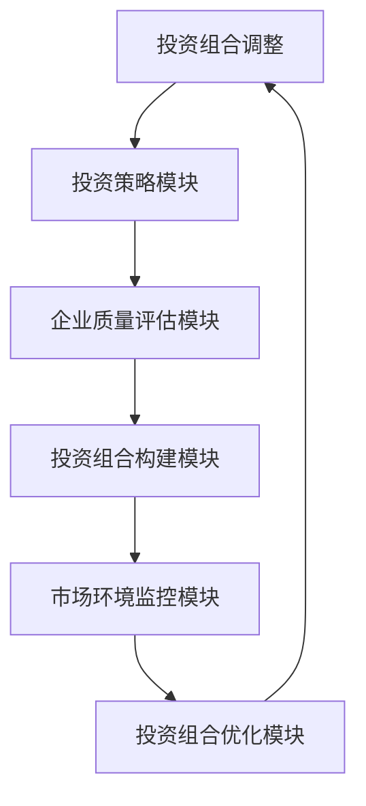
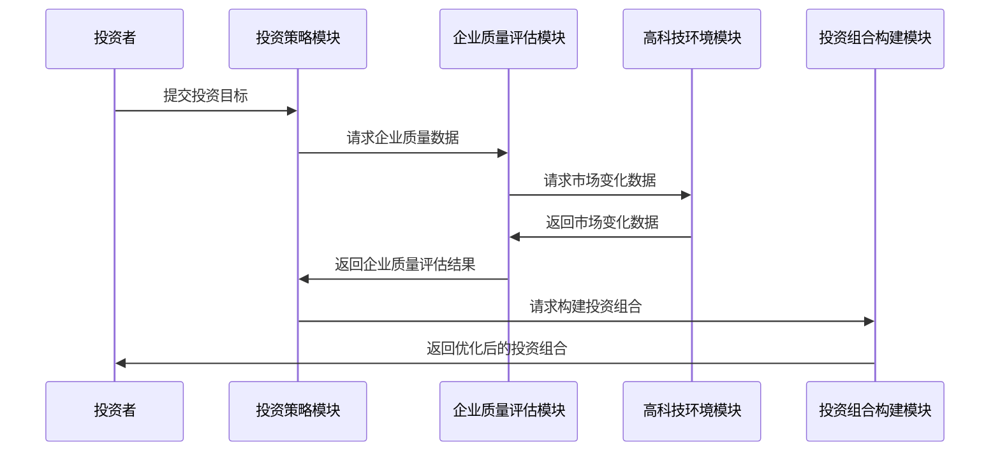

                 


# 费雪的质量增长策略：在高科技时代的重新诠释

## 关键词：
- 费雪投资理论
- 质量增长策略
- 高科技时代
- 投资策略
- 数学模型

## 摘要：
费雪的质量增长策略是一种通过注重企业质量来实现投资增长的方法。在高科技时代，随着科技的快速发展和市场的剧烈变化，传统的质量增长策略需要重新审视和优化。本文从背景介绍、核心概念、算法原理、系统架构到项目实战，全面分析了费雪策略在高科技环境下的应用，结合数学模型和实际案例，为投资者提供了新的视角和策略。

---

## 目录大纲

### 第一部分：费雪投资理论的背景与基础

#### 第1章：费雪投资理论概述

##### 1.1 费雪投资理论的核心概念
- 1.1.1 投资的基本原理
- 1.1.2 费雪投资理论的起源与发展
- 1.1.3 质量增长策略的基本框架

##### 1.2 投资策略的演变
- 1.2.1 传统投资策略的局限性
- 1.2.2 质量增长策略的兴起
- 1.2.3 高科技时代对投资策略的影响

##### 1.3 费雪策略的核心要素
- 1.3.1 质量的定义与衡量标准
- 1.3.2 增长的实现路径
- 1.3.3 费雪策略与现代金融理论的结合

---

### 第二部分：质量增长策略的核心概念与联系

#### 第2章：质量增长策略的深度解析

##### 2.1 核心概念的原理
- 2.1.1 质量增长策略的数学模型
- 2.1.2 投资组合优化的算法原理
- 2.1.3 费雪策略与现代投资组合理论的对比

##### 2.2 核心概念对比表
- 质量增长策略与传统增长策略的对比
- 费雪策略与价值投资策略的对比
- 费雪策略与成长股投资的对比

##### 2.3 ER实体关系图
```mermaid
er
  entity 投资者 {
    id: integer
    名称: string
    投资目标: string
  }

  entity 企业质量 {
    id: integer
    质量指标: string
    企业价值: integer
  }

  entity 投资策略 {
    id: integer
    策略类型: string
    实施步骤: string
  }

  entity 投资组合 {
    id: integer
    资产配置: string
    风险收益比: float
  }

  entity 高科技环境 {
    id: integer
    技术发展: string
    市场变化: string
  }

  投资者 --> 投资策略: 选择并实施
  投资策略 --> 企业质量: 评估和优化
  企业质量 --> 投资组合: 构建和调整
  投资组合 --> 高科技环境: 适应和变化
```

---

### 第三部分：算法原理与数学模型

#### 第3章：算法原理与数学模型

##### 3.1 质量增长策略的数学模型
- 费雪投资模型的公式：
  $$ P = \sum_{i=1}^{n} w_i \cdot Q_i $$
  其中，\( P \) 是投资组合的总价值，\( w_i \) 是第 \( i \) 个资产的权重，\( Q_i \) 是第 \( i \) 个资产的质量指标。

##### 3.2 投资组合优化的算法流程


##### 3.3 实际案例分析
- 使用CAPM模型评估高科技企业的投资价值：
  $$ E(r_i) = R_f + \beta_i (R_m - R_f) $$
  其中，\( E(r_i) \) 是预期回报率，\( R_f \) 是无风险利率，\( \beta_i \) 是贝塔系数，\( R_m \) 是市场预期回报率。

---

### 第四部分：系统分析与架构设计

#### 第4章：系统架构与实现

##### 4.1 问题场景介绍
- 高科技环境下的投资决策系统设计。

##### 4.2 系统功能设计


##### 4.3 系统架构设计


##### 4.4 接口设计与交互流程


---

### 第五部分：项目实战

#### 第5章：项目实战与案例分析

##### 5.1 环境安装与配置
- 安装Python和相关库（如NumPy、Pandas、Matplotlib、Scikit-learn）。

##### 5.2 核心代码实现
```python
import numpy as np
import pandas as pd
from sklearn.metrics import pairwise_distances

# 示例数据：企业质量指标
companies = pd.DataFrame({
    '企业名称': ['A', 'B', 'C'],
    '质量指标': [85, 70, 90],
    '企业价值': [100, 80, 120]
})

# 计算投资组合权重
def calculate_weights(quality, value):
    # 质量标准化
    normalized_quality = (quality - quality.min()) / (quality.max() - quality.min())
    # 综合评分
    scores = normalized_quality * (value / value.mean())
    # 返回权重（假设总和为1）
    return scores / scores.sum()

weights = companies['质量指标'].apply(calculate_weights(companies['质量指标'], companies['企业价值']))
print(weights)
```

##### 5.3 案例分析与解读
- 分析高科技企业（如科技公司）的质量指标和投资组合优化结果。

##### 5.4 项目小结
- 总结项目实现的关键点和实际应用中的注意事项。

---

### 第六部分：最佳实践与总结

#### 第6章：最佳实践与未来展望

##### 6.1 最佳实践
- 定期评估和调整投资组合。
- 结合市场变化及时优化质量指标。
- 使用大数据和AI技术辅助投资决策。

##### 6.2 小结
- 费雪的质量增长策略在高科技时代依然具有重要的指导意义。
- 通过数学模型和系统架构的设计，可以更好地实现投资目标。

##### 6.3 注意事项
- 风险管理是投资策略成功的关键。
- 数据质量和模型准确性直接影响投资结果。

##### 6.4 拓展阅读
- 推荐书籍：《投资最重要的简单真理》
- 推荐文章：《大数据在投资决策中的应用》

---

通过以上结构，文章详细阐述了费雪的质量增长策略在高科技环境下的应用，结合理论分析、算法实现和实际案例，为投资者提供了实用的指导和新的视角。

