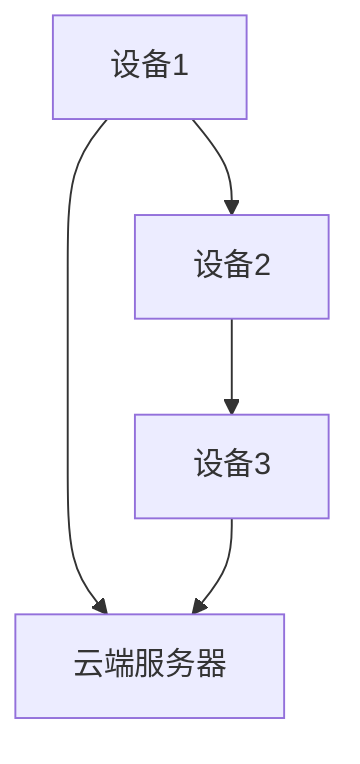
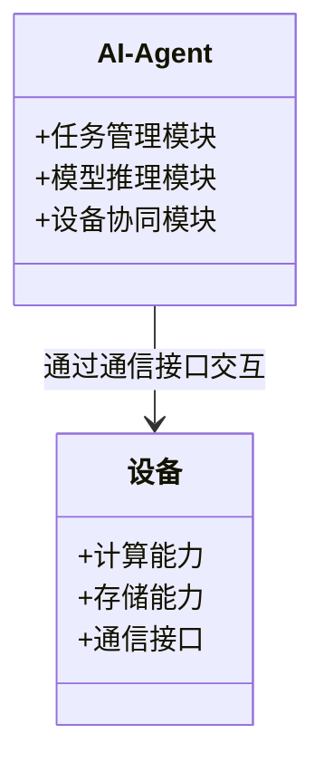
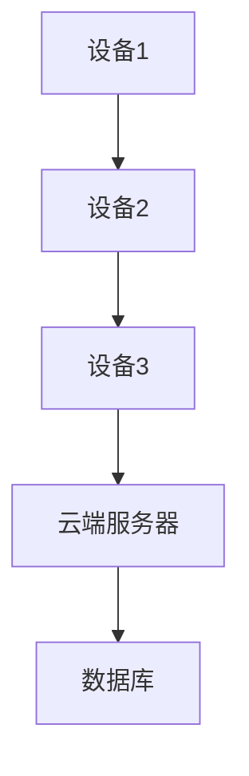

                 

# 跨平台AI Agent：LLM在多种终端设备上的部署

> 关键词：跨平台AI Agent，LLM，终端设备部署，多模态交互，分布式计算，系统架构设计

> 摘要：随着大语言模型（LLM）技术的快速发展，跨平台AI Agent的部署需求日益增长。本文从AI Agent的基本概念出发，详细探讨了LLM在多种终端设备上的部署方法。通过系统架构设计、算法原理分析、项目实战案例等多维度内容，深入剖析了跨平台AI Agent的核心技术与实现细节。文章最后结合实际应用场景，总结了跨平台AI Agent的未来发展方向与最佳实践。

---

## 第一部分: 跨平台AI Agent基础

### 第1章: 跨平台AI Agent概述

#### 1.1 AI Agent的基本概念

##### 1.1.1 什么是AI Agent
AI Agent（人工智能代理）是指能够感知环境、自主决策并执行任务的智能体。AI Agent可以是软件程序、机器人或其他智能设备，其核心目标是通过与环境交互来完成特定任务。

##### 1.1.2 AI Agent的核心特点
- **自主性**：AI Agent能够自主决策，无需外部干预。
- **反应性**：能够实时感知环境变化并做出响应。
- **目标导向**：基于目标驱动行为。
- **社交能力**：能够与其他AI Agent或人类进行交互协作。

##### 1.1.3 跨平台AI Agent的定义与特点
跨平台AI Agent是指能够在多种操作系统、硬件平台和终端设备上运行的AI Agent。其特点包括：
- **多平台兼容性**：支持Android、iOS、Windows、Linux等多种操作系统。
- **多设备适应性**：适用于手机、平板、PC、服务器等多种终端设备。
- **分布式协作**：能够与其他设备或系统协同工作。

#### 1.2 跨平台部署的背景与挑战

##### 1.2.1 跨平台部署的背景
随着AI技术的普及，用户对AI服务的需求日益多样化。跨平台AI Agent能够满足不同设备用户的需求，推动AI技术的广泛应用。

##### 1.2.2 跨平台部署的主要挑战
- **技术复杂性**：不同平台和设备的硬件性能、软件架构差异大。
- **兼容性问题**：模型在不同平台上可能需要重新优化和调整。
- **资源限制**：部分终端设备（如手机）的计算资源有限，对模型轻量化提出更高要求。

##### 1.2.3 跨平台部署的意义与价值
跨平台AI Agent能够提升用户体验，降低开发成本，推动AI技术的普惠化。通过一次开发、多端部署的方式，开发者能够高效地将AI服务推向市场。

#### 1.3 LLM的基本原理

##### 1.3.1 大语言模型的定义
大语言模型（LLM, Large Language Model）是指基于深度学习技术构建的大型神经网络模型，能够处理自然语言文本。

##### 1.3.2 LLM的核心技术
- **神经网络结构**：常用的模型架构包括Transformer、BERT等。
- **预训练与微调**：通过大量数据预训练模型，并在特定任务上进行微调。
- **多模态能力**：支持文本、图像、语音等多种数据类型。

##### 1.3.3 LLM的应用场景
- **自然语言处理**：文本生成、机器翻译、问答系统等。
- **多模态交互**：结合图像、语音等多种模态信息进行交互。

#### 1.4 跨平台部署的目标与范围

##### 1.4.1 跨平台部署的目标
通过统一的框架和接口，实现在多种终端设备上的快速部署和运行。

##### 1.4.2 跨平台部署的范围
涵盖从移动设备到云端服务器的全场景部署。

##### 1.4.3 跨平台部署的边界与外延
- **边界**：专注于LLM的部署，不涉及模型训练和数据预处理。
- **外延**：扩展至分布式计算、多模态交互等领域。

---

### 第2章: 跨平台AI Agent的核心概念与联系

#### 2.1 跨平台AI Agent的核心概念

##### 2.1.1 跨平台AI Agent的组成要素
- **感知层**：负责环境感知和数据采集。
- **决策层**：基于感知数据进行决策。
- **执行层**：执行决策并输出结果。
- **通信层**：实现设备间的通信与协作。

##### 2.1.2 跨平台AI Agent的功能模块
- **任务管理模块**：负责任务的分配与调度。
- **模型推理模块**：运行LLM模型进行推理。
- **设备协同模块**：实现设备间的协同工作。

##### 2.1.3 跨平台AI Agent的交互流程
1. 感知环境并采集数据。
2. 通过模型推理生成响应。
3. 通过通信层与其他设备或系统交互。
4. 执行决策并输出结果。

#### 2.2 跨平台AI Agent的核心原理

##### 2.2.1 跨平台AI Agent的工作原理
跨平台AI Agent通过统一的接口和协议，实现在不同平台上的运行。模型推理部分在本地设备或云端服务器上执行，结果通过通信层返回给用户。

##### 2.2.2 跨平台AI Agent的通信机制
- **本地通信**：设备内部组件间的通信。
- **跨设备通信**：设备间的通信（如通过蓝牙、Wi-Fi、互联网）。

##### 2.2.3 跨平台AI Agent的协作机制
- **任务分配**：根据设备能力和当前负载动态分配任务。
- **结果共享**：设备间共享推理结果和状态信息。

#### 2.3 跨平台AI Agent的概念结构与核心要素

##### 2.3.1 跨平台AI Agent的概念结构

##### 2.3.2 跨平台AI Agent的核心要素
- **设备能力**：设备的计算能力、存储能力。
- **通信协议**：设备间通信的协议和接口。
- **模型部署**：LLM模型在不同设备上的部署方式。

---

### 第3章: 跨平台AI Agent的系统架构设计

#### 3.1 跨平台AI Agent的系统架构概述

##### 3.1.1 系统架构设计的原则
- **模块化设计**：各模块相对独立，便于维护和扩展。
- **可扩展性**：支持新设备和新功能的接入。
- **高效性**：确保系统在不同设备上的运行效率。

##### 3.1.2 系统架构设计的步骤
1. 确定系统目标和需求。
2. 分析系统功能模块。
3. 设计模块间的交互关系。
4. 选择合适的开发框架和工具。

##### 3.1.3 系统架构设计的注意事项
- **设备异构性**：考虑不同设备的硬件性能差异。
- **网络条件**：考虑网络延迟和带宽限制。

#### 3.2 跨平台AI Agent的系统架构实现

##### 3.2.1 系统架构的实现方法
- **选择开发框架**：如React、Vue等前端框架，以及TensorFlow Lite、TNN等模型推理框架。
- **设备适配**：针对不同设备进行代码优化和性能调优。
- **通信协议设计**：制定设备间通信的协议和数据格式。

##### 3.2.2 系统架构的实现步骤
1. 环境搭建：安装开发工具和依赖库。
2. 模型部署：将LLM模型部署到目标设备上。
3. 系统集成：将各模块集成到统一系统中。
4. 测试优化：进行功能测试和性能优化。

##### 3.2.3 系统架构的实现案例
- **环境搭建**：安装Python、TensorFlow、PyTorch等工具。
- **模型部署**：将BERT模型部署到手机和平板上。
- **系统集成**：通过WebSocket实现设备间的实时通信。

#### 3.3 跨平台AI Agent的系统架构设计

##### 3.3.1 系统功能设计

##### 3.3.2 系统架构设计

##### 3.3.3 系统接口设计
- **设备接口**：定义设备间的通信接口和协议。
- **云端接口**：定义与云端服务器的交互接口。

---

## 第四部分: 总结与展望

### 第X章: 总结与展望

#### X.1 跨平台AI Agent的核心内容回顾
跨平台AI Agent通过统一的框架和接口，实现在多种终端设备上的部署和运行。本文详细探讨了系统架构设计、算法原理和项目实战等内容。

#### X.2 跨平台AI Agent的未来发展方向
- **模型优化**：进一步优化LLM模型的性能和效率。
- **多模态交互**：支持更多模态的数据输入和输出。
- **分布式计算**：提升设备间的协作能力和计算效率。

#### X.3 跨平台AI Agent的最佳实践
- **选择合适的开发框架**：根据需求选择合适的开发工具和框架。
- **注重设备适配**：针对不同设备进行优化和调整。
- **确保通信稳定**：设计可靠的通信机制，保证设备间的高效协作。

---

通过以上内容，我们可以看到，跨平台AI Agent的部署涉及多方面的技术和挑战。从系统架构设计到算法优化，每一个环节都需要仔细考虑和实施。未来，随着技术的不断进步，跨平台AI Agent将更加智能化、高效化，为用户带来更好的体验。

