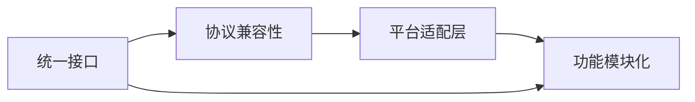
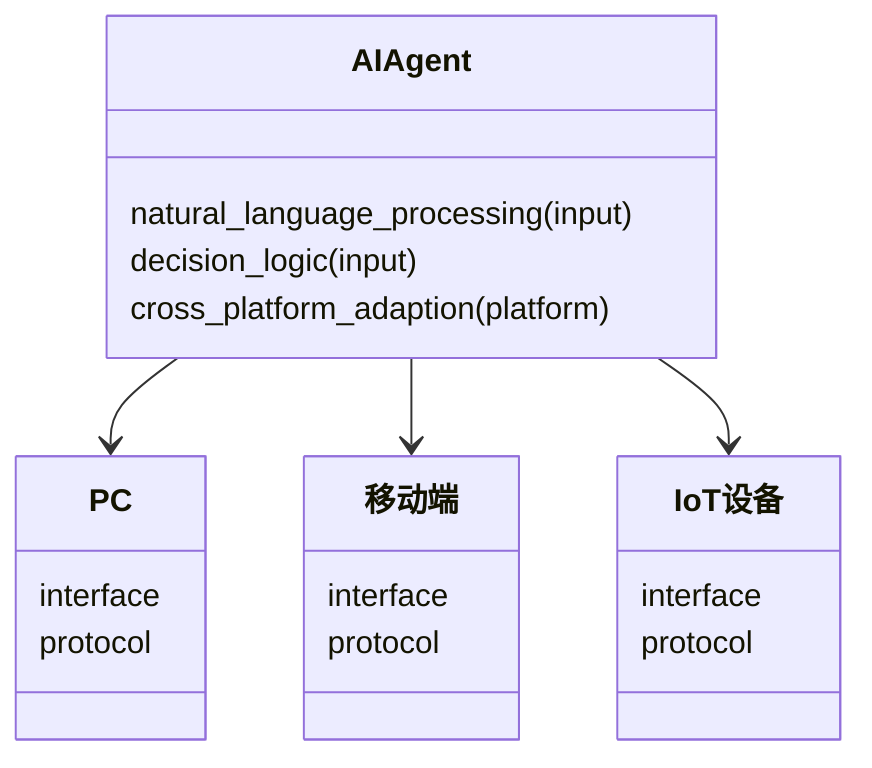
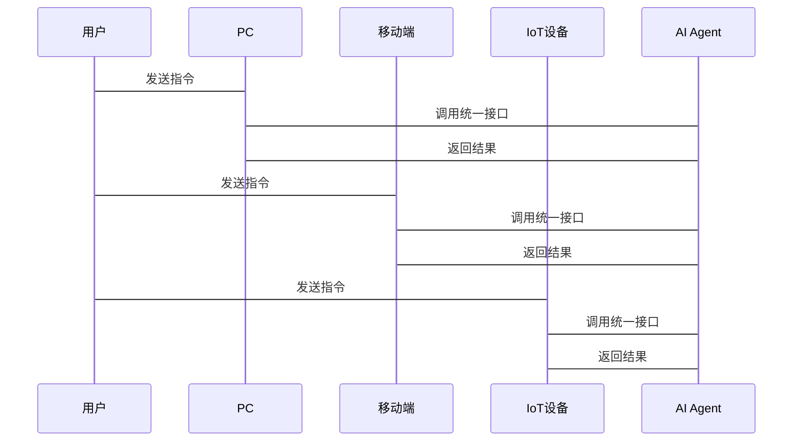

                 


# 跨平台AI Agent：PC、移动端和IoT设备的统一体验

---

## 关键词：
跨平台AI Agent，统一接口，协议兼容，自然语言处理，决策逻辑，IoT设备

---

## 摘要：
本文详细探讨了如何在PC、移动端和IoT设备上实现AI Agent的统一体验。通过分析跨平台AI Agent的核心概念、算法原理、系统架构和项目实战，本文为技术开发者提供了从理论到实践的全面指导。我们通过自然语言处理、决策逻辑和跨平台适配算法，结合统一接口和协议的设计，展示了如何在多平台上实现AI Agent的无缝交互与协作。本文还提供了详细的系统架构设计和实际案例分析，帮助读者理解如何在实际项目中实现跨平台AI Agent的统一体验。

---

# 第一部分：背景介绍

## 第1章：问题背景

### 1.1 当前AI Agent的发展现状
AI Agent（人工智能代理）作为人工智能领域的重要组成部分，近年来得到了快速发展。随着技术的进步，AI Agent已经广泛应用于智能助手、智能客服、智能家居等领域。然而，当前的AI Agent大多局限于单一平台，无法实现跨平台的统一交互和协作。

### 1.2 跨平台AI Agent的必要性
随着智能设备的多样化，用户希望能够在不同的设备上无缝使用AI Agent。例如，用户希望在PC上通过语音助手设置智能家居设备，或者在移动端上通过AI Agent控制IoT设备。然而，不同平台之间的接口和协议差异较大，导致AI Agent难以实现跨平台的统一体验。

### 1.3 跨平台统一体验的核心问题
- **平台差异性**：不同平台的操作系统、API和交互方式存在差异，导致AI Agent在不同平台上需要进行大量的适配工作。
- **统一接口设计**：如何设计统一的接口和协议，使得AI Agent能够在不同平台上无缝交互，是实现跨平台统一体验的关键。
- **性能优化**：跨平台AI Agent需要在不同平台上实现高性能运行，这对算法和系统架构提出了更高的要求。

## 第2章：问题描述

### 2.1 AI Agent在不同平台上的差异
- **PC平台**：PC平台上的AI Agent通常依赖于桌面应用程序或浏览器插件，交互方式主要为文本输入或鼠标点击。
- **移动端**：移动端上的AI Agent主要通过移动应用实现，支持语音交互和触摸操作。
- **IoT设备**：IoT设备上的AI Agent通常通过嵌入式系统实现，支持传感器数据采集和远程控制。

### 2.2 跨平台统一体验的目标
- **统一交互方式**：用户在不同平台上使用AI Agent时，能够以统一的方式进行交互，例如通过自然语言处理实现一致的对话体验。
- **统一功能集**：AI Agent在不同平台上提供相同的功能集，例如智能助手、信息查询、设备控制等。
- **统一性能表现**：AI Agent在不同平台上实现一致的响应速度和准确性。

### 2.3 跨平台实现中的挑战
- **平台适配复杂性**：不同平台的操作系统、API和硬件性能差异较大，导致AI Agent的实现需要进行大量的平台适配工作。
- **资源限制**：IoT设备通常资源有限，AI Agent的实现需要在性能和资源消耗之间进行平衡。
- **安全性与隐私性**：跨平台AI Agent需要处理不同平台上的数据传输和存储，如何确保数据的安全性和隐私性是一个重要挑战。

## 第3章：问题解决

### 3.1 跨平台AI Agent的设计思路
- **统一接口设计**：设计一个统一的接口和协议，使得AI Agent能够在不同平台上无缝交互。
- **平台适配策略**：针对不同平台的特点，制定相应的适配策略，例如针对IoT设备进行轻量级设计。
- **功能模块化**：将AI Agent的功能模块化设计，使得不同平台可以根据自身需求选择性地使用功能模块。

### 3.2 统一接口与协议的设计原则
- **兼容性**：设计的接口和协议需要能够兼容不同平台的API和通信协议。
- **可扩展性**：接口和协议设计需要具有可扩展性，以便未来新增功能或平台。
- **安全性**：接口和协议设计需要考虑数据的安全性和隐私性，确保跨平台交互的安全性。

### 3.3 平台适配策略的制定
- **平台特性分析**：分析不同平台的特性，例如操作系统的API、硬件性能、用户交互方式等。
- **适配层设计**：设计一个适配层，使得AI Agent的核心逻辑可以在不同平台上运行。
- **性能优化**：针对不同平台的特点，进行性能优化，例如在IoT设备上进行轻量级设计。

## 第4章：边界与外延

### 4.1 跨平台AI Agent的边界
- **功能边界**：AI Agent的功能集中在智能助手、信息查询和设备控制等领域，不涉及其他功能。
- **平台边界**：AI Agent的设计和实现仅针对PC、移动端和IoT设备，不考虑其他类型的设备。
- **数据边界**：AI Agent的数据处理仅限于用户交互数据和设备控制数据，不涉及其他类型的数据。

### 4.2 相关领域的区别与联系
- **自然语言处理**：自然语言处理是AI Agent实现对话交互的核心技术，需要与跨平台设计结合。
- **分布式系统**：跨平台AI Agent的设计涉及到分布式系统的架构设计和通信协议。
- **物联网技术**：IoT设备的接入和控制是跨平台AI Agent的重要组成部分，需要结合物联网技术进行设计。

### 4.3 与其他技术的整合
- **云服务**：AI Agent的核心逻辑可以部署在云端，通过API接口与不同平台进行交互。
- **边缘计算**：针对IoT设备，可以通过边缘计算技术实现本地化的AI Agent功能。
- **区块链**：通过区块链技术实现跨平台数据的安全传输和存储。

## 第5章：概念结构与核心要素组成

### 5.1 跨平台AI Agent的核心要素
- **统一接口**：实现不同平台之间的交互与协作的核心接口。
- **协议兼容性**：支持不同平台的通信协议和API。
- **平台适配层**：针对不同平台进行适配的逻辑层。
- **功能模块化**：将AI Agent的功能模块化设计，便于不同平台的选择性使用。

### 5.2 各要素之间的关系
- **统一接口与协议兼容性**：统一接口是实现跨平台交互的基础，协议兼容性是确保不同平台能够顺利通信的关键。
- **平台适配层与功能模块化**：平台适配层负责将AI Agent的核心功能适配到不同平台上，功能模块化设计使得不同平台可以根据自身需求选择性地使用功能模块。

### 5.3 概念结构的可视化


---

# 第二部分：核心概念与联系

## 第6章：核心概念原理

### 6.1 AI Agent的基本原理
AI Agent通过自然语言处理技术实现与用户的对话交互，通过决策逻辑算法实现智能助手的功能。AI Agent的核心逻辑可以部署在云端，通过统一接口与不同平台进行交互。

### 6.2 跨平台统一的关键技术
- **统一接口设计**：设计一个统一的接口和协议，使得AI Agent能够在不同平台上无缝交互。
- **协议兼容性**：支持不同平台的通信协议和API，确保AI Agent可以在不同平台上运行。
- **平台适配层**：针对不同平台的特点，设计适配层，使得AI Agent的核心逻辑可以在不同平台上运行。

### 6.3 统一接口与协议的设计原则
- **兼容性**：设计的接口和协议需要能够兼容不同平台的API和通信协议。
- **可扩展性**：接口和协议设计需要具有可扩展性，以便未来新增功能或平台。
- **安全性**：接口和协议设计需要考虑数据的安全性和隐私性，确保跨平台交互的安全性。

---

## 第7章：概念属性特征对比表格

| 概念       | 属性           | 特征                           |
|------------|----------------|--------------------------------|
| AI Agent   | 平台适配性     | 支持多平台                     |
| 统一接口    | 可扩展性       | 支持多种协议                   |
| 协议兼容性  | 灵活性         | 根据平台调整                   |

---

## 第8章：ER实体关系图

```mermaid
erd
  entity 跨平台AI Agent {
    id
    platform
    interface
    protocol
  }
  entity PC {
    id
    interface
    protocol
  }
  entity 移动端 {
    id
    interface
    protocol
  }
  entity IoT设备 {
    id
    interface
    protocol
  }
  PC -|> 跨平台AI Agent
  移动端 -|> 跨平台AI Agent
  IoT设备 -|> 跨平台AI Agent
```

---

# 第三部分：算法原理讲解

## 第9章：算法原理

### 9.1 自然语言处理算法
自然语言处理是AI Agent实现对话交互的核心技术。通过自然语言处理算法，AI Agent可以理解用户的意图，并生成相应的回复。

### 9.2 决策逻辑算法
决策逻辑算法是AI Agent实现智能助手功能的核心算法。通过决策逻辑算法，AI Agent可以根据用户的需求，调用相应的功能模块。

### 9.3 跨平台适配算法
跨平台适配算法是实现AI Agent在不同平台上运行的关键算法。通过跨平台适配算法，AI Agent可以适配不同平台的API和通信协议。

---

## 第10章：算法实现

### 10.1 Python源代码实现

```python
def natural_language_processing(input):
    # 自然语言处理实现
    pass

def decision_logic(input):
    # 决策逻辑实现
    pass

def cross_platform_adaption(platform):
    # 跨平台适配实现
    pass
```

---

## 第11章：数学模型与公式推导

### 11.1 自然语言处理模型
自然语言处理模型通常基于概率论和统计学方法，例如贝叶斯分类和马尔可夫链。

### 11.2 决策逻辑模型
决策逻辑模型通常基于逻辑推理和强化学习，例如Q-learning算法。

### 11.3 跨平台适配模型
跨平台适配模型通常基于协议兼容性和平台特性分析，例如动态适配算法。

---

## 第12章：系统分析与架构设计

### 12.1 系统功能设计



---

## 第13章：系统架构设计


---

## 第14章：系统接口设计

### 14.1 统一接口设计
统一接口设计包括API接口和通信协议的设计，确保AI Agent可以在不同平台上无缝交互。

### 14.2 接口交互流程



---

## 第15章：项目实战

### 15.1 环境安装
需要安装Python、AI框架（例如TensorFlow）、API开发工具（例如Flask）等。

### 15.2 核心代码实现

```python
def natural_language_processing(input):
    # 自然语言处理实现
    pass

def decision_logic(input):
    # 决策逻辑实现
    pass

def cross_platform_adaption(platform):
    # 跨平台适配实现
    pass
```

### 15.3 案例分析
通过实际案例分析，展示如何在PC、移动端和IoT设备上实现AI Agent的统一体验。

---

## 第16章：小结与注意事项

### 16.1 最佳实践
- **统一接口设计**：设计一个统一的接口和协议，使得AI Agent可以在不同平台上无缝交互。
- **平台适配策略**：针对不同平台的特点，制定相应的适配策略。
- **性能优化**：在IoT设备上进行轻量级设计，确保性能和资源消耗的平衡。

### 16.2 小结
本文详细探讨了如何在PC、移动端和IoT设备上实现AI Agent的统一体验，通过统一接口、协议兼容性和平台适配层的设计，解决了跨平台实现中的关键问题。

### 16.3 注意事项
- **安全性**：在跨平台交互中，需要确保数据的安全性和隐私性。
- **性能优化**：在IoT设备上进行轻量级设计，确保性能和资源消耗的平衡。
- **可扩展性**：设计接口和协议时，需要考虑未来的扩展性。

---

## 第17章：参考文献与拓展阅读

### 17.1 参考文献
1. 自然语言处理相关文献
2. 强化学习相关文献
3. 分布式系统相关文献

### 17.2 拓展阅读
- 推荐阅读相关领域的书籍和论文，例如《自然语言处理实战》、《强化学习入门》等。

---

通过以上思考和逐步分析，我们可以得出结论：实现跨平台AI Agent的统一体验，需要从统一接口、协议兼容性、平台适配层等多个方面进行设计和实现。通过本文的详细指导，读者可以全面理解并掌握跨平台AI Agent的设计与实现方法。

