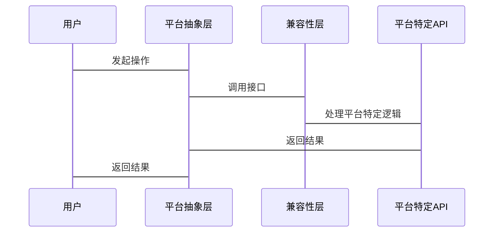

                 


# 跨平台兼容性

> 关键词：跨平台兼容性, 跨平台开发框架, 跨平台测试, 跨平台架构设计, 跨平台实现, 跨平台优化

> 摘要：本文深入探讨了跨平台兼容性的各个方面，包括背景、核心概念、实现原理、测试方法、系统架构设计、项目实战和最佳实践。通过分析跨平台兼容性的定义、实现方式、关键技术、测试策略、系统架构以及实际案例，本文为开发者提供了全面的指导，帮助他们更好地理解和实现跨平台兼容性。

---

# 第一部分: 跨平台兼容性概述

## 第1章: 跨平台兼容性背景与现状

### 1.1 跨平台兼容性的定义与背景

#### 1.1.1 跨平台兼容性的定义

跨平台兼容性（Cross-Platform Compatibility）指的是软件或应用程序能够在不同操作系统、硬件架构、设备类型或环境中正常运行并提供一致用户体验的能力。简单来说，跨平台兼容性意味着应用程序可以在多种平台上运行，而无需进行大规模的代码修改或重新设计。

#### 1.1.2 跨平台兼容性的背景

在当今的数字世界中，用户使用的设备种类繁多，包括智能手机、平板电脑、笔记本电脑、台式机、服务器等，且这些设备运行的操作系统各不相同，如Windows、macOS、Linux、iOS、Android等。此外，随着Web技术的发展，浏览器也成为了一个重要的平台。开发者希望用一套代码或一种技术栈来满足多种平台的需求，从而节省时间和资源。然而，不同平台之间的差异（如API、功能、性能等）给开发者带来了巨大的挑战。因此，跨平台兼容性成为一个重要的技术课题。

#### 1.1.3 跨平台兼容性的目标

跨平台兼容性的目标是确保应用程序在不同平台上的功能、性能和用户体验尽可能一致。这意味着开发者需要解决不同平台之间的差异，并找到一种通用的方式来处理这些差异。

---

### 1.2 跨平台兼容性的现状分析

#### 1.2.1 跨平台技术的发展历程

跨平台技术的发展可以追溯到20世纪90年代，当时互联网的兴起推动了跨平台技术的需求。随着Web技术的发展，前端技术如HTML、CSS和JavaScript已经成为跨平台的通用语言。近年来，随着移动应用的普及，跨平台技术再次成为热门话题，各种跨平台开发框架如雨后春笋般涌现。

#### 1.2.2 当前主流的跨平台技术

目前，主流的跨平台技术主要包括：

1. **Web技术**：HTML、CSS和JavaScript是跨平台的通用语言，可以在所有现代浏览器中运行。
2. **跨平台开发框架**：如React Native、Flutter、 Xamarin等，这些框架允许开发者使用一种代码库来开发多平台应用程序。
3. **跨平台编译技术**：如LLVM（Low-Level Virtual Machine）和C/C++编译器，允许代码在多种平台上运行。
4. **虚拟机技术**：如Java虚拟机（JVM）和.NET虚拟机，允许在不同平台上运行相同的字节码。

#### 1.2.3 跨平台兼容性的挑战

尽管跨平台技术取得了显著进展，但实现真正的跨平台兼容性仍然面临许多挑战：

1. **平台差异**：不同平台的API、功能和性能差异可能导致应用程序在不同平台上表现不一致。
2. **用户体验**：用户对不同平台的期望和习惯不同，如何在不同平台上保持一致的用户体验是一个挑战。
3. **性能问题**：跨平台技术可能会引入额外的开销，影响应用程序的性能。
4. **安全问题**：不同平台的安全机制不同，跨平台应用程序可能面临更多的安全风险。

---

### 1.3 跨平台兼容性的目标与意义

#### 1.3.1 跨平台兼容性的目标

跨平台兼容性的目标是通过技术手段消除不同平台之间的差异，使得应用程序可以在多种平台上无缝运行，并为用户提供一致的体验。

#### 1.3.2 跨平台兼容性对企业的影响

跨平台兼容性可以帮助企业降低开发和维护成本，快速响应市场需求，提高产品的市场占有率。通过跨平台技术，企业可以将资源集中在核心业务逻辑的开发上，而无需为每个平台单独开发。

#### 1.3.3 跨平台兼容性对开发者的价值

对于开发者来说，跨平台兼容性意味着可以用一套代码或技术栈开发多个平台的应用，节省时间和资源。此外，跨平台技术还可以提高开发者的技能，使其能够应对更多复杂的技术挑战。

---

## 第2章: 跨平台兼容性的核心概念与技术基础

### 2.1 跨平台兼容性的核心概念

#### 2.1.1 平台差异分析

平台差异是跨平台兼容性面临的最大挑战之一。不同平台之间的差异包括：

1. **API差异**：不同平台提供的API不同，例如Windows和macOS的API差异较大。
2. **功能差异**：某些平台可能不支持某些功能，例如某些设备可能不支持摄像头或GPS。
3. **性能差异**：不同平台的性能不同，例如服务器和移动设备的性能差异显著。

#### 2.1.2 跨平台技术的分类

跨平台技术可以分为以下几类：

1. **基于Web的技术**：如HTML、CSS和JavaScript，适用于Web应用程序。
2. **跨平台开发框架**：如React Native、Flutter，适用于移动应用开发。
3. **跨平台编译技术**：如LLVM，适用于C/C++开发。
4. **虚拟机技术**：如JVM和.NET，适用于跨平台运行字节码。

#### 2.1.3 跨平台兼容性的实现机制

跨平台兼容性的实现机制主要包括：

1. **平台抽象层**：通过抽象层隐藏平台差异，提供统一的API。
2. **兼容性层**：通过适配器或中间件处理不同平台的差异。
3. **动态适配**：根据运行时环境动态调整应用程序的行为。

---

### 2.2 跨平台兼容性的技术基础

#### 2.2.1 跨平台开发框架简介

跨平台开发框架是实现跨平台兼容性的关键工具。以下是一些主流的跨平台开发框架：

1. **React Native**：基于JavaScript和React，主要用于移动应用开发。
2. **Flutter**：Google的跨平台开发框架，基于Dart语言。
3. **Xamarin**：基于C#，适用于多种平台，包括iOS、Android和Windows。
4. **WebGL**：用于在Web浏览器中渲染3D图形。

#### 2.2.2 跨平台技术的核心原理

跨平台技术的核心原理是通过抽象层或编译技术，将代码转换为适合不同平台的格式。例如，React Native通过JavaScript和React组件实现跨平台，而Flutter通过Dart语言和定制的编译器实现跨平台。

#### 2.2.3 跨平台兼容性的实现方式

跨平台兼容性的实现方式包括：

1. **使用跨平台框架**：如React Native、Flutter等。
2. **基于Web技术**：如HTML、CSS和JavaScript。
3. **跨平台编译技术**：如LLVM和C/C++编译器。

---

### 2.3 跨平台兼容性的关键技术

#### 2.3.1 平台抽象层的设计

平台抽象层（Platform Abstraction Layer，PAL）是跨平台兼容性的重要组成部分。PAL的作用是隐藏不同平台之间的差异，为应用程序提供统一的API。例如，React Native通过PAL隐藏了iOS和Android的API差异，使得开发者只需编写一次代码即可运行在多个平台上。

#### 2.3.2 跨平台兼容性层的实现

跨平台兼容性层（Cross-Platform Compatibility Layer）是另一个关键部分。它负责处理不同平台之间的差异，例如设备功能、API调用等。兼容性层可以通过适配器或中间件实现，例如在移动应用中处理摄像头或传感器的差异。

#### 2.3.3 跨平台兼容性的优化策略

为了提高跨平台兼容性的性能和用户体验，可以采用以下优化策略：

1. **代码优化**：通过代码分析和优化工具减少平台差异带来的性能损失。
2. **缓存机制**：利用缓存技术减少重复计算和资源消耗。
3. **动态加载**：根据运行时环境动态加载必要的资源和功能。

---

## 第3章: 跨平台兼容性的实现原理

### 3.1 跨平台兼容性的实现机制

#### 3.1.1 跨平台开发框架的运行原理

以React Native为例，React Native通过JavaScript和React组件实现跨平台。代码在运行时被编译为字节码，并在JavaScript引擎中执行。React Native还通过原生组件与平台API交互，从而实现跨平台兼容性。

#### 3.1.2 跨平台兼容性的代码结构

跨平台兼容性的代码结构通常包括以下部分：

1. **公共代码**：适用于所有平台的代码，如业务逻辑和UI组件。
2. **平台特定代码**：针对特定平台的代码，如iOS和Android的API调用。
3. **兼容性层**：处理不同平台之间的差异，如设备功能和API适配。

#### 3.1.3 跨平台兼容性的资源管理

跨平台兼容性的资源管理需要考虑不同平台的资源需求，例如：

1. **图像资源**：不同平台可能需要不同分辨率的图像。
2. **字体资源**：不同平台可能支持不同的字体格式。
3. **配置文件**：不同平台可能需要不同的配置参数。

---

### 3.2 跨平台兼容性的代码实现

#### 3.2.1 跨平台代码的编写规范

跨平台代码的编写规范包括：

1. **模块化开发**：将代码分成模块，每个模块负责特定的功能。
2. **避免平台特定代码**：尽可能减少平台特定的代码，以提高代码的复用性。
3. **统一的API调用**：通过平台抽象层统一API调用方式。

#### 3.2.2 跨平台兼容性的API调用

跨平台兼容性的API调用需要通过平台抽象层进行。例如，在React Native中，开发者通过React组件调用平台特定的API，而React Native框架负责将这些API调用转换为具体的平台API。

#### 3.2.3 跨平台兼容性的调试与优化

跨平台兼容性的调试与优化可以通过以下步骤实现：

1. **日志输出**：在不同平台上输出日志，分析代码的执行情况。
2. **性能分析**：使用性能分析工具，找出代码中的瓶颈。
3. **用户体验测试**：在不同平台上进行用户体验测试，确保一致的体验。

---

### 3.3 跨平台兼容性的数学模型与公式

#### 3.3.1 跨平台兼容性的计算模型

跨平台兼容性的计算模型可以通过以下公式表示：

$$
C = \sum_{i=1}^{n} \frac{1}{1 + e^{-d_i}}
$$

其中，$C$ 表示跨平台兼容性，$d_i$ 表示第$i$个平台的兼容性得分，$n$ 表示平台总数。

#### 3.3.2 跨平台兼容性的数学公式

跨平台兼容性的数学公式可以通过以下步骤进行计算：

1. **确定每个平台的兼容性得分**：$d_i$ 表示第$i$个平台的兼容性得分，范围为0到1。
2. **计算兼容性总和**：$\sum_{i=1}^{n} \frac{1}{1 + e^{-d_i}}$
3. **计算最终兼容性**：$C = \sum_{i=1}^{n} \frac{1}{1 + e^{-d_i}}$

#### 3.3.3 跨平台兼容性的算法实现

以下是一个简单的跨平台兼容性算法的实现：

```python
import math

def calculate_compatibility(d_scores):
    total = 0.0
    for d in d_scores:
        total += 1 / (1 + math.exp(-d))
    return total

# 示例
d_scores = [0.8, 0.6, 0.9]
compatibility = calculate_compatibility(d_scores)
print(compatibility)
```

---

## 第4章: 跨平台兼容性的测试与验证

### 4.1 跨平台兼容性的测试方法

#### 4.1.1 跨平台兼容性测试的定义

跨平台兼容性测试是指在不同平台上测试应用程序的功能、性能和用户体验是否一致。测试的目标是发现并修复跨平台兼容性问题，确保应用程序在所有目标平台上正常运行。

#### 4.1.2 跨平台兼容性测试的步骤

跨平台兼容性测试的步骤包括：

1. **需求分析**：明确测试的目标和范围。
2. **测试环境搭建**：准备不同平台的测试环境，例如iOS、Android、Windows等。
3. **测试用例设计**：设计覆盖不同平台的测试用例。
4. **执行测试**：在不同平台上执行测试用例，记录测试结果。
5. **分析结果**：分析测试结果，发现并修复问题。
6. **持续测试**：在开发过程中持续进行跨平台兼容性测试，确保每次代码提交都能通过所有平台的测试。

#### 4.1.3 跨平台兼容性测试的工具

跨平台兼容性测试的工具包括：

1. **Selenium**：用于Web应用程序的自动化测试。
2. **Appium**：用于移动应用的自动化测试。
3. **Robot Framework**：通用的自动化测试框架。
4. **JMeter**：用于性能测试。

---

### 4.2 跨平台兼容性的测试框架

#### 4.2.1 跨平台测试框架的设计

跨平台测试框架的设计需要考虑以下因素：

1. **平台支持**：框架需要支持所有目标平台。
2. **自动化测试**：框架需要支持自动化测试，减少手动测试的工作量。
3. **测试用例管理**：框架需要能够管理大量的测试用例，并支持测试用例的复用。

#### 4.2.2 跨平台测试框架的实现

以下是一个简单的跨平台测试框架的实现：

```python
import unittest
from selenium import webdriver

class CrossPlatformTestCase(unittest.TestCase):
    def setUp(self):
        self.driver = webdriver.Remote(desired_capabilities={
            "platformName": "android",
            "platformVersion": "11.0",
            "deviceName": " emulator-5554",
            "appPackage": "com.example.app",
            "appActivity": "com.example.MainActivity"
        })

    def test_cross_platform(self):
        self.driver.get("https://www.example.com")
        self.assertEqual("Example", self.driver.title)

    def tearDown(self):
        self.driver.quit()

if __name__ == "__main__":
    unittest.main()
```

---

### 4.3 跨平台兼容性的测试与验证

#### 4.3.1 跨平台测试的自动化实现

跨平台测试的自动化实现可以通过以下步骤完成：

1. **选择合适的测试工具**：根据目标平台选择合适的测试工具，例如Selenium、Appium等。
2. **设计测试用例**：设计覆盖不同平台的测试用例，并确保测试用例的可重复性和独立性。
3. **实现自动化测试脚本**：使用测试工具编写自动化测试脚本，并确保脚本能够在不同平台上执行。
4. **执行测试**：在不同的平台上执行自动化测试脚本，记录测试结果。
5. **分析结果**：分析测试结果，发现并修复问题。

#### 4.3.2 跨平台测试的注意事项

跨平台测试的注意事项包括：

1. **测试环境一致性**：确保测试环境的一致性，避免因环境差异导致测试失败。
2. **测试用例覆盖性**：确保测试用例覆盖所有目标平台和功能。
3. **测试结果分析**：分析测试结果，找出跨平台兼容性问题的根本原因，并采取措施进行修复。

---

## 第5章: 跨平台兼容性的系统分析与架构设计方案

### 5.1 跨平台兼容性的系统分析

#### 5.1.1 跨平台系统分析的目标

跨平台系统分析的目标是通过分析系统的功能需求、性能需求和用户体验需求，确定系统在不同平台上的实现方式。

#### 5.1.2 跨平台系统的功能需求

跨平台系统的功能需求包括：

1. **跨平台支持**：支持多种平台，包括iOS、Android、Windows等。
2. **一致的用户体验**：在不同平台上提供一致的用户体验。
3. **高效的性能**：确保在不同平台上的性能一致且高效。

#### 5.1.3 跨平台系统的性能需求

跨平台系统的性能需求包括：

1. **响应时间**：确保应用程序在不同平台上的响应时间一致且满足用户需求。
2. **资源利用率**：确保应用程序在不同平台上的资源利用率合理。
3. **扩展性**：确保系统能够支持未来的平台扩展。

---

### 5.2 跨平台兼容性的架构设计

#### 5.2.1 跨平台架构的设计目标

跨平台架构的设计目标是通过合理的架构设计，实现跨平台兼容性，并确保系统的可扩展性和可维护性。

#### 5.2.2 跨平台架构的设计原则

跨平台架构的设计原则包括：

1. **模块化设计**：将系统划分为多个模块，每个模块负责特定的功能。
2. **平台抽象层**：通过平台抽象层隐藏不同平台之间的差异，提供统一的API。
3. **兼容性层**：通过兼容性层处理不同平台之间的差异，确保系统在不同平台上的兼容性。
4. **动态适配**：根据运行时环境动态调整系统的行为，以适应不同平台的需求。

#### 5.2.3 跨平台架构的实体关系图

以下是跨平台架构的实体关系图：

```mermaid
entity 跨平台系统 {
    has 跨平台框架
    has 平台抽象层
    has 兼容性层
}

entity 跨平台框架 {
    has 公共代码
    has 平台特定代码
    has 资源管理
}

entity 平台抽象层 {
    has 统一的API
    has 资源管理
}

entity 兼容性层 {
    has 设备功能适配
    has API适配
    has 用户体验适配
}
```

---

### 5.3 跨平台兼容性的接口设计

#### 5.3.1 跨平台系统的接口设计

跨平台系统的接口设计需要考虑以下因素：

1. **统一的API接口**：通过平台抽象层提供统一的API接口，隐藏不同平台之间的差异。
2. **动态适配接口**：根据运行时环境动态调整接口的实现方式，以适应不同平台的需求。
3. **高效的接口通信**：确保接口通信高效，减少延迟和资源消耗。

#### 5.3.2 跨平台接口的交互设计

跨平台接口的交互设计可以通过以下步骤实现：

1. **定义接口规范**：定义接口的输入、输出和调用方式。
2. **实现接口适配器**：为每个平台实现接口适配器，处理平台特定的差异。
3. **测试接口交互**：在不同平台上测试接口交互，确保接口通信正常。

---

### 5.4 跨平台兼容性的系统交互设计

#### 5.4.1 跨平台系统的交互流程

跨平台系统的交互流程包括：

1. **用户输入**：用户在某个平台上进行操作。
2. **接口调用**：用户操作触发接口调用。
3. **平台抽象层处理**：平台抽象层将接口调用转换为具体的平台API。
4. **兼容性层处理**：兼容性层处理平台特定的差异，确保系统在不同平台上的兼容性。
5. **结果返回**：处理结果返回给用户。

#### 5.4.2 跨平台系统的交互序列图

以下是跨平台系统的交互序列图：



---

## 第6章: 跨平台兼容性的项目实战

### 6.1 跨平台项目的环境搭建

#### 6.1.1 开发环境的选择

跨平台项目的开发环境需要根据选择的跨平台开发框架来确定。例如，使用React Native需要安装Node.js、Yarn、React Native CLI和相应的IDE。

#### 6.1.2 开发工具的安装

跨平台项目的开发工具包括：

1. **Node.js**：用于运行和管理React Native项目。
2. **Yarn**：用于代码依赖管理。
3. **Android Studio**：用于Android开发。
4. **Xcode**：用于iOS开发。
5. **Visual Studio**：用于Xamarin开发。

#### 6.1.3 项目初始化与配置

跨平台项目的初始化与配置可以通过以下步骤完成：

1. **安装开发框架**：根据选择的跨平台开发框架安装必要的工具和库。
2. **创建项目**：使用框架提供的命令创建新项目。
3. **配置开发环境**：配置开发环境，确保所有工具和库正常运行。

---

### 6.2 跨平台项目的代码实现

#### 6.2.1 跨平台项目的核心代码

以下是一个简单的跨平台项目的核心代码示例：

```python
# 跨平台项目的核心代码
import platform

def get_platform_info():
    return f"Current platform: {platform.system()}"

print(get_platform_info())
```

#### 6.2.2 跨平台项目的代码解读

上述代码示例的功能是获取当前平台的信息。`platform.system()`函数返回当前操作系统的名称。通过这个示例，我们可以看到跨平台代码的基本结构和实现方式。

---

### 6.3 跨平台项目的测试与优化

#### 6.3.1 跨平台项目的测试

跨平台项目的测试可以通过以下步骤完成：

1. **环境搭建**：确保测试环境包含所有目标平台。
2. **测试用例设计**：设计覆盖所有目标平台的测试用例。
3. **执行测试**：在不同平台上执行测试用例，记录测试结果。
4. **分析结果**：分析测试结果，发现并修复问题。
5. **持续测试**：在开发过程中持续进行测试，确保每次代码提交都能通过所有平台的测试。

#### 6.3.2 跨平台项目的优化

跨平台项目的优化可以通过以下步骤实现：

1. **代码优化**：通过代码分析工具优化代码性能。
2. **资源管理优化**：优化资源管理，减少资源消耗。
3. **平台特定优化**：针对不同平台进行特定优化，提高性能和用户体验。

---

## 第7章: 跨平台兼容性的最佳实践与小结

### 7.1 跨平台兼容性的最佳实践

#### 7.1.1 跨平台开发框架的选择

选择合适的跨平台开发框架是实现跨平台兼容性的关键。开发者需要根据项目需求、团队技能和目标平台选择合适的框架。

#### 7.1.2 跨平台兼容性的实现

跨平台兼容性的实现需要通过平台抽象层和兼容性层来处理不同平台之间的差异，确保系统在所有目标平台上的兼容性和一致性。

#### 7.1.3 跨平台兼容性的测试

跨平台兼容性的测试需要在所有目标平台上进行，确保系统在不同平台上的功能、性能和用户体验一致。自动化测试是跨平台兼容性测试的重要手段，可以显著提高测试效率。

---

### 7.2 跨平台兼容性的开发与测试注意事项

#### 7.2.1 跨平台开发的注意事项

跨平台开发的注意事项包括：

1. **平台差异处理**：通过平台抽象层和兼容性层处理不同平台之间的差异。
2. **代码复用**：尽可能复用代码，减少平台特定代码的编写。
3. **性能优化**：通过代码优化和资源管理优化提高系统性能。

#### 7.2.2 跨平台测试的注意事项

跨平台测试的注意事项包括：

1. **测试环境一致性**：确保测试环境的一致性，避免因环境差异导致测试失败。
2. **测试用例覆盖性**：确保测试用例覆盖所有目标平台和功能。
3. **测试结果分析**：分析测试结果，找出跨平台兼容性问题的根本原因，并采取措施进行修复。

---

### 7.3 跨平台兼容性的总结与展望

#### 7.3.1 跨平台兼容性的总结

跨平台兼容性是实现多平台应用的重要技术，通过平台抽象层和兼容性层的实现，可以在不同平台上提供一致的功能、性能和用户体验。跨平台兼容性的实现需要选择合适的开发框架，通过合理的架构设计和代码实现，确保系统的跨平台兼容性和可扩展性。

#### 7.3.2 跨平台兼容性的未来展望

随着技术的发展，跨平台兼容性将变得更加重要。未来，跨平台兼容性将朝着更加智能化和自动化的方向发展，通过AI和机器学习技术实现更高效的跨平台兼容性测试和优化。同时，跨平台开发框架也将不断进化，提供更加丰富和强大的功能，帮助开发者更好地实现跨平台兼容性。

---

### 7.4 跨平台兼容性的拓展阅读

#### 7.4.1 跨平台开发框架

1. React Native
2. Flutter
3. Xamarin
4. WebAssembly

#### 7.4.2 跨平台兼容性测试工具

1. Selenium
2. Appium
3. Robot Framework
4. JMeter

#### 7.4.3 跨平台系统架构设计

1. 微服务架构
2. 单体架构
3. 分布式架构
4. 混合架构

---

通过以上章节的内容，我们可以全面了解跨平台兼容性的各个方面，包括背景、核心概念、实现原理、测试方法、系统架构设计、项目实战和最佳实践。希望本文能够为开发者在实现跨平台兼容性时提供有价值的参考和指导。

