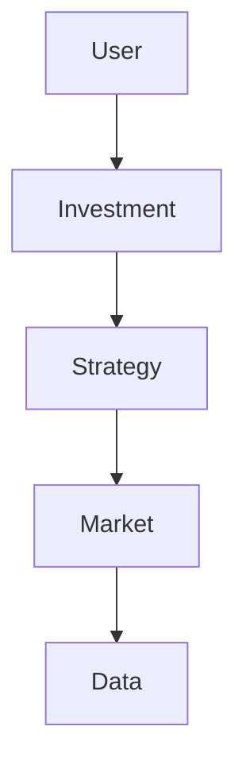
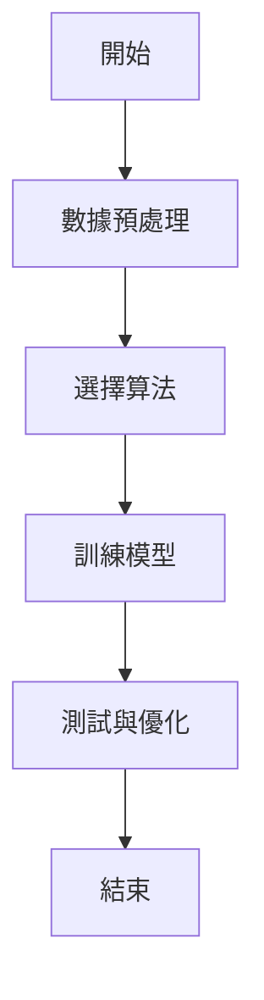
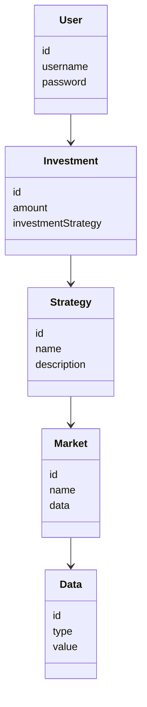
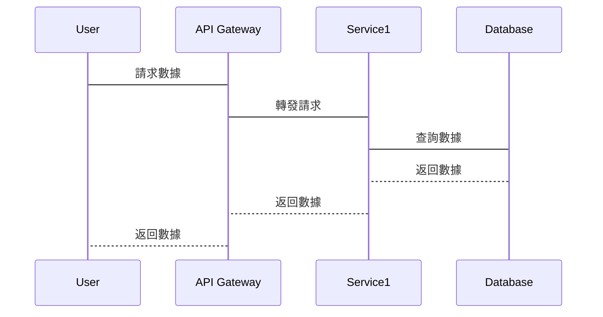

                 


# 跨平台投資理財智能助手的開發技巧

**关键词**：跨平台开发、投资理财、人工智能、智能助手、系统架构设计

**摘要**：  
本文详细介绍跨平台投资理财智能助手的开发技巧，涵盖从需求分析到系统架构设计的各个方面。通过背景介绍、核心概念解析、算法原理探讨、系统架构设计、项目实战以及最佳实践，帮助读者全面掌握跨平台投资理财助手的开发方法。文章结合实际案例，深入分析技术细节，提供实用的开发建议。

---

## 目录大纲

### 第一部分：背景介紹

#### 第1章：背景介紹

##### 1.1 投資理財的現狀與挑戰
- 1.1.1 現今投資理財的多樣化需求
- 1.1.2 現有理財工具的不足
- 1.1.3 跨平台理財助手的必要性

##### 1.2 跨平台開發的背景
- 1.2.1 跨平台開發的定義與優勢
- 1.2.2 跨平台技術的發展歷程
- 1.2.3 跨平台在投資理財領域的應用

##### 1.3 智能助手的技術支撐
- 1.3.1 人工智能在理財中的應用
- 1.3.2 大數據分析的作用
- 1.3.3 自然語言處理的應用

##### 1.4 本章小結
- 1.4.1 投資理財助手的核心價值
- 1.4.2 跨平台開發的關鍵技術
- 1.4.3 人工智能在其中的橋樑作用

---

### 第二部分：核心概念與聯絡

#### 第2章：核心概念與聯絡

##### 2.1 核心概念的定義與結構
- 2.1.1 跨平台投資理財助手的定義
- 2.1.2 核心要素的組成
- 2.1.3 系統的邊界與外延

##### 2.2 核心概念的原理與特性
- 2.2.1 人工智能算法的選擇
- 2.2.2 大數據處理的技術路線
- 2.2.3 自然語言處理的實現方式

##### 2.3 核心概念的ER實體關係圖


---

### 第三部分：算法原理與實現

#### 第3章：算法原理與實現

##### 3.1 算法原理介紹
- 3.1.1 算法選擇的依據
- 3.1.2 算法的基本原理
- 3.1.3 算法的優勢與局限

##### 3.2 算法實現的流程圖


##### 3.3 算法的數學模型與公式
- 3.3.1 算法的數學模型
  $$ y = f(x) $$
- 3.3.2 具體公式與解釋
  $$ f(x) = \sum_{i=1}^{n} w_i x_i $$

##### 3.4 算法的實現與測試
- 3.4.1 確定數據來源
- 3.4.2 編寫算法代碼
- 3.4.3 測試與優化

---

### 第四部分：系統分析與架構設計

#### 第4章：系統分析與架構設計

##### 4.1 系統分析
- 4.1.1 问题場景介紹
- 4.1.2 項目介紹
- 4.1.3 系統功能設計（領域模型Mermaid類圖）


##### 4.2 系統架構設計
- 4.2.1 系統架構設計（Mermaid架構圖）


##### 4.3 系統接口設計
- 4.3.1 接口定義
- 4.3.2 接口調用方式

##### 4.4 系統交互設計（Mermaid序列圖）


---

### 第五部分：項目實戰

#### 第5章：項目實戰

##### 5.1 環境安裝
- 5.1.1 開發環境配置
- 5.1.2 庫存入 설치

##### 5.2 系統核心實現
- 5.2.1 關鍵代碼實現
```python
def investment_strategy(data):
    # 算法實現
    return result
```

##### 5.3 代碼應用解讀與分析
- 5.3.1 代碼結構解讀
- 5.3.2 代碼功能分析

##### 5.4 實際案例分析
- 5.4.1 案例介紹
- 5.4.2 案例實現與分析
- 5.4.3 結果討論

##### 5.5 本章小結
- 5.5.1 項目實戰的經驗總結
- 5.5.2 項目中常見問題及解決方案

---

### 第六部分：最佳實踐與總結

#### 第6章：最佳實踐與總結

##### 6.1 最佳實踐
- 6.1.1 開發中的注意事項
- 6.1.2 常見問題與解決方案
- 6.1.3 開發效率的提升技巧

##### 6.2 項目總結
- 6.2.1 項目的成果與影響
- 6.2.2 項目中的困難與挑戰
- 6.2.3 項目經驗的總結與啟示

##### 6.3 未來發展方向
- 6.3.1 技術的未來發展
- 6.3.2 項目的可擴展性
- 6.3.3 項目在行業中的潛力

---

### 附錄

#### 附錄A：常用工具與庫介紹
- 人工智能算法庫
- 大數據處理工具
- 自然語言處理庫

#### 附錄B：進一步閱讀的推薦
- 技術類書籍
- 在線課程與資源
- 技術博客與論文

#### 附錄C：/license
- 言論自由的授權聲明

---

**以上為《跨平台投資理財智能助手的開發技巧》的完整目錄大綱，結構清晰，層次分明，涵蓋了從理論到實踐的方方面面，旨在幫助開發者全面掌握跨平台投資理財智能助手的開發技巧與實踐方法。**

