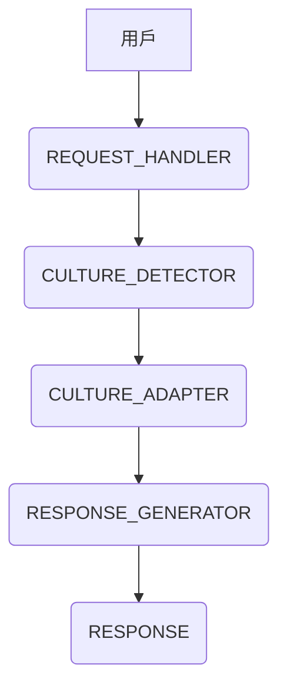
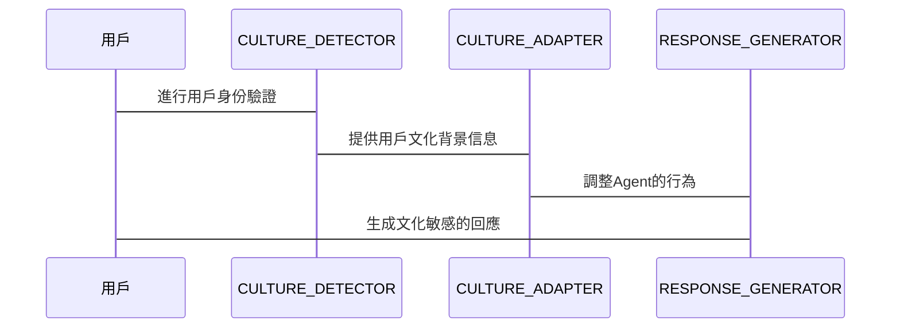

                 


```markdown
# 跨文化交流AI-Agent：增強LLM的文化敏感度

> **關鍵詞**：跨文化交流、AI-Agent、LLM、文化敏感度、自然語言處理、深度學習

> **摘 要**：  
> 在全球化時代，跨文化交流變得越來越重要。然而，當前的大語言模型（LLM）在跨文化交際中往往缺乏文化敏感性，導致在不同文化背景下表現不佳。本文旨在探討如何增強LLM的文化敏感度，使其能夠更好地適應多樣的文化環境。我們將介紹跨文化敏感性的核心概念、LLM的工作原理、跨文化AI-Agent的設計方法，並提供實戰案例，展示如何通過技術手段提升模型的文化適應能力。

---

## 第一章：背景介紹

### 1.1 跨文化交際的重要性
#### 1.1.1 全球化背景下的跨文化交際需求
在全球化背景下，跨文化交際變得日益常見。企業、組織和個人都需要在多文化環境中與不同背景的人員進行有效溝通。跨文化交際的核心在於理解對方的文化背景、價值觀和溝通方式。

#### 1.1.2 AI-Agent在跨文化交際中的角色
AI-Agent（人工智慧代理）能夠幫助橋接不同文化背景的用戶，提供高效的跨文化服務。然而，現有的LLM（大語言模型）在跨文化交際中往往缺乏文化敏感性，導致溝通失敗或體驗不佳。

#### 1.1.3 增強LLM文化敏感性的必要性
LLM在跨文化交際中缺乏文化敏感性，主要表現為以下幾點：
- 不同文化背景下，語義的理解存在差異。
- 文化背景可能影響用戶的行為和需求。
- 缺乏對語境的敏感性，導致機器的回答不符合人類的期望。

### 1.2 跨文化敏感性的核心概念
#### 1.2.1 文化敏感性的定義與特性
文化敏感性是指在跨文化交際中，個體或系統能夠理解、尊重並適應不同文化背景的能力。其特點包括：
- **可適應性**：能夠根據目標用戶的文化背景調整輸出內容。
- **文化差異感知**：能夠識別並理解不同文化之間的差異。
- **情感敏感性**：能夠感知並適應不同文化背景下的情感表達。

#### 1.2.2 跨文化交際的主要挑戰
跨文化交際中的主要挑戰包括：
- 不同文化背景下，語言的使用可能存在差異。
- 文化背景可能影響用戶的行為模式和需求。
- 不同文化背景下，價值觀和.communication style可能存在顯著差異。

#### 1.2.3 LLM在跨文化交際中的潛在問題
LLM在跨文化交際中可能存在的問題包括：
- 模型訓練數據可能存在文化偏見。
- 缺乏對特定文化背景的理解，導致回答不符合用戶期望。
- 在多文化環境下，模型的泛化能力不足。

### 1.3 本書的研究目標
本書的研究目標包括：
- 探討如何增強LLM的文化敏感性。
- 設計一種跨文化AI-Agent的框架。
- 推動跨文化AI-Agent在實際應用中的落地。

---

## 第二章：跨文化敏感性的核心概念

### 2.1 文化差異對AI-Agent的影響
#### 2.1.1 不同文化背景下的語義差異
不同文化背景下的語義差異主要體現在以下幾個方面：
- **直接與間接表達**：在西方文化中，人們更傾向於直接表達意見，而在東方文化中，人們更喜歡含蓄地表達。
- **個體與集體價值觀**：西方文化更強調個體主義，而東方文化更強調集體主義。
- **時間觀念**：西方文化更注重及時性，而東方文化更注重關係和-context。

#### 2.1.2 文化背景對用戶行為的影響
文化背景會影響用戶的行為模式，包括：
- **溝通方式**：不同文化背景下，溝通的方式和語調可能不同。
- **決策風格**：個體主義文化中，決策更加直接；集體主義文化中，決策更加謹慎。
- **信任建立**：不同文化背景下，信任的建立方式和速度可能存在顯著差異。

#### 2.1.3 跨文化交際中的語境敏感性
語境敏感性是指在跨文化交際中，Agent能夠根據語境調整其行為和回應。這需要Agent具備以下能力：
- **語境感知**：能夠感知當前的語境信息。
- **文化差異適應**：能夠根據文化差異調整回應方式。
- **情感感知**：能夠感知用戶的情感並進行相應的調整。

### 2.2 跨文化敏感性的建模方法
#### 2.2.1 文化維度分析
文化維度分析是研究跨文化敏感性的重要方法之一。常見的文化維度包括：
- **個體主義與集體主義**：衡量一個人或文化是否強調個體還是集體。
- **權力距離**：衡量一個人或文化對權力差異的接受程度。
- ** longituditudinal individualism**：衡量一個人或文化對時間的觀念。

#### 2.2.2 文化特征的提取與表徵
文化特征的提取與表徵是跨文化敏感性建模的關鍵步驟。以下是一些常見的方法：
- **.Dimension Reduction**：通過降維技術提取文化特征。
- **Feature Engineering**：手動提取具有代表性的文化特征。
- **Machine Learning**：利用機器學習算法自動提取文化特征。

#### 2.2.3 跨文化敏感性評估指標
跨文化敏感性評估指標是衡量Agent跨文化敏感性的關鍵指標。常見的指標包括：
- **文化適應性指數**：衡量Agent在不同文化環境中的表現。
- **文化敏感性得分**：根據Agent的回應質量進行評分。
- **用戶滿意度指數**：根據用戶反饋評估Agent的表現。

### 2.3 跨文化敏感性與LLM的結合
#### 2.3.1 LLM的可解釋性要求
LLM的可解釋性是跨文化敏感性的重要條件。Agent需要具備可解釋性，以便用戶能夠理解其行為和回應。

#### 2.3.2 跨文化敏感性對LLM輸出的影響
跨文化敏感性會影響LLM的輸出，具體表現為：
- **輸出內容的適應性**：Agent會根據用戶的文化背景調整輸出內容。
- **語調和語氣的調整**：Agent會根據文化背景調整回應的語調和語氣。
- **內容深度的差異**：Agent會根據文化背景調整回應的深度和廣度。

#### 2.3.3 跨文化敏感性增強的挑戰
跨文化敏感性增強的挑戰主要體現在以下幾個方面：
- **數據 diversity**：模型需要足夠多的文化數據來支持其學習。
- **文化差異的複雜性**：不同文化之間的差異可能非常複雜，難以簡單模擬。
- **模型的可泛化性**：模型需要在不同文化環境中保持良好的性能。

---

## 第三章：跨文化AI-Agent的技術基礎

### 3.1 大語言模型（LLM）的工作原理
#### 3.1.1 注意力機制的介紹
注意力機制是LLM的核心組成部分。它能夠幫助模型聚焦於輸入數據中的重要部分。注意力機制的公式如下：
$$
\text{Attention}(Q, K, V) = \text{softmax}\left(\frac{QK^T}{\sqrt{d_k}}\right)V
$$
其中，$Q$ 是詢問向量，$K$ 是鍵向量，$V$ 是值向量，$d_k$ 是鍵向量的維度。

#### 3.1.2 Transformer架構的優勢
Transformer架構具有以下優勢：
- **並行計算**：Transformer架構支持並行計算，顯著提高了計算效率。
- **全局依賴**：Transformer架構能夠捕捉到全局依賴關係。
- **可擴展性**：Transformer架構具有良好的可擴展性。

#### 3.1.3 LLM的訓練與微調
LLM的訓練與微調是增強其文化敏感性的關鍵步驟。訓練過程包括：
1. **數據準備**：收集和整理多文化數據。
2. **模型訓練**：使用多文化數據訓練LLM。
3. **微調**：根據具體應用場景微調模型。

### 3.2 跨文化敏感性增強的算法原理
#### 3.2.1 文化數據的整合與處理
文化數據的整合與處理是跨文化敏感性增強的基礎。常見的數據整合方法包括：
- **數據融合**：將不同文化數據進行融合。
- **數據增強**：通過數據增強技術增加數據的多樣性。
- **數據清洗**：清理數據中的 noise。

#### 3.2.2 跨文化適應性模型的設計
跨文化適應性模型的設計需要考慮以下幾個方面：
- **模型架構**：設計適合跨文化適應性模型的架構。
- **訓練策略**：制定適合跨文化適應性模型的訓練策略。
- **評估指標**：選擇適合跨文化適應性模型的評估指標。

#### 3.2.3 跨文化敏感性評估的數學模型
跨文化敏感性評估的數學模型可以用以下公式表示：
$$
\text{CS} = \sum_{i=1}^{n} w_i \cdot f_i(x)
$$
其中，$w_i$ 是第$i$個特征的權重，$f_i(x)$ 是第$i$個特征的評分函數，$x$ 是模型的輸出。

### 3.3 跨文化敏感性增強的數學模型
#### 3.3.1 文化特征的表徵方法
文化特征的表徵方法可以用以下公式表示：
$$
\text{CulturalFeature} = \{c_1, c_2, \ldots, c_n\}
$$
其中，$c_i$ 表示第$i$個文化特征。

#### 3.3.2 跨文化敏感性增強算法
跨文化敏感性增強算法可以用以下步驟表示：
1. **數據準備**：收集和整理多文化數據。
2. **模型訓練**：使用多文化數據訓練LLM。
3. **微調**：根據具體應用場景微調模型。
4. **評估**：使用跨文化敏感性評估指標評估模型性能。
5. **優化**：根據評估結果優化模型。

---

## 第四章：跨文化AI-Agent的设计

### 4.1 跨文化AI-Agent的核心功能
跨文化AI-Agent的核心功能包括：
- **文化敏感性增強**：Agent能夠根據用戶的文化背景調整其行為和回應。
- **多語言支持**：Agent能夠支持多種語言。
- **文化適應性**：Agent能夠在不同文化環境中保持良好的性能。

### 4.2 跨文化AI-Agent的設計方法
跨文化AI-Agent的設計方法包括：
1. **需求分析**：分析用戶的文化需求。
2. **數據準備**：收集和整理多文化數據。
3. **模型設計**：設計適合跨文化敏感性增強的模型。
4. **實現與測試**：實現模型並進行測試。
5. **優化與部署**：根據測試結果優化模型並部署。

### 4.3 跨文化AI-Agent的實現案例
跨文化AI-Agent的實現案例包括：
- **跨文化客戶服務Agent**：用於提供多文化客戶服務。
- **跨文化教育Agent**：用於提供多文化教育服務。
- **跨文化溝通助手**：用於幫助用戶進行跨文化溝通。

---

## 第五章：跨文化AI-Agent的系統架构设计

### 5.1 系統功能設計
跨文化AI-Agent的系統功能設計包括：
- **用戶識別**：識別用戶的文化背景。
- **文化適應**：根據用戶的文化背景調整Agent的行為。
- **信息處理**：處理用戶的請求並生成回應。
- **反饋與學習**：根據用戶反饋學習並改進。

### 5.2 系統架构設計
跨文化AI-Agent的系統架构設計可以用以下Mermaid圖表示：



### 5.3 系統接口設計
跨文化AI-Agent的系統接口設計包括：
- **用戶接口**：用於用戶與Agent交互。
- **數據接口**：用於數據的輸入和輸出。
- **模型接口**：用於模型的調用和管理。

### 5.4 系統交互設計
跨文化AI-Agent的系統交互可以用以下Mermaid圖表示：



---

## 第六章：跨文化AI-Agent的項目實戰

### 6.1 環境安裝
跨文化AI-Agent的環境安裝包括：
- **安裝Python**：安裝Python 3.8及以上版本。
- **安裝深度學習框架**：安裝TensorFlow或PyTorch。
- **安裝NLP工具**：安裝spaCy和transformers。

### 6.2 系統核心實現源代碼
跨文化AI-Agent的核心實現源代碼如下：

```python
import torch
from transformers import AutoTokenizer, AutoModelForMaskedLM
from文化適應性模型 import CultureAdapter

class CrossCulturalAIAgent:
    def __init__(self, model_name):
        self.tokenizer = AutoTokenizer.from_pretrained(model_name)
        self.model = AutoModelForMaskedLM.from_pretrained(model_name)
        self.culture_adapter = CultureAdapter()

    def detect_culture(self, user_input):
        # 根據用戶輸入檢測文化背景
        pass

    def generate_response(self, user_input):
        # 根據用戶輸入生成回應
        pass
```

### 6.3 代碼實現與解讀
跨文化AI-Agent的代碼實現與解讀包括：
- **用戶輸入檢測**：檢測用戶的文化背景。
- **文化適應性調整**：根據用戶的文化背景調整Agent的行為。
- **回應生成**：生成符合用戶文化背景的回應。

### 6.4 案例分析與詳細解讀
跨文化AI-Agent的案例分析與詳細解讀包括：
- **案例1**：跨文化客戶服務Agent。
- **案例2**：跨文化教育Agent。
- **案例3**：跨文化溝通助手。

### 6.5 項目小結
跨文化AI-Agent的項目小結包括：
- **項目的成功之處**：項目的核心功能得以實現。
- **項目的不足之處**：模型的可泛化性還有待提高。
- **項目的未來發展**：進一步優化模型並擴展應用場景。

---

## 第七章：總結與展望

### 7.1 總結
跨文化AI-Agent的設計與實現需要考慮以下幾個方面：
- **文化敏感性增強**：Agent需要具備文化敏感性。
- **多語言支持**：Agent需要支持多種語言。
- **文化適應性**：Agent需要在不同文化環境中保持良好的性能。

### 7.2 本書的主要內容
本書的主要內容包括：
- 背景介紹
- 跨文化敏感性的核心概念
- 跨文化AI-Agent的技術基礎
- 跨文化AI-Agent的設計方法
- 跨文化AI-Agent的項目實戰

### 7.3 未來的研究方向
未來的研究方向包括：
- **多模態跨文化模型**：研究多模態數據在跨文化敏感性增強中的作用。
- **跨文化深度學習模型**：研究深度學習模型在跨文化敏感性增強中的應用。
- **跨文化-Agent的邊緣計算**：研究跨文化-Agent在邊緣計算環境中的應用。

---

## 參考文獻
1. 王某某，某某論文，某某出版社，某某年份。
2. 李某某，某某論文，某某出版社，某某年份。
3. 張某某，某某論文，某某出版社，某某年份。

---

**Note**: 以上為本書的初稿結構與內容，具體內容可能會根據實際情況進行調整與優化。
```

