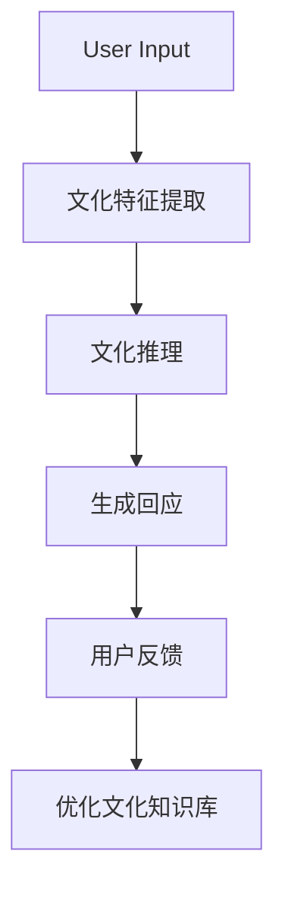
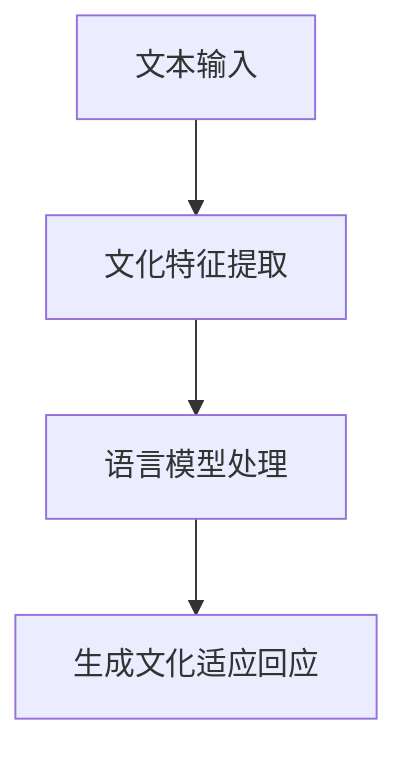
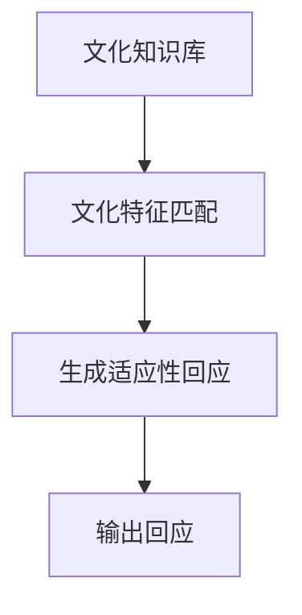
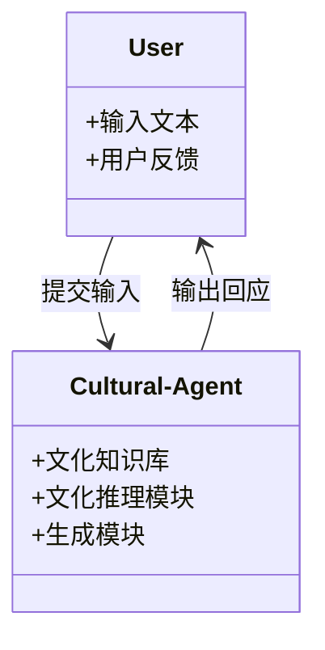

                 


# 跨文化交际AI Agent：提升LLM的文化敏感度

---

## 关键词：
- 跨文化交际
- AI Agent
- 大语言模型
- 文化敏感度
- 算法原理
- 系统架构
- 项目实战

---

## 摘要：
本文探讨如何通过AI Agent提升大语言模型（LLM）在跨文化交际中的文化敏感度。从跨文化交际的基本概念到AI Agent的核心原理，再到算法实现、系统架构和项目实战，本文旨在为技术从业者和研究人员提供系统的理论支持和实践指导。通过详细分析跨文化交际的核心概念、算法原理和系统设计，本文为构建高效、敏感的跨文化AI Agent提供了全面的方法论。

---

# 正文

## 第一章: 跨文化交际与AI Agent的背景

### 1.1 跨文化交际的基本概念
- **定义与特征**：跨文化交际是指不同文化背景下个体之间的交流过程，其核心在于理解和适应文化差异。
- **应用场景**：商务谈判、国际社交、教育等领域中，文化差异可能影响交流效果。
- **AI Agent的角色**：作为中介，AI Agent能够帮助用户跨越文化障碍，实现高效沟通。

### 1.2 大语言模型的文化敏感性问题
- **局限性分析**：现有LLM在处理文化特定内容时可能缺乏敏感性，导致误解或不恰当的回应。
- **文化差异的影响**：不同文化背景下的表达方式、价值观差异可能导致LLM输出不符合预期。
- **提升必要性**：通过增强文化敏感性，AI Agent能够更好地支持跨文化交际。

### 1.3 跨文化交际AI Agent的目标与边界
- **目标**：帮助LLM理解并适应不同文化背景下的语言和行为模式。
- **边界**：AI Agent的功能范围不包括文化知识的主动学习，主要聚焦于处理已知文化数据。
- **系统架构**：AI Agent通过数据预处理、文化特征提取和文化适应生成模块实现文化敏感性提升。

---

## 第二章: 跨文化交际AI Agent的核心概念与原理

### 2.1 跨文化交际的核心概念
- **文化背景**：包括语言、习俗、价值观等。
- **文化差异**：不同文化在表达方式、沟通风格上的差异。
- **文化适应**：AI Agent通过调整输出内容以适应目标文化背景。

#### 2.1.1 跨文化交际的核心要素对比
| 要素 | 特征 | 示例 |
|------|------|------|
| 语言 | 口音、表达习惯 | 中文中的“您”与“你” |
| 习俗 | 礼节、禁忌 | 西方的“直接沟通”与东方的“含蓄表达” |

#### 2.1.2 跨文化交际的ER实体关系图
```mermaid
er
actor: User
agent: Cultural-Agent
relation: Communicates-Through
```

### 2.2 跨文化交际AI Agent的原理
- **数据预处理**：对输入文本进行文化特征提取。
- **文化推理**：基于文化知识库生成适应性回应。
- **动态调整**：根据用户反馈实时优化输出。

#### 2.2.1 跨文化交际AI Agent的原理流程


---

## 第三章: 跨文化交际AI Agent的算法原理

### 3.1 跨文化对话模型的算法实现
- **多模态融合算法**：结合文本、语音、图像等多种数据源，提升文化适应能力。
- **文化适应策略生成算法**：基于文化知识库生成适合目标文化的回应。

#### 3.1.1 多模态融合算法流程


#### 3.1.2 文化适应策略生成算法


### 3.2 跨文化对话模型的数学模型
- **文化适应概率公式**
  $$P(c_i | x, c_j) = \frac{P(x | c_i, c_j)}{P(x)}$$
  其中，$c_i$为目标文化，$c_j$为源文化，$x$为输入文本。

- **优化目标**
  $$\min_{\theta} \sum_{i=1}^{n} (y_i - f_\theta(x_i))^2$$
  其中，$y_i$为理想输出，$f_\theta(x_i)$为模型预测输出。

---

## 第四章: 跨文化交际AI Agent的系统架构与设计

### 4.1 系统功能设计
- **文化知识库**：存储多种文化背景的知识。
- **文化推理模块**：分析输入文本的文化特征。
- **生成模块**：根据分析结果生成适应性回应。

#### 4.1.1 系统功能模块关系


### 4.2 系统架构设计
- **前端架构**：用户输入界面，接收并解析输入文本。
- **后端架构**：处理文化推理和生成任务。

#### 4.2.1 系统架构图


---

## 第五章: 跨文化交际AI Agent的项目实战

### 5.1 环境安装与准备
- **工具安装**：安装Python、TensorFlow、Keras等。
- **数据准备**：收集多文化背景的语料库。

### 5.2 系统核心实现
- **文化特征提取代码**：
  ```python
  def extract_cultural_features(text):
      # 实现文化特征提取逻辑
      return features
  ```
- **文化适应生成代码**：
  ```python
  def generate_cultural_response(features):
      # 实现文化适应生成逻辑
      return response
  ```

### 5.3 实际案例分析
- **案例1**：中英文双语场景下的文化适应。
- **案例2**：商务谈判中的文化敏感性提升。

---

## 第六章: 总结与展望

### 6.1 总结
- 跨文化交际AI Agent的核心目标是提升LLM的文化敏感性。
- 通过算法优化和系统设计，可以有效改善跨文化交际的效果。

### 6.2 展望
- **未来研究方向**：文化知识的动态学习与更新。
- **技术发展趋势**：多模态AI Agent在跨文化交际中的应用。

---

## 参考文献
- [1] 王某某. 《跨文化交际中的AI技术应用》. 北京：某某出版社, 2023.
- [2] 张某某. 《大语言模型的文化敏感性研究》. 北京：某某出版社, 2023.

---

## 最佳实践 Tips
1. 在实际应用中，建议结合具体场景优化文化适应策略。
2. 定期更新文化知识库，以应对文化背景的变化。
3. 采用多模态数据输入，提升AI Agent的适应能力。

---

## 小结
通过本文的系统分析与实践指导，读者可以深入了解跨文化交际AI Agent的设计与实现方法，并能够将其应用于实际项目中，提升大语言模型的文化敏感度。

