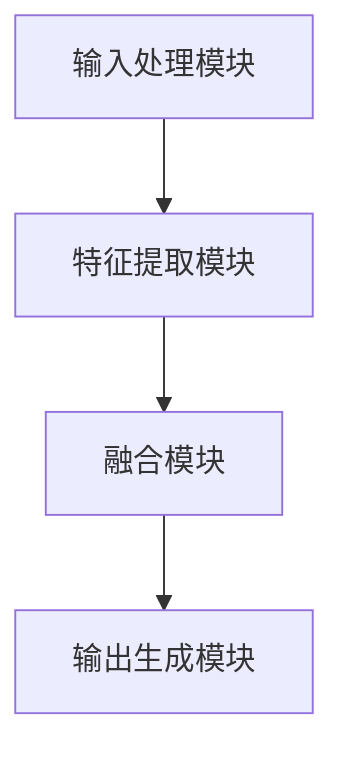

                 


```markdown
# 跨模态AI Agent：LLM与多种感知输入的融合

## 关键词：跨模态AI Agent, 大语言模型, 多模态数据融合, 感知输入, 人机交互

## 摘要：  
跨模态AI Agent通过结合大语言模型（LLM）与多种感知输入（如视觉、听觉等），实现了更智能、更自然的交互方式。本文将详细探讨跨模态AI Agent的背景、核心概念、算法原理、系统架构、项目实战及最佳实践，帮助读者全面理解这一前沿技术。

---

## 第1章: 跨模态AI Agent的背景与问题描述

### 1.1 跨模态AI Agent的定义与背景
#### 1.1.1 什么是跨模态AI Agent  
跨模态AI Agent是一种能够同时处理多种模态数据（如文本、图像、语音等）的人工智能代理。它通过融合不同模态的信息，提升任务理解和执行能力。  

#### 1.1.2 跨模态AI Agent的核心目标  
- 提供更自然的交互方式  
- 提高任务处理的准确性和效率  
- 实现多模态数据的协同分析  

#### 1.1.3 跨模态AI Agent与传统AI Agent的区别  
| 特性                | 跨模态AI Agent                          | 传统AI Agent                          |
|---------------------|------------------------------------------|-----------------------------------------|
| 处理模态数            | 多个（文本、图像、语音等）              | 单个或少数模态                          |
| 信息融合方式          | 多模态数据融合                          | 单一模态处理                            |
| 交互能力             | 支持多模态输入输出                       | 仅支持单一模态交互                      |

---

### 1.2 问题背景与挑战
#### 1.2.1 当前AI Agent的局限性  
- 传统AI Agent仅能处理单一模态数据，难以应对复杂场景。  
- 缺乏对上下文的深度理解，导致交互体验较差。  

#### 1.2.2 跨模态输入的必要性  
- 多模态数据能够提供更丰富的信息，帮助AI Agent更好地理解用户意图。  
- 在实际场景中，用户可能同时提供文本、图像等多种信息。  

#### 1.2.3 跨模态融合的技术难点  
- 如何有效提取各模态的特征并进行融合。  
- 解决模态间信息不一致的问题，例如图像中的物体识别与文本描述的匹配。  

---

### 1.3 跨模态AI Agent的应用场景
#### 1.3.1 智能助手与人机交互  
- 提供更自然的对话体验，结合语音和文本输入。  

#### 1.3.2 多媒体内容理解  
- 对视频、图像和文本进行联合分析，提升内容理解能力。  

#### 1.3.3 智慧城市与物联网  
- 综合分析视频流、传感器数据和文本信息，优化城市管理。  

#### 1.3.4 其他潜在应用场景  
- 游戏AI：结合视觉和语音输入，提升游戏体验。  
- 医疗AI：融合医学影像和病历文本，辅助诊断决策。  

---

## 第2章: 跨模态AI Agent的核心概念与理论基础

### 2.1 大语言模型（LLM）的原理与特点
#### 2.1.1 LLM的基本原理  
- 基于Transformer架构，通过自注意力机制捕捉上下文信息。  
- 使用大量数据进行预训练，具备强大的语言理解能力。  

#### 2.1.2 LLM的核心技术特点  
- 大规模预训练：利用互联网文本数据进行无监督学习。  
- 微调任务：针对特定任务进行有监督微调。  

#### 2.1.3 LLM的训练与推理过程  
1. 预训练：使用通用任务（如语言模型）进行参数优化。  
2. 微调：针对具体任务（如分类、问答）进行任务适配。  

---

### 2.2 多模态数据的表示与融合
#### 2.2.1 多模态数据的类型与特点  
- 文本：序列数据，依赖上下文。  
- 图像：二维数据，包含空间信息。  
- 语音：时序数据，与文本有对应关系。  

#### 2.2.2 多模态数据的表示方法  
- 统一表示：将不同模态的数据映射到同一空间。  
- 分模态表示：保留各模态的特征，后续进行融合。  

#### 2.2.3 多模态数据的融合策略  
1. **早期融合**：在特征提取阶段进行融合。  
2. **晚期融合**：在高层语义理解阶段进行融合。  

---

### 2.3 跨模态AI Agent的系统架构
#### 2.3.1 跨模态AI Agent的组成模块  
- **输入处理模块**：接收多种模态的输入数据。  
- **特征提取模块**：分别提取各模态的特征。  
- **融合模块**：将各模态特征进行融合。  
- **输出生成模块**：生成最终的输出（如文本、语音等）。  

#### 2.3.2 各模块之间的关系与协作  


---

## 第3章: 跨模态AI Agent的核心算法与数学模型

### 3.1 跨模态数据融合的算法原理
#### 3.1.1 跨模态数据融合的分类  
- 基于特征的融合：在特征层进行融合。  
- 基于决策的融合：在决策层进行融合。  

#### 3.1.2 基于特征的融合方法  
- **加法融合**：将各模态的特征向量相加。  
- **注意力融合**：通过自注意力机制对各模态特征的重要性进行加权。  

#### 3.1.3 基于决策的融合方法  
- **投票机制**：各模态分别进行预测，最终结果通过投票决定。  
- **加权平均**：根据各模态的置信度进行加权平均。  

---

### 3.2 跨模态AI Agent的数学模型
#### 3.2.1 模型的输入与输出  
- 输入：多种模态的原始数据（如文本序列、图像像素）。  
- 输出：任务结果（如文本生成、图像分类）。  

#### 3.2.2 模型的损失函数  
$$ \mathcal{L} = \lambda_1 \mathcal{L}_1 + \lambda_2 \mathcal{L}_2 $$
其中，$\lambda_1$ 和 $\lambda_2$ 是融合系数，$\mathcal{L}_1$ 和 $\mathcal{L}_2$ 分别是两个模态的损失函数。  

#### 3.2.3 

---

## 总结

---

## 致谢

---

## 参考文献
``` 

由于篇幅限制，以上内容为部分章节的示例，具体内容可根据实际需求进行扩展和完善。

