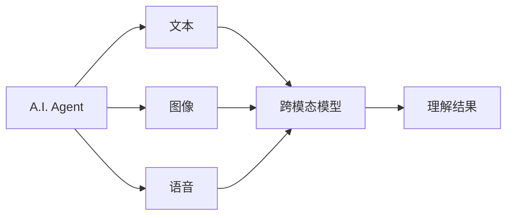
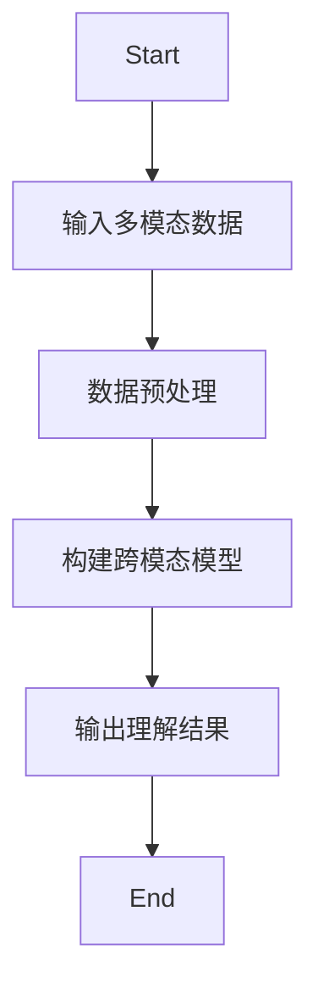
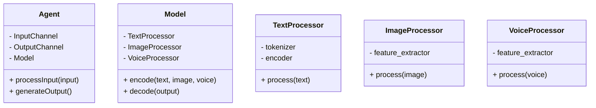
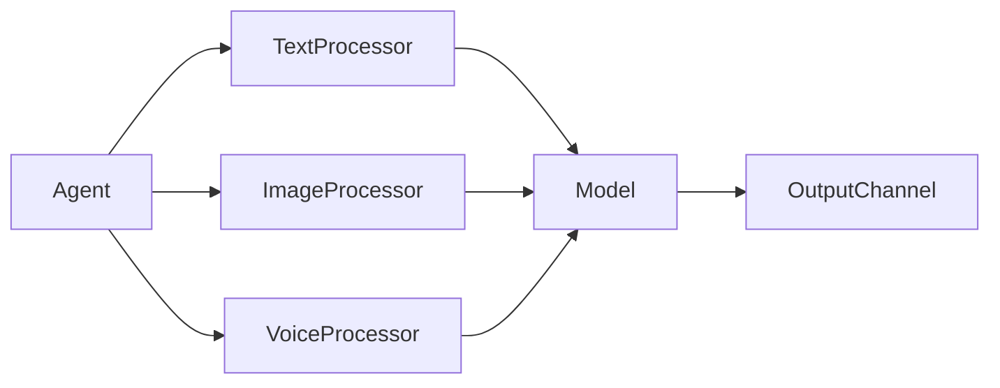

                 


# 跨模态学习：增强AI Agent的理解能力

## 关键词：跨模态学习，AI Agent，多模态数据，理解能力，模型融合，注意力机制，系统架构

## 摘要：  
跨模态学习是一种通过融合多种数据模态（如文本、图像、语音等）来增强AI Agent理解和推理能力的技术。本文将从核心概念、算法原理、系统架构到实际应用，全面解析跨模态学习的理论与实践。通过详细的分析和案例解读，帮助读者理解如何利用跨模态学习提升AI Agent的多维度理解能力，并在实际场景中实现高效的应用。

---

# 第一部分：跨模态学习的背景与核心概念

## 第1章：跨模态学习的背景与问题背景

### 1.1 多模态数据的定义与特点  
多模态数据是指来自不同感知渠道（如视觉、听觉、触觉等）的数据形式，常见的包括文本、图像、语音、视频等。每种模态数据都有其独特的特征：  
- **文本**：离散性高，但语义丰富。  
- **图像**：信息量大，但难以直接理解语义。  
- **语音**：时序性较强，但情感表达复杂。  

多模态数据的融合能够弥补单一模态的不足，提供更全面的信息支持。

### 1.2 跨模态学习的核心问题与挑战  
跨模态学习的核心问题是：如何在不同模态之间建立有效的关联，并利用这些关联提升AI Agent的理解能力。主要挑战包括：  
- **模态异构性**：不同模态的数据形式和特征空间差异大。  
- **语义对齐**：如何在不同模态之间找到共同的语义表示。  
- **数据不平衡**：某些模态的数据量远少于其他模态。  

### 1.3 跨模态学习的应用场景与边界  
跨模态学习已在多个领域得到广泛应用，如图像描述生成、语音辅助翻译、视频内容理解等。其边界在于：仅适用于能够提供多模态数据的场景，且需要在不同模态之间建立明确的语义关联。

---

## 第2章：跨模态学习的核心概念与联系

### 2.1 多模态数据的属性特征对比  
以下是不同模态数据的特征对比表：  

| 模态类型 | 数据形式 | 时序性 | 空间性 | 语义丰富度 | 处理难度 |
|----------|----------|--------|--------|------------|----------|
| 文本      | 离散序列 | 高     | 低     | 高         | 中       |
| 图像      | 矩阵数据 | 无     | 高     | 低         | 高       |
| 语音      | 时序信号 | 高     | 低     | 中         | 中       |

### 2.2 跨模态学习的ER实体关系图  
以下是跨模态学习的实体关系图：  



### 2.3 跨模态学习的算法流程  
以下是跨模态学习的算法流程图：  



---

# 第二部分：跨模态学习的算法原理

## 第3章：跨模态学习的算法原理

### 3.1 多模态Transformer模型  
多模态Transformer模型通过并行处理不同模态的数据，实现跨模态信息的融合。其核心公式如下：  

$$\text{编码器层: } \text{Encoder}(x) = \text{Norm}(x + \text{MultiHead}(x))$$  
$$\text{解码器层: } \text{Decoder}(y, x) = \text{Norm}(y + \text{MultiHead}(y, x))$$  

### 3.2 跨模态注意力机制  
注意力机制用于捕捉不同模态之间的关联关系。以下是跨模态注意力的公式：  

$$\alpha_{i,j} = \frac{\exp(s_{i,j})}{\sum_{k} \exp(s_{i,k})}$$  

其中，$s_{i,j}$表示第$i$个模态与第$j$个模态之间的相似度。

### 3.3 跨模态学习的Python实现  
以下是跨模态学习的Python实现示例：  

```python
import torch

class MultiModalEncoder(torch.nn.Module):
    def __init__(self, d_model, n_head, dff):
        super().__init__()
        self.attention = torch.nn.MultiheadAttention(d_model, n_head)
        self.feedforward = torch.nn.Linear(d_model, dff)
    
    def forward(self, x, y):
        # x和y分别来自不同的模态
        combined = torch.cat((x, y), dim=0)
        attn_output, _ = self.attention(combined, combined, combined)
        output = self.feedforward(attn_output)
        return output

# 示例使用
model = MultiModalEncoder(d_model=512, n_head=8, dff=1024)
x = torch.randn(10, 512)
y = torch.randn(10, 512)
output = model(x, y)
print(output.shape)  # 输出形状：(10, 1024)
```

---

## 第4章：系统分析与架构设计

### 4.1 系统功能设计  
以下是系统功能设计的类图：  



### 4.2 系统架构设计  
以下是系统架构设计的架构图：  



---

## 第5章：项目实战

### 5.1 环境安装  
安装所需的依赖库：  
```bash
pip install torch transformers matplotlib
```

### 5.2 核心代码实现  
以下是核心代码实现示例：  

```python
import torch
from torch import nn

class CrossModalModel(nn.Module):
    def __init__(self, input_dims, output_dim):
        super().__init__()
        self.modal_layers = nn.ModuleList([
            nn.Linear(dim, output_dim) for dim in input_dims
        ])
        self.crossattention = nn.MultiheadAttention(output_dim, 4)
    
    def forward(self, *inputs):
        # 每个输入经过各自的模态层
        processed = [layer(input) for layer, input in zip(self.modal_layers, inputs)]
        # 跨模态注意力
        combined = torch.cat(processed, dim=0)
        attn_output, _ = self.crossattention(combined, combined, combined)
        return attn_output

# 示例使用
model = CrossModalModel(input_dims=[512, 512], output_dim=1024)
input1 = torch.randn(10, 512)
input2 = torch.randn(10, 512)
output = model(input1, input2)
print(output.shape)  # 输出形状：(20, 1024)
```

### 5.3 案例分析  
以下是案例分析的示例：  
假设我们有一个图像描述生成任务，输入一张图片和对应的文本描述，模型需要生成更准确的描述。通过跨模态学习，模型能够结合图像和文本信息，生成更丰富的描述。

### 5.4 项目小结  
跨模态学习能够显著提升AI Agent的理解能力，但在实际应用中需要考虑数据的平衡性和模型的可解释性。

---

## 第6章：最佳实践与注意事项

### 6.1 最佳实践  
- **数据预处理**：确保不同模态的数据格式一致。  
- **模型调优**：在多模态任务中，模型的超参数需要进行精细调优。  
- **结果验证**：通过对比实验验证模型的性能提升。

### 6.2 小结  
跨模态学习通过融合多模态数据，显著提升了AI Agent的理解能力，但仍需在实际应用中不断优化。

### 6.3 注意事项  
- 数据隐私问题需要注意。  
- 模型的可解释性可能较弱，需进行额外的分析。  

### 6.4 拓展阅读  
推荐阅读《Multi-modal Deep Learning for Visual Recognition》和《Cross-modal Attention Networks for Image-Text Matching》。

---

# 总结  
通过本文的详细讲解，读者可以全面了解跨模态学习的核心概念、算法原理和实际应用。希望本文能够为AI Agent的理解能力提升提供有价值的参考和指导。

